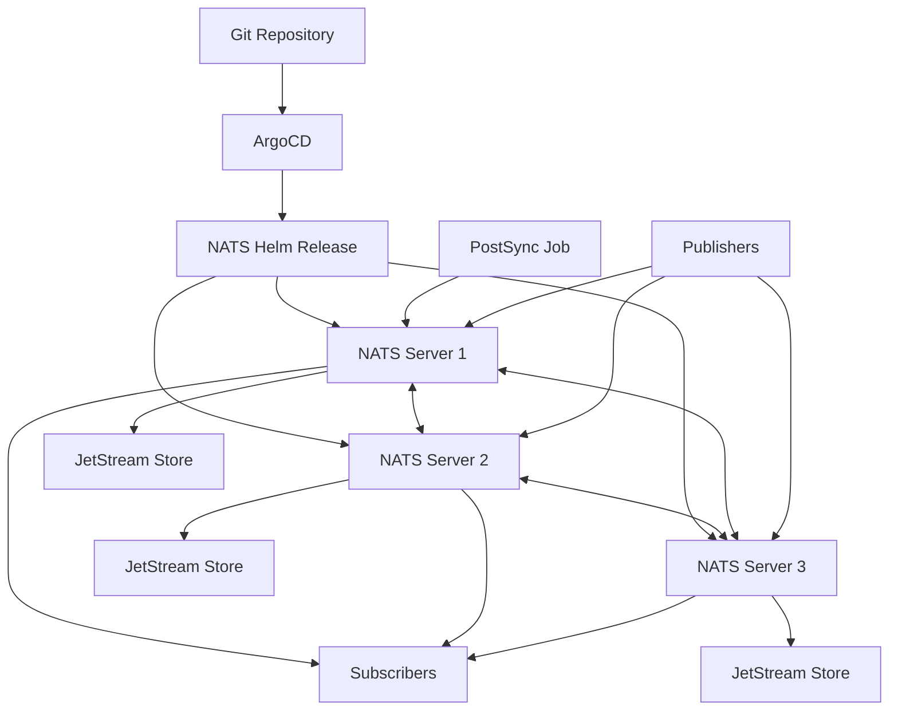

# How to Deploy NATS with ArgoCD

Author: [nawazdhandala](https://github.com/nawazdhandala)

Tags: ArgoCD, GitOps, Kubernetes, NATS, Messaging

Description: Learn how to deploy NATS messaging system on Kubernetes using ArgoCD with JetStream persistence, clustering, and GitOps-driven configuration management.

---

NATS is a lightweight, high-performance messaging system that supports publish-subscribe, request-reply, and streaming through JetStream. Its simplicity and low resource footprint make it a popular choice for microservice communication and IoT workloads. Deploying NATS on Kubernetes with ArgoCD ensures your messaging infrastructure is version-controlled, reproducible, and automatically reconciled.

This guide covers deploying NATS clusters with JetStream enabled, configuring authentication, setting up monitoring, and managing everything through Git.

## Prerequisites

- Kubernetes cluster (1.24+)
- ArgoCD installed and configured
- A Git repository for manifests
- Storage class for JetStream persistence

## Step 1: Deploy NATS via Helm and ArgoCD

NATS publishes an official Helm chart. Create an ArgoCD Application to install it.

```yaml
# argocd/nats-cluster.yaml
apiVersion: argoproj.io/v1alpha1
kind: Application
metadata:
  name: nats-production
  namespace: argocd
  finalizers:
    - resources-finalizer.argocd.argoproj.io
spec:
  project: default
  source:
    chart: nats
    repoURL: https://nats-io.github.io/k8s/helm/charts/
    targetRevision: 1.2.4
    helm:
      releaseName: nats
      values: |
        config:
          cluster:
            enabled: true
            replicas: 3

          jetstream:
            enabled: true
            # File-based storage
            fileStore:
              pvc:
                enabled: true
                size: 50Gi
                storageClassName: gp3-encrypted
            # Memory store for hot data
            memoryStore:
              enabled: true
              maxSize: 1Gi

          # Merge additional NATS config
          merge:
            max_payload: 8MB
            max_connections: 10000
            write_deadline: 10s

        # Pod template configuration
        podTemplate:
          topologySpreadConstraints:
            kubernetes.io/hostname:
              maxSkew: 1
              whenUnsatisfiable: DoNotSchedule

        container:
          resources:
            requests:
              cpu: 500m
              memory: 1Gi
            limits:
              cpu: "2"
              memory: 2Gi

        # NATS Box for debugging
        natsBox:
          enabled: true

        # Prometheus metrics
        promExporter:
          enabled: true
          port: 7777
  destination:
    server: https://kubernetes.default.svc
    namespace: messaging
  syncPolicy:
    automated:
      prune: false
      selfHeal: true
    syncOptions:
      - CreateNamespace=true
```

## Step 2: Configure Authentication

NATS supports multiple authentication mechanisms. For production, use NKey-based authentication or JWT-based auth with an account resolver.

Create a configuration overlay in your Git repository:

```yaml
# messaging/nats/auth-config.yaml
apiVersion: v1
kind: Secret
metadata:
  name: nats-auth-config
  namespace: messaging
type: Opaque
stringData:
  auth.conf: |
    authorization {
      users = [
        {
          user: "order-service"
          password: "$NATS_ORDER_SVC_PASS"
          permissions: {
            publish: ["orders.>", "_INBOX.>"]
            subscribe: ["orders.>", "_INBOX.>"]
          }
        }
        {
          user: "notification-service"
          password: "$NATS_NOTIFICATION_SVC_PASS"
          permissions: {
            publish: ["_INBOX.>"]
            subscribe: ["orders.created", "orders.updated", "_INBOX.>"]
          }
        }
        {
          user: "admin"
          password: "$NATS_ADMIN_PASS"
          permissions: {
            publish: ">"
            subscribe: ">"
          }
        }
      ]
    }
```

For a more production-appropriate setup, use External Secrets to manage the credentials:

```yaml
# messaging/nats/external-secret.yaml
apiVersion: external-secrets.io/v1beta1
kind: ExternalSecret
metadata:
  name: nats-credentials
  namespace: messaging
spec:
  refreshInterval: 1h
  secretStoreRef:
    name: aws-secrets-manager
    kind: ClusterSecretStore
  target:
    name: nats-credentials
  data:
    - secretKey: order-service-password
      remoteRef:
        key: /production/nats/order-service
        property: password
    - secretKey: admin-password
      remoteRef:
        key: /production/nats/admin
        property: password
```

## Step 3: Configure JetStream Streams Declaratively

While NATS does not have a Kubernetes operator for stream management like Strimzi does for Kafka topics, you can use init containers or Jobs to create streams declaratively.

```yaml
# messaging/nats/streams-job.yaml
apiVersion: batch/v1
kind: Job
metadata:
  name: nats-stream-setup
  namespace: messaging
  annotations:
    argocd.argoproj.io/hook: PostSync
    argocd.argoproj.io/hook-delete-policy: BeforeHookCreation
spec:
  template:
    spec:
      containers:
        - name: setup
          image: natsio/nats-box:0.14.5
          command:
            - /bin/sh
            - -c
            - |
              # Wait for NATS to be ready
              until nats server check connection \
                --server=nats://nats.messaging.svc:4222; do
                echo "Waiting for NATS..."
                sleep 5
              done

              # Create or update streams
              nats stream add orders \
                --server=nats://nats.messaging.svc:4222 \
                --subjects="orders.>" \
                --storage=file \
                --replicas=3 \
                --retention=limits \
                --max-age=7d \
                --max-bytes=10GB \
                --discard=old \
                --dupe-window=2m \
                --defaults \
                || nats stream edit orders \
                  --server=nats://nats.messaging.svc:4222 \
                  --max-age=7d \
                  --force

              nats stream add notifications \
                --server=nats://nats.messaging.svc:4222 \
                --subjects="notifications.>" \
                --storage=file \
                --replicas=3 \
                --retention=workqueue \
                --max-age=24h \
                --defaults \
                || echo "Stream notifications already exists"

              echo "Stream setup complete"
      restartPolicy: OnFailure
  backoffLimit: 3
```

## Step 4: Set Up Monitoring

NATS provides a Prometheus exporter through the `promExporter` config we enabled in the Helm values. Create a ServiceMonitor to scrape it.

```yaml
# messaging/nats/service-monitor.yaml
apiVersion: monitoring.coreos.com/v1
kind: ServiceMonitor
metadata:
  name: nats-monitor
  namespace: messaging
  labels:
    release: prometheus
spec:
  selector:
    matchLabels:
      app.kubernetes.io/name: nats
  endpoints:
    - port: prom-metrics
      interval: 15s
      path: /metrics
```

Key metrics to watch:

- `nats_server_connections` - current connection count
- `nats_server_messages_sent` and `nats_server_messages_received` - throughput
- `nats_jetstream_server_total_streams` - stream count
- `nats_jetstream_consumer_num_pending` - consumer lag

Integrate these with [OneUptime](https://oneuptime.com) for alerting on consumer lag and connection spikes.

## Architecture



## Leafnode Configuration for Multi-Cluster

NATS supports leafnode connections for extending clusters across Kubernetes clusters or cloud regions. Add this to your Helm values:

```yaml
config:
  merge:
    leafnodes:
      remotes:
        - url: "nats-leaf://remote-nats.other-region.svc:7422"
          credentials: "/etc/nats-creds/leafnode.creds"
```

This lets you connect NATS clusters across regions while keeping each cluster independently managed by its own ArgoCD instance.

## Scaling NATS

NATS is designed for horizontal scaling. To add more capacity, increase the replica count:

```yaml
config:
  cluster:
    replicas: 5  # was 3
```

New nodes join the cluster automatically through DNS-based peer discovery. JetStream rebalances stream replicas across the expanded cluster.

## Health Checks for ArgoCD

Since NATS is deployed as a Helm chart (not a custom operator), ArgoCD uses standard Kubernetes health checks. The StatefulSet and Pod readiness probes handle this automatically. However, if you want JetStream-aware health, add a custom health check:

```yaml
# In argocd-cm
data:
  resource.customizations.health.apps_StatefulSet: |
    hs = {}
    if obj.status ~= nil then
      if obj.status.readyReplicas == obj.status.replicas then
        hs.status = "Healthy"
      else
        hs.status = "Progressing"
      end
    end
    return hs
```

## Conclusion

NATS is one of the simplest messaging systems to deploy on Kubernetes, and ArgoCD makes it even more manageable. By defining your NATS configuration, authentication, and stream setup in Git, you get a fully reproducible messaging platform. The JetStream persistence layer gives you durable streaming when you need it, while the core NATS protocol remains lightweight for pub-sub workloads. Use PostSync hooks for stream configuration, disable auto-pruning to protect persistent data, and monitor consumer lag to catch processing issues early.
