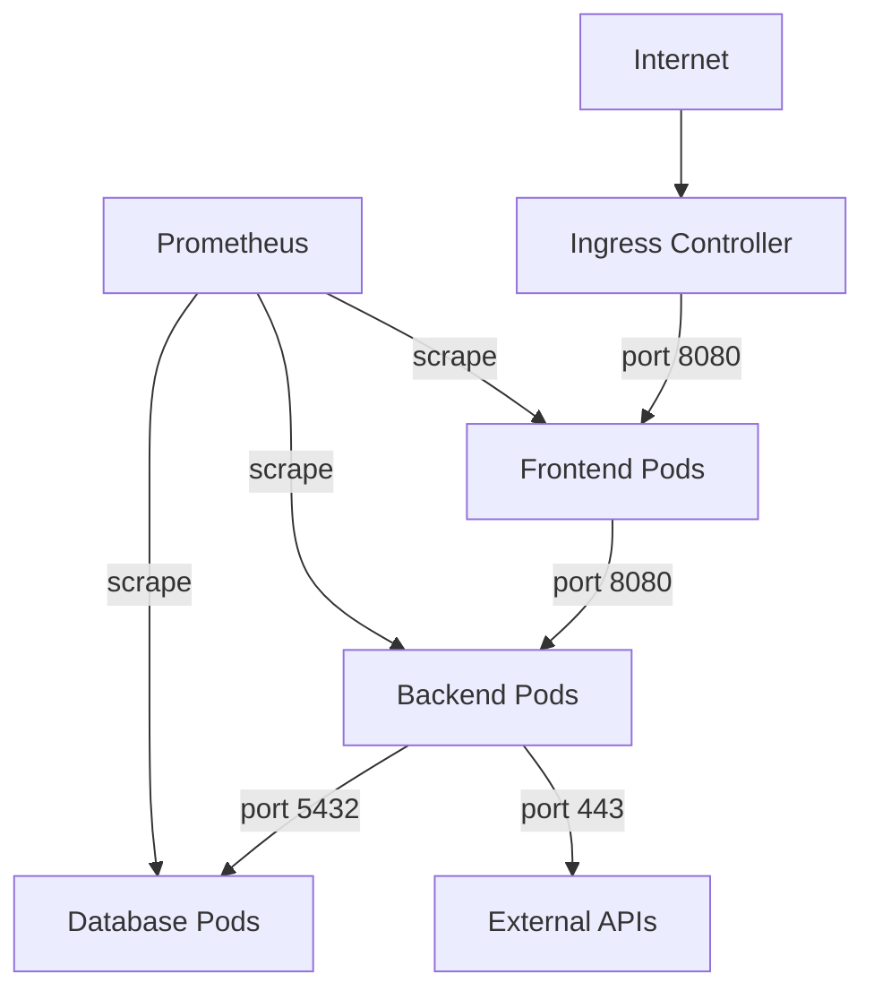

# How to Deploy Network Security Policies with ArgoCD

Author: [nawazdhandala](https://github.com/nawazdhandala)

Tags: ArgoCD, GitOps, Kubernetes, NetworkPolicy, Security

Description: Learn how to deploy and manage Kubernetes NetworkPolicies using ArgoCD for GitOps-managed network segmentation and zero-trust networking.

---

Kubernetes NetworkPolicies control traffic flow between pods, namespaces, and external endpoints. By default, Kubernetes allows all pod-to-pod communication, which violates the principle of least privilege. Deploying NetworkPolicies through ArgoCD ensures your network segmentation rules are version-controlled, reviewed, and consistently applied across all environments.

This guide covers designing and deploying network security policies with ArgoCD, from basic deny-all rules to advanced Cilium policies, all managed through GitOps.

## Why Network Policies Need GitOps

Network policies are security-critical resources that:

- Should be reviewed before deployment (like firewall rules)
- Need to be consistent across environments
- Must be auditable for compliance
- Should be protected from manual modification

ArgoCD addresses all of these by treating network policies as code in Git.

## Prerequisites

NetworkPolicies require a CNI plugin that supports them. Common options include:

- **Calico**: Full NetworkPolicy support plus extended Calico policies
- **Cilium**: Full support plus L7 policies and DNS-aware rules
- **Weave Net**: Basic NetworkPolicy support
- **Default kubenet**: Does NOT support NetworkPolicies

Verify your CNI supports NetworkPolicies before deploying them.

## Repository Structure

```text
network-policies/
  base/
    default-deny-all.yaml
    allow-dns.yaml
    allow-monitoring.yaml
  namespaces/
    frontend/
      allow-ingress.yaml
      allow-backend.yaml
    backend/
      allow-frontend.yaml
      allow-database.yaml
    database/
      allow-backend-only.yaml
  cilium/
    l7-http-policy.yaml
    dns-policy.yaml
```

## Default Deny Policies

Start with a default deny policy for every namespace. This is the foundation of zero-trust networking.

```yaml
# network-policies/base/default-deny-all.yaml
apiVersion: networking.k8s.io/v1
kind: NetworkPolicy
metadata:
  name: default-deny-all
  namespace: "{{ namespace }}"
spec:
  podSelector: {}
  policyTypes:
    - Ingress
    - Egress
```

Since you cannot template a plain YAML file with ArgoCD directly, use Kustomize or a Kyverno generate policy to apply this to all namespaces.

### Using Kyverno to Generate Default Deny

```yaml
# network-policies/base/generate-default-deny.yaml
apiVersion: kyverno.io/v1
kind: ClusterPolicy
metadata:
  name: generate-default-deny
spec:
  rules:
    - name: default-deny-ingress
      match:
        any:
          - resources:
              kinds:
                - Namespace
      exclude:
        any:
          - resources:
              names:
                - kube-system
                - kube-public
                - argocd
                - monitoring
      generate:
        synchronize: true
        apiVersion: networking.k8s.io/v1
        kind: NetworkPolicy
        name: default-deny-ingress
        namespace: "{{request.object.metadata.name}}"
        data:
          spec:
            podSelector: {}
            policyTypes:
              - Ingress
    - name: default-deny-egress
      match:
        any:
          - resources:
              kinds:
                - Namespace
      exclude:
        any:
          - resources:
              names:
                - kube-system
                - kube-public
                - argocd
                - monitoring
      generate:
        synchronize: true
        apiVersion: networking.k8s.io/v1
        kind: NetworkPolicy
        name: default-deny-egress
        namespace: "{{request.object.metadata.name}}"
        data:
          spec:
            podSelector: {}
            policyTypes:
              - Egress
```

## Allow DNS Egress

After applying default deny, pods cannot resolve DNS. Allow egress to the kube-dns service.

```yaml
# network-policies/base/allow-dns.yaml
apiVersion: networking.k8s.io/v1
kind: NetworkPolicy
metadata:
  name: allow-dns-egress
  namespace: default
spec:
  podSelector: {}
  policyTypes:
    - Egress
  egress:
    - to:
        - namespaceSelector:
            matchLabels:
              kubernetes.io/metadata.name: kube-system
          podSelector:
            matchLabels:
              k8s-app: kube-dns
      ports:
        - protocol: UDP
          port: 53
        - protocol: TCP
          port: 53
```

## Allow Monitoring Scraping

Prometheus needs to scrape metrics from pods in all namespaces.

```yaml
# network-policies/base/allow-monitoring.yaml
apiVersion: networking.k8s.io/v1
kind: NetworkPolicy
metadata:
  name: allow-prometheus-scraping
  namespace: default
spec:
  podSelector: {}
  policyTypes:
    - Ingress
  ingress:
    - from:
        - namespaceSelector:
            matchLabels:
              kubernetes.io/metadata.name: monitoring
          podSelector:
            matchLabels:
              app.kubernetes.io/name: prometheus
      ports:
        - protocol: TCP
          port: 9090
        - protocol: TCP
          port: 8080
        - protocol: TCP
          port: 9113
```

## Application-Specific Policies

### Frontend Namespace

```yaml
# network-policies/namespaces/frontend/allow-ingress.yaml
apiVersion: networking.k8s.io/v1
kind: NetworkPolicy
metadata:
  name: allow-ingress-controller
  namespace: frontend
spec:
  podSelector:
    matchLabels:
      app: web
  policyTypes:
    - Ingress
  ingress:
    - from:
        - namespaceSelector:
            matchLabels:
              kubernetes.io/metadata.name: ingress-nginx
      ports:
        - protocol: TCP
          port: 8080
---
# network-policies/namespaces/frontend/allow-backend.yaml
apiVersion: networking.k8s.io/v1
kind: NetworkPolicy
metadata:
  name: allow-egress-to-backend
  namespace: frontend
spec:
  podSelector:
    matchLabels:
      app: web
  policyTypes:
    - Egress
  egress:
    - to:
        - namespaceSelector:
            matchLabels:
              kubernetes.io/metadata.name: backend
          podSelector:
            matchLabels:
              app: api
      ports:
        - protocol: TCP
          port: 8080
```

### Database Namespace

```yaml
# network-policies/namespaces/database/allow-backend-only.yaml
apiVersion: networking.k8s.io/v1
kind: NetworkPolicy
metadata:
  name: allow-backend-to-database
  namespace: database
spec:
  podSelector:
    matchLabels:
      app: postgresql
  policyTypes:
    - Ingress
  ingress:
    - from:
        - namespaceSelector:
            matchLabels:
              kubernetes.io/metadata.name: backend
          podSelector:
            matchLabels:
              app: api
      ports:
        - protocol: TCP
          port: 5432
```

## Cilium Network Policies (Advanced)

If you are running Cilium, you get access to L7-aware policies and DNS-based filtering.

```yaml
# network-policies/cilium/l7-http-policy.yaml
apiVersion: cilium.io/v2
kind: CiliumNetworkPolicy
metadata:
  name: l7-api-policy
  namespace: backend
spec:
  endpointSelector:
    matchLabels:
      app: api
  ingress:
    - fromEndpoints:
        - matchLabels:
            app: web
            io.kubernetes.pod.namespace: frontend
      toPorts:
        - ports:
            - port: "8080"
              protocol: TCP
          rules:
            http:
              - method: "GET"
                path: "/api/v1/.*"
              - method: "POST"
                path: "/api/v1/orders"
```

```yaml
# network-policies/cilium/dns-policy.yaml
apiVersion: cilium.io/v2
kind: CiliumNetworkPolicy
metadata:
  name: allow-external-api
  namespace: backend
spec:
  endpointSelector:
    matchLabels:
      app: api
  egress:
    - toFQDNs:
        - matchName: "api.stripe.com"
        - matchName: "api.sendgrid.com"
      toPorts:
        - ports:
            - port: "443"
              protocol: TCP
```

## ArgoCD Application for Network Policies

```yaml
apiVersion: argoproj.io/v1alpha1
kind: Application
metadata:
  name: network-policies
  namespace: argocd
spec:
  project: security
  source:
    repoURL: https://github.com/your-org/gitops-repo.git
    targetRevision: main
    path: network-policies
  destination:
    server: https://kubernetes.default.svc
  syncPolicy:
    automated:
      prune: true
      selfHeal: true
```

## Testing Network Policies

Always test policies before enforcing them in production.

```bash
# Deploy a test pod
kubectl run test-pod --image=busybox --rm -it --restart=Never -- sh

# Test DNS resolution
nslookup kubernetes.default

# Test connectivity to a service
wget -qO- --timeout=2 http://api.backend.svc.cluster.local:8080/health

# Use Cilium's policy checker (if using Cilium)
cilium policy trace --src-k8s-pod default:test-pod --dst-k8s-pod backend:api-pod --dport 8080
```

## Visualizing Network Policies



## Summary

Deploying network security policies with ArgoCD brings GitOps discipline to network segmentation. Start with default deny policies, then explicitly allow required traffic paths. Use Kyverno to automatically generate baseline policies for new namespaces. For advanced use cases, Cilium policies provide L7 and DNS-aware filtering. With ArgoCD managing the lifecycle, every network policy change is tracked, reviewed, and consistently applied across your clusters.
