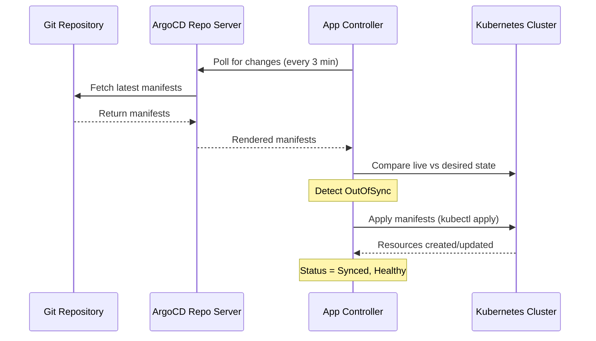

# How to Deploy a Simple Nginx App with ArgoCD

Author: [nawazdhandala](https://github.com/nawazdhandala)

Tags: ArgoCD, GitOps, Kubernetes, NGINX

Description: Step-by-step tutorial on deploying a simple Nginx application using ArgoCD with GitOps principles, from Git repository setup to production deployment.

---

Deploying Nginx with ArgoCD is one of the best ways to learn GitOps fundamentals. Nginx is simple enough that you can focus on the ArgoCD workflow rather than getting bogged down in application complexity. In this tutorial, we will go from zero to a fully deployed Nginx application managed by ArgoCD.

## Prerequisites

Before starting, make sure you have:

- A running Kubernetes cluster (minikube, kind, or any cloud provider)
- ArgoCD installed and running (see [How to Install ArgoCD on Kubernetes](https://oneuptime.com/blog/post/2026-01-25-install-argocd-kubernetes/view))
- kubectl configured to access your cluster
- ArgoCD CLI installed
- A Git repository you can push to (GitHub, GitLab, Bitbucket)

## Step 1: Create the Git Repository Structure

First, create a Git repository to hold your Nginx manifests. This is the "single source of truth" that ArgoCD will watch.

```bash
# Create the project structure
mkdir -p nginx-gitops/manifests
cd nginx-gitops
git init
```

## Step 2: Write the Kubernetes Manifests

Create the namespace, deployment, service, and optionally an ingress for Nginx.

### Namespace

```yaml
# manifests/namespace.yaml
apiVersion: v1
kind: Namespace
metadata:
  name: nginx-demo
  labels:
    app: nginx-demo
    managed-by: argocd
```

### Deployment

```yaml
# manifests/deployment.yaml
apiVersion: apps/v1
kind: Deployment
metadata:
  name: nginx
  namespace: nginx-demo
  labels:
    app: nginx
spec:
  replicas: 3
  selector:
    matchLabels:
      app: nginx
  template:
    metadata:
      labels:
        app: nginx
    spec:
      containers:
        - name: nginx
          image: nginx:1.25.3
          ports:
            - containerPort: 80
              name: http
          # Resource limits for production readiness
          resources:
            requests:
              cpu: 100m
              memory: 128Mi
            limits:
              cpu: 250m
              memory: 256Mi
          # Health check to verify Nginx is serving
          livenessProbe:
            httpGet:
              path: /
              port: 80
            initialDelaySeconds: 5
            periodSeconds: 10
          readinessProbe:
            httpGet:
              path: /
              port: 80
            initialDelaySeconds: 5
            periodSeconds: 5
```

### Service

```yaml
# manifests/service.yaml
apiVersion: v1
kind: Service
metadata:
  name: nginx
  namespace: nginx-demo
  labels:
    app: nginx
spec:
  type: ClusterIP
  ports:
    - port: 80
      targetPort: 80
      protocol: TCP
      name: http
  selector:
    app: nginx
```

### ConfigMap for Custom Content (Optional)

```yaml
# manifests/configmap.yaml
apiVersion: v1
kind: ConfigMap
metadata:
  name: nginx-html
  namespace: nginx-demo
data:
  index.html: |
    <!DOCTYPE html>
    <html>
    <head><title>ArgoCD Nginx Demo</title></head>
    <body>
      <h1>Deployed with ArgoCD GitOps</h1>
      <p>This page is managed by ArgoCD.</p>
    </body>
    </html>
```

If you want to use the custom HTML, add a volume mount to the deployment:

```yaml
# Add to the deployment spec under containers
volumeMounts:
  - name: html-volume
    mountPath: /usr/share/nginx/html
# Add under spec.template.spec
volumes:
  - name: html-volume
    configMap:
      name: nginx-html
```

## Step 3: Push to Git

```bash
# Commit and push your manifests
git add .
git commit -m "Add Nginx Kubernetes manifests"
git remote add origin https://github.com/yourorg/nginx-gitops.git
git push -u origin main
```

## Step 4: Create the ArgoCD Application

Now comes the ArgoCD part. You have two choices - declarative YAML or the CLI.

### Option A: Declarative Application YAML (Recommended)

```yaml
# argocd-application.yaml
apiVersion: argoproj.io/v1alpha1
kind: Application
metadata:
  name: nginx-demo
  namespace: argocd
  # Finalizer ensures resources are cleaned up when the app is deleted
  finalizers:
    - resources-finalizer.argocd.argoproj.io
spec:
  project: default
  source:
    repoURL: https://github.com/yourorg/nginx-gitops.git
    targetRevision: main
    path: manifests
  destination:
    server: https://kubernetes.default.svc
    namespace: nginx-demo
  syncPolicy:
    automated:
      prune: true      # Delete resources removed from Git
      selfHeal: true   # Fix drift automatically
    syncOptions:
      - CreateNamespace=true  # Create namespace if it does not exist
```

Apply it:

```bash
kubectl apply -f argocd-application.yaml
```

### Option B: Using the ArgoCD CLI

```bash
argocd app create nginx-demo \
  --repo https://github.com/yourorg/nginx-gitops.git \
  --path manifests \
  --dest-server https://kubernetes.default.svc \
  --dest-namespace nginx-demo \
  --sync-policy automated \
  --auto-prune \
  --self-heal \
  --sync-option CreateNamespace=true
```

## Step 5: Verify the Deployment

Check the application status in ArgoCD:

```bash
# Check application status
argocd app get nginx-demo

# Expected output:
# Name:               argocd/nginx-demo
# Server:             https://kubernetes.default.svc
# Namespace:          nginx-demo
# URL:                https://argocd.example.com/applications/nginx-demo
# Repo:               https://github.com/yourorg/nginx-gitops.git
# Target:             main
# Path:               manifests
# SyncWindow:         Sync Allowed
# Sync Policy:        Automated (Prune)
# Sync Status:        Synced
# Health Status:      Healthy
```

Verify the pods are running:

```bash
kubectl get pods -n nginx-demo

# NAME                     READY   STATUS    RESTARTS   AGE
# nginx-6d4cf56db6-2x7kp   1/1     Running   0          45s
# nginx-6d4cf56db6-8j9mn   1/1     Running   0          45s
# nginx-6d4cf56db6-qt4zl   1/1     Running   0          45s
```

Test the service:

```bash
# Port-forward to access Nginx locally
kubectl port-forward -n nginx-demo svc/nginx 8080:80

# In another terminal
curl http://localhost:8080
```

## Step 6: Make a GitOps Change

The real power of ArgoCD becomes apparent when you make changes through Git. Let us scale up the deployment.

Edit `manifests/deployment.yaml` and change replicas from 3 to 5:

```yaml
spec:
  replicas: 5  # Changed from 3
```

Commit and push:

```bash
git add manifests/deployment.yaml
git commit -m "Scale Nginx to 5 replicas"
git push
```

Within a few minutes (or seconds if you configured a webhook), ArgoCD will detect the change and automatically sync. Watch it happen:

```bash
# Watch the sync happen in real time
argocd app get nginx-demo --refresh

# Or watch pods scale up
kubectl get pods -n nginx-demo -w
```

## Step 7: Observe Self-Healing

With self-healing enabled, try manually changing something in the cluster and watch ArgoCD revert it:

```bash
# Manually scale down to 1 replica
kubectl scale deployment nginx -n nginx-demo --replicas=1

# Watch ArgoCD detect the drift and restore to 5 replicas
kubectl get pods -n nginx-demo -w
```

ArgoCD will detect that the live state (1 replica) does not match the desired state in Git (5 replicas) and automatically correct it.

## Understanding the Sync Flow

Here is what happens when ArgoCD syncs your Nginx application:



## Common Mistakes to Avoid

1. **Forgetting the namespace in manifests** - If your manifests specify a namespace that does not match the Application destination, resources end up in unexpected places. Always be explicit about namespaces.

2. **Not setting resource limits** - ArgoCD will deploy whatever you define. Without resource limits, a single pod could starve your cluster.

3. **Hardcoding image tags to latest** - Use specific image tags like `nginx:1.25.3` instead of `nginx:latest`. The `latest` tag makes it impossible to know which version is deployed and breaks GitOps traceability.

4. **Skipping health probes** - ArgoCD uses health status to determine if a deployment succeeded. Without probes, ArgoCD might report Healthy when your app is actually broken.

## Next Steps

Now that you have a basic Nginx deployment working with ArgoCD, you can:

- Add an Ingress resource with TLS termination
- Create environment-specific overlays using Kustomize
- Set up [ArgoCD notifications](https://oneuptime.com/blog/post/2026-02-02-argocd-notifications/view) to get alerted on sync events
- Use [ArgoCD sync waves](https://oneuptime.com/blog/post/2026-01-27-argocd-sync-waves/view) to order resource creation

Deploying Nginx with ArgoCD may seem like overkill for a single application, but it establishes the GitOps workflow that scales to hundreds of applications. The patterns you learn here - declarative configuration, automated sync, self-healing - apply to every application you deploy with ArgoCD.
