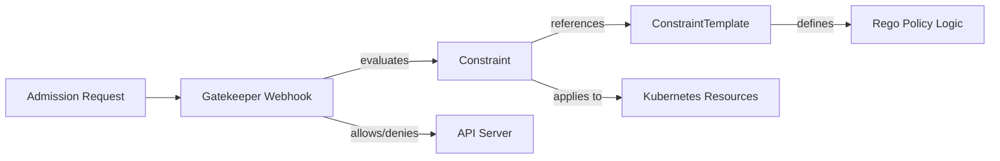

# How to Deploy OPA Gatekeeper with ArgoCD

Author: [nawazdhandala](https://github.com/nawazdhandala)

Tags: ArgoCD, GitOps, Kubernetes, OPA, Gatekeeper

Description: Learn how to deploy OPA Gatekeeper for policy enforcement using ArgoCD with constraint templates, constraints, and audit-based compliance checking.

---

OPA Gatekeeper is a Kubernetes admission controller that enforces policies using the Open Policy Agent (OPA) engine. It provides a Kubernetes-native way to define and enforce policies using the Rego policy language. Deploying Gatekeeper with ArgoCD brings GitOps discipline to your policy management, ensuring that policies are reviewed, versioned, and automatically applied across clusters.

This guide covers deploying Gatekeeper through ArgoCD, writing constraint templates and constraints, and managing the policy lifecycle through Git.

## How Gatekeeper Works

Gatekeeper introduces two custom resources:

- **ConstraintTemplate**: Defines a reusable policy template written in Rego. Think of it as a parameterized policy class.
- **Constraint**: An instance of a ConstraintTemplate with specific parameters. Think of it as applying a policy with concrete values.

This two-layer approach lets your platform team write templates that application teams can use with different parameters.



## Repository Structure

```text
security/
  gatekeeper/
    Chart.yaml
    values.yaml
  gatekeeper-policies/
    templates/
      k8srequiredlabels.yaml
      k8scontainerlimits.yaml
      k8sdisallowedtags.yaml
      k8sblockprivileged.yaml
    constraints/
      require-team-label.yaml
      require-resource-limits.yaml
      disallow-latest-tag.yaml
      block-privileged.yaml
```

## Deploying Gatekeeper

### Wrapper Chart

```yaml
# security/gatekeeper/Chart.yaml
apiVersion: v2
name: gatekeeper
description: Wrapper chart for OPA Gatekeeper
type: application
version: 1.0.0
dependencies:
  - name: gatekeeper
    version: "3.17.1"
    repository: "https://open-policy-agent.github.io/gatekeeper/charts"
```

### Gatekeeper Values

```yaml
# security/gatekeeper/values.yaml
gatekeeper:
  # Replicas for high availability
  replicas: 3

  # Audit configuration
  audit:
    replicas: 1
    resources:
      requests:
        cpu: 250m
        memory: 256Mi
      limits:
        memory: 512Mi
    # How often to audit existing resources
    auditInterval: 300  # 5 minutes
    constraintViolationsLimit: 100
    auditFromCache: false
    auditChunkSize: 500

  # Controller manager
  controllerManager:
    resources:
      requests:
        cpu: 250m
        memory: 256Mi
      limits:
        memory: 512Mi

  # Webhook configuration
  webhook:
    # What happens when Gatekeeper is unavailable
    failurePolicy: Ignore
    # Timeout for webhook calls
    timeoutSeconds: 5

  # Exempt namespaces from enforcement
  exemptNamespaces:
    - kube-system
    - kube-public
    - kube-node-lease
    - gatekeeper-system
    - argocd

  # Exempt namespaces via prefix
  exemptNamespacePrefixes: []

  # Enable mutation support
  mutatingWebhookEnabled: true
  mutatingWebhookFailurePolicy: Ignore

  # Emit admission events
  emitAdmissionEvents: true
  emitAuditEvents: true

  # Enable external data providers
  enableExternalData: false

  # Pod disruption budget
  podDisruptionBudget:
    minAvailable: 1

  # ServiceMonitor
  serviceMonitor:
    enabled: true
    additionalLabels:
      release: kube-prometheus-stack

  # Install CRDs
  crds:
    affinity: {}
    resources:
      requests:
        cpu: 100m
        memory: 128Mi
```

### ArgoCD Application for Gatekeeper

```yaml
apiVersion: argoproj.io/v1alpha1
kind: Application
metadata:
  name: gatekeeper
  namespace: argocd
  annotations:
    argocd.argoproj.io/sync-wave: "-2"
  finalizers:
    - resources-finalizer.argocd.argoproj.io
spec:
  project: security
  source:
    repoURL: https://github.com/your-org/gitops-repo.git
    targetRevision: main
    path: security/gatekeeper
    helm:
      valueFiles:
        - values.yaml
  destination:
    server: https://kubernetes.default.svc
    namespace: gatekeeper-system
  syncPolicy:
    automated:
      prune: true
      selfHeal: true
    syncOptions:
      - CreateNamespace=true
      - ServerSideApply=true
    retry:
      limit: 5
      backoff:
        duration: 5s
        factor: 2
        maxDuration: 3m
  ignoreDifferences:
    - group: admissionregistration.k8s.io
      kind: MutatingWebhookConfiguration
      jqPathExpressions:
        - '.webhooks[]?.clientConfig.caBundle'
    - group: admissionregistration.k8s.io
      kind: ValidatingWebhookConfiguration
      jqPathExpressions:
        - '.webhooks[]?.clientConfig.caBundle'
```

## Writing Constraint Templates

### Required Labels Template

```yaml
# security/gatekeeper-policies/templates/k8srequiredlabels.yaml
apiVersion: templates.gatekeeper.sh/v1
kind: ConstraintTemplate
metadata:
  name: k8srequiredlabels
  annotations:
    description: Requires specified labels on resources
spec:
  crd:
    spec:
      names:
        kind: K8sRequiredLabels
      validation:
        openAPIV3Schema:
          type: object
          properties:
            labels:
              type: array
              items:
                type: object
                properties:
                  key:
                    type: string
                  allowedRegex:
                    type: string
  targets:
    - target: admission.k8s.gatekeeper.sh
      rego: |
        package k8srequiredlabels

        violation[{"msg": msg, "details": {"missing_labels": missing}}] {
          provided := {label | input.review.object.metadata.labels[label]}
          required := {label | label := input.parameters.labels[_].key}
          missing := required - provided
          count(missing) > 0
          msg := sprintf("Missing required labels: %v", [missing])
        }

        violation[{"msg": msg}] {
          label := input.parameters.labels[_]
          label.allowedRegex != ""
          value := input.review.object.metadata.labels[label.key]
          not re_match(label.allowedRegex, value)
          msg := sprintf("Label '%v' value '%v' does not match regex '%v'", [label.key, value, label.allowedRegex])
        }
```

### Container Limits Template

```yaml
# security/gatekeeper-policies/templates/k8scontainerlimits.yaml
apiVersion: templates.gatekeeper.sh/v1
kind: ConstraintTemplate
metadata:
  name: k8scontainerlimits
  annotations:
    description: Requires containers to have resource limits set
spec:
  crd:
    spec:
      names:
        kind: K8sContainerLimits
      validation:
        openAPIV3Schema:
          type: object
          properties:
            cpu:
              type: string
            memory:
              type: string
            exemptImages:
              type: array
              items:
                type: string
  targets:
    - target: admission.k8s.gatekeeper.sh
      rego: |
        package k8scontainerlimits

        violation[{"msg": msg}] {
          container := input.review.object.spec.containers[_]
          not is_exempt(container)
          not container.resources.limits.cpu
          msg := sprintf("Container '%v' has no CPU limit", [container.name])
        }

        violation[{"msg": msg}] {
          container := input.review.object.spec.containers[_]
          not is_exempt(container)
          not container.resources.limits.memory
          msg := sprintf("Container '%v' has no memory limit", [container.name])
        }

        is_exempt(container) {
          exempt_images := object.get(input.parameters, "exemptImages", [])
          img := container.image
          exemption := exempt_images[_]
          _matches_exemption(img, exemption)
        }

        _matches_exemption(img, exemption) {
          contains(googimg, exemption)
        }

        _matches_exemption(img, exemption) {
          endswith(exemption, "*")
          prefix := trim_suffix(exemption, "*")
          startswith(img, prefix)
        }
```

### Block Privileged Containers

```yaml
# security/gatekeeper-policies/templates/k8sblockprivileged.yaml
apiVersion: templates.gatekeeper.sh/v1
kind: ConstraintTemplate
metadata:
  name: k8sblockprivileged
  annotations:
    description: Blocks containers from running in privileged mode
spec:
  crd:
    spec:
      names:
        kind: K8sBlockPrivileged
      validation:
        openAPIV3Schema:
          type: object
          properties:
            exemptImages:
              type: array
              items:
                type: string
  targets:
    - target: admission.k8s.gatekeeper.sh
      rego: |
        package k8sblockprivileged

        violation[{"msg": msg}] {
          c := input_containers[_]
          c.securityContext.privileged == true
          msg := sprintf("Privileged container not allowed: %v", [c.name])
        }

        input_containers[c] {
          c := input.review.object.spec.containers[_]
        }
        input_containers[c] {
          c := input.review.object.spec.initContainers[_]
        }
        input_containers[c] {
          c := input.review.object.spec.ephemeralContainers[_]
        }
```

## Writing Constraints

```yaml
# security/gatekeeper-policies/constraints/require-team-label.yaml
apiVersion: constraints.gatekeeper.sh/v1beta1
kind: K8sRequiredLabels
metadata:
  name: require-team-label
spec:
  enforcementAction: warn  # Start with warn, move to deny
  match:
    kinds:
      - apiGroups: ["apps"]
        kinds: ["Deployment", "StatefulSet", "DaemonSet"]
    excludedNamespaces:
      - kube-system
      - argocd
      - gatekeeper-system
  parameters:
    labels:
      - key: "team"
      - key: "app.kubernetes.io/name"
```

```yaml
# security/gatekeeper-policies/constraints/block-privileged.yaml
apiVersion: constraints.gatekeeper.sh/v1beta1
kind: K8sBlockPrivileged
metadata:
  name: block-privileged-containers
spec:
  enforcementAction: deny
  match:
    kinds:
      - apiGroups: [""]
        kinds: ["Pod"]
    excludedNamespaces:
      - kube-system
      - security
  parameters:
    exemptImages:
      - "gcr.io/google-containers/*"
```

### ArgoCD Application for Policies

Deploy templates first using sync waves, then constraints.

```yaml
apiVersion: argoproj.io/v1alpha1
kind: Application
metadata:
  name: gatekeeper-policies
  namespace: argocd
  annotations:
    argocd.argoproj.io/sync-wave: "-1"
spec:
  project: security
  source:
    repoURL: https://github.com/your-org/gitops-repo.git
    targetRevision: main
    path: security/gatekeeper-policies
  destination:
    server: https://kubernetes.default.svc
  syncPolicy:
    automated:
      prune: true
      selfHeal: true
    syncOptions:
      - ServerSideApply=true
```

Use sync wave annotations on individual resources to ensure templates are created before constraints.

```yaml
# On ConstraintTemplate resources
metadata:
  annotations:
    argocd.argoproj.io/sync-wave: "0"

# On Constraint resources
metadata:
  annotations:
    argocd.argoproj.io/sync-wave: "1"
```

## Checking Audit Results

```bash
# View constraint violations
kubectl get k8srequiredlabels require-team-label -o yaml | \
  yq '.status.violations'

# View all constraints and their violation counts
kubectl get constraints

# Check Gatekeeper audit logs
kubectl logs -n gatekeeper-system -l control-plane=audit-controller --tail=30
```

## Summary

Deploying OPA Gatekeeper with ArgoCD provides a robust, GitOps-managed policy enforcement layer. Constraint templates and constraints are version-controlled in Git, reviewed through pull requests, and automatically deployed. Start with `warn` enforcement action to understand policy impact, then gradually move to `deny` as your team adapts. The key to success is proper sync wave ordering (templates before constraints) and excluding system namespaces from enforcement.
