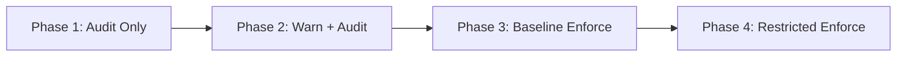

# How to Deploy Pod Security Standards with ArgoCD

Author: [nawazdhandala](https://github.com/nawazdhandala)

Tags: ArgoCD, GitOps, Kubernetes, Pod Security, Security

Description: Learn how to deploy and enforce Kubernetes Pod Security Standards using ArgoCD with namespace labels, policy engines, and gradual enforcement strategies.

---

Pod Security Standards (PSS) define three levels of security for Kubernetes pods: Privileged, Baseline, and Restricted. They replaced the deprecated PodSecurityPolicy (PSP) and are enforced through the built-in Pod Security Admission (PSA) controller. Deploying these standards through ArgoCD ensures that security levels are consistently applied across namespaces, tracked in Git, and protected from manual changes.

This guide covers implementing Pod Security Standards using ArgoCD, from namespace label configuration to policy engine integration for more granular control.

## Understanding Pod Security Standards

The three levels are cumulative:

- **Privileged**: Unrestricted. No security constraints.
- **Baseline**: Prevents known privilege escalations. Allows most common workloads without modification.
- **Restricted**: Heavily restricted. Follows security best practices. Requires workloads to be explicitly configured for security.

Each level can be applied with three modes:

- **enforce**: Violations reject the pod
- **audit**: Violations are logged but allowed
- **warn**: Violations trigger a warning to the user but are allowed

## How PSA Works

Pod Security Admission is enabled by default in Kubernetes 1.25+. It uses namespace labels to determine which security level to apply.

```yaml
# Namespace labels for Pod Security Admission
metadata:
  labels:
    pod-security.kubernetes.io/enforce: restricted
    pod-security.kubernetes.io/audit: restricted
    pod-security.kubernetes.io/warn: restricted
    pod-security.kubernetes.io/enforce-version: v1.30
    pod-security.kubernetes.io/audit-version: v1.30
    pod-security.kubernetes.io/warn-version: v1.30
```

## Repository Structure

```
pod-security/
  namespaces/
    production/
      frontend.yaml
      backend.yaml
      database.yaml
    staging/
      frontend.yaml
      backend.yaml
    system/
      monitoring.yaml
      logging.yaml
  kyverno-policies/
    enforce-restricted.yaml
    require-security-context.yaml
```

## Deploying Namespace Security Labels with ArgoCD

### Defining Namespaces with Security Levels

```yaml
# pod-security/namespaces/production/frontend.yaml
apiVersion: v1
kind: Namespace
metadata:
  name: frontend
  labels:
    pod-security.kubernetes.io/enforce: restricted
    pod-security.kubernetes.io/audit: restricted
    pod-security.kubernetes.io/warn: restricted
    pod-security.kubernetes.io/enforce-version: latest
    environment: production
    team: frontend
```

```yaml
# pod-security/namespaces/production/backend.yaml
apiVersion: v1
kind: Namespace
metadata:
  name: backend
  labels:
    pod-security.kubernetes.io/enforce: restricted
    pod-security.kubernetes.io/audit: restricted
    pod-security.kubernetes.io/warn: restricted
    pod-security.kubernetes.io/enforce-version: latest
    environment: production
    team: backend
```

```yaml
# pod-security/namespaces/system/monitoring.yaml
apiVersion: v1
kind: Namespace
metadata:
  name: monitoring
  labels:
    # Monitoring tools often need baseline level due to host access
    pod-security.kubernetes.io/enforce: baseline
    pod-security.kubernetes.io/audit: restricted
    pod-security.kubernetes.io/warn: restricted
    pod-security.kubernetes.io/enforce-version: latest
    environment: system
    team: platform
```

### ArgoCD Application for Namespaces

```yaml
apiVersion: argoproj.io/v1alpha1
kind: Application
metadata:
  name: namespace-security
  namespace: argocd
spec:
  project: security
  source:
    repoURL: https://github.com/your-org/gitops-repo.git
    targetRevision: main
    path: pod-security/namespaces
  destination:
    server: https://kubernetes.default.svc
  syncPolicy:
    automated:
      prune: false  # Never auto-delete namespaces
      selfHeal: true
    syncOptions:
      - ServerSideApply=true
```

Note that `prune: false` is set deliberately - you do not want ArgoCD to automatically delete namespaces if you remove a file from Git.

## What Each Security Level Requires

### Baseline Level

The Baseline level prevents the most common privilege escalations. Workloads must NOT:

- Run privileged containers
- Use hostNetwork, hostPID, or hostIPC
- Use hostPath volumes
- Add Linux capabilities beyond the default set
- Set the sysctl interface to unsafe values

### Restricted Level

The Restricted level requires workloads to be explicitly secure. In addition to Baseline requirements, workloads must:

- Run as non-root
- Use a read-only root filesystem (recommended but not required)
- Drop ALL capabilities and only add NET_BIND_SERVICE if needed
- Set seccompProfile to RuntimeDefault or Localhost
- Not allow privilege escalation

Here is a pod spec that complies with the Restricted level.

```yaml
apiVersion: v1
kind: Pod
metadata:
  name: secure-app
spec:
  securityContext:
    runAsNonRoot: true
    seccompProfile:
      type: RuntimeDefault
  containers:
    - name: app
      image: your-registry.com/app:v1.0
      securityContext:
        allowPrivilegeEscalation: false
        readOnlyRootFilesystem: true
        runAsNonRoot: true
        capabilities:
          drop:
            - ALL
        seccompProfile:
          type: RuntimeDefault
      resources:
        requests:
          cpu: 100m
          memory: 128Mi
        limits:
          memory: 256Mi
```

## Enforcing PSS with Kyverno (Beyond Built-in PSA)

The built-in PSA controller is namespace-scoped and binary (allowed or denied). Kyverno provides more flexibility with exceptions, mutations, and detailed reports.

### Auto-Inject Security Context

Instead of blocking non-compliant pods, mutate them to add the required security context.

```yaml
# pod-security/kyverno-policies/inject-security-context.yaml
apiVersion: kyverno.io/v1
kind: ClusterPolicy
metadata:
  name: inject-security-context
  annotations:
    policies.kyverno.io/title: Inject Default Security Context
    policies.kyverno.io/category: Pod Security Standards
spec:
  rules:
    - name: add-security-context
      match:
        any:
          - resources:
              kinds:
                - Pod
              namespaceSelector:
                matchLabels:
                  pod-security.kubernetes.io/enforce: restricted
      mutate:
        patchStrategicMerge:
          spec:
            securityContext:
              runAsNonRoot: true
              seccompProfile:
                type: RuntimeDefault
            containers:
              - (name): "*"
                securityContext:
                  allowPrivilegeEscalation: false
                  capabilities:
                    drop:
                      - ALL
```

### Enforce with Exceptions

Allow specific workloads to bypass certain restrictions using PolicyExceptions.

```yaml
# pod-security/kyverno-policies/enforce-restricted.yaml
apiVersion: kyverno.io/v1
kind: ClusterPolicy
metadata:
  name: enforce-restricted-pss
spec:
  validationFailureAction: Enforce
  background: true
  rules:
    - name: restricted-containers
      match:
        any:
          - resources:
              kinds:
                - Pod
              namespaceSelector:
                matchLabels:
                  pod-security.kubernetes.io/enforce: restricted
      validate:
        message: "Container must set allowPrivilegeEscalation to false."
        pattern:
          spec:
            containers:
              - securityContext:
                  allowPrivilegeEscalation: false
```

```yaml
# Exception for a specific workload
apiVersion: kyverno.io/v2beta1
kind: PolicyException
metadata:
  name: allow-istio-init
  namespace: kyverno
spec:
  exceptions:
    - policyName: enforce-restricted-pss
      ruleNames:
        - restricted-containers
  match:
    any:
      - resources:
          kinds:
            - Pod
          namespaces:
            - istio-system
          names:
            - "istio-init*"
```

## Gradual Rollout Strategy

Do not enforce the Restricted level everywhere at once. Follow this progression:



### Phase 1: Audit Everything

```yaml
labels:
  pod-security.kubernetes.io/audit: restricted
```

Review audit logs to identify non-compliant workloads.

```bash
# Check audit events
kubectl get events --field-selector reason=FailedCreate -A
```

### Phase 2: Add Warnings

```yaml
labels:
  pod-security.kubernetes.io/audit: restricted
  pod-security.kubernetes.io/warn: restricted
```

Users see warnings when deploying non-compliant workloads, giving them time to fix.

### Phase 3: Enforce Baseline

```yaml
labels:
  pod-security.kubernetes.io/enforce: baseline
  pod-security.kubernetes.io/audit: restricted
  pod-security.kubernetes.io/warn: restricted
```

### Phase 4: Enforce Restricted

```yaml
labels:
  pod-security.kubernetes.io/enforce: restricted
  pod-security.kubernetes.io/audit: restricted
  pod-security.kubernetes.io/warn: restricted
```

## Verifying the Deployment

```bash
# Check namespace labels
kubectl get ns --show-labels | grep pod-security

# Test a non-compliant pod
kubectl run test --image=nginx --dry-run=server -n frontend
# Should be rejected if namespace enforces restricted

# Check policy reports (if using Kyverno)
kubectl get policyreports -A

# Check admission events
kubectl get events -A --field-selector reason=FailedCreate
```

## Summary

Deploying Pod Security Standards with ArgoCD provides a GitOps-managed approach to pod-level security. The built-in PSA controller handles basic enforcement through namespace labels, while policy engines like Kyverno add mutation, exceptions, and detailed reporting. By managing security level assignments through Git, you get a reviewable, auditable, and consistent security posture across all your namespaces. Start with audit mode, fix non-compliant workloads, and gradually increase enforcement levels.
