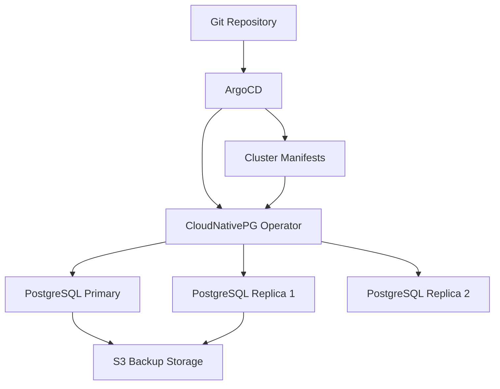

# How to Deploy PostgreSQL Operator (CloudNativePG) with ArgoCD

Author: [nawazdhandala](https://github.com/nawazdhandala)

Tags: ArgoCD, GitOps, Kubernetes, PostgreSQL, CloudNativePG

Description: Learn how to deploy and manage the CloudNativePG PostgreSQL operator using ArgoCD for fully GitOps-driven database lifecycle management on Kubernetes.

---

Running PostgreSQL on Kubernetes has become a standard practice for many teams, and CloudNativePG is one of the best operators for the job. It handles everything from cluster provisioning to automated failover, backups, and rolling upgrades. But deploying it through manual Helm commands or kubectl applies defeats the purpose of having a repeatable, auditable infrastructure pipeline. That is where ArgoCD comes in.

By managing CloudNativePG through ArgoCD, you get declarative database infrastructure that is version-controlled, automatically synced, and easy to roll back. This guide walks through the full setup, from installing the operator to provisioning PostgreSQL clusters, all managed through Git.

## Prerequisites

Before you start, make sure you have:

- A Kubernetes cluster (1.25+)
- ArgoCD installed and running
- A Git repository for your manifests
- kubectl configured for your cluster

## Step 1: Create the ArgoCD Application for the Operator

CloudNativePG is distributed as a Helm chart. Create an ArgoCD Application that points to the official chart repository.

```yaml
# argocd/cloudnativepg-operator.yaml
apiVersion: argoproj.io/v1alpha1
kind: Application
metadata:
  name: cloudnativepg-operator
  namespace: argocd
  finalizers:
    - resources-finalizer.argocd.argoproj.io
spec:
  project: default
  source:
    chart: cloudnative-pg
    repoURL: https://cloudnative-pg.github.io/charts
    targetRevision: 0.22.0
    helm:
      releaseName: cloudnative-pg
      values: |
        # Number of operator replicas for HA
        replicaCount: 2
        # Resource limits for the operator pods
        resources:
          limits:
            memory: 256Mi
            cpu: 200m
          requests:
            memory: 128Mi
            cpu: 100m
        # Enable monitoring
        monitoring:
          podMonitorEnabled: true
  destination:
    server: https://kubernetes.default.svc
    namespace: cnpg-system
  syncPolicy:
    automated:
      prune: true
      selfHeal: true
    syncOptions:
      - CreateNamespace=true
      - ServerSideApply=true
```

The `ServerSideApply=true` sync option is important here because CloudNativePG CRDs are large and can exceed the annotation size limit that client-side apply uses.

## Step 2: Deploy a PostgreSQL Cluster

Once the operator is running, you can define PostgreSQL clusters as Kubernetes custom resources. Create a separate ArgoCD Application for your database instances.

```yaml
# argocd/postgres-clusters.yaml
apiVersion: argoproj.io/v1alpha1
kind: Application
metadata:
  name: postgres-clusters
  namespace: argocd
spec:
  project: default
  source:
    repoURL: https://github.com/your-org/k8s-manifests.git
    targetRevision: main
    path: databases/postgres
  destination:
    server: https://kubernetes.default.svc
    namespace: databases
  syncPolicy:
    automated:
      prune: false  # Don't auto-delete databases
      selfHeal: true
    syncOptions:
      - CreateNamespace=true
```

Notice that `prune` is set to `false`. This is intentional. You do not want ArgoCD to automatically delete database clusters if someone removes a manifest from Git. Database deletions should be deliberate and carefully planned.

## Step 3: Define the PostgreSQL Cluster Manifest

Place this in your Git repository under the path referenced by the ArgoCD Application above.

```yaml
# databases/postgres/production-cluster.yaml
apiVersion: postgresql.cnpg.io/v1
kind: Cluster
metadata:
  name: production-db
  namespace: databases
spec:
  instances: 3

  # PostgreSQL version
  imageName: ghcr.io/cloudnative-pg/postgresql:16.2

  # Storage configuration
  storage:
    size: 50Gi
    storageClass: gp3-encrypted

  # Resource allocation
  resources:
    requests:
      memory: 2Gi
      cpu: "1"
    limits:
      memory: 4Gi
      cpu: "2"

  # PostgreSQL configuration
  postgresql:
    parameters:
      max_connections: "200"
      shared_buffers: 1GB
      effective_cache_size: 3GB
      work_mem: 16MB
      maintenance_work_mem: 256MB
      wal_buffers: 16MB
      max_wal_size: 2GB

  # Automated backup configuration
  backup:
    barmanObjectStore:
      destinationPath: s3://my-pg-backups/production
      s3Credentials:
        accessKeyId:
          name: s3-backup-creds
          key: ACCESS_KEY_ID
        secretAccessKey:
          name: s3-backup-creds
          key: SECRET_ACCESS_KEY
      wal:
        compression: gzip
    retentionPolicy: "30d"

  # High availability settings
  minSyncReplicas: 1
  maxSyncReplicas: 1

  # Pod anti-affinity for spreading across nodes
  affinity:
    enablePodAntiAffinity: true
    topologyKey: kubernetes.io/hostname
```

## Step 4: Handle Database Credentials with External Secrets

Database credentials should not live in your Git repository. Use the External Secrets Operator or Sealed Secrets to manage them.

```yaml
# databases/postgres/backup-credentials.yaml
apiVersion: external-secrets.io/v1beta1
kind: ExternalSecret
metadata:
  name: s3-backup-creds
  namespace: databases
spec:
  refreshInterval: 1h
  secretStoreRef:
    name: aws-secrets-manager
    kind: ClusterSecretStore
  target:
    name: s3-backup-creds
  data:
    - secretKey: ACCESS_KEY_ID
      remoteRef:
        key: /production/postgres/backup-s3
        property: access_key_id
    - secretKey: SECRET_ACCESS_KEY
      remoteRef:
        key: /production/postgres/backup-s3
        property: secret_access_key
```

## Step 5: Configure Health Checks in ArgoCD

ArgoCD does not natively understand CloudNativePG health status. Add a custom health check to your ArgoCD ConfigMap so that ArgoCD correctly reports whether your PostgreSQL clusters are healthy.

```yaml
# argocd-cm ConfigMap addition
apiVersion: v1
kind: ConfigMap
metadata:
  name: argocd-cm
  namespace: argocd
data:
  resource.customizations.health.postgresql.cnpg.io_Cluster: |
    hs = {}
    if obj.status ~= nil then
      if obj.status.phase == "Cluster in healthy state" then
        hs.status = "Healthy"
        hs.message = "Cluster is running with " ..
          (obj.status.readyInstances or 0) .. " ready instances"
      elseif obj.status.phase == "Setting up primary" or
             obj.status.phase == "Creating replica" then
        hs.status = "Progressing"
        hs.message = obj.status.phase
      else
        hs.status = "Degraded"
        hs.message = obj.status.phase or "Unknown phase"
      end
    end
    return hs
```

## Step 6: Set Up Scheduled Backups

CloudNativePG supports ScheduledBackup resources. Define them alongside your cluster manifests.

```yaml
# databases/postgres/scheduled-backup.yaml
apiVersion: postgresql.cnpg.io/v1
kind: ScheduledBackup
metadata:
  name: production-db-backup
  namespace: databases
spec:
  schedule: "0 2 * * *"  # Daily at 2 AM
  backupOwnerReference: self
  cluster:
    name: production-db
  immediate: false
```

## Architecture Overview

Here is how the components interact when managed through ArgoCD:



## Handling Upgrades

When you need to upgrade PostgreSQL, update the `imageName` in your Git repository. CloudNativePG handles the rolling upgrade automatically - it promotes a replica, updates the old primary, and reintegrates it as a replica. ArgoCD detects the manifest change and triggers the sync.

```yaml
# Change this line in your cluster manifest
imageName: ghcr.io/cloudnative-pg/postgresql:16.3  # was 16.2
```

Commit and push. ArgoCD picks up the change and syncs. The operator then performs a rolling update with zero downtime.

## Sync Waves for Proper Ordering

If you are deploying both the operator and clusters from the same ArgoCD Application (or App of Apps), use sync waves to ensure the operator installs first.

```yaml
metadata:
  annotations:
    argocd.argoproj.io/sync-wave: "-1"  # Operator installs first
```

```yaml
metadata:
  annotations:
    argocd.argoproj.io/sync-wave: "1"  # Clusters install after operator
```

## Monitoring the Setup

With monitoring enabled on the operator and PostgreSQL clusters, you get Prometheus metrics for connection counts, replication lag, transaction rates, and more. Pair this with a monitoring platform like [OneUptime](https://oneuptime.com/blog/post/2026-01-21-cloudnativepg-prometheus-monitoring/view) to get alerts when your database clusters drift from their desired state.

## Conclusion

Managing CloudNativePG through ArgoCD gives you a production-grade PostgreSQL setup that is fully declarative. Every change to your database infrastructure goes through Git, gets reviewed in a pull request, and is automatically applied. Combined with proper backup configuration and health checks, this approach makes database operations on Kubernetes reliable and auditable. The key takeaways are: use `ServerSideApply` for CRDs, disable auto-pruning for database resources, and add custom health checks so ArgoCD accurately reflects your cluster state.
