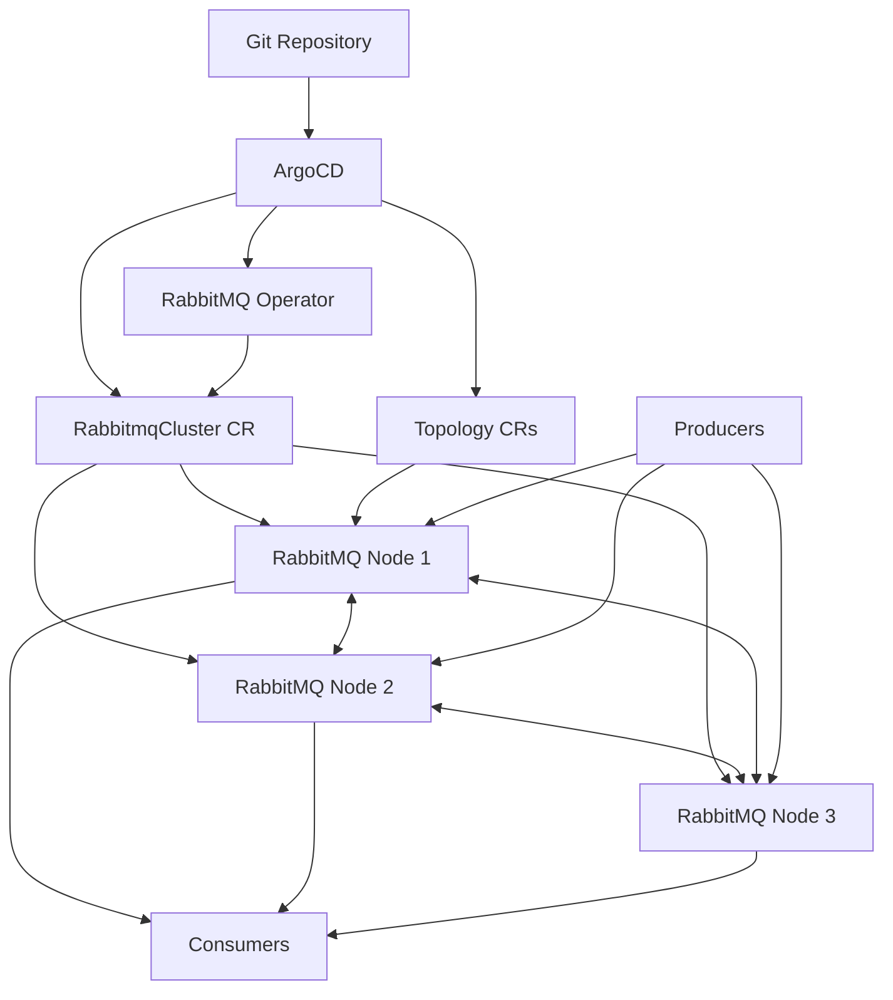

# How to Deploy RabbitMQ Cluster Operator with ArgoCD

Author: [nawazdhandala](https://github.com/nawazdhandala)

Tags: ArgoCD, GitOps, Kubernetes, RabbitMQ, Messaging

Description: Learn how to deploy the RabbitMQ Cluster Operator using ArgoCD for GitOps-managed message broker clusters with quorum queues and high availability.

---

RabbitMQ remains one of the most popular message brokers, and the RabbitMQ Cluster Operator makes running it on Kubernetes straightforward. It handles cluster formation, peer discovery, rolling upgrades, and quorum queue management. By deploying it through ArgoCD, you bring the same GitOps discipline to your messaging infrastructure that you already have for your applications.

This guide covers the complete setup: installing the operator, provisioning RabbitMQ clusters, configuring policies, and managing the entire lifecycle through Git.

## Prerequisites

- Kubernetes cluster (1.24+)
- ArgoCD installed and configured
- A Git repository for manifests
- Storage class with dynamic provisioning

## Step 1: Deploy the RabbitMQ Cluster Operator

The operator is available through its own GitHub releases or through the VMware Tanzu Helm repository. Here we use the raw manifests approach with Kustomize.

```yaml
# argocd/rabbitmq-operator.yaml
apiVersion: argoproj.io/v1alpha1
kind: Application
metadata:
  name: rabbitmq-cluster-operator
  namespace: argocd
  finalizers:
    - resources-finalizer.argocd.argoproj.io
spec:
  project: default
  source:
    repoURL: https://github.com/your-org/k8s-manifests.git
    targetRevision: main
    path: operators/rabbitmq
  destination:
    server: https://kubernetes.default.svc
    namespace: rabbitmq-system
  syncPolicy:
    automated:
      prune: true
      selfHeal: true
    syncOptions:
      - CreateNamespace=true
      - ServerSideApply=true
```

In your Git repository, create a Kustomization that pulls the official manifests:

```yaml
# operators/rabbitmq/kustomization.yaml
apiVersion: kustomize.config.k8s.io/v1beta1
kind: Kustomization
resources:
  - https://github.com/rabbitmq/cluster-operator/releases/download/v2.10.0/cluster-operator.yml
```

## Step 2: Define a RabbitMQ Cluster

The `RabbitmqCluster` custom resource is clean and expressive. Here is a production-ready configuration:

```yaml
# messaging/rabbitmq/production-cluster.yaml
apiVersion: rabbitmq.com/v1beta1
kind: RabbitmqCluster
metadata:
  name: production-rabbitmq
  namespace: messaging
spec:
  replicas: 3

  # RabbitMQ image
  image: rabbitmq:3.13-management

  # Persistence
  persistence:
    storageClassName: gp3-encrypted
    storage: 50Gi

  # Resource allocation
  resources:
    requests:
      cpu: "1"
      memory: 2Gi
    limits:
      cpu: "2"
      memory: 4Gi

  # RabbitMQ configuration
  rabbitmq:
    additionalConfig: |
      # Quorum queue defaults
      default_queue_type = quorum

      # Memory management
      vm_memory_high_watermark.relative = 0.7
      vm_memory_high_watermark_paging_ratio = 0.8

      # Disk free limit
      disk_free_limit.absolute = 2GB

      # Connection limits
      channel_max = 128

      # Heartbeat
      heartbeat = 60

      # Cluster partition handling
      cluster_partition_handling = pause_minority

    advancedConfig: |
      [
        {rabbit, [
          {consumer_timeout, 3600000}
        ]}
      ].

  # Pod anti-affinity
  affinity:
    podAntiAffinity:
      requiredDuringSchedulingIgnoredDuringExecution:
        - labelSelector:
            matchLabels:
              app.kubernetes.io/name: production-rabbitmq
          topologyKey: kubernetes.io/hostname

  # Termination grace period for clean shutdown
  terminationGracePeriodSeconds: 600

  # Override for pod spec
  override:
    statefulSet:
      spec:
        template:
          spec:
            topologySpreadConstraints:
              - maxSkew: 1
                topologyKey: topology.kubernetes.io/zone
                whenUnsatisfiable: DoNotSchedule
                labelSelector:
                  matchLabels:
                    app.kubernetes.io/name: production-rabbitmq
```

## Step 3: Create the ArgoCD Application for Clusters

```yaml
# argocd/rabbitmq-clusters.yaml
apiVersion: argoproj.io/v1alpha1
kind: Application
metadata:
  name: rabbitmq-clusters
  namespace: argocd
spec:
  project: default
  source:
    repoURL: https://github.com/your-org/k8s-manifests.git
    targetRevision: main
    path: messaging/rabbitmq
  destination:
    server: https://kubernetes.default.svc
    namespace: messaging
  syncPolicy:
    automated:
      prune: false  # Protect message broker clusters
      selfHeal: true
    syncOptions:
      - CreateNamespace=true
```

## Step 4: Configure Policies and Users

RabbitMQ policies control queue behavior. Define them alongside your cluster.

```yaml
# messaging/rabbitmq/policies.yaml
apiVersion: rabbitmq.com/v1beta1
kind: Policy
metadata:
  name: ha-policy
  namespace: messaging
spec:
  name: ha-policy
  vhost: /
  pattern: ".*"
  applyTo: queues
  definition:
    ha-mode: exactly
    ha-params: 2
    ha-sync-mode: automatic
  rabbitmqClusterReference:
    name: production-rabbitmq
---
apiVersion: rabbitmq.com/v1beta1
kind: Policy
metadata:
  name: dlx-policy
  namespace: messaging
spec:
  name: dlx-policy
  vhost: /
  pattern: "^app\\."
  applyTo: queues
  definition:
    dead-letter-exchange: dlx
    dead-letter-routing-key: dlx
  rabbitmqClusterReference:
    name: production-rabbitmq
```

Create users for your applications:

```yaml
# messaging/rabbitmq/users.yaml
apiVersion: rabbitmq.com/v1beta1
kind: User
metadata:
  name: app-publisher
  namespace: messaging
spec:
  rabbitmqClusterReference:
    name: production-rabbitmq
  importCredentialsSecret:
    name: rabbitmq-app-publisher-creds
  tags:
    - management
---
apiVersion: rabbitmq.com/v1beta1
kind: Permission
metadata:
  name: app-publisher-permissions
  namespace: messaging
spec:
  vhost: /
  userReference:
    name: app-publisher
  permissions:
    write: ".*"
    configure: "^app\\."
    read: ""
  rabbitmqClusterReference:
    name: production-rabbitmq
```

## Step 5: Define Exchanges and Queues Declaratively

One of the best features of the RabbitMQ topology operator is declarative queue and exchange management.

```yaml
# messaging/rabbitmq/topology.yaml
apiVersion: rabbitmq.com/v1beta1
kind: Exchange
metadata:
  name: events-exchange
  namespace: messaging
spec:
  name: events
  type: topic
  durable: true
  rabbitmqClusterReference:
    name: production-rabbitmq
---
apiVersion: rabbitmq.com/v1beta1
kind: Queue
metadata:
  name: order-events-queue
  namespace: messaging
spec:
  name: order-events
  durable: true
  type: quorum
  rabbitmqClusterReference:
    name: production-rabbitmq
---
apiVersion: rabbitmq.com/v1beta1
kind: Binding
metadata:
  name: order-events-binding
  namespace: messaging
spec:
  source: events
  destination: order-events
  destinationType: queue
  routingKey: "orders.#"
  rabbitmqClusterReference:
    name: production-rabbitmq
```

## Step 6: Health Check Configuration

```yaml
# argocd-cm ConfigMap
data:
  resource.customizations.health.rabbitmq.com_RabbitmqCluster: |
    hs = {}
    if obj.status ~= nil and obj.status.conditions ~= nil then
      for _, condition in ipairs(obj.status.conditions) do
        if condition.type == "AllReplicasReady" then
          if condition.status == "True" then
            hs.status = "Healthy"
            hs.message = "All RabbitMQ replicas are ready"
          else
            hs.status = "Progressing"
            hs.message = condition.message or "Replicas not ready"
          end
          return hs
        end
      end
    end
    hs.status = "Progressing"
    hs.message = "Waiting for cluster status"
    return hs
```

## Architecture



## Monitoring

RabbitMQ exposes Prometheus metrics on port 15692. Create a ServiceMonitor or PodMonitor to scrape them. Pair this with [OneUptime](https://oneuptime.com) for alerting on queue depth, consumer lag, and cluster health.

```yaml
# messaging/rabbitmq/pod-monitor.yaml
apiVersion: monitoring.coreos.com/v1
kind: PodMonitor
metadata:
  name: rabbitmq-monitor
  namespace: messaging
spec:
  selector:
    matchLabels:
      app.kubernetes.io/name: production-rabbitmq
  podMetricsEndpoints:
    - port: prometheus
      interval: 15s
```

## Handling Upgrades

To upgrade RabbitMQ, update the image tag in your cluster manifest and push to Git. The operator performs a rolling restart, draining connections and transferring queue leadership before restarting each node.

```yaml
spec:
  image: rabbitmq:4.0-management  # was 3.13-management
```

The `terminationGracePeriodSeconds: 600` gives each pod 10 minutes to drain connections and sync quorum queues before shutdown.

## Conclusion

The RabbitMQ Cluster Operator combined with ArgoCD provides a powerful GitOps workflow for messaging infrastructure. You can declaratively manage not just the cluster itself but also exchanges, queues, bindings, users, and policies - all through Git. This makes your messaging topology as reviewable and auditable as your application code. Key practices: use quorum queues by default for durability, spread nodes across zones, set generous termination grace periods, and disable auto-pruning for cluster resources.
