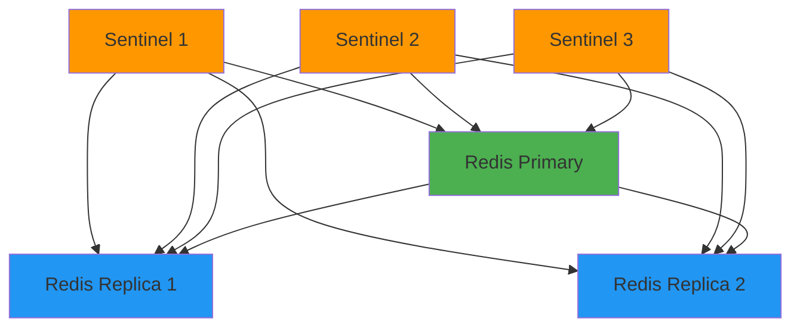

# How to Deploy Redis Sentinel with ArgoCD

Author: [nawazdhandala](https://github.com/nawazdhandala)

Tags: ArgoCD, GitOps, Kubernetes, Redis, High Availability

Description: Learn how to deploy Redis with Sentinel for automatic failover on Kubernetes using ArgoCD for GitOps-managed high availability caching and messaging.

---

Redis Sentinel provides high availability for Redis through automatic failover, monitoring, and notification. When the primary Redis instance fails, Sentinel promotes a replica and reconfigures the other replicas to use the new primary. Managing this setup through ArgoCD means your entire Redis HA configuration is declared in Git and automatically maintained.

This guide covers deploying Redis with Sentinel on Kubernetes using ArgoCD, including proper configuration for failover, persistence, and monitoring.

## Prerequisites

- Kubernetes cluster (1.24+)
- ArgoCD installed and configured
- A Git repository for manifests
- Storage class for Redis persistence

## Step 1: Deploy Redis with Sentinel via Helm

The Bitnami Redis Helm chart supports Sentinel mode out of the box. Create an ArgoCD Application.

```yaml
# argocd/redis-sentinel.yaml
apiVersion: argoproj.io/v1alpha1
kind: Application
metadata:
  name: redis-sentinel
  namespace: argocd
  finalizers:
    - resources-finalizer.argocd.argoproj.io
spec:
  project: default
  source:
    chart: redis
    repoURL: https://charts.bitnami.com/bitnami
    targetRevision: 19.6.0
    helm:
      releaseName: redis
      values: |
        # Architecture: replication with sentinel
        architecture: replication

        # Authentication
        auth:
          enabled: true
          existingSecret: redis-credentials
          existingSecretPasswordKey: redis-password

        # Master configuration
        master:
          count: 1
          resources:
            requests:
              cpu: 500m
              memory: 1Gi
            limits:
              cpu: "2"
              memory: 2Gi
          persistence:
            enabled: true
            size: 20Gi
            storageClass: gp3-encrypted
          configuration: |
            maxmemory 1500mb
            maxmemory-policy allkeys-lru
            appendonly yes
            appendfsync everysec
            no-appendfsync-on-rewrite yes
            auto-aof-rewrite-percentage 100
            auto-aof-rewrite-min-size 64mb
            save 900 1
            save 300 10
            save 60 10000

        # Replica configuration
        replica:
          replicaCount: 2
          resources:
            requests:
              cpu: 250m
              memory: 512Mi
            limits:
              cpu: "1"
              memory: 1Gi
          persistence:
            enabled: true
            size: 20Gi
            storageClass: gp3-encrypted
          affinity:
            podAntiAffinity:
              requiredDuringSchedulingIgnoredDuringExecution:
                - labelSelector:
                    matchLabels:
                      app.kubernetes.io/name: redis
                  topologyKey: kubernetes.io/hostname

        # Sentinel configuration
        sentinel:
          enabled: true
          quorum: 2
          downAfterMilliseconds: 10000
          failoverTimeout: 180000
          parallelSyncs: 1
          resources:
            requests:
              cpu: 100m
              memory: 128Mi
            limits:
              cpu: 250m
              memory: 256Mi
          configuration: |
            sentinel resolve-hostnames yes
            sentinel announce-hostnames yes

        # Metrics
        metrics:
          enabled: true
          serviceMonitor:
            enabled: true
            interval: 15s
  destination:
    server: https://kubernetes.default.svc
    namespace: caching
  syncPolicy:
    automated:
      prune: false
      selfHeal: true
    syncOptions:
      - CreateNamespace=true
```

## Step 2: Manage Credentials

Create the Redis password secret using External Secrets.

```yaml
# caching/redis/credentials.yaml
apiVersion: external-secrets.io/v1beta1
kind: ExternalSecret
metadata:
  name: redis-credentials
  namespace: caching
  annotations:
    argocd.argoproj.io/sync-wave: "-1"
spec:
  refreshInterval: 1h
  secretStoreRef:
    name: aws-secrets-manager
    kind: ClusterSecretStore
  target:
    name: redis-credentials
  data:
    - secretKey: redis-password
      remoteRef:
        key: /production/redis/password
        property: value
```

## Step 3: Create Supporting ArgoCD Application

If you have additional Redis configuration (credentials, network policies) that lives in your Git repository, create a separate Application for it.

```yaml
# argocd/redis-config.yaml
apiVersion: argoproj.io/v1alpha1
kind: Application
metadata:
  name: redis-config
  namespace: argocd
spec:
  project: default
  source:
    repoURL: https://github.com/your-org/k8s-manifests.git
    targetRevision: main
    path: caching/redis
  destination:
    server: https://kubernetes.default.svc
    namespace: caching
  syncPolicy:
    automated:
      prune: true
      selfHeal: true
    syncOptions:
      - CreateNamespace=true
```

## Understanding Sentinel Failover

Here is how Sentinel-managed failover works:



When the primary fails:

1. Sentinels detect the failure after `downAfterMilliseconds` (10 seconds)
2. A Sentinel is elected leader
3. The leader promotes the best replica to primary
4. Other replicas are reconfigured to replicate from the new primary
5. Clients are notified through Sentinel's pub/sub channel

## Step 4: Client Configuration

Applications should connect through Sentinel, not directly to the Redis primary. This ensures automatic failover handling.

Here is an example for a Node.js application using ioredis:

```javascript
// Application connection configuration
const Redis = require('ioredis');

const redis = new Redis({
  sentinels: [
    { host: 'redis-node-0.redis-headless.caching.svc', port: 26379 },
    { host: 'redis-node-1.redis-headless.caching.svc', port: 26379 },
    { host: 'redis-node-2.redis-headless.caching.svc', port: 26379 },
  ],
  name: 'mymaster',  // Sentinel master name
  password: process.env.REDIS_PASSWORD,
  sentinelPassword: process.env.REDIS_PASSWORD,
  // Retry strategy
  retryStrategy(times) {
    const delay = Math.min(times * 50, 2000);
    return delay;
  },
});
```

For Python with redis-py:

```python
from redis.sentinel import Sentinel

sentinel = Sentinel([
    ('redis-node-0.redis-headless.caching.svc', 26379),
    ('redis-node-1.redis-headless.caching.svc', 26379),
    ('redis-node-2.redis-headless.caching.svc', 26379),
], sentinel_kwargs={'password': REDIS_PASSWORD})

# Get master connection
master = sentinel.master_for('mymaster', password=REDIS_PASSWORD)

# Get replica connection for reads
replica = sentinel.slave_for('mymaster', password=REDIS_PASSWORD)
```

## Step 5: Network Policies

Lock down Redis access with network policies managed through ArgoCD.

```yaml
# caching/redis/network-policy.yaml
apiVersion: networking.k8s.io/v1
kind: NetworkPolicy
metadata:
  name: redis-access
  namespace: caching
spec:
  podSelector:
    matchLabels:
      app.kubernetes.io/name: redis
  policyTypes:
    - Ingress
  ingress:
    # Allow Redis traffic from application namespaces
    - from:
        - namespaceSelector:
            matchLabels:
              redis-access: "true"
      ports:
        - protocol: TCP
          port: 6379
        - protocol: TCP
          port: 26379
    # Allow Sentinel communication between pods
    - from:
        - podSelector:
            matchLabels:
              app.kubernetes.io/name: redis
      ports:
        - protocol: TCP
          port: 6379
        - protocol: TCP
          port: 26379
    # Allow metrics scraping
    - from:
        - namespaceSelector:
            matchLabels:
              name: monitoring
      ports:
        - protocol: TCP
          port: 9121
```

## Step 6: Monitoring and Alerting

With metrics enabled, the Redis exporter exposes Prometheus metrics. Key metrics to monitor:

- `redis_connected_clients` - client connections
- `redis_memory_used_bytes` - memory usage
- `redis_connected_slaves` - replica count
- `redis_master_link_up` - replication health on replicas
- `redis_sentinel_masters` - Sentinel's view of masters

Set up alerting through [OneUptime](https://oneuptime.com) to catch replication lag, memory pressure, and failover events.

## Handling Configuration Changes

When you need to update Redis configuration, modify the Helm values in your ArgoCD Application manifest and push to Git. ArgoCD detects the change and performs a rolling update.

For non-disruptive configuration changes, Redis supports `CONFIG SET` at runtime. But for GitOps consistency, always update the manifest in Git so that the next pod restart picks up the same configuration.

## Scaling Replicas

To add more read replicas:

```yaml
replica:
  replicaCount: 4  # was 2
```

New replicas automatically connect to the primary and start replicating. Sentinel discovers them and adds them to its monitoring list.

## Conclusion

Redis Sentinel with ArgoCD gives you a production-grade caching layer with automatic failover, all managed through Git. The Bitnami Helm chart handles the complex Sentinel configuration, while ArgoCD ensures your Redis setup is continuously reconciled. Key practices: always connect through Sentinel from your applications, use pod anti-affinity to spread across nodes, disable auto-pruning to protect persistent data, and monitor replication lag to detect issues before they cause failovers.
