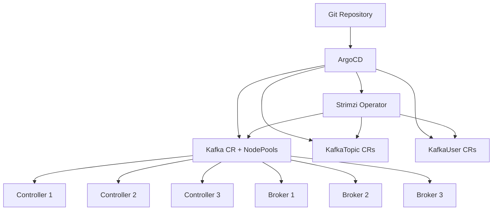

# How to Deploy Strimzi Kafka with ArgoCD

Author: [nawazdhandala](https://github.com/nawazdhandala)

Tags: ArgoCD, GitOps, Kubernetes, Kafka, Strimzi

Description: Learn how to deploy Apache Kafka on Kubernetes using the Strimzi operator and ArgoCD for fully GitOps-managed event streaming infrastructure.

---

Apache Kafka is the backbone of event-driven architectures, and Strimzi is the leading Kubernetes operator for running Kafka clusters. Strimzi handles broker provisioning, ZooKeeper management (or KRaft mode), topic creation, user authentication, and rolling upgrades. When you manage Strimzi through ArgoCD, your entire Kafka infrastructure becomes declarative, version-controlled, and automatically reconciled.

This guide covers deploying Strimzi, provisioning Kafka clusters in KRaft mode, managing topics and users, and handling the operational nuances through ArgoCD.

## Prerequisites

- Kubernetes cluster (1.25+)
- ArgoCD installed and configured
- A Git repository for manifests
- Storage class with SSD-backed volumes

## Step 1: Deploy the Strimzi Operator

Strimzi publishes Helm charts and raw YAML manifests. The Helm approach works well with ArgoCD.

```yaml
# argocd/strimzi-operator.yaml
apiVersion: argoproj.io/v1alpha1
kind: Application
metadata:
  name: strimzi-operator
  namespace: argocd
  finalizers:
    - resources-finalizer.argocd.argoproj.io
spec:
  project: default
  source:
    chart: strimzi-kafka-operator
    repoURL: https://strimzi.io/charts/
    targetRevision: 0.43.0
    helm:
      releaseName: strimzi
      values: |
        # Watch all namespaces
        watchNamespaces: []
        # Operator replicas
        replicas: 2
        # Resource limits
        resources:
          limits:
            memory: 512Mi
            cpu: 500m
          requests:
            memory: 256Mi
            cpu: 200m
        # Feature gates for KRaft
        featureGates: "+UseKRaft"
  destination:
    server: https://kubernetes.default.svc
    namespace: strimzi-system
  syncPolicy:
    automated:
      prune: true
      selfHeal: true
    syncOptions:
      - CreateNamespace=true
      - ServerSideApply=true
```

## Step 2: Provision a Kafka Cluster

With Strimzi installed, define a Kafka cluster in KRaft mode (no ZooKeeper dependency).

```yaml
# streaming/kafka/production-cluster.yaml
apiVersion: kafka.strimzi.io/v1beta2
kind: KafkaNodePool
metadata:
  name: controller
  namespace: streaming
  labels:
    strimzi.io/cluster: production-kafka
spec:
  replicas: 3
  roles:
    - controller
  storage:
    type: persistent-claim
    size: 10Gi
    class: gp3-encrypted
  resources:
    requests:
      cpu: 500m
      memory: 2Gi
    limits:
      cpu: "1"
      memory: 4Gi
---
apiVersion: kafka.strimzi.io/v1beta2
kind: KafkaNodePool
metadata:
  name: broker
  namespace: streaming
  labels:
    strimzi.io/cluster: production-kafka
spec:
  replicas: 3
  roles:
    - broker
  storage:
    type: persistent-claim
    size: 200Gi
    class: gp3-encrypted
  resources:
    requests:
      cpu: "2"
      memory: 8Gi
    limits:
      cpu: "4"
      memory: 16Gi
  template:
    pod:
      affinity:
        podAntiAffinity:
          requiredDuringSchedulingIgnoredDuringExecution:
            - labelSelector:
                matchLabels:
                  strimzi.io/name: production-kafka-broker
              topologyKey: kubernetes.io/hostname
---
apiVersion: kafka.strimzi.io/v1beta2
kind: Kafka
metadata:
  name: production-kafka
  namespace: streaming
  annotations:
    strimzi.io/node-pools: enabled
    strimzi.io/kraft: enabled
spec:
  kafka:
    version: 3.8.0
    metadataVersion: 3.8-IV0
    listeners:
      - name: plain
        port: 9092
        type: internal
        tls: false
      - name: tls
        port: 9093
        type: internal
        tls: true
        authentication:
          type: tls
      - name: external
        port: 9094
        type: loadbalancer
        tls: true
        authentication:
          type: tls
    config:
      # Replication defaults
      default.replication.factor: 3
      min.insync.replicas: 2
      # Log retention
      log.retention.hours: 168
      log.retention.bytes: -1
      # Segment size
      log.segment.bytes: 1073741824
      # Transaction state
      transaction.state.log.replication.factor: 3
      transaction.state.log.min.isr: 2
      # Offset topic
      offsets.topic.replication.factor: 3
    metricsConfig:
      type: jmxPrometheusExporter
      valueFrom:
        configMapKeyRef:
          name: kafka-metrics-config
          key: kafka-metrics-config.yml
  entityOperator:
    topicOperator:
      resources:
        requests:
          cpu: 100m
          memory: 256Mi
        limits:
          cpu: 500m
          memory: 512Mi
    userOperator:
      resources:
        requests:
          cpu: 100m
          memory: 256Mi
        limits:
          cpu: 500m
          memory: 512Mi
```

## Step 3: ArgoCD Application for Kafka Infrastructure

```yaml
# argocd/kafka-clusters.yaml
apiVersion: argoproj.io/v1alpha1
kind: Application
metadata:
  name: kafka-clusters
  namespace: argocd
spec:
  project: default
  source:
    repoURL: https://github.com/your-org/k8s-manifests.git
    targetRevision: main
    path: streaming/kafka
  destination:
    server: https://kubernetes.default.svc
    namespace: streaming
  syncPolicy:
    automated:
      prune: false
      selfHeal: true
    syncOptions:
      - CreateNamespace=true
    retry:
      limit: 5
      backoff:
        duration: 30s
        factor: 2
        maxDuration: 15m
```

## Step 4: Manage Topics Through Git

Strimzi's Entity Operator watches for `KafkaTopic` resources. This means topics become Git-managed resources.

```yaml
# streaming/kafka/topics.yaml
apiVersion: kafka.strimzi.io/v1beta2
kind: KafkaTopic
metadata:
  name: order-events
  namespace: streaming
  labels:
    strimzi.io/cluster: production-kafka
spec:
  partitions: 12
  replicas: 3
  config:
    retention.ms: "604800000"     # 7 days
    cleanup.policy: delete
    min.insync.replicas: "2"
    segment.bytes: "536870912"    # 512MB
---
apiVersion: kafka.strimzi.io/v1beta2
kind: KafkaTopic
metadata:
  name: user-activity
  namespace: streaming
  labels:
    strimzi.io/cluster: production-kafka
spec:
  partitions: 24
  replicas: 3
  config:
    retention.ms: "2592000000"    # 30 days
    cleanup.policy: compact,delete
    min.insync.replicas: "2"
---
apiVersion: kafka.strimzi.io/v1beta2
kind: KafkaTopic
metadata:
  name: audit-log
  namespace: streaming
  labels:
    strimzi.io/cluster: production-kafka
spec:
  partitions: 6
  replicas: 3
  config:
    retention.ms: "-1"            # Infinite retention
    cleanup.policy: delete
    min.insync.replicas: "2"
```

## Step 5: Manage Users and ACLs

```yaml
# streaming/kafka/users.yaml
apiVersion: kafka.strimzi.io/v1beta2
kind: KafkaUser
metadata:
  name: order-service
  namespace: streaming
  labels:
    strimzi.io/cluster: production-kafka
spec:
  authentication:
    type: tls
  authorization:
    type: simple
    acls:
      - resource:
          type: topic
          name: order-events
          patternType: literal
        operations:
          - Write
          - Describe
      - resource:
          type: topic
          name: order-events
          patternType: literal
        operations:
          - Read
          - Describe
        host: "*"
      - resource:
          type: group
          name: order-service-group
          patternType: literal
        operations:
          - Read
```

## Step 6: ArgoCD Health Checks

```yaml
# argocd-cm ConfigMap
data:
  resource.customizations.health.kafka.strimzi.io_Kafka: |
    hs = {}
    if obj.status ~= nil and obj.status.conditions ~= nil then
      for _, condition in ipairs(obj.status.conditions) do
        if condition.type == "Ready" then
          if condition.status == "True" then
            hs.status = "Healthy"
            hs.message = "Kafka cluster is ready"
          else
            hs.status = "Progressing"
            hs.message = condition.message or "Cluster not ready"
          end
          return hs
        end
      end
    end
    hs.status = "Progressing"
    hs.message = "Waiting for cluster readiness"
    return hs
```

## Metrics Configuration

Create the metrics ConfigMap referenced by the Kafka resource:

```yaml
# streaming/kafka/metrics-config.yaml
apiVersion: v1
kind: ConfigMap
metadata:
  name: kafka-metrics-config
  namespace: streaming
data:
  kafka-metrics-config.yml: |
    lowercaseOutputName: true
    rules:
      - pattern: kafka.server<type=(.+), name=(.+), clientId=(.+), topic=(.+), partition=(.+)><>Value
        name: kafka_server_$1_$2
        type: GAUGE
        labels:
          clientId: "$3"
          topic: "$4"
          partition: "$5"
      - pattern: kafka.server<type=(.+), name=(.+)><>Value
        name: kafka_server_$1_$2
        type: GAUGE
```

## Architecture



## Conclusion

Strimzi and ArgoCD together give you a powerful, fully declarative Kafka platform. Topics, users, ACLs, and cluster configuration all live in Git, making your event streaming infrastructure as manageable as application code. KRaft mode simplifies the architecture by removing ZooKeeper, and node pools give you independent scaling of controllers and brokers. Use retry policies generously since Kafka clusters take time to stabilize, and always disable auto-pruning to protect against accidental data loss.
