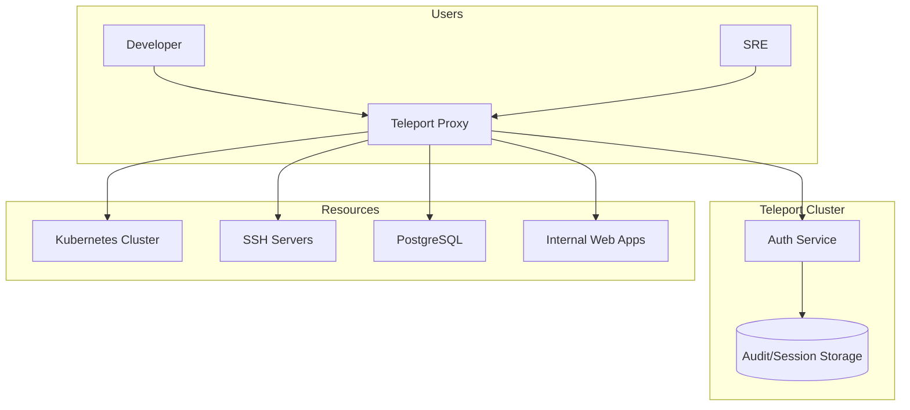

# How to Deploy Teleport with ArgoCD

Author: [nawazdhandala](https://github.com/nawazdhandala)

Tags: ArgoCD, GitOps, Kubernetes, Teleport, Security

Description: Learn how to deploy Teleport for secure infrastructure access using ArgoCD with Kubernetes authentication, session recording, and role-based access control.

---

Teleport is an open-source infrastructure access platform that provides secure, audited access to SSH servers, Kubernetes clusters, databases, and web applications through a single gateway. Deploying Teleport with ArgoCD means your access infrastructure is managed through GitOps - the same workflow you use for your applications and other infrastructure components.

This guide covers deploying the Teleport cluster with ArgoCD, configuring Kubernetes access, and setting up role-based access control for your team.

## What Teleport Provides

Teleport acts as an identity-aware access proxy that:

- **Replaces VPNs** with identity-based access to infrastructure
- **Records sessions** for SSH, Kubernetes, and database access
- **Provides SSO** through OIDC, SAML, and GitHub authentication
- **Enforces RBAC** with fine-grained roles for every resource type
- **Generates audit logs** for every access event

## Teleport Architecture



## Repository Structure

```text
access/
  teleport/
    Chart.yaml
    values.yaml
    values-production.yaml
  teleport-agents/
    kube-agent.yaml
    db-agent.yaml
  teleport-roles/
    developer-role.yaml
    sre-role.yaml
    readonly-role.yaml
```

## Deploying the Teleport Cluster

### Wrapper Chart

```yaml
# access/teleport/Chart.yaml
apiVersion: v2
name: teleport-cluster
description: Wrapper chart for Teleport
type: application
version: 1.0.0
dependencies:
  - name: teleport-cluster
    version: "16.4.6"
    repository: "https://charts.releases.teleport.dev"
```

### Teleport Values

```yaml
# access/teleport/values.yaml
teleport-cluster:
  # Cluster name must be a valid DNS name
  clusterName: teleport.example.com

  # Authentication configuration
  authentication:
    type: github
    connectorName: github
    localAuth: true

  # Proxy service configuration
  proxyListenerMode: multiplex

  # High availability
  highAvailability:
    replicaCount: 2
    certManager:
      enabled: true
      issuerName: letsencrypt-prod
      issuerKind: ClusterIssuer

  # Persistence
  persistence:
    enabled: true
    storageClassName: gp3
    volumeSize: 50Gi

  # Ingress
  ingress:
    enabled: true
    spec:
      ingressClassName: nginx
      annotations:
        nginx.ingress.kubernetes.io/backend-protocol: HTTPS
        nginx.ingress.kubernetes.io/ssl-passthrough: "true"

  # Resources
  resources:
    requests:
      cpu: 500m
      memory: 512Mi
    limits:
      memory: 1Gi

  # Session recording to S3
  sessionRecording: node-sync
  chartMode: standalone

  # Teleport configuration
  teleportConfig:
    teleport:
      log:
        severity: INFO
        format:
          output: json
    auth_service:
      enabled: true
      listen_addr: 0.0.0.0:3025
      cluster_name: teleport.example.com
      session_recording: node-sync
      authentication:
        type: github
        second_factor: "on"
        webauthn:
          rp_id: teleport.example.com
    proxy_service:
      enabled: true
      listen_addr: 0.0.0.0:3023
      web_listen_addr: 0.0.0.0:3080
      tunnel_listen_addr: 0.0.0.0:3024
      public_addr: teleport.example.com:443
      https_keypairs: []
      kube_listen_addr: 0.0.0.0:3026
    kubernetes_service:
      enabled: true
      listen_addr: 0.0.0.0:3027
```

### ArgoCD Application

```yaml
apiVersion: argoproj.io/v1alpha1
kind: Application
metadata:
  name: teleport
  namespace: argocd
  finalizers:
    - resources-finalizer.argocd.argoproj.io
spec:
  project: access
  source:
    repoURL: https://github.com/your-org/gitops-repo.git
    targetRevision: main
    path: access/teleport
    helm:
      valueFiles:
        - values.yaml
        - values-production.yaml
  destination:
    server: https://kubernetes.default.svc
    namespace: teleport
  syncPolicy:
    automated:
      prune: true
      selfHeal: true
    syncOptions:
      - CreateNamespace=true
      - ServerSideApply=true
    retry:
      limit: 5
      backoff:
        duration: 10s
        factor: 2
        maxDuration: 5m
  ignoreDifferences:
    - group: ""
      kind: Secret
      jsonPointers:
        - /data
```

## Configuring GitHub SSO

Create a GitHub OAuth application and configure the connector.

```yaml
# access/teleport-agents/github-connector.yaml
kind: github
version: v3
metadata:
  name: github
spec:
  client_id: your-github-client-id
  client_secret: your-github-client-secret  # Use a Secret reference
  display: GitHub
  redirect_url: https://teleport.example.com/v1/webapi/github/callback
  teams_to_roles:
    - organization: your-org
      team: sre-team
      roles:
        - sre
        - access
    - organization: your-org
      team: developers
      roles:
        - developer
        - access
```

## Defining Access Roles

Manage Teleport roles as Kubernetes custom resources through ArgoCD.

```yaml
# access/teleport-roles/developer-role.yaml
kind: role
version: v7
metadata:
  name: developer
spec:
  allow:
    # Kubernetes access
    kubernetes_groups: ["developers"]
    kubernetes_labels:
      environment: ["staging", "development"]
    kubernetes_resources:
      - kind: pod
        verbs: ["get", "list", "watch"]
      - kind: pod
        name: "*"
        namespace: "*"
        verbs: ["get", "list"]

    # SSH access
    node_labels:
      environment: ["staging", "development"]
    logins: ["ubuntu", "ec2-user"]

    # Database access
    db_labels:
      environment: ["staging", "development"]
    db_names: ["myapp_staging"]
    db_users: ["readonly"]

    # Session settings
    max_session_ttl: 8h

  deny:
    # Never allow access to production nodes via developer role
    node_labels:
      environment: ["production"]

  options:
    # Force MFA for sensitive actions
    require_session_mfa: true
    # Session recording
    enhanced_recording:
      - command
      - network
```

```yaml
# access/teleport-roles/sre-role.yaml
kind: role
version: v7
metadata:
  name: sre
spec:
  allow:
    kubernetes_groups: ["system:masters"]
    kubernetes_labels:
      "*": "*"
    node_labels:
      "*": "*"
    logins: ["root", "ubuntu", "ec2-user"]
    db_labels:
      "*": "*"
    db_names: ["*"]
    db_users: ["admin", "readonly"]
    max_session_ttl: 4h

  options:
    require_session_mfa: true
    enhanced_recording:
      - command
      - network
      - disk
    max_connections: 5
```

## Deploying Teleport Agents for Remote Clusters

To provide access to Kubernetes clusters that are separate from where Teleport runs, deploy agents.

```yaml
# access/teleport-agents/kube-agent.yaml
apiVersion: argoproj.io/v1alpha1
kind: Application
metadata:
  name: teleport-kube-agent
  namespace: argocd
spec:
  project: access
  source:
    repoURL: https://charts.releases.teleport.dev
    chart: teleport-kube-agent
    targetRevision: "16.4.6"
    helm:
      values: |
        proxyAddr: teleport.example.com:443
        roles: kube,app,discovery
        joinParams:
          method: kubernetes
          tokenName: kube-agent-token
        kubeClusterName: production-cluster
        labels:
          environment: production
          region: us-east-1
        resources:
          requests:
            cpu: 100m
            memory: 128Mi
          limits:
            memory: 256Mi
  destination:
    server: https://kubernetes.default.svc
    namespace: teleport
  syncPolicy:
    automated:
      selfHeal: true
```

## Using Teleport with kubectl

Once Teleport is deployed, users authenticate through the web UI or CLI, then access Kubernetes clusters transparently.

```bash
# Login to Teleport
tsh login --proxy=teleport.example.com

# List available Kubernetes clusters
tsh kube ls

# Connect to a cluster
tsh kube login production-cluster

# Now kubectl works through Teleport
kubectl get pods -n default

# All commands are recorded and auditable
```

## Verifying the Deployment

```bash
# Check Teleport pods
kubectl get pods -n teleport

# Check Teleport status
kubectl exec -n teleport deploy/teleport -- tctl status

# List configured roles
kubectl exec -n teleport deploy/teleport -- tctl get roles

# List registered nodes and clusters
kubectl exec -n teleport deploy/teleport -- tctl get nodes
kubectl exec -n teleport deploy/teleport -- tctl get kube_clusters

# Check ArgoCD sync status
argocd app get teleport
```

## Summary

Deploying Teleport with ArgoCD provides GitOps-managed secure access to your infrastructure. Access roles, SSO configuration, and agent deployments are all version-controlled in Git and automatically synced by ArgoCD. This approach eliminates the need for VPNs, provides complete audit trails for all access events, and enforces consistent access policies across all your infrastructure. The key is properly configuring authentication (GitHub SSO, OIDC), defining granular roles, and deploying agents to every cluster and resource that needs secure access.
