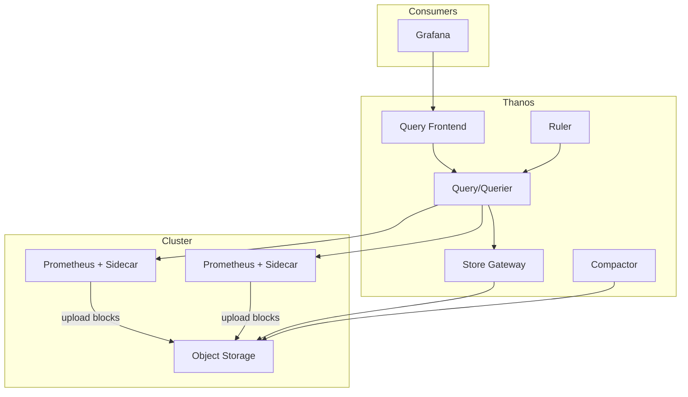

# How to Deploy Thanos with ArgoCD

Author: [nawazdhandala](https://github.com/nawazdhandala)

Tags: ArgoCD, GitOps, Kubernetes, Thanos, Prometheus

Description: Learn how to deploy Thanos for highly available, long-term Prometheus metrics storage using ArgoCD with sidecar mode, object storage, and global query views.

---

Thanos extends Prometheus with long-term storage, high availability, and a global query view across multiple Prometheus instances. It is an excellent choice when you need to retain metrics beyond what local Prometheus storage can handle, or when you have multiple clusters that need a unified metrics view. Deploying Thanos with ArgoCD ensures your entire metrics infrastructure is managed through GitOps.

This guide covers deploying Thanos in sidecar mode alongside Prometheus, setting up the complete Thanos component stack, and managing everything through ArgoCD.

## Thanos Architecture

Thanos has several components that work together:

- **Sidecar**: Runs alongside Prometheus, uploads TSDB blocks to object storage, and serves real-time data to the Query component
- **Store Gateway**: Serves historical data from object storage
- **Query (Querier)**: Provides a global query view across all stores, deduplicating results
- **Query Frontend**: Adds caching and query splitting in front of Query
- **Compactor**: Downsamples and compacts historical data in object storage
- **Ruler**: Evaluates recording and alerting rules against the global view



## Repository Structure

```
metrics/
  thanos/
    Chart.yaml
    values.yaml
    values-production.yaml
    objstore-secret.yaml
```

## Creating the Wrapper Chart

```yaml
# metrics/thanos/Chart.yaml
apiVersion: v2
name: thanos
description: Wrapper chart for Thanos
type: application
version: 1.0.0
dependencies:
  - name: thanos
    version: "15.7.25"
    repository: "https://charts.bitnami.com/bitnami"
```

## Configuring the Object Store Secret

Thanos needs access to an object store. Create a secret with the configuration.

```yaml
# metrics/thanos/objstore-secret.yaml
apiVersion: v1
kind: Secret
metadata:
  name: thanos-objstore-config
  namespace: thanos
type: Opaque
stringData:
  objstore.yml: |
    type: S3
    config:
      bucket: thanos-metrics
      endpoint: s3.us-east-1.amazonaws.com
      region: us-east-1
      # When using IRSA, leave access_key and secret_key empty
      access_key: ""
      secret_key: ""
```

For production, use Sealed Secrets or an external secrets operator instead of plain Secrets.

## Configuring Thanos

```yaml
# metrics/thanos/values.yaml
thanos:
  # Object store configuration
  existingObjstoreSecret: thanos-objstore-config

  # Query component - the entry point for PromQL queries
  query:
    enabled: true
    replicaCount: 2
    replicaLabel:
      - replica
      - prometheus_replica
    resources:
      requests:
        cpu: 250m
        memory: 512Mi
      limits:
        memory: 1Gi
    # Discover stores via DNS
    stores:
      - "dnssrv+_grpc._tcp.thanos-storegateway.thanos.svc.cluster.local"
      - "dnssrv+_grpc._tcp.kube-prometheus-stack-thanos-discovery.monitoring.svc.cluster.local"
    dnsDiscovery:
      enabled: true
      sidecarsService: kube-prometheus-stack-thanos-discovery
      sidecarsNamespace: monitoring

  # Query Frontend - adds caching and splitting
  queryFrontend:
    enabled: true
    replicaCount: 2
    resources:
      requests:
        cpu: 250m
        memory: 256Mi
      limits:
        memory: 512Mi
    config: |
      type: IN-MEMORY
      config:
        max_size: 512MB
        max_size_items: 1000
        validity: 10m

  # Store Gateway - serves historical data from object storage
  storegateway:
    enabled: true
    replicaCount: 2
    persistence:
      enabled: true
      size: 20Gi
      storageClass: gp3
    resources:
      requests:
        cpu: 250m
        memory: 1Gi
      limits:
        memory: 2Gi
    config: |
      type: IN-MEMORY
      config:
        max_size: 256MB

  # Compactor - deduplicates and downsamples
  compactor:
    enabled: true
    persistence:
      enabled: true
      size: 50Gi
      storageClass: gp3
    resources:
      requests:
        cpu: 500m
        memory: 1Gi
      limits:
        memory: 2Gi
    retentionResolutionRaw: 30d
    retentionResolution5m: 180d
    retentionResolution1h: 365d
    consistencyDelay: 30m

  # Ruler - for recording rules and alerts
  ruler:
    enabled: true
    replicaCount: 1
    alertmanagers:
      - http://kube-prometheus-stack-alertmanager.monitoring.svc.cluster.local:9093
    config: |
      groups: []
    persistence:
      enabled: true
      size: 10Gi
      storageClass: gp3
    resources:
      requests:
        cpu: 100m
        memory: 256Mi
      limits:
        memory: 512Mi

  # Metrics
  metrics:
    enabled: true
    serviceMonitor:
      enabled: true
      labels:
        release: kube-prometheus-stack
```

## Configuring Prometheus Sidecar

The Thanos sidecar needs to be added to your Prometheus instances. If you are using kube-prometheus-stack, configure it in those values.

```yaml
# In kube-prometheus-stack values
kube-prometheus-stack:
  prometheus:
    prometheusSpec:
      # Enable Thanos sidecar
      thanos:
        image: quay.io/thanos/thanos:v0.36.1
        objectStorageConfig:
          existingSecret:
            name: thanos-objstore-config
            key: objstore.yml
        resources:
          requests:
            cpu: 100m
            memory: 256Mi
          limits:
            memory: 512Mi

      # Required for Thanos to work properly
      replicaExternalLabelName: "replica"
      prometheusExternalLabelName: "cluster"
      externalLabels:
        cluster: production

      # Disable compaction - Thanos Compactor handles this
      disableCompaction: true

      # Keep retention shorter since Thanos handles long-term
      retention: 2d
      retentionSize: "10GB"

    # Expose Thanos sidecar for discovery
    thanosService:
      enabled: true
    thanosServiceMonitor:
      enabled: true
```

## Creating the ArgoCD Application

```yaml
apiVersion: argoproj.io/v1alpha1
kind: Application
metadata:
  name: thanos
  namespace: argocd
  finalizers:
    - resources-finalizer.argocd.argoproj.io
spec:
  project: metrics
  source:
    repoURL: https://github.com/your-org/gitops-repo.git
    targetRevision: main
    path: metrics/thanos
    helm:
      valueFiles:
        - values.yaml
        - values-production.yaml
  destination:
    server: https://kubernetes.default.svc
    namespace: thanos
  syncPolicy:
    automated:
      prune: true
      selfHeal: true
    syncOptions:
      - CreateNamespace=true
      - ServerSideApply=true
    retry:
      limit: 5
      backoff:
        duration: 10s
        factor: 2
        maxDuration: 5m
  ignoreDifferences:
    - group: apps
      kind: StatefulSet
      jqPathExpressions:
        - '.spec.volumeClaimTemplates[]?.spec.resources'
```

## Adding Thanos as a Grafana Datasource

Point Grafana at the Thanos Query Frontend instead of directly at Prometheus.

```yaml
kube-prometheus-stack:
  grafana:
    additionalDataSources:
      - name: Thanos
        type: prometheus
        url: http://thanos-query-frontend.thanos.svc.cluster.local:9090
        access: proxy
        isDefault: true
        jsonData:
          timeInterval: 15s
          httpMethod: POST
```

## Multi-Cluster Setup

For querying across multiple clusters, each cluster runs its own Prometheus with a Thanos sidecar that uploads to the same object storage bucket. The central Thanos Query component discovers all sidecars and store gateways to provide a unified view.

```yaml
# Prometheus in cluster-a
externalLabels:
  cluster: cluster-a

# Prometheus in cluster-b
externalLabels:
  cluster: cluster-b
```

The Query component deduplicates metrics based on the `replica` label, giving you a single view across clusters.

## Verifying the Deployment

```bash
# Check all Thanos components
kubectl get pods -n thanos

# Verify store gateway is connected to object storage
kubectl logs -n thanos -l app.kubernetes.io/component=storegateway --tail=20

# Verify query has discovered all stores
kubectl port-forward -n thanos svc/thanos-query-frontend 9090:9090
# Visit http://localhost:9090 and check the Stores page

# Verify compactor is running
kubectl logs -n thanos -l app.kubernetes.io/component=compactor --tail=20

# Check ArgoCD sync status
argocd app get thanos
```

## Summary

Deploying Thanos with ArgoCD provides a GitOps-managed solution for long-term Prometheus metrics storage, high availability, and multi-cluster querying. The key components are the sidecar on Prometheus for data upload, the store gateway for serving historical data, the compactor for data lifecycle management, and the query frontend for efficient querying. With ArgoCD managing the full stack, you get a reproducible and auditable metrics infrastructure that scales across clusters.
