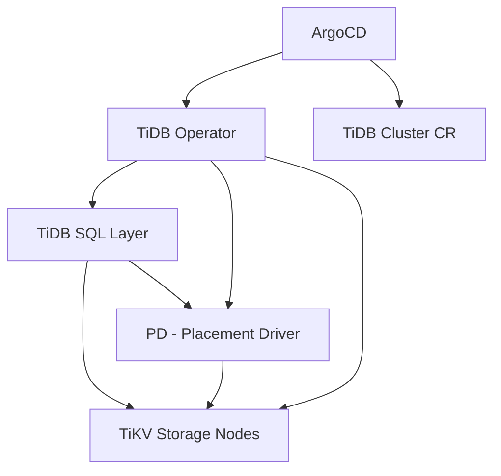

# How to Deploy TiDB with ArgoCD

Author: [nawazdhandala](https://github.com/nawazdhandala)

Tags: ArgoCD, GitOps, Kubernetes, TiDB, Database

Description: Learn how to deploy TiDB distributed SQL database on Kubernetes using ArgoCD and the TiDB Operator for GitOps-managed horizontal scaling and high availability.

---

TiDB is a MySQL-compatible distributed SQL database that provides horizontal scalability, strong consistency, and high availability. The TiDB Operator for Kubernetes manages the complex lifecycle of TiDB clusters including PD (Placement Driver), TiKV (storage), and TiDB (SQL layer) components. When you manage this through ArgoCD, every aspect of your TiDB deployment lives in Git, from cluster topology to configuration changes.

This guide covers deploying the TiDB Operator, provisioning TiDB clusters, handling storage, and managing the multi-component architecture through ArgoCD.

## Prerequisites

- Kubernetes cluster (1.24+) with at least 3 nodes
- ArgoCD installed and running
- A Git repository for manifests
- Fast storage class (SSD-backed recommended)

## Understanding TiDB Architecture

Before diving into deployment, it helps to understand TiDB's components:



- **PD** manages metadata and scheduling
- **TiKV** stores the actual data in a distributed key-value format
- **TiDB** provides the MySQL-compatible SQL interface
- **TiDB Operator** orchestrates all components on Kubernetes

## Step 1: Deploy TiDB Operator CRDs

TiDB Operator CRDs are large and should be deployed separately with server-side apply.

```yaml
# argocd/tidb-crds.yaml
apiVersion: argoproj.io/v1alpha1
kind: Application
metadata:
  name: tidb-operator-crds
  namespace: argocd
  annotations:
    argocd.argoproj.io/sync-wave: "-2"
spec:
  project: default
  source:
    chart: tidb-operator
    repoURL: https://charts.pingcap.org
    targetRevision: v1.6.0
    helm:
      releaseName: tidb-operator-crds
      values: |
        # Only install CRDs
        operatorMode: "crd-only"
  destination:
    server: https://kubernetes.default.svc
    namespace: tidb-admin
  syncPolicy:
    automated:
      prune: false
      selfHeal: true
    syncOptions:
      - CreateNamespace=true
      - ServerSideApply=true
      - Replace=true
```

## Step 2: Deploy TiDB Operator

```yaml
# argocd/tidb-operator.yaml
apiVersion: argoproj.io/v1alpha1
kind: Application
metadata:
  name: tidb-operator
  namespace: argocd
  annotations:
    argocd.argoproj.io/sync-wave: "-1"
spec:
  project: default
  source:
    chart: tidb-operator
    repoURL: https://charts.pingcap.org
    targetRevision: v1.6.0
    helm:
      releaseName: tidb-operator
      values: |
        operatorImage: pingcap/tidb-operator:v1.6.0
        controllerManager:
          replicas: 2
          resources:
            requests:
              cpu: 100m
              memory: 256Mi
            limits:
              cpu: 250m
              memory: 512Mi
        scheduler:
          replicas: 2
          resources:
            requests:
              cpu: 100m
              memory: 128Mi
            limits:
              cpu: 250m
              memory: 256Mi
  destination:
    server: https://kubernetes.default.svc
    namespace: tidb-admin
  syncPolicy:
    automated:
      prune: true
      selfHeal: true
    syncOptions:
      - CreateNamespace=true
```

## Step 3: Define a TiDB Cluster

The TiDB Operator uses the `TidbCluster` custom resource. This is where you define the topology of PD, TiKV, and TiDB components.

```yaml
# databases/tidb/production-cluster.yaml
apiVersion: pingcap.com/v1alpha1
kind: TidbCluster
metadata:
  name: production-tidb
  namespace: tidb-production
spec:
  version: v8.1.0
  timezone: UTC

  # PD Configuration - metadata and scheduling
  pd:
    replicas: 3
    requests:
      cpu: "1"
      memory: 2Gi
      storage: 10Gi
    limits:
      cpu: "2"
      memory: 4Gi
    storageClassName: gp3-encrypted
    config:
      replication:
        max-replicas: 3
        location-labels:
          - zone
      schedule:
        leader-schedule-limit: 4
        region-schedule-limit: 2048
    affinity:
      podAntiAffinity:
        requiredDuringSchedulingIgnoredDuringExecution:
          - labelSelector:
              matchLabels:
                app.kubernetes.io/component: pd
                app.kubernetes.io/instance: production-tidb
            topologyKey: kubernetes.io/hostname

  # TiKV Configuration - storage layer
  tikv:
    replicas: 3
    requests:
      cpu: "2"
      memory: 8Gi
      storage: 200Gi
    limits:
      cpu: "4"
      memory: 16Gi
    storageClassName: gp3-encrypted
    config:
      storage:
        block-cache:
          capacity: 6GB
      raftstore:
        sync-log: true
    affinity:
      podAntiAffinity:
        requiredDuringSchedulingIgnoredDuringExecution:
          - labelSelector:
              matchLabels:
                app.kubernetes.io/component: tikv
                app.kubernetes.io/instance: production-tidb
            topologyKey: kubernetes.io/hostname

  # TiDB Configuration - SQL layer
  tidb:
    replicas: 2
    requests:
      cpu: "2"
      memory: 4Gi
    limits:
      cpu: "4"
      memory: 8Gi
    config:
      performance:
        max-procs: 0
        tcp-keep-alive: true
      log:
        slow-threshold: 300
    service:
      type: ClusterIP
    affinity:
      podAntiAffinity:
        preferredDuringSchedulingIgnoredDuringExecution:
          - weight: 100
            podAffinityTerm:
              labelSelector:
                matchLabels:
                  app.kubernetes.io/component: tidb
                  app.kubernetes.io/instance: production-tidb
              topologyKey: kubernetes.io/hostname
```

## Step 4: ArgoCD Application for TiDB Clusters

```yaml
# argocd/tidb-clusters.yaml
apiVersion: argoproj.io/v1alpha1
kind: Application
metadata:
  name: tidb-clusters
  namespace: argocd
spec:
  project: default
  source:
    repoURL: https://github.com/your-org/k8s-manifests.git
    targetRevision: main
    path: databases/tidb
  destination:
    server: https://kubernetes.default.svc
    namespace: tidb-production
  syncPolicy:
    automated:
      prune: false
      selfHeal: true
    syncOptions:
      - CreateNamespace=true
    retry:
      limit: 5
      backoff:
        duration: 30s
        factor: 2
        maxDuration: 10m
```

The retry configuration is important because TiDB clusters take time to provision. PD must be healthy before TiKV starts, and TiKV must be healthy before TiDB starts.

## Step 5: Configure TiDB Dashboard and Monitoring

TiDB includes a built-in dashboard and Prometheus-compatible metrics. Add a TidbMonitor resource.

```yaml
# databases/tidb/monitoring.yaml
apiVersion: pingcap.com/v1alpha1
kind: TidbMonitor
metadata:
  name: production-tidb-monitor
  namespace: tidb-production
spec:
  clusters:
    - name: production-tidb
  prometheus:
    baseImage: prom/prometheus
    version: v2.53.0
    service:
      type: ClusterIP
    resources:
      requests:
        cpu: 100m
        memory: 512Mi
      limits:
        cpu: "1"
        memory: 2Gi
    storage: 50Gi
    storageClassName: gp3
  grafana:
    baseImage: grafana/grafana
    version: "10.4.0"
    service:
      type: ClusterIP
    resources:
      requests:
        cpu: 100m
        memory: 128Mi
      limits:
        cpu: 500m
        memory: 512Mi
```

## Step 6: Custom Health Check for ArgoCD

```yaml
# argocd-cm ConfigMap
data:
  resource.customizations.health.pingcap.com_TidbCluster: |
    hs = {}
    if obj.status ~= nil then
      local pdReady = obj.status.pd and obj.status.pd.phase == "Normal"
      local tikvReady = obj.status.tikv and obj.status.tikv.phase == "Normal"
      local tidbReady = obj.status.tidb and obj.status.tidb.phase == "Normal"
      if pdReady and tikvReady and tidbReady then
        hs.status = "Healthy"
        hs.message = "All TiDB components are running normally"
      elseif obj.status.pd and obj.status.pd.phase == "Upgrade" or
             obj.status.tikv and obj.status.tikv.phase == "Upgrade" or
             obj.status.tidb and obj.status.tidb.phase == "Upgrade" then
        hs.status = "Progressing"
        hs.message = "TiDB cluster is upgrading"
      else
        hs.status = "Progressing"
        hs.message = "TiDB cluster is being provisioned"
      end
    else
      hs.status = "Progressing"
      hs.message = "Waiting for cluster status"
    end
    return hs
```

## Scaling Components Independently

One of TiDB's strengths is independent scaling of compute and storage. To handle more SQL queries, scale TiDB. To store more data, scale TiKV.

```yaml
# Scale SQL layer for more query throughput
tidb:
  replicas: 4  # was 2

# Scale storage for more capacity
tikv:
  replicas: 5  # was 3
```

Commit and push. ArgoCD syncs the change, and the operator scales each component independently while maintaining data consistency.

## Backup Configuration

Add a TiDB backup schedule using the TiDB Operator's backup CRDs.

```yaml
# databases/tidb/backup-schedule.yaml
apiVersion: pingcap.com/v1alpha1
kind: BackupSchedule
metadata:
  name: production-tidb-backup
  namespace: tidb-production
spec:
  schedule: "0 2 * * *"
  maxBackups: 7
  backupTemplate:
    from:
      host: production-tidb-tidb.tidb-production.svc
      port: 4000
    br:
      cluster: production-tidb
      clusterNamespace: tidb-production
    s3:
      provider: aws
      region: us-east-1
      bucket: tidb-backups
      prefix: production
    storageClassName: gp3
    storageSize: 200Gi
```

## Conclusion

TiDB's multi-component architecture makes it an ideal candidate for GitOps management through ArgoCD. By declaring PD, TiKV, and TiDB configurations in Git, you get version-controlled database infrastructure that scales independently per component. The TiDB Operator handles the complex orchestration of component dependencies, while ArgoCD ensures your desired state is continuously reconciled. Key practices include using sync waves for CRD and operator ordering, disabling pruning for database resources, and configuring custom health checks that understand TiDB's multi-component health model.
