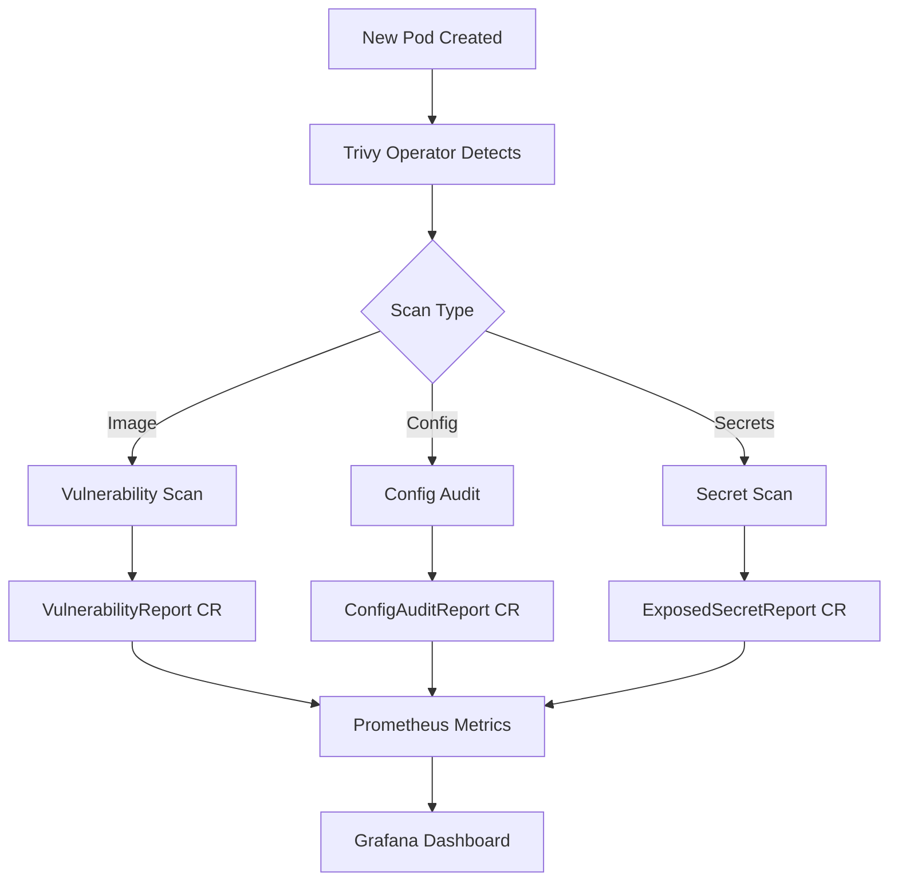

# How to Deploy Trivy Operator with ArgoCD

Author: [nawazdhandala](https://github.com/nawazdhandala)

Tags: ArgoCD, GitOps, Kubernetes, Trivy, Security

Description: Learn how to deploy the Trivy Operator for automated vulnerability scanning using ArgoCD with GitOps-managed security policies and compliance reporting.

---

The Trivy Operator is a Kubernetes operator that continuously scans your cluster for security issues. It leverages Trivy, Aqua Security's open-source vulnerability scanner, to automatically scan container images, Kubernetes resources, and infrastructure configurations. Deploying it with ArgoCD means your vulnerability scanning infrastructure is managed as code, with configuration changes tracked in Git.

This guide covers deploying the Trivy Operator through ArgoCD, configuring scan policies, and integrating results with your monitoring stack.

## What the Trivy Operator Scans

The operator automatically generates security reports for:

- **VulnerabilityReports**: CVEs in container images
- **ConfigAuditReports**: Kubernetes resource misconfigurations
- **ExposedSecretReports**: Secrets accidentally embedded in container images
- **RbacAssessmentReports**: RBAC configuration issues
- **InfraAssessmentReports**: Kubernetes infrastructure security
- **ClusterComplianceReports**: Compliance against standards like NSA, CIS

These reports are stored as Kubernetes custom resources, making them queryable with kubectl and visible in tools that read CRDs.

## Repository Structure

```
security/
  trivy-operator/
    Chart.yaml
    values.yaml
    values-production.yaml
```

## Creating the Wrapper Chart

```yaml
# security/trivy-operator/Chart.yaml
apiVersion: v2
name: trivy-operator
description: Wrapper chart for Trivy Operator
type: application
version: 1.0.0
dependencies:
  - name: trivy-operator
    version: "0.24.1"
    repository: "https://aquasecurity.github.io/helm-charts"
```

## Configuring the Trivy Operator

```yaml
# security/trivy-operator/values.yaml
trivy-operator:
  # Operator settings
  operator:
    # Scan all namespaces
    scanJobsConcurrentLimit: 10
    # Rescan interval
    vulnerabilityScannerScanOnlyCurrentRevisions: true
    configAuditScannerScanOnlyCurrentRevisions: true
    # Batch delete limit for cleanup
    batchDeleteLimit: 10
    batchDeleteDelay: 10s

  # Trivy scanner configuration
  trivy:
    # Use standalone mode (no server required)
    mode: Standalone

    # Image vulnerability scanning
    severity: "UNKNOWN,LOW,MEDIUM,HIGH,CRITICAL"
    ignoreUnfixed: false

    # Resource limits for scan jobs
    resources:
      requests:
        cpu: 100m
        memory: 100Mi
      limits:
        cpu: 500m
        memory: 500Mi

    # Use compressed DB to save bandwidth
    dbRepository: ghcr.io/aquasecurity/trivy-db
    javaDbRepository: ghcr.io/aquasecurity/trivy-java-db

    # Timeout for individual scans
    timeout: 10m0s

    # Skip directories in image scanning
    skipDirs: "/proc,/sys,/dev"

    # Offline mode if cluster has no internet
    offlineScan: false

  # Scanner reports to generate
  scanners:
    vulnerability:
      enabled: true
    configAudit:
      enabled: true
    exposedSecrets:
      enabled: true
    rbacAssessment:
      enabled: true
    infraAssessment:
      enabled: true
    clusterComplianceReport:
      enabled: true

  # Compliance standards to check
  compliance:
    specs:
      - nsa
      - cis

  # Exclude namespaces from scanning
  excludeNamespaces: ""
  targetNamespaces: ""

  # Node collector for infra assessment
  nodeCollector:
    tolerations:
      - effect: NoSchedule
        operator: Exists

  # Operator resources
  resources:
    requests:
      cpu: 200m
      memory: 256Mi
    limits:
      memory: 512Mi

  # Service account
  serviceAccount:
    create: true
    name: trivy-operator

  # ServiceMonitor for Prometheus metrics
  serviceMonitor:
    enabled: true
    labels:
      release: kube-prometheus-stack

  # Metrics
  trivyOperator:
    metricsVulnerabilityId:
      enabled: true
    metricsFindingsEnabled: true
    metricsExposedSecretInfo: true
```

## Creating the ArgoCD Application

```yaml
apiVersion: argoproj.io/v1alpha1
kind: Application
metadata:
  name: trivy-operator
  namespace: argocd
  finalizers:
    - resources-finalizer.argocd.argoproj.io
spec:
  project: security
  source:
    repoURL: https://github.com/your-org/gitops-repo.git
    targetRevision: main
    path: security/trivy-operator
    helm:
      valueFiles:
        - values.yaml
        - values-production.yaml
  destination:
    server: https://kubernetes.default.svc
    namespace: trivy-system
  syncPolicy:
    automated:
      prune: true
      selfHeal: true
    syncOptions:
      - CreateNamespace=true
      - ServerSideApply=true
    retry:
      limit: 3
      backoff:
        duration: 5s
        factor: 2
        maxDuration: 3m
```

## Using Server Mode for Large Clusters

For clusters with many workloads, running Trivy in Standalone mode means each scan job downloads the vulnerability database. This is wasteful. Instead, deploy a Trivy server that caches the database.

```yaml
# Add to values.yaml
trivy-operator:
  trivy:
    mode: ClientServer
    serverURL: http://trivy-server.trivy-system.svc.cluster.local:4954
```

Deploy the Trivy server as a separate ArgoCD Application.

```yaml
# security/trivy-server/values.yaml
apiVersion: apps/v1
kind: Deployment
metadata:
  name: trivy-server
  namespace: trivy-system
spec:
  replicas: 1
  selector:
    matchLabels:
      app: trivy-server
  template:
    metadata:
      labels:
        app: trivy-server
    spec:
      containers:
        - name: trivy
          image: ghcr.io/aquasecurity/trivy:0.57.0
          args:
            - server
            - --listen
            - "0.0.0.0:4954"
            - --cache-dir
            - /home/scanner/.cache/trivy
          ports:
            - containerPort: 4954
              name: trivy-http
          resources:
            requests:
              cpu: 200m
              memory: 512Mi
            limits:
              memory: 1Gi
          volumeMounts:
            - name: cache
              mountPath: /home/scanner/.cache
      volumes:
        - name: cache
          persistentVolumeClaim:
            claimName: trivy-server-cache
---
apiVersion: v1
kind: Service
metadata:
  name: trivy-server
  namespace: trivy-system
spec:
  selector:
    app: trivy-server
  ports:
    - port: 4954
      targetPort: 4954
      name: trivy-http
---
apiVersion: v1
kind: PersistentVolumeClaim
metadata:
  name: trivy-server-cache
  namespace: trivy-system
spec:
  accessModes:
    - ReadWriteOnce
  storageClassName: gp3
  resources:
    requests:
      storage: 10Gi
```

## Viewing Scan Results

Query vulnerability reports using kubectl.

```bash
# List all vulnerability reports
kubectl get vulnerabilityreports -A

# Get details for a specific workload
kubectl get vulnerabilityreports -n default -l trivy-operator.resource.name=my-deployment -o json | \
  jq '.items[].report.vulnerabilities[] | select(.severity == "CRITICAL")'

# View config audit results
kubectl get configauditreports -A

# View RBAC assessment
kubectl get rbacassessmentreports -A

# View cluster compliance
kubectl get clustercompliancereports
```

## Creating Grafana Dashboards for Trivy Metrics

The Trivy Operator exposes Prometheus metrics that you can visualize in Grafana. Deploy a dashboard ConfigMap.

```yaml
apiVersion: v1
kind: ConfigMap
metadata:
  name: grafana-dashboard-trivy
  namespace: monitoring
  labels:
    grafana_dashboard: "1"
  annotations:
    grafana_folder: "Security"
data:
  trivy-overview.json: |
    {
      "title": "Trivy Security Overview",
      "uid": "trivy-security",
      "panels": [
        {
          "title": "Critical Vulnerabilities by Namespace",
          "type": "bargauge",
          "targets": [
            {
              "expr": "sum by (namespace) (trivy_image_vulnerabilities{severity=\"Critical\"})",
              "legendFormat": "{{ namespace }}"
            }
          ]
        },
        {
          "title": "Vulnerability Trend",
          "type": "timeseries",
          "targets": [
            {
              "expr": "sum by (severity) (trivy_image_vulnerabilities)",
              "legendFormat": "{{ severity }}"
            }
          ]
        }
      ]
    }
```

## Scan Flow



## Verifying the Deployment

```bash
# Check operator pod
kubectl get pods -n trivy-system

# Verify CRDs are installed
kubectl get crd | grep aquasecurity

# Check scan jobs
kubectl get jobs -n trivy-system --sort-by=.metadata.creationTimestamp

# Verify reports are being generated
kubectl get vulnerabilityreports -A --no-headers | wc -l

# Check ArgoCD sync status
argocd app get trivy-operator
```

## Summary

Deploying the Trivy Operator with ArgoCD provides continuous, automated security scanning that is managed as code. The operator handles the lifecycle of scans, reports are stored as Kubernetes resources for easy querying, and Prometheus metrics enable dashboarding and alerting. By managing the Trivy Operator configuration through ArgoCD, you ensure that scanning policies are reviewed, versioned, and consistently applied across all clusters.
