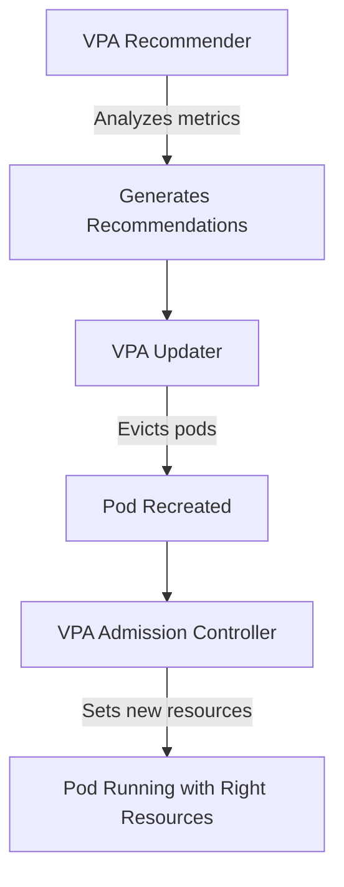

# How to Deploy VPA Configuration with ArgoCD

Author: [nawazdhandala](https://github.com/nawazdhandala)

Tags: ArgoCD, GitOps, Kubernetes, VPA, Resource Management

Description: Learn how to deploy Vertical Pod Autoscaler configurations with ArgoCD to automatically right-size container resource requests and limits.

---

The Vertical Pod Autoscaler (VPA) adjusts container CPU and memory requests based on actual usage. Unlike HPA which scales the number of pods, VPA scales the size of individual pods. This is especially useful for workloads where adding more replicas does not help - think single-threaded batch jobs or databases. Deploying VPA with ArgoCD has its own set of challenges because VPA modifies pod specs that ArgoCD tracks.

## How VPA Works

VPA has three components:

- **Recommender** - Analyzes current and past resource usage to generate recommendations
- **Updater** - Evicts pods that need resizing so they are recreated with new resources
- **Admission Controller** - Modifies pod resource requests when pods are created



## Installing VPA Components

First, deploy the VPA components. This should be a separate ArgoCD Application since VPA is a cluster-level tool:

```yaml
apiVersion: argoproj.io/v1alpha1
kind: Application
metadata:
  name: vpa
  namespace: argocd
spec:
  project: platform
  source:
    repoURL: https://github.com/kubernetes/autoscaler
    targetRevision: vpa-release-1.0
    path: vertical-pod-autoscaler/deploy
  destination:
    server: https://kubernetes.default.svc
    namespace: kube-system
  syncPolicy:
    automated:
      selfHeal: true
```

Or using the Helm chart:

```yaml
apiVersion: argoproj.io/v1alpha1
kind: Application
metadata:
  name: vpa
  namespace: argocd
spec:
  project: platform
  source:
    repoURL: https://charts.fairwinds.com/stable
    chart: vpa
    targetRevision: 4.4.0
    helm:
      values: |
        recommender:
          enabled: true
          resources:
            requests:
              cpu: 50m
              memory: 500Mi
        updater:
          enabled: true
          resources:
            requests:
              cpu: 50m
              memory: 500Mi
        admissionController:
          enabled: true
          resources:
            requests:
              cpu: 50m
              memory: 200Mi
  destination:
    server: https://kubernetes.default.svc
    namespace: vpa-system
```

## Creating VPA Resources

Define a VPA resource for your service:

```yaml
# vpa.yaml
apiVersion: autoscaling.k8s.io/v1
kind: VerticalPodAutoscaler
metadata:
  name: backend-api
spec:
  targetRef:
    apiVersion: apps/v1
    kind: Deployment
    name: backend-api
  updatePolicy:
    updateMode: "Auto"  # Or "Off" for recommendation-only mode
  resourcePolicy:
    containerPolicies:
      - containerName: api
        minAllowed:
          cpu: 100m
          memory: 128Mi
        maxAllowed:
          cpu: "4"
          memory: 8Gi
        controlledResources: ["cpu", "memory"]
        controlledValues: RequestsOnly  # Only adjust requests, not limits
```

## VPA Update Modes

VPA has three update modes, each with different ArgoCD implications:

### Mode 1: Off (Recommendation Only)

```yaml
updatePolicy:
  updateMode: "Off"
```

VPA only generates recommendations without making changes. This is the safest mode with ArgoCD because nothing is modified. You manually review recommendations and update Git:

```bash
# Check VPA recommendations
kubectl get vpa backend-api -o yaml | grep -A 20 recommendation
```

Output:

```yaml
recommendation:
  containerRecommendations:
    - containerName: api
      lowerBound:
        cpu: 150m
        memory: 200Mi
      target:
        cpu: 250m
        memory: 350Mi
      upperBound:
        cpu: 500m
        memory: 700Mi
```

Then update your Git manifests with the target values.

### Mode 2: Initial

```yaml
updatePolicy:
  updateMode: "Initial"
```

VPA sets resources only when pods are first created. It does not evict running pods. This has minimal conflict with ArgoCD because VPA only acts during pod creation.

### Mode 3: Auto

```yaml
updatePolicy:
  updateMode: "Auto"
```

VPA actively evicts and recreates pods with new resource values. This conflicts with ArgoCD because the live pod spec differs from what is in Git.

## Handling the ArgoCD Diff Problem

When VPA is in Auto or Initial mode, it modifies the pod resource requests. ArgoCD sees this as a diff and reports the Application as OutOfSync.

Configure ignoreDifferences to handle this:

```yaml
apiVersion: argoproj.io/v1alpha1
kind: Application
metadata:
  name: backend-api
spec:
  source:
    repoURL: https://github.com/myorg/backend-api-config
    targetRevision: main
    path: overlays/production
  ignoreDifferences:
    - group: apps
      kind: Deployment
      jqPathExpressions:
        - .spec.template.spec.containers[].resources
  destination:
    server: https://kubernetes.default.svc
    namespace: production
```

The `jqPathExpressions` format is more flexible than `jsonPointers` for matching nested array elements. This ignores all resource changes on all containers.

For more precision, ignore only specific containers:

```yaml
ignoreDifferences:
  - group: apps
    kind: Deployment
    name: backend-api
    jqPathExpressions:
      - '.spec.template.spec.containers[] | select(.name == "api") | .resources.requests'
```

## Combining VPA with HPA

VPA and HPA can work together, but they must not both try to scale on the same metric:

```yaml
# HPA scales on custom metrics (requests per second)
apiVersion: autoscaling/v2
kind: HorizontalPodAutoscaler
metadata:
  name: backend-api
spec:
  scaleTargetRef:
    apiVersion: apps/v1
    kind: Deployment
    name: backend-api
  minReplicas: 3
  maxReplicas: 20
  metrics:
    - type: Pods
      pods:
        metric:
          name: http_requests_per_second
        target:
          type: AverageValue
          averageValue: "1000"

---
# VPA adjusts CPU and memory resources
apiVersion: autoscaling.k8s.io/v1
kind: VerticalPodAutoscaler
metadata:
  name: backend-api
spec:
  targetRef:
    apiVersion: apps/v1
    kind: Deployment
    name: backend-api
  updatePolicy:
    updateMode: "Auto"
  resourcePolicy:
    containerPolicies:
      - containerName: api
        controlledResources: ["cpu", "memory"]
        controlledValues: RequestsOnly
```

Important: If HPA scales on CPU and VPA also adjusts CPU requests, they will conflict. HPA adds pods when CPU utilization is high, but VPA also increases CPU requests, which lowers utilization. The HPA then scales down, VPA sees lower usage, and the cycle continues.

The safe combination:
- **HPA**: Scale on request rate, queue depth, or custom business metrics
- **VPA**: Adjust CPU and memory requests

## Kustomize Configuration for VPA

Organize VPA configs per environment:

```yaml
# base/vpa.yaml
apiVersion: autoscaling.k8s.io/v1
kind: VerticalPodAutoscaler
metadata:
  name: backend-api
spec:
  targetRef:
    apiVersion: apps/v1
    kind: Deployment
    name: backend-api
  updatePolicy:
    updateMode: "Off"  # Default to recommendation-only
  resourcePolicy:
    containerPolicies:
      - containerName: api
        minAllowed:
          cpu: 50m
          memory: 64Mi
        maxAllowed:
          cpu: "2"
          memory: 4Gi
```

```yaml
# overlays/production/patches/vpa.yaml
apiVersion: autoscaling.k8s.io/v1
kind: VerticalPodAutoscaler
metadata:
  name: backend-api
spec:
  updatePolicy:
    updateMode: "Auto"  # Auto-adjust in production
  resourcePolicy:
    containerPolicies:
      - containerName: api
        minAllowed:
          cpu: 200m
          memory: 256Mi
        maxAllowed:
          cpu: "4"
          memory: 8Gi
```

## Monitoring VPA Recommendations

Create a CronJob that exports VPA recommendations to your monitoring stack:

```yaml
apiVersion: batch/v1
kind: CronJob
metadata:
  name: vpa-recommendation-exporter
  namespace: monitoring
spec:
  schedule: "*/30 * * * *"
  jobTemplate:
    spec:
      template:
        spec:
          containers:
            - name: exporter
              image: bitnami/kubectl:latest
              command:
                - /bin/sh
                - -c
                - |
                  kubectl get vpa -A -o json | jq -r '
                    .items[] |
                    .metadata.namespace as $ns |
                    .metadata.name as $name |
                    .status.recommendation.containerRecommendations[]? |
                    "\($ns)/\($name)/\(.containerName) " +
                    "target_cpu=\(.target.cpu) " +
                    "target_memory=\(.target.memory) " +
                    "lower_cpu=\(.lowerBound.cpu) " +
                    "upper_cpu=\(.upperBound.cpu)"
                  '
          restartPolicy: Never
```

## Health Check for VPA Resources

Add a custom health check for VPA in ArgoCD:

```yaml
resource.customizations.health.autoscaling.k8s.io_VerticalPodAutoscaler: |
  hs = {}
  if obj.status ~= nil then
    if obj.status.recommendation ~= nil then
      if obj.status.recommendation.containerRecommendations ~= nil then
        hs.status = "Healthy"
        hs.message = "VPA has active recommendations"
        return hs
      end
    end
    if obj.status.conditions ~= nil then
      for _, condition in ipairs(obj.status.conditions) do
        if condition.type == "RecommendationProvided" and condition.status == "False" then
          hs.status = "Progressing"
          hs.message = condition.message or "Waiting for recommendations"
          return hs
        end
      end
    end
  end
  hs.status = "Progressing"
  hs.message = "Waiting for VPA to generate recommendations"
  return hs
```

## Best Practices

1. **Start with Off mode** - Get comfortable with VPA recommendations before enabling auto-updates
2. **Set minAllowed and maxAllowed** - Prevent VPA from setting resources too low or too high
3. **Use controlledValues: RequestsOnly** - Let VPA adjust requests but keep limits from Git
4. **Monitor pod restarts** - VPA in Auto mode evicts pods. Watch restart counts.
5. **Exclude sidecar containers** - If you have sidecars, exclude them from VPA or set separate policies

```yaml
resourcePolicy:
  containerPolicies:
    - containerName: api
      controlledResources: ["cpu", "memory"]
    - containerName: istio-proxy
      mode: "Off"  # Do not adjust sidecar
```

## Summary

VPA with ArgoCD requires managing the tension between GitOps-defined resource specs and autoscaler-managed resources. Start with VPA in "Off" mode to get recommendations, then graduate to "Initial" or "Auto" mode. Use ignoreDifferences to prevent ArgoCD from fighting VPA changes. When combining VPA with HPA, ensure they control different scaling dimensions - HPA for replica count based on business metrics, VPA for resource requests based on actual usage. The result is pods that are automatically right-sized while maintaining GitOps control over the autoscaling policies themselves.
