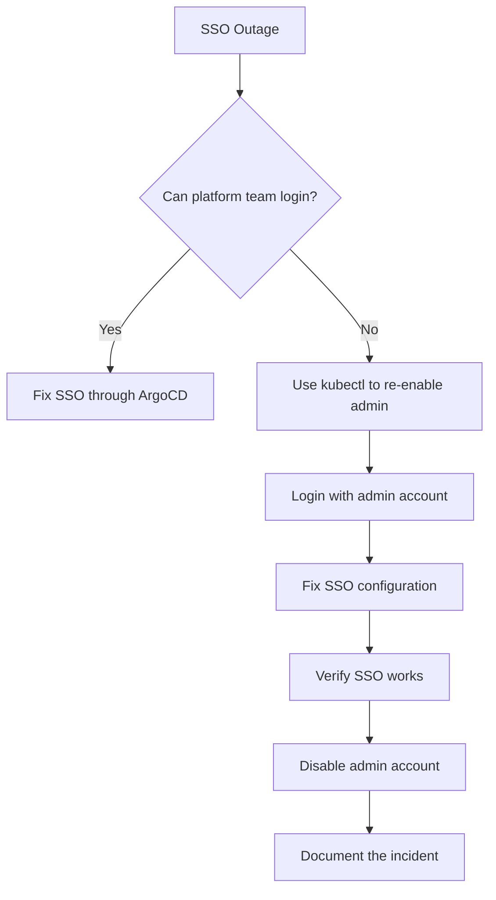

# How to Disable the ArgoCD Admin Account for Security

Author: [nawazdhandala](https://github.com/nawazdhandala)

Tags: ArgoCD, GitOps, Kubernetes, Security

Description: Learn how to disable the ArgoCD built-in admin account after configuring SSO, reducing attack surface and enforcing identity-based access control.

---

The ArgoCD admin account is a built-in local account with full cluster access. It uses a static password, has no audit trail tied to a real identity, and cannot be managed through your identity provider. In production environments, you should disable it after configuring SSO, keeping it only as an emergency break-glass procedure.

Disabling the admin account forces all users to authenticate through your SSO provider, which means you get proper identity tracking, group-based RBAC, session management, and audit logs tied to real people.

## Why Disable the Admin Account

- **No identity tracking**: When multiple people share the admin account, you cannot tell who did what in the audit logs
- **Static password risk**: Static passwords can be leaked, shared, or brute-forced
- **No MFA**: The built-in admin account does not support multi-factor authentication
- **Compliance**: Many compliance frameworks (SOC2, ISO 27001, PCI-DSS) require individual user accounts with identity-based access

## Prerequisites

Before disabling admin, make sure you have:

1. **SSO configured and working** - At least one SSO provider (OIDC, SAML, or Dex with a connector) that users can log in with
2. **RBAC configured** - At least one SSO user or group has admin-level access through RBAC policies
3. **Tested SSO login** - You have confirmed that SSO users can log in and perform the operations they need

If you disable admin without working SSO, you will lock yourself out of ArgoCD.

## Step 1: Verify SSO is Working

Before disabling anything, confirm your SSO setup.

```bash
# Check that SSO is configured
kubectl get configmap argocd-cm -n argocd -o yaml | grep -A20 "oidc.config\|dex.config"

# Login via SSO to verify it works
argocd login argocd.yourdomain.com --sso

# Verify you have admin access via SSO
argocd app list
argocd cluster list
argocd project list
```

## Step 2: Configure RBAC for SSO Users

Make sure your SSO users have the right permissions. Check the RBAC configuration.

```bash
# View current RBAC policies
kubectl get configmap argocd-rbac-cm -n argocd -o yaml
```

Ensure at least one SSO group or user has admin access.

```yaml
# argocd-rbac-cm.yaml
apiVersion: v1
kind: ConfigMap
metadata:
  name: argocd-rbac-cm
  namespace: argocd
data:
  # Map SSO groups to ArgoCD roles
  policy.csv: |
    # Platform team gets admin access
    g, platform-team, role:admin

    # Developers get read-only access
    g, developers, role:readonly

    # Specific user as admin (backup)
    g, john@example.com, role:admin

  # Default policy for authenticated users without explicit mapping
  policy.default: role:readonly

  # Match SSO groups to ArgoCD groups
  scopes: '[groups, email]'
```

Apply the RBAC configuration.

```bash
kubectl apply -f argocd-rbac-cm.yaml
```

Test that your SSO admin user can perform admin operations.

```bash
# Login as SSO user
argocd login argocd.yourdomain.com --sso

# Verify admin access
argocd account can-i create applications '*/*'
argocd account can-i sync applications '*/*'
argocd account can-i delete applications '*/*'
```

## Step 3: Disable the Admin Account

Once SSO is verified and RBAC is configured, disable the admin account.

```bash
# Disable the admin account
kubectl patch configmap argocd-cm -n argocd --type merge \
  -p '{"data":{"admin.enabled":"false"}}'
```

Or edit the ConfigMap directly.

```yaml
# argocd-cm.yaml
apiVersion: v1
kind: ConfigMap
metadata:
  name: argocd-cm
  namespace: argocd
data:
  admin.enabled: "false"
  # ... rest of your configuration
```

```bash
kubectl apply -f argocd-cm.yaml
```

Restart the ArgoCD server to pick up the change.

```bash
kubectl rollout restart deployment argocd-server -n argocd
kubectl rollout status deployment argocd-server -n argocd
```

## Step 4: Verify Admin is Disabled

Try logging in with the admin account - it should be rejected.

```bash
# This should fail
argocd login argocd.yourdomain.com --username admin --password '<password>' --insecure
# Expected: FATA[0000] rpc error: code = PermissionDenied desc = Account admin is disabled
```

Login via SSO should still work.

```bash
# This should succeed
argocd login argocd.yourdomain.com --sso
```

Check in the UI as well. The admin login option should be gone or return an error.

## Creating Service Accounts for Automation

After disabling admin, CI/CD pipelines need their own accounts. Create API-only accounts that do not use password authentication.

```yaml
# argocd-cm.yaml - add service accounts
apiVersion: v1
kind: ConfigMap
metadata:
  name: argocd-cm
  namespace: argocd
data:
  admin.enabled: "false"
  # Create API-only accounts for automation
  accounts.cicd-deployer: apiKey
  accounts.monitoring: apiKey
```

Configure RBAC for these accounts.

```yaml
# argocd-rbac-cm.yaml
apiVersion: v1
kind: ConfigMap
metadata:
  name: argocd-rbac-cm
  namespace: argocd
data:
  policy.csv: |
    # SSO groups
    g, platform-team, role:admin
    g, developers, role:readonly

    # CI/CD service account - can sync but not delete
    p, role:cicd, applications, get, */*, allow
    p, role:cicd, applications, sync, */*, allow
    p, role:cicd, applications, override, */*, allow
    g, cicd-deployer, role:cicd

    # Monitoring account - read only
    p, role:monitoring, applications, get, */*, allow
    g, monitoring, role:monitoring
  policy.default: role:readonly
  scopes: '[groups, email]'
```

Generate tokens for the service accounts.

```bash
# You need to login as an SSO admin to generate tokens
argocd login argocd.yourdomain.com --sso

# Generate a token for the CI/CD account
argocd account generate-token --account cicd-deployer
# Save this token securely in your CI/CD system

# Generate a token for monitoring
argocd account generate-token --account monitoring
```

## Emergency Break-Glass Procedure

If SSO breaks and you need to regain access, you can temporarily re-enable the admin account.

```bash
# Re-enable admin (requires kubectl access to the cluster)
kubectl patch configmap argocd-cm -n argocd --type merge \
  -p '{"data":{"admin.enabled":"true"}}'

# Restart the server
kubectl rollout restart deployment argocd-server -n argocd

# Login with admin
argocd login argocd.yourdomain.com --username admin --password '<password>' --insecure

# Fix whatever broke with SSO
# ...

# Disable admin again when done
kubectl patch configmap argocd-cm -n argocd --type merge \
  -p '{"data":{"admin.enabled":"false"}}'

kubectl rollout restart deployment argocd-server -n argocd
```

### Document the Break-Glass Process

Keep this procedure documented and accessible to the platform team. Store the admin password in a secure vault (not in a wiki or shared document).



## Additional Security Hardening

### Disable Password Login Entirely

If all your users use SSO and all automation uses API tokens, you can disable password-based login entirely.

```yaml
# argocd-cm.yaml
apiVersion: v1
kind: ConfigMap
metadata:
  name: argocd-cm
  namespace: argocd
data:
  admin.enabled: "false"
  # Only allow SSO login (no local accounts can login with passwords)
  accounts.cicd-deployer: apiKey  # apiKey only, no login capability
```

The `apiKey` capability allows only token-based access. Adding `login` would allow password-based access:

```yaml
# apiKey only - can use tokens, cannot login with password
accounts.cicd-deployer: apiKey

# Both capabilities - can use tokens AND login with password
accounts.cicd-deployer: apiKey, login
```

### Set Session Timeout

Reduce the risk of abandoned sessions.

```yaml
# argocd-cm.yaml
apiVersion: v1
kind: ConfigMap
metadata:
  name: argocd-cm
  namespace: argocd
data:
  # Sessions expire after 24 hours (default is 24h)
  # For tighter security, reduce to 8 hours
  timeout.session: "8h"
  timeout.session.maxlifetime: "24h"
```

### Enable Audit Logging

Make sure ArgoCD logs who does what.

```bash
# Check that audit events are being logged
kubectl logs deployment/argocd-server -n argocd | grep -i "admin\|sync\|create\|delete"
```

## Troubleshooting

### Locked Out After Disabling Admin

If you disabled admin and SSO is not working:

```bash
# Re-enable admin via kubectl (you need cluster access)
kubectl patch configmap argocd-cm -n argocd --type merge \
  -p '{"data":{"admin.enabled":"true"}}'

kubectl rollout restart deployment argocd-server -n argocd
```

### SSO Groups Not Mapping to RBAC

Check the RBAC logs.

```bash
kubectl logs deployment/argocd-server -n argocd | grep -i "rbac\|policy\|denied"
```

Make sure the `scopes` field in argocd-rbac-cm includes `groups`.

### API Token Not Working

Verify the account exists and has the apiKey capability.

```bash
# List accounts
argocd account list

# Check specific account
argocd account get --account cicd-deployer
```

## Further Reading

- Configure SSO: [ArgoCD SSO with OIDC](https://oneuptime.com/blog/post/2026-01-25-sso-oidc-argocd/view)
- RBAC policies: [ArgoCD RBAC](https://oneuptime.com/blog/post/2026-01-25-rbac-policies-argocd/view)
- SSO with Dex: [ArgoCD SSO with Dex](https://oneuptime.com/blog/post/2026-02-02-argocd-sso-dex/view)

Disabling the admin account is a straightforward security improvement. The prerequisites - working SSO and proper RBAC - are the hard part. Once those are in place, flipping the switch is a single ConfigMap change. Keep the admin password in a vault for emergencies, and make sure your platform team knows the break-glass procedure.
