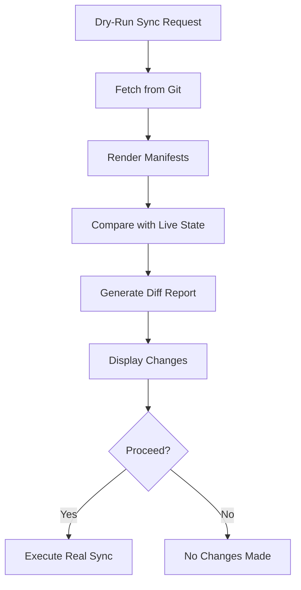

# How to Implement Dry-Run Syncs in ArgoCD

Author: [nawazdhandala](https://github.com/nawazdhandala)

Tags: ArgoCD, GitOps, Kubernetes, Dry Run, Deployment Safety

Description: Learn how to use ArgoCD dry-run sync operations to preview what changes will be applied to your cluster before actually executing the sync.

---

Deploying to production without knowing exactly what will change is like crossing a street blindfolded. ArgoCD's dry-run capability lets you preview the exact changes a sync will apply before committing to the operation. This is especially valuable for production environments where unexpected changes can cause outages.

This guide covers how to implement dry-run syncs in ArgoCD using the CLI, API, and UI, along with practical patterns for integrating dry runs into your deployment workflow.

## What a Dry-Run Sync Does

A dry-run sync performs all the steps of a normal sync except the final apply. It:

1. Fetches the latest manifests from the Git repository
2. Renders templates (Helm, Kustomize, etc.)
3. Compares the rendered manifests against the live cluster state
4. Reports what would change without making any modifications



## CLI Dry-Run

The ArgoCD CLI provides a `--dry-run` flag for sync operations:

```bash
# Dry-run sync - shows what would happen
argocd app sync my-app --dry-run

# Output example:
# Name:               my-app
# Project:            default
# Server:             https://kubernetes.default.svc
# Namespace:          production
# Sync Status:        OutOfSync
#
# GROUP  KIND        NAMESPACE   NAME       STATUS     HEALTH   HOOK  MESSAGE
# apps   Deployment  production  my-app     OutOfSync  Healthy
# v1     Service     production  my-app     Synced     Healthy
# v1     ConfigMap   production  my-app     OutOfSync  Missing
```

The output shows which resources would be created, updated, or deleted without making any changes.

## Detailed Diff with Dry-Run

Combine dry-run with the diff command for a detailed view of changes:

```bash
# Show the exact diff for each resource
argocd app diff my-app

# Output:
# ===== apps/Deployment production/my-app ======
# --- live
# +++ desired
# @@ -17,7 +17,7 @@
#      containers:
#      - name: my-app
# -      image: my-app:v1.0.0
# +      image: my-app:v1.1.0
#        resources:
#          limits:
# -          memory: "256Mi"
# +          memory: "512Mi"
#
# ===== /ConfigMap production/my-app ======
# +++ desired (new resource)
# apiVersion: v1
# kind: ConfigMap
# metadata:
#   name: my-app
#   namespace: production
# data:
#   config.yaml: |
#     feature_flags:
#       new_feature: true
```

This shows exactly what will change: the image is updated, memory limit is increased, and a new ConfigMap is created.

## Server-Side Dry-Run

For more accurate results, use server-side dry-run which validates against the actual Kubernetes API:

```bash
# Server-side dry-run validates with the cluster's admission controllers
argocd app sync my-app --dry-run --server-side
```

Server-side dry-run catches issues that client-side validation misses:
- Admission webhook rejections
- Resource quota violations
- Mutating webhook effects
- RBAC permission errors

## API-Based Dry-Run

For programmatic workflows, use the ArgoCD API:

```bash
# Trigger a dry-run sync via the API
curl -X POST "https://argocd.example.com/api/v1/applications/my-app/sync" \
  -H "Authorization: Bearer $ARGOCD_TOKEN" \
  -H "Content-Type: application/json" \
  -d '{
    "dryRun": true,
    "strategy": {
      "apply": {
        "force": false
      }
    }
  }'
```

The API response includes the sync result with all resource changes that would have been applied:

```json
{
  "status": {
    "operationState": {
      "phase": "Succeeded",
      "syncResult": {
        "resources": [
          {
            "group": "apps",
            "kind": "Deployment",
            "name": "my-app",
            "namespace": "production",
            "status": "SyncedOutOfSync",
            "message": "deployment.apps/my-app would be updated"
          }
        ]
      }
    }
  }
}
```

## Building a Dry-Run Workflow

### Pre-Merge Dry-Run

Run a dry-run as part of your PR review process. When a developer creates a PR that changes manifests, automatically show what would change in the cluster:

```yaml
# GitHub Actions - PR dry-run
name: ArgoCD Dry-Run
on:
  pull_request:
    paths:
    - 'apps/**'

jobs:
  dry-run:
    runs-on: ubuntu-latest
    steps:
    - uses: actions/checkout@v4

    - name: Install ArgoCD CLI
      run: |
        curl -sSL -o argocd https://github.com/argoproj/argo-cd/releases/latest/download/argocd-linux-amd64
        chmod +x argocd
        sudo mv argocd /usr/local/bin/

    - name: Login to ArgoCD
      run: |
        argocd login argocd.example.com \
          --username ci-user \
          --password ${{ secrets.ARGOCD_PASSWORD }} \
          --grpc-web

    - name: Generate diff report
      id: diff
      run: |
        # Find which apps changed
        CHANGED_APPS=$(git diff --name-only origin/main | \
          grep "^apps/" | cut -d/ -f2 | sort -u)

        DIFF_OUTPUT=""
        for app in $CHANGED_APPS; do
          echo "=== Dry-run for $app ==="
          DIFF=$(argocd app diff "$app" --local "apps/$app" 2>&1 || true)
          DIFF_OUTPUT="${DIFF_OUTPUT}\n### ${app}\n\`\`\`diff\n${DIFF}\n\`\`\`\n"
        done

        echo "diff_output<<EOF" >> $GITHUB_OUTPUT
        echo -e "$DIFF_OUTPUT" >> $GITHUB_OUTPUT
        echo "EOF" >> $GITHUB_OUTPUT

    - name: Comment PR with diff
      uses: actions/github-script@v7
      with:
        script: |
          github.rest.issues.createComment({
            issue_number: context.issue.number,
            owner: context.repo.owner,
            repo: context.repo.repo,
            body: `## ArgoCD Dry-Run Results\n\n${{ steps.diff.outputs.diff_output }}`
          })
```

This posts a comment on every PR showing exactly what would change in the cluster, making reviews more informed.

### Pre-Deployment Approval

For production deployments, require a dry-run review before the actual sync:

```bash
#!/bin/bash
# deploy-with-review.sh

APP=$1
echo "=== Dry-Run Results for $APP ==="

# Show what would change
argocd app diff "$APP" 2>&1

echo ""
echo "=== Resource Summary ==="
argocd app sync "$APP" --dry-run 2>&1

echo ""
read -p "Proceed with sync? (yes/no): " CONFIRM

if [ "$CONFIRM" = "yes" ]; then
  echo "Executing sync..."
  argocd app sync "$APP"
  argocd app wait "$APP" --health --timeout 300
  echo "Sync complete."
else
  echo "Sync cancelled."
fi
```

## Automated Dry-Run with Notifications

Set up automated dry-run checks that notify the team when changes are pending:

```yaml
# CronJob that runs dry-run checks
apiVersion: batch/v1
kind: CronJob
metadata:
  name: argocd-dry-run-check
  namespace: argocd
spec:
  schedule: "*/30 * * * *"  # Every 30 minutes
  jobTemplate:
    spec:
      template:
        spec:
          containers:
          - name: dry-run-checker
            image: argoproj/argocd:v2.10.0
            command:
            - /bin/bash
            - -c
            - |
              # Login to ArgoCD
              argocd login argocd-server:443 \
                --username admin \
                --password "$ARGOCD_PASSWORD" \
                --insecure

              # Check all apps for pending changes
              OUTOFSYNC=$(argocd app list -o json | \
                jq -r '.[] | select(.status.sync.status == "OutOfSync") | .metadata.name')

              for app in $OUTOFSYNC; do
                echo "=== Pending changes for $app ==="
                argocd app diff "$app" 2>&1

                # Send notification (Slack example)
                curl -X POST "$SLACK_WEBHOOK" \
                  -H "Content-Type: application/json" \
                  -d "{\"text\": \"ArgoCD: Application $app has pending changes. Run dry-run to review.\"}"
              done
            env:
            - name: ARGOCD_PASSWORD
              valueFrom:
                secretKeyRef:
                  name: argocd-initial-admin-secret
                  key: password
            - name: SLACK_WEBHOOK
              valueFrom:
                secretKeyRef:
                  name: slack-webhook
                  key: url
          restartPolicy: OnFailure
```

## Handling Dry-Run Limitations

Dry-run has some limitations to be aware of:

**Webhook effects**: Client-side dry-run does not account for mutating webhooks. Use server-side dry-run for accurate results when you have admission controllers.

**Dynamic resources**: Resources created by operators (like Jobs created by CronJobs) will not appear in the dry-run since they are created at runtime.

**Secret values**: Dry-run diffs show encoded secret values. Be careful about exposing these in CI logs or PR comments.

```bash
# Filter out secrets from diff output
argocd app diff my-app 2>&1 | grep -v "kind: Secret" || true
```

For comprehensive deployment monitoring that complements dry-run checks, integrate [OneUptime](https://oneuptime.com/blog/post/2026-02-26-argocd-alerts-failed-syncs/view) to track sync success rates and deployment health metrics.

## Summary

Dry-run syncs in ArgoCD provide a safety net for deployments by showing exactly what will change before changes are applied. Use the CLI `--dry-run` flag for manual checks, the `argocd app diff` command for detailed diffs, server-side dry-run for admission controller validation, and the API for programmatic workflows. Integrate dry-run into your PR review process to give reviewers visibility into cluster impact. For production deployments, combine dry-run with manual approval gates. The extra seconds spent reviewing a dry-run can prevent hours of incident response.
