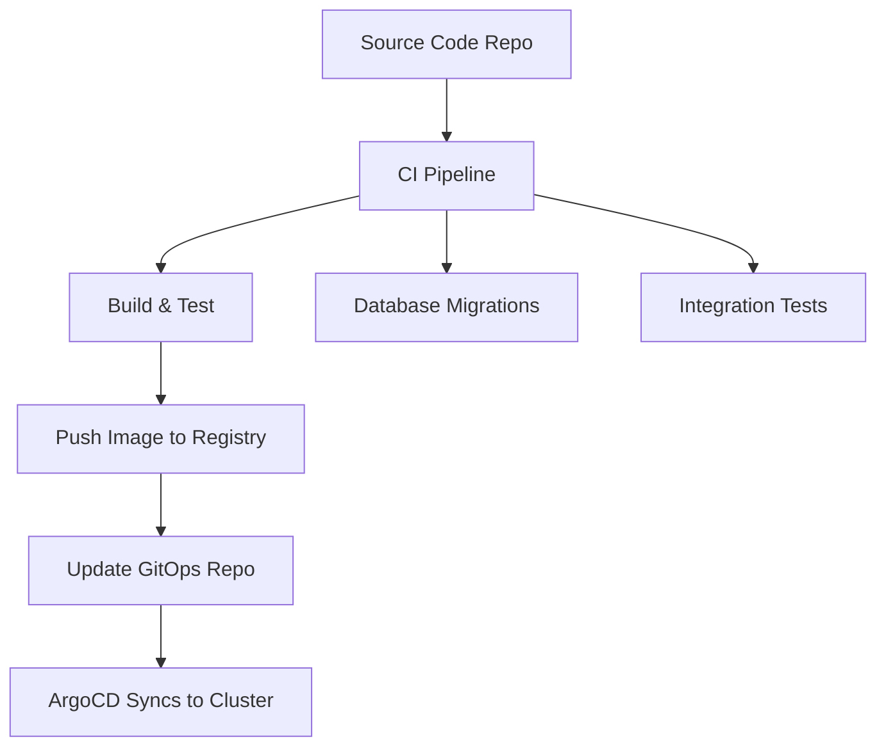

# GitOps with ArgoCD vs Traditional CI/CD: Pros and Cons

Author: [nawazdhandala](https://github.com/nawazdhandala)

Tags: ArgoCD, GitOps, Kubernetes, CI/CD, DevOps

Description: Compare GitOps with ArgoCD against traditional CI/CD pipelines, examining deployment models, security, reliability, and when each approach makes sense.

---

The shift from traditional CI/CD to GitOps represents a fundamental change in how we think about deployments. Traditional CI/CD pipelines push changes from a build system to production. GitOps with ArgoCD pulls changes from Git to the cluster. This distinction might sound subtle, but it has profound implications for security, reliability, auditability, and developer experience. This article breaks down both approaches honestly, including the real trade-offs that GitOps advocates sometimes gloss over.

## The Two Models

### Traditional CI/CD (Push Model)

In a traditional pipeline, a CI server builds your code, runs tests, and then pushes the result to your deployment target. The CI server has credentials to deploy to production.


```yaml
# Traditional CI/CD: Jenkins pipeline example
pipeline {
    agent any
    stages {
        stage('Build') {
            steps {
                sh 'docker build -t myapp:${BUILD_NUMBER} .'
                sh 'docker push registry.example.com/myapp:${BUILD_NUMBER}'
            }
        }
        stage('Test') {
            steps {
                sh 'docker run myapp:${BUILD_NUMBER} npm test'
            }
        }
        stage('Deploy Staging') {
            steps {
                sh 'kubectl set image deployment/myapp myapp=myapp:${BUILD_NUMBER} -n staging'
            }
        }
        stage('Deploy Production') {
            when { branch 'main' }
            steps {
                sh 'kubectl set image deployment/myapp myapp=myapp:${BUILD_NUMBER} -n production'
            }
        }
    }
}
```

### GitOps with ArgoCD (Pull Model)

In the GitOps model, the desired state lives in Git. ArgoCD continuously watches the Git repository and reconciles the cluster to match. The CI server never touches the cluster directly.


```yaml
# GitOps: CI builds the image, ArgoCD deploys
# Step 1: CI pipeline builds and updates the GitOps repo
# .github/workflows/build.yaml
name: Build
on:
  push:
    branches: [main]
jobs:
  build:
    runs-on: ubuntu-latest
    steps:
      - uses: actions/checkout@v4
      - run: docker build -t myapp:${{ github.sha }} .
      - run: docker push registry.example.com/myapp:${{ github.sha }}
      - name: Update GitOps repo
        run: |
          git clone https://github.com/org/gitops-repo
          cd gitops-repo
          yq e ".image.tag = \"${{ github.sha }}\"" -i apps/myapp/values.yaml
          git commit -am "Update myapp to ${{ github.sha }}"
          git push

# Step 2: ArgoCD Application (already configured)
# ArgoCD detects the Git change and syncs automatically
```

## Security Comparison

### Credential Exposure

**Traditional CI/CD:**
- The CI server needs cluster credentials (kubeconfig, service account tokens)
- Every pipeline that deploys has access to production
- A compromised CI server can deploy arbitrary code to production
- Credentials are stored in CI secrets, which are a frequent attack target

**GitOps with ArgoCD:**
- ArgoCD runs inside the cluster and uses in-cluster authentication
- The CI server only needs Git write access - it never touches the cluster
- ArgoCD pulls from Git - no inbound connections required
- Cluster credentials never leave the cluster

```bash
# Traditional: CI server needs cluster access
# If Jenkins is compromised, attacker gets:
kubectl get secret -A  # Access to all secrets
kubectl exec -it ...   # Shell access to pods

# GitOps: CI server only has Git access
# If GitHub Actions is compromised, attacker can:
git push  # Push code, which still goes through PR review
# They CANNOT directly access the cluster
```

### Audit Trail

**Traditional CI/CD:** Audit depends on CI server logging. Pipeline logs can be modified or deleted. There is no guarantee of immutable history.

**GitOps with ArgoCD:** Git provides an immutable audit trail. Every deployment change is a Git commit with author, timestamp, and content. Reverting means reverting a commit.

```bash
# GitOps audit trail
git log --oneline apps/production/
# a1b2c3d Update myapp to v2.1.0 (John, 2024-01-15)
# d4e5f6g Update myapp to v2.0.9 (Jane, 2024-01-14)
# g7h8i9j Update resource limits (Bob, 2024-01-13)

# Every change is traceable, reviewable, and revertable
git revert a1b2c3d  # Instant rollback
```

## Reliability Comparison

### Drift Detection and Self-Healing

**Traditional CI/CD:** If someone runs `kubectl edit` to change a deployment in production, the CI pipeline has no idea. The cluster state silently diverges from what was deployed.

**GitOps with ArgoCD:** ArgoCD continuously compares the cluster state to Git. If someone manually modifies a resource, ArgoCD detects the drift and can automatically revert it.

```yaml
# ArgoCD self-healing configuration
syncPolicy:
  automated:
    selfHeal: true  # Automatically revert manual changes
    prune: true     # Remove resources deleted from Git
```

### Disaster Recovery

**Traditional CI/CD:** If a cluster is lost, you need to re-run all deployment pipelines in the correct order, hoping they are all still working.

**GitOps with ArgoCD:** If a cluster is lost, point ArgoCD at a new cluster and it recreates everything from Git. The entire desired state is declared in version control.

```bash
# Disaster recovery with GitOps
# 1. Create new cluster
# 2. Install ArgoCD
# 3. Point ArgoCD at the same Git repo
# 4. Everything is restored automatically
```

### Deployment Ordering

**Traditional CI/CD** provides explicit deployment ordering through pipeline stages. You control exactly when each step executes.

**GitOps with ArgoCD** uses sync waves and hooks for ordering, but this is less intuitive than pipeline stages.

```yaml
# ArgoCD sync ordering with waves
metadata:
  annotations:
    argocd.argoproj.io/sync-wave: "1"  # Lower numbers sync first
```

## Developer Experience

### Deployment Velocity

**Traditional CI/CD** offers straightforward "push a button, see it deploy" semantics. Developers are familiar with pipeline-triggered deployments.

**GitOps** requires a mental shift. Deployments happen through Git commits, not pipeline buttons. This can feel indirect at first.

### Rollback Speed

**Traditional CI/CD:**
```bash
# Re-run the previous pipeline with the old image tag
# OR: manually roll back
kubectl rollout undo deployment/myapp -n production
# Problem: this drift is now invisible to your CI system
```

**GitOps with ArgoCD:**
```bash
# Revert the Git commit
git revert HEAD
git push

# ArgoCD automatically syncs the rollback
# Everything is tracked and auditable
```

### Local Development

**Traditional CI/CD** pipelines can be complex to replicate locally. Each developer might deploy differently.

**GitOps** makes the deployed state obvious - just look at the Git repo. However, testing GitOps changes locally requires running ArgoCD locally or using preview environments.

## Complexity Comparison

### Initial Setup

**Traditional CI/CD:** Lower initial setup. Write a pipeline, give it cluster credentials, done. Most teams can set this up in a day.

**GitOps:** Higher initial setup. You need ArgoCD installed, a GitOps repository structure, webhook configuration, and team training on the new workflow. Initial setup typically takes a week.

### Ongoing Maintenance

**Traditional CI/CD:** Pipeline maintenance can become a significant burden. Complex pipelines with many stages, conditions, and integrations become fragile over time.

**GitOps:** Once set up, the operational model is simpler. The system continuously converges to the desired state. Less time is spent debugging failed deployments.

## Where Traditional CI/CD Still Wins

Let's be honest about GitOps limitations:

**Non-Kubernetes deployments.** GitOps with ArgoCD only works for Kubernetes. If you deploy to VMs, serverless, or other platforms, you still need traditional pipelines.

**Complex orchestration.** Multi-stage deployments with external approvals, database migrations, and cross-service coordination are easier to model in traditional pipelines.

**Testing in the deployment pipeline.** Traditional CI/CD can run integration tests as part of the deployment process. With GitOps, you need to build this separately.

**Speed of iteration.** For rapid prototyping environments, the indirection of GitOps (commit to Git, wait for sync) can feel slow compared to direct deployment.

## The Hybrid Approach

Most organizations do not go pure GitOps or pure traditional CI/CD. The pragmatic approach is:



Use traditional CI for building, testing, and artifact creation. Use GitOps with ArgoCD for the deployment and cluster state management layer. This gives you the security and reliability benefits of GitOps while keeping the orchestration capabilities of CI pipelines.

## When to Use Which

**Use Traditional CI/CD when:**
- Deploying to non-Kubernetes targets
- You need complex deployment orchestration
- Your team is small and setup time matters
- You are deploying to a single environment

**Use GitOps with ArgoCD when:**
- Deploying to Kubernetes
- Security and audit requirements are strict
- You manage multiple clusters or environments
- Drift detection and self-healing matter
- You want infrastructure-as-code for your deployments

The trend is clearly moving toward GitOps for Kubernetes deployments, but traditional CI/CD is not going away. Understanding both models and their trade-offs lets you choose the right tool for each part of your delivery pipeline.
