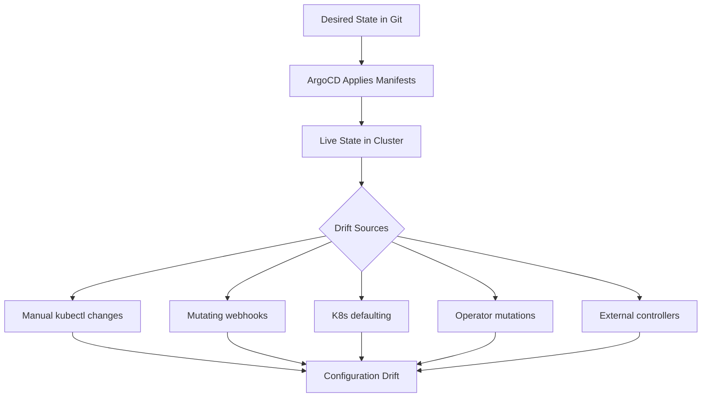
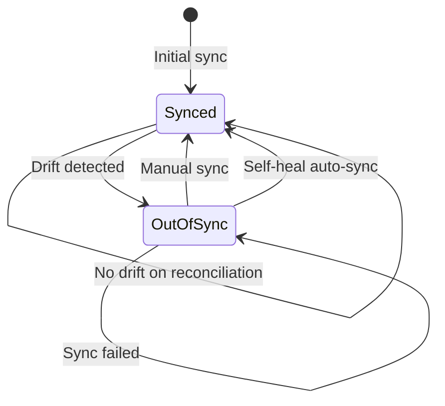

# How Configuration Drift Detection Works in GitOps

Author: [nawazdhandala](https://github.com/nawazdhandala)

Tags: ArgoCD, GitOps, Kubernetes, Drift Detection, Configuration Management

Description: Understand how configuration drift detection works in GitOps, how ArgoCD detects and remediates drift, and best practices for keeping clusters in sync.

---

Configuration drift happens when the actual state of your cluster diverges from the desired state declared in Git. In a traditional Kubernetes setup, drift is a constant problem - someone runs `kubectl edit`, a CronJob modifies a ConfigMap, or an operator mutates a resource. In GitOps, drift detection is a core feature, not an afterthought.

This guide explains how drift detection works under the hood in GitOps controllers like ArgoCD, and how to configure it effectively.

## What Causes Configuration Drift?

Before diving into detection, let us understand what causes drift in the first place:

1. **Manual kubectl changes.** Someone runs `kubectl edit deployment` or `kubectl scale` directly against the cluster.

2. **Admission controllers and webhooks.** Mutating admission webhooks modify resources as they are applied, adding fields that were not in the original manifest.

3. **Kubernetes defaulting.** The API server adds default values to fields you did not specify in your manifests.

4. **Operator modifications.** Controllers and operators update resource status and sometimes spec fields.

5. **External systems.** Service meshes inject sidecars, auto-scalers change replica counts, and certificate managers update secrets.



## How ArgoCD Detects Drift

ArgoCD uses a continuous reconciliation loop to detect drift. Here is how it works step by step:

### Step 1: Fetch Desired State from Git

ArgoCD clones or fetches the Git repository at the configured revision. It then renders the manifests using the configured tool (Kustomize, Helm, plain YAML, or a custom plugin).

### Step 2: Normalize the Manifests

This is where things get interesting. ArgoCD does not just do a raw diff between Git and the cluster. It applies normalization to account for Kubernetes defaulting and other mutations:

- Removes server-side fields like `metadata.managedFields`, `metadata.resourceVersion`, and `metadata.uid`
- Handles default values that Kubernetes adds automatically
- Respects `argocd.argoproj.io/compare-options` annotations for custom comparison behavior

### Step 3: Compare with Live State

ArgoCD fetches the live state of each resource from the Kubernetes API server and compares it against the normalized desired state. The comparison uses a structured diff algorithm, not a simple string comparison.

### Step 4: Determine Sync Status

Based on the comparison, ArgoCD assigns one of these sync statuses:

- **Synced** - Live state matches desired state
- **OutOfSync** - Live state differs from desired state
- **Unknown** - ArgoCD cannot determine the state

### Step 5: Report or Remediate

Depending on your sync policy, ArgoCD either reports the drift (for manual sync) or automatically remediates it (for auto-sync with self-heal).

## Configuring Drift Detection in ArgoCD

### Basic Auto-Sync with Self-Heal

The simplest way to handle drift is to enable self-healing:

```yaml
apiVersion: argoproj.io/v1alpha1
kind: Application
metadata:
  name: my-app
  namespace: argocd
spec:
  project: default
  source:
    repoURL: https://github.com/myorg/gitops-repo
    path: apps/my-app/production
    targetRevision: main
  destination:
    server: https://kubernetes.default.svc
    namespace: production
  syncPolicy:
    automated:
      selfHeal: true    # Automatically fix drift
      prune: true       # Remove resources not in Git
    syncOptions:
      - CreateNamespace=true
```

With `selfHeal: true`, ArgoCD will automatically revert any manual changes within a few minutes (the default sync interval is 3 minutes).

### Customizing the Reconciliation Interval

You can adjust how frequently ArgoCD checks for drift:

```yaml
apiVersion: v1
kind: ConfigMap
metadata:
  name: argocd-cm
  namespace: argocd
data:
  # How often ArgoCD reconciles all applications (default: 3m)
  timeout.reconciliation: 180s

  # How often ArgoCD re-fetches Git repositories (default: 3m)
  timeout.hard.reconciliation: 180s
```

For critical applications, you might want more frequent reconciliation:

```yaml
apiVersion: argoproj.io/v1alpha1
kind: Application
metadata:
  name: critical-app
  annotations:
    # Override reconciliation interval for this app
    argocd.argoproj.io/refresh: "60"
spec:
  # ... app spec
```

### Ignoring Specific Fields

Some drift is expected and should be ignored. For example, an HPA changing replica counts or a cert-manager updating TLS secrets:

```yaml
apiVersion: argoproj.io/v1alpha1
kind: Application
metadata:
  name: my-app
spec:
  ignoreDifferences:
    # Ignore replica count changes (managed by HPA)
    - group: apps
      kind: Deployment
      jsonPointers:
        - /spec/replicas

    # Ignore caBundle injection by cert-manager
    - group: admissionregistration.k8s.io
      kind: MutatingWebhookConfiguration
      jqPathExpressions:
        - .webhooks[]?.clientConfig.caBundle

    # Ignore all annotations matching a pattern
    - group: "*"
      kind: "*"
      managedFieldsManagers:
        - kube-controller-manager
```

You can also configure this globally in the ArgoCD ConfigMap:

```yaml
apiVersion: v1
kind: ConfigMap
metadata:
  name: argocd-cm
  namespace: argocd
data:
  resource.customizations.ignoreDifferences.all: |
    managedFieldsManagers:
      - kube-controller-manager
      - kube-scheduler
    jsonPointers:
      - /metadata/annotations/kubectl.kubernetes.io~1last-applied-configuration
```

### Using Server-Side Diff

ArgoCD 2.10+ supports server-side diff, which gives more accurate drift detection by comparing against what the API server would actually produce:

```yaml
apiVersion: argoproj.io/v1alpha1
kind: Application
metadata:
  name: my-app
  annotations:
    argocd.argoproj.io/compare-options: ServerSideDiff=true
spec:
  # ... app spec
```

Server-side diff eliminates many false positives caused by defaulting and normalization issues.

## Monitoring Drift with Metrics

ArgoCD exposes Prometheus metrics that let you track drift across your fleet:

```promql
# Count of out-of-sync applications
sum(argocd_app_info{sync_status="OutOfSync"})

# Applications with drift by project
sum by (project) (argocd_app_info{sync_status="OutOfSync"})

# Time since last successful sync (detect long-standing drift)
time() - argocd_app_info{sync_status="Synced"}
```

Set up alerts for persistent drift:

```yaml
apiVersion: monitoring.coreos.com/v1
kind: PrometheusRule
metadata:
  name: argocd-drift-alerts
spec:
  groups:
    - name: argocd-drift
      rules:
        - alert: ApplicationOutOfSync
          expr: |
            argocd_app_info{sync_status="OutOfSync"} == 1
          for: 15m
          labels:
            severity: warning
          annotations:
            summary: "Application {{ $labels.name }} has been out of sync for 15 minutes"

        - alert: ApplicationDriftNotRemediated
          expr: |
            argocd_app_info{sync_status="OutOfSync",
              automated_sync="true", self_heal="true"} == 1
          for: 10m
          labels:
            severity: critical
          annotations:
            summary: "Application {{ $labels.name }} has drift that self-heal cannot fix"
```

## Understanding the Diff Output

When ArgoCD detects drift, you can inspect the exact differences:

```bash
# View drift for an application
argocd app diff my-app

# View drift with full context
argocd app diff my-app --local /path/to/local/manifests
```

The output looks similar to a unified diff:

```diff
===== apps/Deployment my-app/my-app ======
--- /tmp/desired.yaml
+++ /tmp/live.yaml
@@ -10,7 +10,7 @@
   spec:
     containers:
     - name: my-app
-      image: myorg/my-app:v2.0.0
+      image: myorg/my-app:v1.9.0
       resources:
         limits:
-          memory: 512Mi
+          memory: 1Gi
```

## The Drift Detection Lifecycle



## Best Practices for Drift Detection

1. **Enable self-heal for stateless applications.** If a resource can be safely re-applied, let ArgoCD fix drift automatically.

2. **Be deliberate about what you ignore.** Every ignored field is a potential blind spot. Document why each ignore rule exists.

3. **Use server-side diff when possible.** It significantly reduces false positives.

4. **Monitor drift metrics with OneUptime.** Track how often drift occurs and how quickly it is remediated. [OneUptime](https://oneuptime.com) can correlate drift events with incidents to identify problematic manual change patterns.

5. **Investigate recurring drift.** If the same resource keeps drifting, find the root cause. It might be an operator, a CronJob, or a team member who does not know about GitOps.

6. **Use RBAC to prevent manual changes.** The best drift prevention is making it impossible for most users to modify resources directly.

## Conclusion

Drift detection is what makes GitOps more than just "deployment from Git." It is the continuous assurance that your cluster matches your declared state. ArgoCD handles this through a reconciliation loop that normalizes, compares, and optionally remediates differences. By tuning your ignore rules, enabling self-heal where appropriate, and monitoring drift metrics, you can maintain a tight feedback loop between your Git repository and your running infrastructure.
