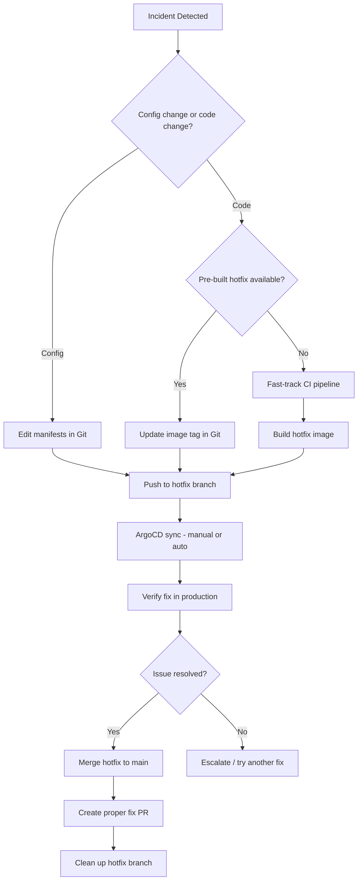

# How to Handle Hotfixes in a GitOps Workflow

Author: [nawazdhandala](https://github.com/nawazdhandala)

Tags: ArgoCD, GitOps, Kubernetes, Hotfix, CI/CD

Description: Learn how to manage emergency hotfixes in a GitOps workflow, balancing speed of response with maintaining Git as the single source of truth.

---

When production is on fire and you need to push a fix in minutes, the structured GitOps workflow can feel like it is getting in the way. The temptation to bypass Git and apply changes directly to the cluster is strong. But doing so defeats the entire purpose of GitOps and often makes things worse.

This guide covers practical strategies for handling hotfixes in a GitOps workflow so you can move fast without breaking your deployment model.

## The Hotfix Challenge in GitOps

In a typical GitOps setup, changes follow this pipeline:

1. Developer commits code
2. CI builds and tests
3. CD updates manifests in the GitOps repository
4. ArgoCD detects the change and syncs

This pipeline might take 10 to 20 minutes. During an outage, that feels like an eternity. The challenge is to shorten this loop for emergencies without abandoning your principles.


## Strategy 1: Fast-Track CI Pipeline

The best approach is to have a fast-track CI pipeline that skips non-essential steps for hotfixes.

Create a dedicated hotfix branch pattern that triggers a stripped-down pipeline:

```yaml
# .github/workflows/hotfix.yaml
name: Hotfix Pipeline
on:
  push:
    branches:
      - 'hotfix/**'

jobs:
  hotfix-deploy:
    runs-on: ubuntu-latest
    steps:
      - uses: actions/checkout@v4

      - name: Build container image
        run: |
          docker build -t myorg/my-app:hotfix-${{ github.sha }} .
          docker push myorg/my-app:hotfix-${{ github.sha }}

      # Run only critical tests
      - name: Smoke tests
        run: |
          docker run --rm myorg/my-app:hotfix-${{ github.sha }} \
            npm run test:smoke

      # Update GitOps repository immediately
      - name: Update GitOps repo
        run: |
          git clone https://github.com/myorg/gitops-repo.git
          cd gitops-repo
          # Update the image tag
          sed -i "s|image: myorg/my-app:.*|image: myorg/my-app:hotfix-${{ github.sha }}|" \
            apps/my-app/production/deployment.yaml
          git add .
          git commit -m "HOTFIX: Update my-app to hotfix-${{ github.sha }}"
          git push origin main
```

This pipeline skips integration tests, linting, and other time-consuming steps. You trade thoroughness for speed, which is acceptable during an emergency.

## Strategy 2: Pre-Built Hotfix Images

Keep a set of pre-built hotfix images that you can deploy immediately. This is particularly useful for common failure modes:

```yaml
# hotfix-images.yaml in your GitOps repo
# Pre-approved hotfix images for common scenarios
hotfixes:
  memory-leak-mitigation:
    image: myorg/my-app:v2.0.0-memlimit
    description: "Reduces memory limits and enables GC tuning"
  connection-pool-fix:
    image: myorg/my-app:v2.0.0-connpool
    description: "Increases connection pool and adds retry logic"
  circuit-breaker:
    image: myorg/my-app:v2.0.0-cb
    description: "Enables circuit breaker for downstream services"
```

When an incident matches a known pattern, you can deploy the pre-built image with a simple manifest update:

```bash
# Quick hotfix deployment
cd gitops-repo
git checkout -b hotfix/memory-leak-2026-02-26

# Update to the pre-built hotfix image
yq e '.spec.template.spec.containers[0].image = "myorg/my-app:v2.0.0-memlimit"' \
  -i apps/my-app/production/deployment.yaml

git add .
git commit -m "HOTFIX: Deploy memory leak mitigation image"
git push origin hotfix/memory-leak-2026-02-26
```

## Strategy 3: ArgoCD Sync Windows for Emergency Access

Configure ArgoCD sync windows to allow emergency syncs outside normal change windows:

```yaml
apiVersion: argoproj.io/v1alpha1
kind: AppProject
metadata:
  name: production
  namespace: argocd
spec:
  syncWindows:
    # Normal deployment window
    - kind: allow
      schedule: '0 9-17 * * 1-5'  # Weekdays 9am-5pm
      duration: 8h
      applications:
        - '*'
    # Emergency hotfix window - always open for manual sync
    - kind: allow
      schedule: '* * * * *'
      duration: 24h
      manualSync: true
      applications:
        - '*-hotfix'
```

Name your hotfix applications with a `-hotfix` suffix so they can be synced at any time:

```yaml
apiVersion: argoproj.io/v1alpha1
kind: Application
metadata:
  name: my-app-hotfix
  namespace: argocd
spec:
  project: production
  source:
    repoURL: https://github.com/myorg/gitops-repo
    path: apps/my-app/production
    targetRevision: hotfix/memory-leak-2026-02-26
  destination:
    server: https://kubernetes.default.svc
    namespace: production
  syncPolicy:
    automated:
      selfHeal: true
      prune: false  # Be conservative during hotfixes
```

## Strategy 4: Config-Only Hotfixes

Many production issues can be resolved with configuration changes rather than code changes. These are faster because no CI build is needed.

Common config-only hotfixes:

```yaml
# Increase replicas to handle load spike
apiVersion: apps/v1
kind: Deployment
metadata:
  name: my-app
spec:
  replicas: 10  # Scaled up from 3

---
# Add resource limits to prevent OOM
apiVersion: apps/v1
kind: Deployment
metadata:
  name: my-app
spec:
  template:
    spec:
      containers:
        - name: my-app
          resources:
            limits:
              memory: "1Gi"  # Increased from 512Mi
            requests:
              memory: "512Mi"

---
# Enable feature flag to disable problematic feature
apiVersion: v1
kind: ConfigMap
metadata:
  name: my-app-config
data:
  FEATURE_NEW_CHECKOUT: "false"  # Disabled due to bug
  LOG_LEVEL: "debug"  # Enable debug logging for investigation
```

These changes go straight to Git and sync within seconds:

```bash
git checkout -b hotfix/scale-up
# Edit manifests
git add .
git commit -m "HOTFIX: Scale my-app to 10 replicas for traffic spike"
git push origin hotfix/scale-up

# Force immediate sync
argocd app sync my-app
```

## Strategy 5: Temporary Override with Scheduled Cleanup

Sometimes you need to apply a quick fix now and do the proper fix later. Use ArgoCD parameter overrides with a scheduled cleanup:

```bash
# Apply immediate override
argocd app set my-app \
  --parameter image.tag=v2.0.0 \
  --parameter replicaCount=10

# Sync with the override
argocd app sync my-app
```

Then create a tracking issue and schedule the proper fix:

```bash
# Create a reminder to clean up the override
# In your incident response process:
# 1. Apply the override (done)
# 2. Create a proper fix PR
# 3. Merge the PR
# 4. Remove the override
argocd app unset my-app --parameter image.tag
argocd app unset my-app --parameter replicaCount
```

## The Hotfix Workflow End-to-End

Here is the complete flow for handling a hotfix:



## Best Practices for Hotfixes in GitOps

1. **Always go through Git, even for emergencies.** The few extra seconds to push a commit are worth it for the audit trail and automatic rollback capability.

2. **Have a hotfix runbook ready.** Document the exact steps your team should follow. During an incident is not the time to figure out the process.

3. **Use branch protection rules wisely.** Consider allowing direct pushes to hotfix branches while keeping main protected:

```bash
# GitHub branch protection allows hotfix/* branches
# to skip required reviews during emergencies
```

4. **Tag every hotfix.** This makes it easy to track and audit hotfix deployments:

```bash
git tag hotfix-2026-02-26-memory-leak
git push origin hotfix-2026-02-26-memory-leak
```

5. **Follow up with a proper fix.** A hotfix is a band-aid. Always create a follow-up ticket for a proper fix that goes through the full CI/CD pipeline.

6. **Monitor the hotfix.** Use [OneUptime](https://oneuptime.com) to track metrics before and after the hotfix to confirm it actually resolved the issue.

## Conclusion

Hotfixes in a GitOps workflow do not have to be slow. By setting up fast-track pipelines, pre-building common hotfix images, and using config-only changes when possible, you can respond to emergencies in minutes while keeping Git as your source of truth. The key is preparation - have your hotfix workflows documented and tested before the next incident hits.
