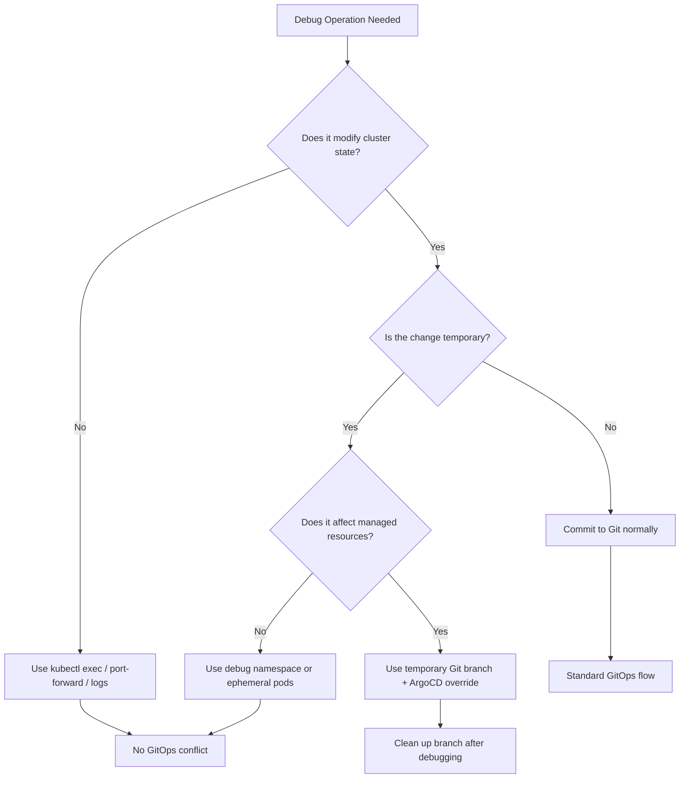

# How to Handle One-Off Debug Operations with GitOps

Author: [nawazdhandala](https://github.com/nawazdhandala)

Tags: ArgoCD, GitOps, Kubernetes, Debugging, DevOps

Description: Learn how to handle one-off debugging operations in a GitOps workflow without breaking your declarative state or causing configuration drift.

---

One of the biggest cultural shifts when adopting GitOps is learning to resist the urge to run quick imperative commands against your cluster. In traditional operations, you might SSH into a node, exec into a pod, or apply a quick patch to fix something. In GitOps, every change should flow through Git. But debugging is inherently exploratory and ad-hoc. So how do you reconcile the two?

This guide walks through practical strategies for handling one-off debug operations in a GitOps world without compromising your source of truth.

## The Tension Between Debugging and GitOps

GitOps demands that your Git repository is the single source of truth for your cluster state. ArgoCD (or any GitOps controller) continuously reconciles the live cluster against what is declared in Git. When you run an imperative command - like `kubectl exec` or `kubectl apply` - you create a divergence that the controller will either revert or flag as out-of-sync.

This creates a real friction point. Debugging often requires:

- Exec-ing into containers to inspect logs or filesystem state
- Running ephemeral pods for network debugging
- Temporarily scaling replicas for load testing
- Applying quick resource patches to test a hypothesis

None of these operations belong in your Git repository permanently. So how do you handle them?

## Strategy 1: Use Ephemeral Debug Pods

Kubernetes natively supports ephemeral debug containers and one-off pods. These do not conflict with your GitOps state because they are not declared in your repository.

You can spin up a debug pod using kubectl debug:

```bash
# Attach a debug container to a running pod
kubectl debug -it my-app-pod-abc123 \
  --image=nicolaka/netshoot \
  --target=my-app-container \
  -n production

# Or create a standalone debug pod
kubectl run debug-shell --rm -it \
  --image=nicolaka/netshoot \
  --namespace=production \
  -- /bin/bash
```

These pods are transient. They do not appear in your Git manifests, and ArgoCD will not try to prune them (unless you have very aggressive prune policies). The key principle: if it is not in Git, ArgoCD does not manage it.

## Strategy 2: Use ArgoCD Resource Exclusions

ArgoCD lets you exclude certain resources from its management scope. This is useful when you need to create temporary resources for debugging without triggering sync drift.

Configure resource exclusions in the ArgoCD ConfigMap:

```yaml
apiVersion: v1
kind: ConfigMap
metadata:
  name: argocd-cm
  namespace: argocd
data:
  resource.exclusions: |
    - apiGroups:
        - ""
      kinds:
        - Pod
      clusters:
        - "*"
      # Exclude pods with a specific label
    - apiGroups:
        - "batch"
      kinds:
        - Job
      clusters:
        - "*"
```

With this configuration, standalone Pods and Jobs are excluded from ArgoCD tracking. You can create debug Jobs and Pods without worrying about sync status.

A more targeted approach is to use annotations:

```yaml
apiVersion: v1
kind: Pod
metadata:
  name: debug-session
  annotations:
    argocd.argoproj.io/compare-options: IgnoreExtraneous
spec:
  containers:
    - name: debug
      image: nicolaka/netshoot
      command: ["sleep", "3600"]
```

The `IgnoreExtraneous` annotation tells ArgoCD to ignore this resource during comparison, so it will not show up as out-of-sync.

## Strategy 3: Create a Dedicated Debug Namespace

A clean pattern is to have a dedicated namespace for debug operations that ArgoCD does not manage at all.

```bash
# Create a namespace that ArgoCD does not watch
kubectl create namespace debug-zone
kubectl label namespace debug-zone argocd.argoproj.io/managed-by-
```

Then configure your ArgoCD project to exclude this namespace:

```yaml
apiVersion: argoproj.io/v1alpha1
kind: AppProject
metadata:
  name: production
  namespace: argocd
spec:
  description: Production workloads
  sourceRepos:
    - 'https://github.com/myorg/gitops-repo'
  destinations:
    - namespace: 'production'
      server: 'https://kubernetes.default.svc'
    # debug-zone is NOT listed as a destination
  namespaceResourceWhitelist:
    - group: ''
      kind: '*'
```

Now engineers can freely create debug resources in the `debug-zone` namespace without any GitOps interference.

## Strategy 4: Temporary Git Branches for Exploratory Changes

When your debug operation requires actual changes to deployed resources (not just ephemeral pods), use a temporary Git branch:

```bash
# Create a debug branch
git checkout -b debug/investigate-memory-leak

# Make your temporary changes
# For example, add resource limits or enable verbose logging
```

Update the deployment manifest temporarily:

```yaml
apiVersion: apps/v1
kind: Deployment
metadata:
  name: my-app
spec:
  template:
    spec:
      containers:
        - name: my-app
          image: myorg/my-app:v1.2.3
          env:
            - name: LOG_LEVEL
              value: "debug"  # Temporarily enable debug logging
          resources:
            limits:
              memory: "2Gi"  # Increased for heap dump
```

Point your ArgoCD Application temporarily at the debug branch:

```bash
argocd app set my-app --revision debug/investigate-memory-leak
```

After debugging, revert the ArgoCD Application to the main branch and delete the debug branch:

```bash
argocd app set my-app --revision main
git branch -d debug/investigate-memory-leak
git push origin --delete debug/investigate-memory-leak
```

This approach keeps everything in Git (satisfying audit requirements) while making it clear these are temporary changes.

## Strategy 5: ArgoCD Resource Actions for Safe Imperative Operations

ArgoCD supports custom resource actions that let you perform common operations through the UI or CLI without leaving the GitOps workflow.

For example, you can restart a deployment:

```bash
# Restart a deployment through ArgoCD
argocd app actions run my-app restart --kind Deployment --resource-name my-app
```

This triggers a rollout restart by updating the pod template annotation, which is a safe operation that does not create drift because ArgoCD is the one performing it.

## Strategy 6: Use Port-Forwarding Instead of SSH

Many debug operations that traditionally required SSH can be handled with port-forwarding:

```bash
# Forward a debug port from a pod
kubectl port-forward pod/my-app-pod-abc123 8080:8080 -n production

# Forward to a service
kubectl port-forward svc/my-app 9090:9090 -n production
```

Port-forwarding creates no state change in the cluster, so it is completely compatible with GitOps.

## Workflow Diagram

Here is a decision tree for handling debug operations in a GitOps environment:



## Best Practices for Debug Operations in GitOps

1. **Set TTLs on debug resources.** Use `ttlSecondsAfterFinished` on Jobs and set timeouts on debug pods so they auto-clean.

2. **Log your debug sessions.** Even though debug operations are temporary, keep a record. A simple approach is to create a debug log entry in your team's incident tracking.

3. **Use RBAC to control imperative access.** Not everyone should be able to run arbitrary commands against production. Use Kubernetes RBAC to limit who can create pods in the debug namespace.

4. **Configure ArgoCD self-heal thoughtfully.** If self-heal is enabled, any manual change to a managed resource will be automatically reverted. This is usually good, but be aware of it when debugging.

```yaml
apiVersion: argoproj.io/v1alpha1
kind: Application
metadata:
  name: my-app
spec:
  syncPolicy:
    automated:
      selfHeal: true  # Manual changes will be reverted
      prune: true
```

5. **Use ArgoCD sync windows.** If you need to debug during a specific time window without ArgoCD reverting your changes, configure a sync window to block automatic syncs.

```yaml
apiVersion: argoproj.io/v1alpha1
kind: AppProject
metadata:
  name: production
spec:
  syncWindows:
    - kind: deny
      schedule: '* * * * *'
      duration: 2h
      manualSync: true  # Still allow manual syncs
```

## Monitoring Debug Operations with OneUptime

When running debug operations in production, it is critical to have observability in place. [OneUptime](https://oneuptime.com/blog/post/2026-02-06-monitor-argocd-deployments-opentelemetry/view) can help you monitor the impact of your debug sessions on application health and catch any unintended side effects in real time.

## Conclusion

Debugging in a GitOps world does not mean you have to commit every temporary change to Git. The key is to use patterns that either exist outside the GitOps-managed scope (ephemeral pods, debug namespaces) or flow through Git temporarily (debug branches). By combining these strategies with proper RBAC and ArgoCD configuration, you can maintain the integrity of your GitOps workflow while still being effective at troubleshooting production issues.
