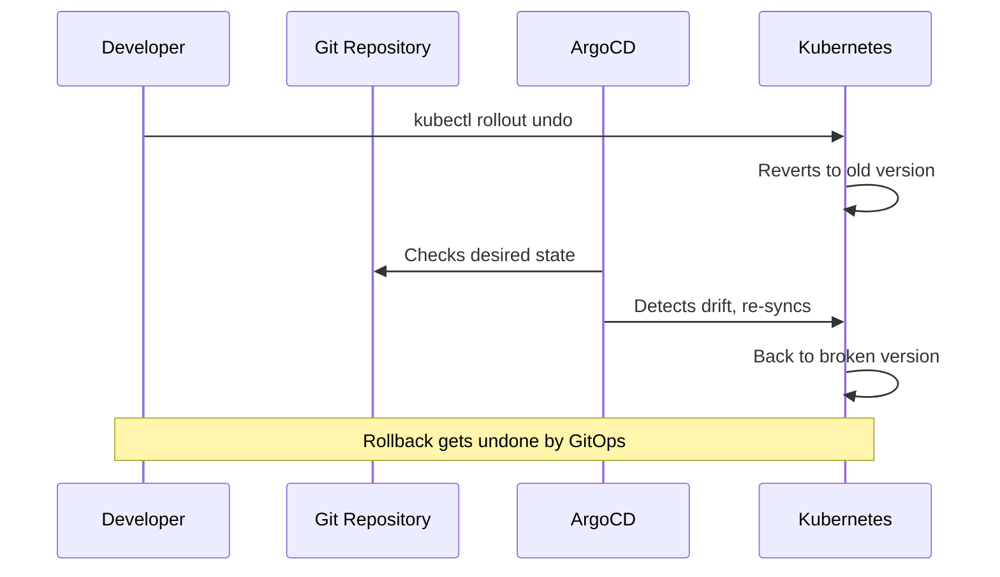
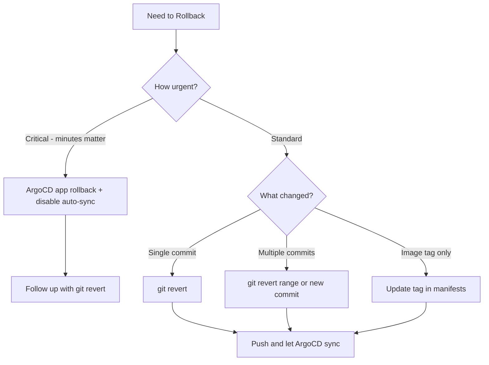

# How to Handle Rollbacks in a GitOps Paradigm

Author: [nawazdhandala](https://github.com/nawazdhandala)

Tags: ArgoCD, GitOps, Kubernetes, Rollback, Deployment

Description: Learn the principles and practical approaches for implementing rollbacks in a GitOps paradigm using Git revert, history, and ArgoCD strategies.

---

Rollbacks are one of those things that seem straightforward until you add GitOps to the picture. In traditional deployments, you might just run `kubectl rollout undo` and call it a day. But in GitOps, the cluster state must always reflect what is in Git. So rolling back means more than just reverting Kubernetes resources - it means reverting your Git history too.

This guide covers the different rollback strategies available in a GitOps paradigm and when to use each one.

## Why Traditional Rollbacks Break GitOps

In a standard Kubernetes workflow, rollbacks work by reverting to a previous ReplicaSet revision:

```bash
# Traditional rollback - works, but breaks GitOps
kubectl rollout undo deployment/my-app -n production
```

The problem is that this creates an immediate discrepancy between your Git repository (which still points to the new version) and your cluster (which now runs the old version). ArgoCD will detect this as "OutOfSync" and, if auto-sync is enabled, will push the new version right back.



This is exactly the scenario that confuses teams new to GitOps. The fix is to make your rollback flow through Git first.

## Strategy 1: Git Revert (The Preferred Approach)

The cleanest rollback in GitOps is a `git revert`. This creates a new commit that undoes the changes from a previous commit, and the forward-moving Git history is preserved.

```bash
# Find the commit that introduced the bad change
git log --oneline -10

# Output:
# a1b2c3d Update my-app to v2.1.0
# e4f5g6h Add monitoring config
# i7j8k9l Update my-app to v2.0.0

# Revert the bad deployment
git revert a1b2c3d --no-edit

# Push the revert commit
git push origin main
```

ArgoCD picks up the revert commit and syncs the cluster back to the previous state. This approach has several advantages:

- The Git history is preserved and auditable
- No force pushes needed
- ArgoCD handles the rollback naturally through its sync loop
- Other changes (like the monitoring config) are not affected

## Strategy 2: ArgoCD Application History Rollback

ArgoCD maintains a history of application syncs. You can use this for quick rollbacks while still maintaining Git as the source of truth.

```bash
# View application sync history
argocd app history my-app

# Output:
# ID  DATE                 REVISION
# 3   2026-02-26 10:30:00  a1b2c3d (main)
# 2   2026-02-25 14:00:00  i7j8k9l (main)
# 1   2026-02-24 09:00:00  m0n1o2p (main)

# Roll back to a previous sync
argocd app rollback my-app 2
```

Important caveat: this rollback is temporary if auto-sync is enabled. ArgoCD will show the app as "OutOfSync" because the live state no longer matches the latest Git state. You should follow up with a `git revert` to make the rollback permanent.

A practical workflow combines both:

```bash
# Step 1: Immediately roll back using ArgoCD history (fast)
argocd app rollback my-app 2

# Step 2: Disable auto-sync temporarily
argocd app set my-app --sync-policy none

# Step 3: Revert the bad commit in Git (permanent fix)
git revert a1b2c3d --no-edit
git push origin main

# Step 4: Re-enable auto-sync
argocd app set my-app --sync-policy automated
```

## Strategy 3: Image Tag Rollback

When the issue is specifically a bad container image, you can roll back just the image tag in your manifests:

```yaml
# Before (broken)
apiVersion: apps/v1
kind: Deployment
metadata:
  name: my-app
spec:
  template:
    spec:
      containers:
        - name: my-app
          image: myorg/my-app:v2.1.0  # This version has a bug

# After (rolled back)
apiVersion: apps/v1
kind: Deployment
metadata:
  name: my-app
spec:
  template:
    spec:
      containers:
        - name: my-app
          image: myorg/my-app:v2.0.0  # Reverted to last known good
```

Commit and push this change:

```bash
git add deployments/my-app/deployment.yaml
git commit -m "Rollback my-app to v2.0.0 due to memory leak in v2.1.0"
git push origin main
```

This is a forward-moving change in Git that achieves a rollback in the cluster.

## Strategy 4: Helm Release Rollback

If you use Helm charts managed by ArgoCD, you cannot use `helm rollback` directly because ArgoCD manages the release. Instead, update the Helm values in your Git repository:

```yaml
# values-production.yaml
image:
  repository: myorg/my-app
  tag: v2.0.0  # Rolled back from v2.1.0

replicaCount: 3

resources:
  limits:
    memory: 512Mi
    cpu: 500m
```

For Helm charts with version pinning:

```yaml
# ArgoCD Application manifest
apiVersion: argoproj.io/v1alpha1
kind: Application
metadata:
  name: my-app
spec:
  source:
    chart: my-app
    repoURL: https://charts.myorg.com
    targetRevision: 1.4.2  # Rolled back from 1.5.0
    helm:
      valueFiles:
        - values-production.yaml
```

## Strategy 5: Kustomize Overlay Rollback

For Kustomize-based deployments, rollbacks typically involve reverting an overlay change:

```yaml
# kustomization.yaml in the production overlay
apiVersion: kustomize.config.k8s.io/v1beta1
kind: Kustomization
resources:
  - ../../base
images:
  - name: myorg/my-app
    newTag: v2.0.0  # Reverted from v2.1.0
patches:
  - target:
      kind: Deployment
      name: my-app
    patch: |-
      - op: replace
        path: /spec/replicas
        value: 3
```

## Automating Rollbacks with ArgoCD and Analysis Runs

For teams that want automated rollbacks, ArgoCD can integrate with Argo Rollouts to automatically roll back based on metric analysis:

```yaml
apiVersion: argoproj.io/v1alpha1
kind: Rollout
metadata:
  name: my-app
spec:
  strategy:
    canary:
      canaryService: my-app-canary
      stableService: my-app-stable
      steps:
        - setWeight: 20
        - pause: { duration: 5m }
        - analysis:
            templates:
              - templateName: success-rate
        - setWeight: 50
        - pause: { duration: 5m }
        - analysis:
            templates:
              - templateName: success-rate
        - setWeight: 100
---
apiVersion: argoproj.io/v1alpha1
kind: AnalysisTemplate
metadata:
  name: success-rate
spec:
  metrics:
    - name: success-rate
      interval: 60s
      successCondition: result[0] >= 0.95
      provider:
        prometheus:
          address: http://prometheus.monitoring:9090
          query: |
            sum(rate(http_requests_total{status=~"2.*",app="my-app"}[5m]))
            /
            sum(rate(http_requests_total{app="my-app"}[5m]))
```

If the success rate drops below 95%, Argo Rollouts automatically aborts the rollout and reverts to the stable version.

## Rollback Decision Matrix

Here is a quick reference for choosing your rollback strategy:



## Best Practices for GitOps Rollbacks

1. **Always use git revert, never git reset --hard.** Revert creates a new commit, preserving history. Reset rewrites history and causes problems with shared branches.

2. **Tag known-good states.** Before major deployments, tag your Git repository so you have clear rollback targets.

```bash
git tag -a pre-v2.1.0-deploy -m "Known good state before v2.1.0"
git push origin pre-v2.1.0-deploy
```

3. **Practice rollbacks regularly.** Include rollback drills in your team's routine. A rollback that has never been tested is a rollback that might fail when you need it most.

4. **Monitor with OneUptime.** Track your deployment health and mean time to recovery. [OneUptime](https://oneuptime.com/blog/post/2026-02-06-monitor-argocd-deployments-opentelemetry/view) gives you the observability needed to detect issues quickly and know when a rollback is necessary.

5. **Document your rollback procedure.** Even with GitOps making rollbacks more systematic, having a runbook saves time during incidents.

## Conclusion

Rollbacks in GitOps are fundamentally about moving Git backward (or forward to a reverted state) and letting the reconciliation loop handle the rest. The key principle is that the cluster follows Git, so your rollback must start in Git. Combine `git revert` for permanent rollbacks with ArgoCD history for emergency speed, and you have a solid rollback strategy that maintains the integrity of your GitOps workflow.
