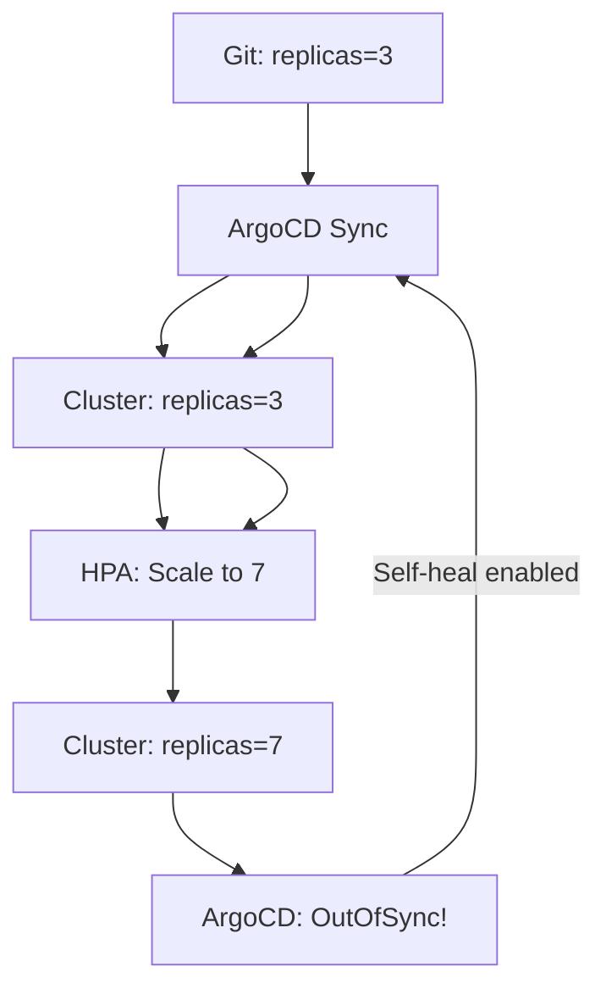

# How to Handle Autoscaler vs GitOps Conflicts

Author: [nawazdhandala](https://github.com/nawazdhandala)

Tags: ArgoCD, GitOps, Kubernetes, Autoscaling, Conflict Resolution

Description: Learn how to resolve the fundamental conflict between Kubernetes autoscalers and ArgoCD GitOps where both try to control the same resource fields.

---

There is a fundamental tension at the heart of running autoscalers with GitOps. GitOps says the Git repository is the single source of truth for cluster state. Autoscalers say the cluster should dynamically adjust itself based on real-time conditions. When both try to control the same fields - replica counts, resource requests, pod specs - you get a conflict that can cause instability, resource waste, or outages.

## Understanding the Conflict

The conflict manifests in several ways:



This creates a loop. ArgoCD sets replicas to 3 from Git. HPA scales to 7 based on load. ArgoCD detects the diff and syncs back to 3. HPA immediately scales back to 7. The pods keep getting created and destroyed.

Even without self-heal, the application shows as permanently OutOfSync, which buries real configuration drift under autoscaler noise. Your team learns to ignore OutOfSync status, which defeats the purpose of GitOps monitoring.

## The Fields That Conflict

Different autoscalers modify different fields:

| Autoscaler | Modified Fields | Conflict Level |
|-----------|----------------|---------------|
| HPA | `.spec.replicas` | High |
| VPA | `.spec.template.spec.containers[].resources` | High |
| KEDA | `.spec.replicas`, labels, annotations | High |
| Cluster Autoscaler | Node-level (no pod manifest conflict) | None |
| Argo Rollouts | `.spec.replicas`, rollout status | Medium |

## Strategy 1: Remove Conflicting Fields from Git

The cleanest approach is to not manage the autoscaler-controlled fields in Git at all:

```yaml
# deployment.yaml - No replicas field, no resource requests
apiVersion: apps/v1
kind: Deployment
metadata:
  name: backend-api
spec:
  # replicas: intentionally omitted (HPA controls this)
  selector:
    matchLabels:
      app: backend-api
  template:
    metadata:
      labels:
        app: backend-api
    spec:
      containers:
        - name: api
          image: myorg/backend-api:v2.3.5
          ports:
            - containerPort: 8080
          # resources: intentionally omitted (VPA controls this)
```

The autoscaler configurations in Git define the bounds:

```yaml
# hpa.yaml - This IS managed by Git
apiVersion: autoscaling/v2
kind: HorizontalPodAutoscaler
metadata:
  name: backend-api
spec:
  scaleTargetRef:
    apiVersion: apps/v1
    kind: Deployment
    name: backend-api
  minReplicas: 3       # Git controls the minimum
  maxReplicas: 20      # Git controls the maximum
  metrics:
    - type: Resource
      resource:
        name: cpu
        target:
          type: Utilization
          averageUtilization: 70
```

Git controls the autoscaling policy. The autoscaler controls the actual values within those bounds.

The downside is that without resource requests in Git, new pods might not get scheduled properly. The VPA admission controller can set initial values, but there is a bootstrapping problem on first deploy.

A practical compromise: keep resource requests in Git as initial values but tell ArgoCD to ignore them:

```yaml
# deployment.yaml - Has resources for bootstrapping
spec:
  template:
    spec:
      containers:
        - name: api
          resources:
            requests:
              cpu: 200m      # Initial value, VPA will adjust
              memory: 256Mi  # Initial value, VPA will adjust
            limits:
              cpu: "2"       # Hard limit stays in Git
              memory: 2Gi    # Hard limit stays in Git
```

## Strategy 2: ignoreDifferences

Tell ArgoCD to exclude specific fields from comparison:

```yaml
apiVersion: argoproj.io/v1alpha1
kind: Application
metadata:
  name: backend-api
spec:
  source:
    repoURL: https://github.com/myorg/backend-api-config
    targetRevision: main
    path: overlays/production
  ignoreDifferences:
    # Ignore HPA-managed replica count
    - group: apps
      kind: Deployment
      jsonPointers:
        - /spec/replicas

    # Ignore VPA-managed resource requests
    - group: apps
      kind: Deployment
      jqPathExpressions:
        - .spec.template.spec.containers[].resources.requests

    # Ignore KEDA-added labels
    - group: apps
      kind: Deployment
      jqPathExpressions:
        - .metadata.labels["scaledobject.keda.sh/name"]
        - .metadata.annotations["scaledobject.keda.sh/name"]

  syncPolicy:
    automated:
      selfHeal: true
      prune: true
```

This is the most common approach because it is explicit and targeted. You keep values in Git for documentation and bootstrapping, but ArgoCD does not fight the autoscaler.

## Strategy 3: Server-Side Diff with Field Ownership

ArgoCD supports server-side diff, which uses Kubernetes field ownership to determine what to compare:

```yaml
apiVersion: argoproj.io/v1alpha1
kind: Application
metadata:
  name: backend-api
  annotations:
    argocd.argoproj.io/compare-options: ServerSideDiff=true
spec:
  ignoreDifferences:
    - group: apps
      kind: Deployment
      managedFieldsManagers:
        - kube-controller-manager    # HPA changes
        - vpa-admission-controller   # VPA changes
        - keda-operator              # KEDA changes
```

With server-side diff, ArgoCD only compares fields that it owns (managed by `argocd-application-controller`). Fields managed by other controllers are ignored. This is more dynamic than listing specific field paths because it automatically handles any field the autoscaler touches.

## Strategy 4: Separate Applications

Split autoscaler-managed workloads into separate ArgoCD Applications:

```yaml
# Application 1: Configuration (managed by ArgoCD)
apiVersion: argoproj.io/v1alpha1
kind: Application
metadata:
  name: backend-api-config
spec:
  source:
    path: manifests/config  # Contains ConfigMaps, Secrets, Services
  syncPolicy:
    automated:
      selfHeal: true

---
# Application 2: Workloads (loose tracking)
apiVersion: argoproj.io/v1alpha1
kind: Application
metadata:
  name: backend-api-workloads
spec:
  source:
    path: manifests/workloads  # Contains Deployments, HPAs
  ignoreDifferences:
    - group: apps
      kind: Deployment
      jsonPointers:
        - /spec/replicas
        - /spec/template/spec/containers/0/resources
  syncPolicy:
    automated:
      selfHeal: false  # Don't auto-fix workload drift
```

The config Application has strict self-heal. The workloads Application is looser, allowing autoscalers to do their thing.

## Handling Argo Rollouts with Autoscaling

If you use Argo Rollouts instead of standard Deployments, the conflict extends to rollout-specific fields:

```yaml
apiVersion: argoproj.io/v1alpha1
kind: Application
metadata:
  name: backend-api
spec:
  ignoreDifferences:
    - group: argoproj.io
      kind: Rollout
      jsonPointers:
        - /spec/replicas
        - /status
```

Argo Rollouts has native HPA support. It pauses the HPA during rollouts to prevent interference:

```yaml
apiVersion: argoproj.io/v1alpha1
kind: Rollout
metadata:
  name: backend-api
spec:
  strategy:
    canary:
      scaleDownDelaySeconds: 30
      # HPA is paused during canary analysis
      dynamicStableScale: true
```

## Monitoring for Conflict Symptoms

Set up alerts to detect autoscaler vs GitOps conflicts:

```yaml
# Prometheus alerting rules
apiVersion: monitoring.coreos.com/v1
kind: PrometheusRule
metadata:
  name: autoscaler-gitops-conflicts
spec:
  groups:
    - name: autoscaler-conflicts
      rules:
        # Alert when replicas oscillate rapidly
        - alert: ReplicaFlapping
          expr: |
            changes(kube_deployment_spec_replicas[10m]) > 5
          for: 5m
          labels:
            severity: warning
          annotations:
            summary: "Deployment {{ $labels.deployment }} replicas are flapping"
            description: "Replicas changed more than 5 times in 10 minutes. Check for autoscaler vs GitOps conflicts."

        # Alert when ArgoCD sync frequency is abnormally high
        - alert: ExcessiveArgoCDSyncs
          expr: |
            increase(argocd_app_sync_total[10m]) > 3
          for: 5m
          labels:
            severity: warning
          annotations:
            summary: "Application {{ $labels.name }} syncing excessively"
            description: "More than 3 syncs in 10 minutes may indicate a conflict loop."
```

## Global Configuration for Organizations

For organizations with many services, set ignore rules at the ArgoCD project level:

```yaml
apiVersion: argoproj.io/v1alpha1
kind: AppProject
metadata:
  name: production-services
spec:
  description: Production services with autoscaling
  sourceRepos:
    - "*"
  destinations:
    - namespace: production
      server: "*"
```

And in argocd-cm, set global resource customizations:

```yaml
apiVersion: v1
kind: ConfigMap
metadata:
  name: argocd-cm
  namespace: argocd
data:
  # Global ignore for all Deployments
  resource.compareoptions: |
    ignoreAggregatedRoles: true

  resource.customizations.ignoreDifferences.apps_Deployment: |
    jqPathExpressions:
      - .spec.replicas
```

This applies to all Applications, so every Deployment's replica count is ignored globally. This is convenient but removes the ability to catch unintended replica changes that are not from autoscalers.

## Decision Matrix

| Scenario | Recommended Strategy |
|----------|---------------------|
| HPA only, few services | ignoreDifferences on replicas |
| HPA + VPA, many services | Server-side diff with field managers |
| KEDA with scale-to-zero | ignoreDifferences + custom health check |
| Multiple autoscalers | Remove fields from Git + autoscaler configs define bounds |
| Argo Rollouts + HPA | Rollout native HPA support + ignoreDifferences |

## Summary

The autoscaler vs GitOps conflict is a fundamental design challenge, not a bug. The solution is to clearly define what Git controls (autoscaling policies, resource bounds, deployment configuration) and what autoscalers control (actual replica counts, runtime resource requests). Use ignoreDifferences for targeted field exclusion, server-side diff for ownership-based exclusion, or remove conflicting fields from Git entirely. Monitor for conflict symptoms like replica flapping and excessive syncs. The goal is a system where Git is still the source of truth for intent (how the service should autoscale) while the cluster manages the runtime reality (what values the autoscaler sets right now).
