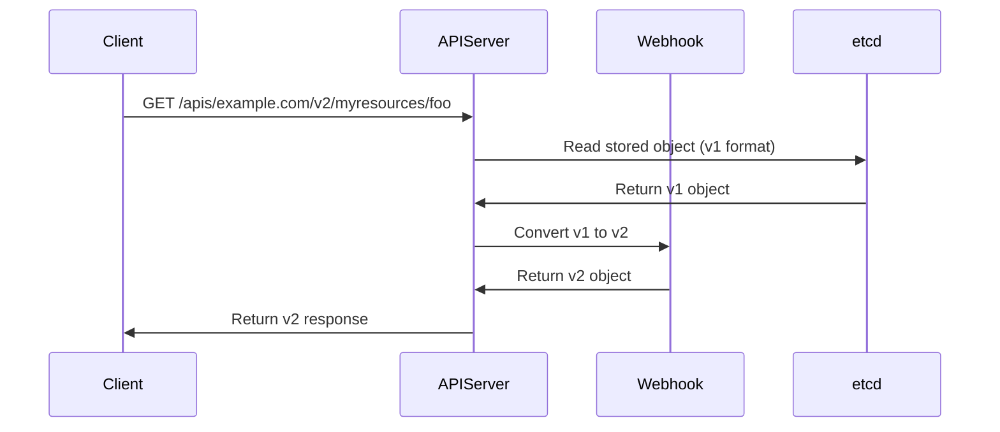

# How to Handle CRD Conversion Webhooks with ArgoCD

Author: [nawazdhandala](https://github.com/nawazdhandala)

Tags: ArgoCD, GitOps, Kubernetes, CRD, Webhooks

Description: Learn how to deploy and manage CRD conversion webhooks with ArgoCD to handle multi-version custom resources safely during upgrades.

---

When you serve multiple versions of a CRD, Kubernetes needs a way to convert between them. Conversion webhooks handle this translation, turning a v1 resource into a v2 format (and back) on the fly. Managing these webhooks with ArgoCD introduces ordering challenges because the webhook service must be running before the CRD references it. This guide walks through the full setup.

## What Conversion Webhooks Do

When a client requests a resource in a version different from the stored version, the API server calls the conversion webhook to translate the object. For example, if a resource is stored as v1 but a client requests v2, the API server sends the v1 object to the webhook and expects a v2 object back.



## The Ordering Challenge with ArgoCD

The conversion webhook setup involves three components that must deploy in the right order:

1. **Webhook Service** - The deployment and service that runs the conversion logic
2. **TLS certificates** - The webhook needs TLS, and the CRD needs the CA bundle
3. **CRD with conversion config** - The CRD spec that references the webhook

If ArgoCD tries to sync all three at once, it can fail because the CRD references a service that does not exist yet, or the webhook does not have its certificates.

## Setting Up the Webhook Deployment

First, deploy the conversion webhook service. This goes in the lowest sync wave:

```yaml
# Wave -3: Namespace
apiVersion: v1
kind: Namespace
metadata:
  name: my-operator
  annotations:
    argocd.argoproj.io/sync-wave: "-3"

---
# Wave -2: Webhook Deployment
apiVersion: apps/v1
kind: Deployment
metadata:
  name: crd-converter
  namespace: my-operator
  annotations:
    argocd.argoproj.io/sync-wave: "-2"
spec:
  replicas: 2
  selector:
    matchLabels:
      app: crd-converter
  template:
    metadata:
      labels:
        app: crd-converter
    spec:
      containers:
        - name: converter
          image: myorg/crd-converter:v1.2.0
          ports:
            - containerPort: 8443
              name: webhook
          volumeMounts:
            - name: tls
              mountPath: /etc/webhook/certs
              readOnly: true
          readinessProbe:
            httpGet:
              path: /healthz
              port: 8443
              scheme: HTTPS
            initialDelaySeconds: 5
            periodSeconds: 10
      volumes:
        - name: tls
          secret:
            secretName: crd-converter-tls

---
# Wave -2: Webhook Service
apiVersion: v1
kind: Service
metadata:
  name: crd-converter
  namespace: my-operator
  annotations:
    argocd.argoproj.io/sync-wave: "-2"
spec:
  selector:
    app: crd-converter
  ports:
    - port: 443
      targetPort: 8443
      protocol: TCP
```

## Managing TLS Certificates

Conversion webhooks require TLS. The most common approach is to use cert-manager to generate and rotate certificates automatically:

```yaml
# Wave -2: Certificate for the webhook
apiVersion: cert-manager.io/v1
kind: Certificate
metadata:
  name: crd-converter-tls
  namespace: my-operator
  annotations:
    argocd.argoproj.io/sync-wave: "-2"
spec:
  secretName: crd-converter-tls
  dnsNames:
    - crd-converter.my-operator.svc
    - crd-converter.my-operator.svc.cluster.local
  issuerRef:
    name: selfsigned-issuer
    kind: ClusterIssuer
  duration: 8760h   # 1 year
  renewBefore: 720h # Renew 30 days before expiry

---
# Self-signed issuer for webhook certs
apiVersion: cert-manager.io/v1
kind: ClusterIssuer
metadata:
  name: selfsigned-issuer
  annotations:
    argocd.argoproj.io/sync-wave: "-3"
spec:
  selfSigned: {}
```

If you do not use cert-manager, you can generate certificates with a Job in a PreSync hook:

```yaml
apiVersion: batch/v1
kind: Job
metadata:
  name: generate-webhook-certs
  namespace: my-operator
  annotations:
    argocd.argoproj.io/hook: PreSync
    argocd.argoproj.io/hook-delete-policy: HookSucceeded
spec:
  template:
    spec:
      serviceAccountName: cert-generator
      containers:
        - name: certgen
          image: registry.k8s.io/ingress-nginx/kube-webhook-certgen:v1.4.0
          args:
            - create
            - --host=crd-converter.my-operator.svc
            - --namespace=my-operator
            - --secret-name=crd-converter-tls
      restartPolicy: Never
```

## Deploying the CRD with Conversion Config

The CRD references the webhook and must deploy after the webhook service is running:

```yaml
# Wave 0: CRD with conversion webhook
apiVersion: apiextensions.k8s.io/v1
kind: CustomResourceDefinition
metadata:
  name: myresources.example.com
  annotations:
    argocd.argoproj.io/sync-wave: "0"
    cert-manager.io/inject-ca-from: my-operator/crd-converter-tls
spec:
  group: example.com
  names:
    kind: MyResource
    plural: myresources
  scope: Namespaced
  conversion:
    strategy: Webhook
    webhook:
      clientConfig:
        service:
          name: crd-converter
          namespace: my-operator
          path: /convert
          port: 443
        # caBundle is injected by cert-manager via the annotation above
      conversionReviewVersions:
        - v1
  versions:
    - name: v1
      served: true
      storage: false
      schema:
        openAPIV3Schema:
          type: object
          properties:
            spec:
              type: object
              properties:
                replicas:
                  type: integer
    - name: v2
      served: true
      storage: true
      schema:
        openAPIV3Schema:
          type: object
          properties:
            spec:
              type: object
              properties:
                replicas:
                  type: integer
                strategy:
                  type: string
```

The `cert-manager.io/inject-ca-from` annotation tells cert-manager to automatically inject the CA bundle into the CRD's webhook configuration. Without this, you would need to manually base64-encode the CA certificate and put it in `caBundle`.

## Handling the CA Bundle with ArgoCD

The CA bundle injection creates an interesting diff problem with ArgoCD. Cert-manager modifies the CRD's `spec.conversion.webhook.clientConfig.caBundle` field after ArgoCD syncs it. This causes ArgoCD to show the CRD as OutOfSync because the live state differs from Git (which has no caBundle).

Fix this with ignoreDifferences:

```yaml
apiVersion: argoproj.io/v1alpha1
kind: Application
metadata:
  name: my-operator
  namespace: argocd
spec:
  source:
    repoURL: https://github.com/myorg/my-operator
    path: deploy/
    targetRevision: main
  destination:
    server: https://kubernetes.default.svc
  ignoreDifferences:
    - group: apiextensions.k8s.io
      kind: CustomResourceDefinition
      jsonPointers:
        - /spec/conversion/webhook/clientConfig/caBundle
```

## Writing the Conversion Logic

The webhook service needs to handle `ConversionReview` requests. Here is a Go example showing the structure:

```go
// Handler for /convert endpoint
func handleConvert(w http.ResponseWriter, r *http.Request) {
    var review apiextensionsv1.ConversionReview
    if err := json.NewDecoder(r.Body).Decode(&review); err != nil {
        http.Error(w, err.Error(), http.StatusBadRequest)
        return
    }

    response := &apiextensionsv1.ConversionReview{
        TypeMeta: metav1.TypeMeta{
            Kind:       "ConversionReview",
            APIVersion: "apiextensions.k8s.io/v1",
        },
        Response: &apiextensionsv1.ConversionResponse{
            UID: review.Request.UID,
        },
    }

    var convertedObjects []runtime.RawExtension
    for _, obj := range review.Request.Objects {
        converted, err := convert(obj, review.Request.DesiredAPIVersion)
        if err != nil {
            response.Response.Result = metav1.Status{
                Status:  "Failure",
                Message: err.Error(),
            }
            json.NewEncoder(w).Encode(response)
            return
        }
        convertedObjects = append(convertedObjects, converted)
    }

    response.Response.ConvertedObjects = convertedObjects
    response.Response.Result = metav1.Status{Status: "Success"}
    json.NewEncoder(w).Encode(response)
}
```

## Health Check for the Conversion Webhook

Add a custom health check so ArgoCD waits for the webhook to be ready before syncing the CRD:

```yaml
# In argocd-cm ConfigMap
resource.customizations.health.apps_Deployment: |
  hs = {}
  if obj.metadata.labels ~= nil and obj.metadata.labels["app"] == "crd-converter" then
    -- Stricter health check for webhook deployments
    if obj.status ~= nil then
      if obj.status.readyReplicas ~= nil and obj.status.readyReplicas >= 1 then
        hs.status = "Healthy"
        hs.message = "Webhook has ready replicas"
      else
        hs.status = "Progressing"
        hs.message = "Waiting for webhook replicas to be ready"
      end
    else
      hs.status = "Progressing"
      hs.message = "Waiting for deployment status"
    end
  end
  return hs
```

## Handling Failures During Sync

If the conversion webhook goes down during an ArgoCD sync, the API server cannot serve any requests for the CRD's resources. This can cascade into broad failures. Protect against this:

1. **Run multiple replicas** of the webhook service
2. **Set a PodDisruptionBudget** to prevent all replicas from being evicted:

```yaml
apiVersion: policy/v1
kind: PodDisruptionBudget
metadata:
  name: crd-converter-pdb
  namespace: my-operator
  annotations:
    argocd.argoproj.io/sync-wave: "-2"
spec:
  minAvailable: 1
  selector:
    matchLabels:
      app: crd-converter
```

3. **Set failurePolicy on the CRD** to handle webhook unavailability:

The CRD conversion configuration does not have a failurePolicy like admission webhooks. If the conversion webhook is unavailable, API requests for that resource type will fail. This is why high availability for the webhook service is critical.

## The Complete Sync Wave Order

Putting it all together, here is the recommended sync wave ordering:

```text
Wave -3: Namespace, ClusterIssuer (cert-manager prereqs)
Wave -2: Webhook Deployment, Service, Certificate, PDB
Wave -1: (wait for webhook to be healthy)
Wave  0: CRD with conversion config
Wave  1: Custom resources using the CRD
```

This ensures each component is healthy before the next wave begins, preventing the chicken-and-egg problem that makes conversion webhooks tricky with GitOps tools.

## Summary

CRD conversion webhooks add complexity to ArgoCD deployments because of the strict ordering requirements. The webhook service and its TLS certificates must be running before the CRD references them, and the CRD must be registered before custom resources can be created. Use sync waves to enforce this order, cert-manager to handle TLS certificates, and ignoreDifferences to prevent CA bundle injection from causing false OutOfSync states. Always run webhook services with multiple replicas and a PodDisruptionBudget to prevent outages during syncs.
