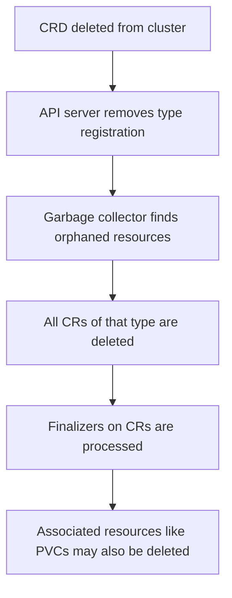

# How to Handle CRD Deletion Impact on ArgoCD Applications

Author: [nawazdhandala](https://github.com/nawazdhandala)

Tags: ArgoCD, GitOps, Kubernetes, CRDs, Resource Management

Description: Learn how to safely handle CRD deletion in ArgoCD to prevent cascade deletion of custom resources and avoid breaking your cluster.

---

Deleting a Custom Resource Definition from a Kubernetes cluster is one of the most destructive operations you can perform. When a CRD gets deleted, Kubernetes automatically garbage-collects every single custom resource of that type across all namespaces. If ArgoCD prunes a CRD during a sync, you could lose hundreds of resources in seconds. This guide covers how to protect yourself.

## The Cascade Deletion Problem

When Kubernetes removes a CRD, it triggers a cascade deletion. Every custom resource instance of that type is deleted. There is no undo, no confirmation, and no grace period for the resources themselves. The CRD acts as the type definition, and without it, the resources cannot exist.

Here is what happens in sequence:



This is especially dangerous with ArgoCD because automated pruning can delete CRDs without human intervention.

## How ArgoCD Can Accidentally Delete CRDs

There are several scenarios where ArgoCD might remove a CRD:

1. **Pruning enabled** - You remove the CRD manifest from Git, and ArgoCD prunes resources that no longer exist in Git.
2. **Application deletion** - You delete the ArgoCD Application, and its finalizer cleans up all managed resources including CRDs.
3. **Path change** - You change the source path in your Application spec, and ArgoCD sees the CRD as removed.
4. **Accidental commit** - Someone deletes the CRD file from the repo by mistake.

## Protecting CRDs from Pruning

The most important protection is the `Prune=false` annotation. Add this to every CRD managed by ArgoCD:

```yaml
apiVersion: apiextensions.k8s.io/v1
kind: CustomResourceDefinition
metadata:
  name: certificates.cert-manager.io
  annotations:
    argocd.argoproj.io/sync-options: Prune=false
spec:
  group: cert-manager.io
  names:
    kind: Certificate
    plural: certificates
  scope: Namespaced
  versions:
    - name: v1
      served: true
      storage: true
      schema:
        openAPIV3Schema:
          type: object
```

With `Prune=false`, ArgoCD will never delete this CRD during sync, even if you remove it from Git. The Application will show as OutOfSync, but the CRD stays in the cluster.

## Using Resource Exclusions

You can configure ArgoCD at the server level to exclude CRDs from management entirely:

```yaml
apiVersion: v1
kind: ConfigMap
metadata:
  name: argocd-cm
  namespace: argocd
data:
  resource.exclusions: |
    - apiGroups:
        - apiextensions.k8s.io
      kinds:
        - CustomResourceDefinition
      clusters:
        - "*"
```

This tells ArgoCD to completely ignore CRDs. They will not show up in Application views, will not be synced, and will not be pruned. The downside is you lose GitOps management of the CRDs themselves, so you need another process to manage them.

A more targeted approach is to exclude specific CRDs:

```yaml
data:
  resource.exclusions: |
    - apiGroups:
        - apiextensions.k8s.io
      kinds:
        - CustomResourceDefinition
      clusters:
        - "https://production-cluster.example.com"
```

## Preventing Application Deletion Cascade

When you delete an ArgoCD Application, its finalizer deletes all managed resources. For Applications that manage CRDs, you have two options.

Option 1: Remove the finalizer before deleting the Application:

```bash
# Remove the finalizer so deletion does not cascade
kubectl patch application my-operator -n argocd \
  --type json \
  -p '[{"op": "remove", "path": "/metadata/finalizers"}]'

# Now delete the Application safely
kubectl delete application my-operator -n argocd
```

Option 2: Use the non-cascading delete option in ArgoCD CLI:

```bash
# Delete the Application without deleting managed resources
argocd app delete my-operator --cascade=false
```

This removes the Application object but leaves all managed resources (including CRDs) in the cluster.

## Separating CRDs from Application Resources

A robust pattern is to manage CRDs in a dedicated Application with strict protection:

```yaml
apiVersion: argoproj.io/v1alpha1
kind: Application
metadata:
  name: platform-crds
  namespace: argocd
  # No finalizer - deleting this app should not delete CRDs
spec:
  project: default
  source:
    repoURL: https://github.com/myorg/platform-crds
    path: crds/
    targetRevision: main
  destination:
    server: https://kubernetes.default.svc
  syncPolicy:
    automated:
      prune: false      # Never prune CRDs
      selfHeal: true
    syncOptions:
      - CreateNamespace=false
      - PruneLast=true
```

Key settings for CRD Applications:
- `prune: false` prevents automatic deletion
- No finalizer on the Application metadata prevents cascade on Application deletion
- `selfHeal: true` restores CRDs if someone manually deletes them

## Handling Operator CRD Lifecycle

Many CRDs come from operators (cert-manager, Istio, Prometheus Operator). These operators often manage their own CRD lifecycle. When using ArgoCD to deploy operators, be careful about CRD ownership.

Helm charts commonly put CRDs in the `crds/` directory. ArgoCD handles Helm CRDs with `--skip-crds` by default in some configurations. Check your setup:

```yaml
apiVersion: argoproj.io/v1alpha1
kind: Application
metadata:
  name: cert-manager
spec:
  source:
    repoURL: https://charts.jetstack.io
    chart: cert-manager
    targetRevision: v1.14.0
    helm:
      parameters:
        - name: installCRDs
          value: "true"  # Let Helm manage CRDs
```

If you let Helm manage CRDs through the chart, ArgoCD tracks them as part of the Application. If you use the `crds/` directory approach, Helm only installs CRDs on first install and never updates or deletes them.

## Recovery After Accidental CRD Deletion

If a CRD does get deleted, here is your recovery path:

1. **Immediately recreate the CRD** - Apply the CRD manifest directly with kubectl to stop further damage.

```bash
kubectl apply -f crd-definition.yaml
```

2. **Restore custom resources from backup** - If you have Velero or another backup tool, restore the CRs.

```bash
velero restore create --from-backup daily-backup \
  --include-resources certificates.cert-manager.io
```

3. **If no backup exists** - Check if the resources are still in etcd. If the API server has not compacted yet, you might be able to recover using etcdctl.

4. **Sync with ArgoCD** - Once the CRD is back, trigger an ArgoCD sync to recreate custom resources from Git.

```bash
argocd app sync my-app --force
```

## Setting Up Alerts for CRD Changes

Use ArgoCD notifications to alert on CRD-related sync events:

```yaml
apiVersion: v1
kind: ConfigMap
metadata:
  name: argocd-notifications-cm
  namespace: argocd
data:
  trigger.on-crd-change: |
    - when: app.status.operationState.phase in ['Succeeded'] and
            app.status.resources[*].kind == 'CustomResourceDefinition'
      send: [slack-crd-alert]
  template.slack-crd-alert: |
    message: |
      CRD changes detected in application {{.app.metadata.name}}.
      Review the sync result immediately.
```

## Implementing a Safety Net with Admission Webhooks

For production clusters, consider a validating admission webhook that prevents CRD deletion:

```yaml
apiVersion: admissionregistration.k8s.io/v1
kind: ValidatingWebhookConfiguration
metadata:
  name: prevent-crd-deletion
webhooks:
  - name: protect-crds.example.com
    rules:
      - apiGroups: ["apiextensions.k8s.io"]
        apiVersions: ["v1"]
        operations: ["DELETE"]
        resources: ["customresourcedefinitions"]
    clientConfig:
      service:
        name: crd-protector
        namespace: kube-system
        path: /validate
    admissionReviewVersions: ["v1"]
    sideEffects: None
    failurePolicy: Fail
```

This webhook intercepts CRD deletion requests and can reject them unless specific conditions are met (like a required annotation or the request comes from an authorized service account).

## Summary

CRD deletion is a destructive operation that cascades to all custom resources. With ArgoCD, the biggest risks come from automated pruning and Application deletion finalizers. Protect your CRDs with `Prune=false` annotations, manage CRDs in dedicated Applications without finalizers, and consider cluster-level protections like admission webhooks. Always have a backup strategy for your custom resources, and set up alerting for any CRD-related changes in your cluster.
