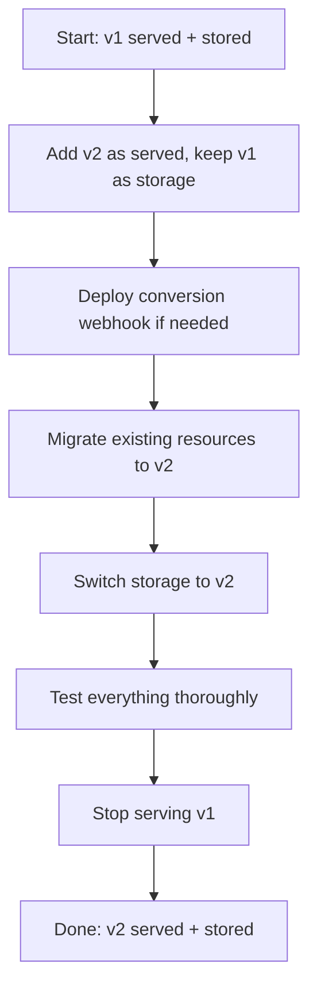

# How to Handle CRD Version Upgrades with ArgoCD

Author: [nawazdhandala](https://github.com/nawazdhandala)

Tags: ArgoCD, GitOps, Kubernetes, CRD, Upgrade

Description: Learn how to safely upgrade Custom Resource Definition versions in ArgoCD without breaking existing custom resources or losing data.

---

Upgrading CRD versions is one of the riskiest operations in a Kubernetes cluster. A bad CRD upgrade can break every custom resource that depends on it, potentially taking down critical infrastructure like service meshes, cert-manager, or monitoring stacks. ArgoCD adds some complexity to this because it wants to sync everything at once. Here is how to handle CRD version upgrades safely.

## Understanding CRD Versioning

Kubernetes CRDs support multiple versions simultaneously. When you define a CRD, you can serve multiple API versions while storing data in one version. This is the foundation that makes upgrades possible without downtime.

```yaml
apiVersion: apiextensions.k8s.io/v1
kind: CustomResourceDefinition
metadata:
  name: myresources.example.com
spec:
  group: example.com
  versions:
    - name: v1
      served: true
      storage: false  # Old version, still served but not stored
      schema:
        openAPIV3Schema:
          type: object
          properties:
            spec:
              type: object
              properties:
                replicas:
                  type: integer
    - name: v2
      served: true
      storage: true   # New version, this is where data is stored
      schema:
        openAPIV3Schema:
          type: object
          properties:
            spec:
              type: object
              properties:
                replicas:
                  type: integer
                strategy:
                  type: string  # New field in v2
  scope: Namespaced
  names:
    plural: myresources
    singular: myresource
    kind: MyResource
```

The key fields are `served` and `storage`. A version with `served: true` can be used by clients. The version with `storage: true` is how objects are stored in etcd. Only one version can be the storage version at any time.

## The Upgrade Flow

Here is the safe sequence for upgrading a CRD version with ArgoCD:



## Step 1: Add the New Version

First, update your CRD to serve both versions. Keep the old version as the storage version initially.

```yaml
apiVersion: apiextensions.k8s.io/v1
kind: CustomResourceDefinition
metadata:
  name: myresources.example.com
  annotations:
    argocd.argoproj.io/sync-wave: "-1"
spec:
  group: example.com
  versions:
    - name: v1
      served: true
      storage: true   # Still storage version
      schema:
        openAPIV3Schema:
          type: object
          properties:
            spec:
              type: object
              properties:
                replicas:
                  type: integer
    - name: v2
      served: true
      storage: false  # New version, served but not yet storing
      schema:
        openAPIV3Schema:
          type: object
          properties:
            spec:
              type: object
              properties:
                replicas:
                  type: integer
                strategy:
                  type: string
                  default: "RollingUpdate"
  scope: Namespaced
  names:
    plural: myresources
    singular: myresource
    kind: MyResource
```

Commit this to Git and let ArgoCD sync it. At this point, both v1 and v2 API endpoints work, but data is stored as v1.

## Step 2: Update Your Custom Resources

Once both versions are being served, update your custom resource manifests in Git to use the new version:

```yaml
# Before - using v1
apiVersion: example.com/v1
kind: MyResource
metadata:
  name: my-instance
spec:
  replicas: 3

# After - using v2
apiVersion: example.com/v2
kind: MyResource
metadata:
  name: my-instance
spec:
  replicas: 3
  strategy: "RollingUpdate"
```

## Step 3: Switch the Storage Version

After all custom resources have been updated to use v2, change the storage version:

```yaml
spec:
  group: example.com
  versions:
    - name: v1
      served: true     # Still serving v1 for backward compatibility
      storage: false   # No longer the storage version
    - name: v2
      served: true
      storage: true    # Now the storage version
```

## Step 4: Migrate Stored Objects

Even after switching the storage version, existing objects in etcd are still stored in the old format. You need to trigger a storage migration. The simplest way is to read and write back every object:

```yaml
# ArgoCD PostSync hook to migrate stored objects
apiVersion: batch/v1
kind: Job
metadata:
  name: migrate-myresources-to-v2
  annotations:
    argocd.argoproj.io/hook: PostSync
    argocd.argoproj.io/hook-delete-policy: HookSucceeded
spec:
  template:
    spec:
      serviceAccountName: crd-migrator
      containers:
        - name: migrator
          image: bitnami/kubectl:latest
          command:
            - /bin/sh
            - -c
            - |
              # Read each resource and write it back to trigger storage migration
              kubectl get myresources --all-namespaces -o json | \
                jq -c '.items[]' | \
                while read -r item; do
                  echo "$item" | kubectl apply -f -
                done
              echo "Migration complete"
      restartPolicy: Never
  backoffLimit: 3
```

## Handling ArgoCD Diff Detection During Upgrades

ArgoCD compares the live state against Git. During CRD upgrades, you might see false diffs because the API server returns objects in a different version than what is in Git. Handle this with ignoreDifferences:

```yaml
apiVersion: argoproj.io/v1alpha1
kind: Application
metadata:
  name: my-app
spec:
  ignoreDifferences:
    - group: example.com
      kind: MyResource
      jsonPointers:
        - /apiVersion
    - group: apiextensions.k8s.io
      kind: CustomResourceDefinition
      jsonPointers:
        - /status
  source:
    repoURL: https://github.com/myorg/my-app
    path: deploy/
    targetRevision: main
  destination:
    server: https://kubernetes.default.svc
```

## Using Server-Side Apply for CRD Updates

CRD updates can conflict when multiple controllers try to manage the same fields. Server-side apply handles this with field ownership tracking:

```yaml
apiVersion: apiextensions.k8s.io/v1
kind: CustomResourceDefinition
metadata:
  name: myresources.example.com
  annotations:
    argocd.argoproj.io/sync-options: ServerSideApply=true
```

This is especially important when upgrading operator-managed CRDs where both ArgoCD and the operator modify CRD fields.

## Breaking Changes Between Versions

Sometimes a version upgrade involves removing or renaming fields. This requires a conversion webhook that translates between versions:

```yaml
spec:
  conversion:
    strategy: Webhook
    webhook:
      clientConfig:
        service:
          name: my-converter
          namespace: my-system
          path: /convert
        caBundle: <base64-encoded-ca-cert>
      conversionReviewVersions:
        - v1
```

Deploy the conversion webhook before changing the CRD. Use sync waves to get the ordering right:

```yaml
# Wave 0: Deploy the conversion webhook service
# Wave 1: Update the CRD to reference the webhook
# Wave 2: Update custom resources to use new version
```

## Rollback Strategy

Always have a rollback plan. Before upgrading, back up your CRD and custom resources:

```bash
# Back up the CRD
kubectl get crd myresources.example.com -o yaml > crd-backup.yaml

# Back up all custom resources
kubectl get myresources --all-namespaces -o yaml > resources-backup.yaml
```

If something goes wrong during the upgrade, you can revert the Git commit and let ArgoCD sync the old version back. However, if the storage version has already been switched and objects migrated, a simple Git revert may not be enough - you may need to restore from backup.

## Testing CRD Upgrades Safely

Never upgrade CRDs directly in production. Use this workflow:

1. Test in a development cluster with ArgoCD
2. Run the upgrade in staging with production-like data
3. Verify all custom resources still work after the upgrade
4. Check that operators and controllers handle the new version
5. Only then apply to production

You can use ArgoCD's multi-cluster support to manage this progression. Have separate Applications for each environment and promote the CRD changes through your environment pipeline.

## Summary

CRD version upgrades with ArgoCD require careful planning. The safest approach is to add the new version first while keeping the old one, gradually migrate resources, then switch storage versions. Use sync waves to control ordering, ignoreDifferences to handle transient diffs, and PostSync hooks to automate storage migration. Always test CRD upgrades in non-production environments first, and keep backups of your CRDs and custom resources before any upgrade.
