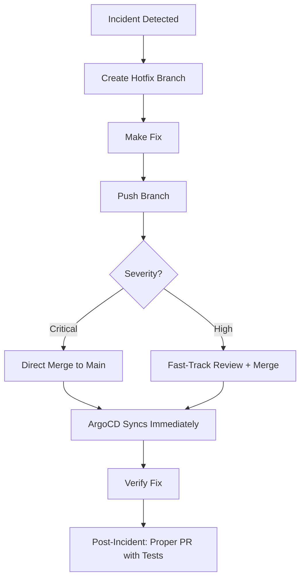

# How to Handle Hotfixes in a GitOps Workflow

Author: [nawazdhandala](https://github.com/nawazdhandala)

Tags: ArgoCD, GitOps, Kubernetes, Hotfix, Incident Response

Description: Learn how to deploy emergency hotfixes quickly in a GitOps workflow using ArgoCD without bypassing the declarative process or creating configuration drift.

---

It is 3 AM. Production is down. The fix is a one-line change to an environment variable. In a traditional setup, you would ssh into the server or run a quick kubectl command and be done in 30 seconds. But you use GitOps now. Every change goes through Git. Every change needs a pull request. Every PR needs a review.

Does GitOps mean you sit there waiting for a code review while production burns? Absolutely not. A well-designed GitOps workflow handles hotfixes quickly while maintaining the audit trail and declarative guarantees that make GitOps valuable. Here is how.

## The Hotfix Workflow

The key insight is that GitOps does not require slow processes. It requires changes to go through Git. Those two things are different. A hotfix through Git can be as fast as a kubectl command if you set up the workflow in advance.



## Setting Up a Fast Hotfix Path

### Pre-Configured Repository Access

Every on-call engineer needs push access to the GitOps repository. Do not discover this during an incident:

```bash
# Verify access works BEFORE you need it
git clone https://github.com/org/gitops-repo
cd gitops-repo
git checkout -b test-access
echo "test" > test.txt
git add test.txt && git commit -m "test access" && git push origin test-access
git push origin --delete test-access
```

### ArgoCD CLI Ready

On-call engineers should have the ArgoCD CLI configured and tested:

```bash
# Pre-configure ArgoCD access
argocd login argocd.internal.company.com --username oncall --password $ARGOCD_PASSWORD
argocd app list  # Verify access works
```

Store the ArgoCD credentials in a password manager accessible to on-call engineers.

### Webhook for Immediate Sync

By default, ArgoCD polls Git every 3 minutes. For hotfixes, you need faster detection. Configure a webhook so ArgoCD syncs immediately when changes are pushed:

```yaml
# argocd-cm ConfigMap
apiVersion: v1
kind: ConfigMap
metadata:
  name: argocd-cm
  namespace: argocd
data:
  # GitHub webhook secret
  webhook.github.secret: $webhook-github-secret
```

Set up the webhook in your GitHub repository settings pointing to `https://argocd.internal.company.com/api/webhook`.

If the webhook is not configured, manually trigger a sync:

```bash
argocd app sync my-app
```

## The 2-Minute Hotfix Process

Here is the actual sequence for deploying a hotfix in under 2 minutes:

```bash
# Step 1: Clone and branch (30 seconds)
git clone https://github.com/org/gitops-repo
cd gitops-repo
git checkout -b hotfix/incident-1234

# Step 2: Make the fix (15 seconds)
# Example: Fix an environment variable
yq e '(.spec.template.spec.containers[0].env[] | select(.name == "MAX_CONNECTIONS")).value = "200"' \
  -i apps/payment-api/production/deployment.yaml

# Step 3: Commit and push (15 seconds)
git add .
git commit -m "HOTFIX: Increase MAX_CONNECTIONS to 200 - Incident #1234"
git push origin hotfix/incident-1234

# Step 4: Fast-track merge (30 seconds)
gh pr create --title "HOTFIX: Incident #1234" --body "Emergency fix" --label hotfix
gh pr merge --squash  # If you have merge permissions

# Step 5: Trigger sync (15 seconds)
argocd app sync payment-api

# Step 6: Verify (15 seconds)
argocd app wait payment-api --health
```

Total time: Under 2 minutes with practice.

## Bypass Options for Critical Incidents

For truly critical incidents where even 2 minutes is too long, you have controlled bypass options:

### Option 1: Sync from a Branch

Tell ArgoCD to temporarily sync from your hotfix branch instead of waiting for a merge:

```bash
# Point ArgoCD to the hotfix branch
argocd app set payment-api --revision hotfix/incident-1234
argocd app sync payment-api

# After the incident, switch back to main
argocd app set payment-api --revision HEAD
```

This deploys the fix immediately from your branch. The PR review and merge happen afterward during the incident post-mortem.

### Option 2: ArgoCD Parameter Override

For simple value changes, use ArgoCD's parameter override:

```bash
# Override a Helm value directly
argocd app set payment-api --helm-set env.MAX_CONNECTIONS=200
argocd app sync payment-api

# After the incident, remove the override and update Git
argocd app unset payment-api --helm-set env.MAX_CONNECTIONS
```

This is the fastest option but creates a configuration that is not in Git. Document the override and commit the change to Git as soon as the immediate crisis is resolved.

### Option 3: kubectl with Documented Exception

As a last resort, you can use kubectl directly:

```bash
# Emergency kubectl - document everything
kubectl set env deployment/payment-api MAX_CONNECTIONS=200 -n production

# IMMEDIATELY create a follow-up task to commit this to Git
# ArgoCD will show OutOfSync - this is expected
```

This should be rare and always followed by a Git commit. If ArgoCD has self-heal enabled, it will revert the change, so you need to disable self-heal temporarily:

```bash
# Temporarily disable self-heal
argocd app set payment-api --self-heal=false

# Make the kubectl change
kubectl set env deployment/payment-api MAX_CONNECTIONS=200 -n production

# After committing the fix to Git, re-enable self-heal
argocd app set payment-api --self-heal=true
```

## Post-Hotfix Cleanup

After the incident is resolved, you must clean up:

1. **Ensure Git matches the cluster**: If you used parameter overrides or kubectl, commit the actual state to Git.

```bash
# Verify Git and cluster are in sync
argocd app get payment-api
# Status should be "Synced"
```

2. **Create a proper PR**: If the hotfix was merged without review, create a follow-up PR with tests and documentation.

3. **Remove temporary configurations**: Revert ArgoCD to tracking the main branch if you changed it.

4. **Write the incident report**: Document what happened, what the fix was, and what the permanent solution should be.

```markdown
## Incident #1234 Post-Mortem

### Timeline
- 03:00 - Alert fired: payment-api returning 500 errors
- 03:05 - On-call identified connection pool exhaustion
- 03:07 - Hotfix branch created, MAX_CONNECTIONS increased
- 03:08 - Hotfix merged and synced via ArgoCD
- 03:10 - Application healthy, errors stopped

### Root Cause
Database connection pool was set to 50 during load testing and never reverted. Traffic increase exceeded pool capacity.

### Permanent Fix
PR #456 adds connection pool sizing based on pod count and implements connection pool monitoring alerts.
```

## Setting Up Hotfix Guardrails

Prevent hotfix bypasses from becoming the default by establishing guardrails:

```yaml
# ArgoCD notification on parameter overrides
apiVersion: v1
kind: ConfigMap
metadata:
  name: argocd-notifications-cm
  namespace: argocd
data:
  trigger.on-parameter-override: |
    - when: app.status.operationState.syncResult.revision != app.spec.source.targetRevision
      send: [slack-alert]
  template.slack-alert: |
    message: |
      Application {{.app.metadata.name}} has a parameter override.
      Current revision: {{.app.status.operationState.syncResult.revision}}
      Expected revision: {{.app.spec.source.targetRevision}}
      Please ensure Git is updated to match.
```

Track hotfix frequency. If you are doing more than one hotfix per month, there is a process or quality issue to address.

For comprehensive incident monitoring that helps catch issues before they become hotfix emergencies, set up [ArgoCD health alerting](https://oneuptime.com/blog/post/2026-02-26-argocd-alerts-failed-syncs/view) with OneUptime.

## Summary

Hotfixes in GitOps do not have to be slow. Pre-configure repository access and ArgoCD CLI for on-call engineers. Set up webhooks for immediate sync detection. Use the 2-minute hotfix process for most incidents. For critical incidents, use branch-based sync or parameter overrides as controlled bypass options. Always follow up with proper Git commits, PR reviews, and incident documentation. The goal is to make the GitOps path fast enough that bypassing it is rarely necessary.
