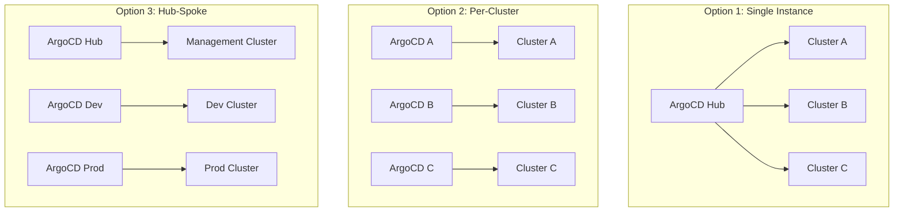

# How Many ArgoCD Instances Should I Run?

Author: [nawazdhandala](https://github.com/nawazdhandala)

Tags: ArgoCD, GitOps, Kubernetes, Architecture, Scaling

Description: Determine the right number of ArgoCD instances for your organization based on cluster count, team structure, security requirements, and operational considerations.

---

This is one of the most debated questions in the ArgoCD community. Should you run a single centralized ArgoCD instance that manages all your clusters? Or should every cluster have its own ArgoCD? Or something in between? The answer depends on your organization's size, security requirements, and operational maturity.

Let me break down the options with real-world considerations.

## The Options



## Option 1: Single Centralized Instance

One ArgoCD instance managing all clusters. This is the simplest starting point.

**How it works**: A single ArgoCD runs in a management cluster and uses cluster credentials to deploy to remote clusters. All teams use the same ArgoCD UI and API.

```yaml
# Register remote clusters
argocd cluster add staging-context --name staging
argocd cluster add production-context --name production

# Application targeting a remote cluster
apiVersion: argoproj.io/v1alpha1
kind: Application
metadata:
  name: my-app-production
  namespace: argocd
spec:
  destination:
    server: https://production-cluster:6443
    namespace: my-app
```

**Pros**:
- Simplest to set up and maintain
- Single UI for all deployments across all clusters
- Centralized RBAC and audit logging
- Easiest to enforce organization-wide policies

**Cons**:
- Single point of failure for all deployments
- Blast radius is the entire organization
- May not scale beyond 200 to 300 applications without tuning
- Network connectivity required to all target clusters
- Credential management becomes complex with many clusters

**Best for**: Small organizations with 1 to 5 clusters and fewer than 200 applications.

## Option 2: One Instance Per Cluster

Every cluster runs its own ArgoCD instance that only manages local resources.

**How it works**: Each cluster has ArgoCD installed, and it only deploys to the local cluster using `https://kubernetes.default.svc`.

```yaml
# Every cluster's ArgoCD only targets itself
apiVersion: argoproj.io/v1alpha1
kind: Application
metadata:
  name: my-app
  namespace: argocd
spec:
  destination:
    server: https://kubernetes.default.svc
    namespace: my-app
```

**Pros**:
- No cross-cluster network requirements
- If one ArgoCD goes down, others are unaffected
- Cluster-level isolation for security and compliance
- Can scale to any number of clusters
- Each cluster is self-contained

**Cons**:
- No centralized view of all deployments
- Need to manage multiple ArgoCD installations
- RBAC must be configured separately per instance
- Harder to enforce consistent configuration across clusters

**Best for**: Organizations with strict isolation requirements, regulated environments, or teams that are fully autonomous per cluster.

## Option 3: Hub-Spoke Model

A hybrid approach with multiple ArgoCD instances, each managing a group of related clusters.

**How it works**: You might have one ArgoCD for non-production environments and another for production. Or one per team, or one per region.

```
ArgoCD-Nonprod  -> manages dev, staging, QA clusters
ArgoCD-Prod     -> manages production clusters across regions
ArgoCD-Platform -> manages infrastructure in all clusters
```

**Pros**:
- Balances centralization with isolation
- Production has a separate blast radius from non-production
- Teams can own their ArgoCD instance
- Can align with organizational boundaries

**Cons**:
- More complex than single instance
- Need tooling to maintain consistency across instances
- May need a meta-layer to manage the ArgoCD instances themselves

**Best for**: Medium to large organizations with 5 to 50 clusters and clear environmental or team boundaries.

## Scaling Considerations

ArgoCD has known scaling limits that affect your decision.

### Application Count

A single ArgoCD instance can comfortably manage around 200 to 300 applications with default settings. Beyond that, you need to tune the controller.

```yaml
# Tune for larger installations
apiVersion: v1
kind: ConfigMap
metadata:
  name: argocd-cmd-params-cm
  namespace: argocd
data:
  # Increase controller processes for more parallelism
  controller.status.processors: "50"
  controller.operation.processors: "25"
  # Increase repo-server parallelism
  reposerver.parallelism.limit: "10"
```

With proper tuning and sharding, a single ArgoCD instance can manage 1000+ applications.

### Cluster Sharding

ArgoCD supports controller sharding, where different controller replicas manage different clusters.

```yaml
apiVersion: apps/v1
kind: Deployment
metadata:
  name: argocd-application-controller
  namespace: argocd
spec:
  replicas: 3
  template:
    spec:
      containers:
        - name: argocd-application-controller
          env:
            - name: ARGOCD_CONTROLLER_REPLICAS
              value: "3"
```

With sharding, each controller replica handles a subset of clusters, distributing the load.

### Resource Requirements

More applications mean more memory and CPU for the controller and repo-server.

```
Cluster Count | Applications | Controller Memory | Repo-Server Memory
1-3           | 50-100       | 1-2 GB            | 1 GB
5-10          | 100-300      | 2-4 GB            | 2-4 GB
10-50         | 300-1000     | 4-8 GB            | 4-8 GB
```

## Security Considerations

Security requirements often drive the decision more than technical scaling.

**Credential isolation**: A single ArgoCD instance has credentials to all target clusters. If that instance is compromised, all clusters are at risk. Separate instances limit the blast radius.

**Compliance boundaries**: If production has different compliance requirements (PCI, HIPAA, SOC 2), running a separate ArgoCD for production may be required.

**Multi-tenancy**: ArgoCD's built-in RBAC and Projects provide multi-tenancy within a single instance. For strong isolation, separate instances are better.

**Network segmentation**: If clusters are in different network segments that cannot communicate, you need separate ArgoCD instances.

## Operational Considerations

**GitOps for ArgoCD itself**: Use a separate mechanism to deploy and manage ArgoCD. Running ArgoCD in the same cluster it manages creates a chicken-and-egg problem if ArgoCD goes down.

```yaml
# Use an ApplicationSet to manage ArgoCD installations across clusters
apiVersion: argoproj.io/v1alpha1
kind: ApplicationSet
metadata:
  name: argocd-installations
  namespace: argocd
spec:
  generators:
    - list:
        elements:
          - cluster: staging
            url: https://staging:6443
          - cluster: production
            url: https://production:6443
  template:
    spec:
      source:
        repoURL: https://github.com/my-org/argocd-config.git
        path: argocd/{{cluster}}
      destination:
        server: '{{url}}'
        namespace: argocd
```

**Disaster recovery**: If you run a single instance and it fails, what is your recovery plan? Multiple instances provide inherent redundancy at the organizational level.

**Monitoring**: Each ArgoCD instance needs monitoring. [OneUptime](https://oneuptime.com) can monitor multiple ArgoCD endpoints, giving you a unified view of all your instances' health.

## My Recommendation

Here is a practical decision framework:

1. **Start with a single instance** if you have fewer than 5 clusters and 200 applications
2. **Split to hub-spoke** when you need to separate production from non-production, or when you exceed 300 applications
3. **Use per-cluster instances** when you have strict isolation requirements or autonomous teams

The most common mistake is starting with too many instances. More instances mean more operational overhead. Start simple and split only when you have a clear reason - whether that is scaling, security, or organizational boundaries.
