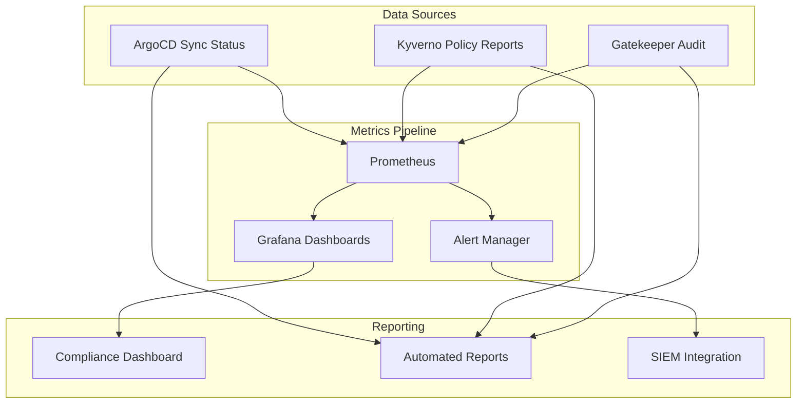

# How to Audit Policy Compliance with ArgoCD

Author: [nawazdhandala](https://github.com/nawazdhandala)

Tags: ArgoCD, GitOps, Kubernetes, Compliance, Auditing

Description: Build a comprehensive policy compliance auditing system using ArgoCD sync status, Kyverno policy reports, OPA Gatekeeper audit results, and Prometheus metrics for continuous compliance monitoring.

---

Compliance auditing answers the question: "Are all our deployments following our policies right now?" This goes beyond just enforcing policies at admission time. It means continuously checking every running resource against your policy set, tracking compliance trends over time, and generating reports for stakeholders.

ArgoCD, combined with policy engines like Kyverno or OPA Gatekeeper, gives you the data needed for comprehensive compliance auditing. This post shows how to build an auditing system that covers current compliance state, historical trends, and automated reporting.

## The Compliance Data Model

Compliance data comes from three sources. ArgoCD provides sync status and drift detection - if an application is out of sync, someone may have made unauthorized manual changes. Kyverno policy reports audit all existing resources against policies, not just new ones. And OPA Gatekeeper's audit controller periodically checks constraints against live resources.



## Auditing with ArgoCD Sync Status

ArgoCD's sync status is itself a compliance indicator. If all applications are synced and healthy, the live state matches the desired state in Git. If something is out of sync, it means either a pending Git change has not been applied or someone manually modified resources on the cluster.

### Checking Fleet-Wide Sync Compliance

```bash
# Get sync compliance across all applications
TOTAL=$(argocd app list -o json | jq '. | length')
SYNCED=$(argocd app list -o json | jq '[.[] | select(.status.sync.status == "Synced")] | length')
OUT_OF_SYNC=$(argocd app list -o json | jq '[.[] | select(.status.sync.status != "Synced")] | length')

echo "Total applications: $TOTAL"
echo "In sync: $SYNCED ($((SYNCED * 100 / TOTAL))%)"
echo "Out of sync: $OUT_OF_SYNC"

# List out-of-sync applications with details
argocd app list -o json | jq '.[] | select(.status.sync.status != "Synced") | {
  name: .metadata.name,
  project: .spec.project,
  syncStatus: .status.sync.status,
  healthStatus: .status.health.status
}'
```

### Detecting Manual Drift

ArgoCD's self-heal feature automatically corrects drift, but for auditing you want to know when drift happened. Use ArgoCD notifications to log drift events.

```yaml
# argocd-notifications-cm - log drift events
apiVersion: v1
kind: ConfigMap
metadata:
  name: argocd-notifications-cm
  namespace: argocd
data:
  template.drift-detected: |
    webhook:
      audit-log:
        method: POST
        body: |
          {
            "event": "drift_detected",
            "application": "{{.app.metadata.name}}",
            "project": "{{.app.spec.project}}",
            "cluster": "{{.app.spec.destination.server}}",
            "namespace": "{{.app.spec.destination.namespace}}",
            "timestamp": "{{.app.status.reconciledAt}}",
            "resources": {{.app.status.resources | toJson}}
          }
  trigger.on-sync-status-unknown: |
    - when: app.status.sync.status == 'OutOfSync'
      send: [drift-detected]
  service.webhook.audit-log: |
    url: https://audit.company.com/api/events
    headers:
      - name: Authorization
        value: Bearer $audit-api-token
```

## Auditing with Kyverno Policy Reports

Kyverno generates PolicyReport and ClusterPolicyReport resources that contain audit results for all resources in the cluster, not just newly created ones.

### Querying Policy Reports

```bash
# Get a summary of all policy violations across the cluster
kubectl get clusterpolicyreport -o json | jq '{
  total_resources: [.items[].results[]] | length,
  pass: [.items[].results[] | select(.result == "pass")] | length,
  fail: [.items[].results[] | select(.result == "fail")] | length,
  warn: [.items[].results[] | select(.result == "warn")] | length,
  error: [.items[].results[] | select(.result == "error")] | length
}'

# Get detailed violations grouped by policy
kubectl get clusterpolicyreport -o json | jq '[.items[].results[] | select(.result == "fail") | {
  policy: .policy,
  rule: .rule,
  resource: "\(.resources[0].kind)/\(.resources[0].name)",
  namespace: .resources[0].namespace,
  message: .message
}] | group_by(.policy) | map({policy: .[0].policy, violations: length, resources: [.[].resource]})'
```

### Per-Namespace Compliance

```bash
# Check compliance per namespace
for ns in $(kubectl get namespaces -o name | cut -d/ -f2); do
  REPORT=$(kubectl get policyreport -n "$ns" -o json 2>/dev/null)
  if [ -n "$REPORT" ]; then
    TOTAL=$(echo "$REPORT" | jq '[.items[].results[]] | length')
    PASS=$(echo "$REPORT" | jq '[.items[].results[] | select(.result == "pass")] | length')
    FAIL=$(echo "$REPORT" | jq '[.items[].results[] | select(.result == "fail")] | length')
    if [ "$TOTAL" -gt 0 ]; then
      RATE=$((PASS * 100 / TOTAL))
      echo "$ns: $RATE% compliant ($PASS pass, $FAIL fail of $TOTAL checks)"
    fi
  fi
done
```

## Auditing with OPA Gatekeeper

Gatekeeper's audit controller periodically checks all existing resources against active constraints.

```bash
# Get audit results from all constraints
kubectl get constraints -o json | jq '.items[] | {
  name: .metadata.name,
  kind: .kind,
  enforcement: .spec.enforcementAction,
  total_violations: (.status.totalViolations // 0),
  violations: [(.status.violations // [])[] | {
    kind: .kind,
    name: .name,
    namespace: .namespace,
    message: .message
  }]
}'

# Summary across all constraints
kubectl get constraints -o json | jq '{
  total_constraints: (.items | length),
  constraints_with_violations: [.items[] | select((.status.totalViolations // 0) > 0)] | length,
  total_violations: [.items[] | .status.totalViolations // 0] | add
}'
```

## Building a Compliance Dashboard

Combine all data sources in Grafana using Prometheus metrics.

### Prometheus Queries

```promql
# ArgoCD application sync compliance rate
sum(argocd_app_info{sync_status="Synced"}) / sum(argocd_app_info) * 100

# ArgoCD application health compliance rate
sum(argocd_app_info{health_status="Healthy"}) / sum(argocd_app_info) * 100

# Kyverno policy compliance (if using kyverno-json exporter)
sum(kyverno_policy_results_total{rule_result="pass"})
/ sum(kyverno_policy_results_total) * 100

# Gatekeeper violations trend
sum(opa_constraint_violations) by (constraint_kind)

# Compliance score over time (custom recording rule)
# Record overall compliance as a metric
- record: compliance:overall_score
  expr: |
    (
      sum(argocd_app_info{sync_status="Synced", health_status="Healthy"})
      / sum(argocd_app_info)
    ) * 100
```

### Grafana Dashboard Panels

```json
{
  "dashboard": {
    "title": "Policy Compliance Audit",
    "panels": [
      {
        "title": "Overall Compliance Score",
        "type": "gauge",
        "targets": [
          {
            "expr": "compliance:overall_score",
            "legendFormat": "Compliance %"
          }
        ],
        "fieldConfig": {
          "defaults": {
            "thresholds": {
              "steps": [
                {"color": "red", "value": 0},
                {"color": "yellow", "value": 80},
                {"color": "green", "value": 95}
              ]
            },
            "min": 0,
            "max": 100
          }
        },
        "gridPos": {"h": 8, "w": 6, "x": 0, "y": 0}
      },
      {
        "title": "Sync Status Distribution",
        "type": "piechart",
        "targets": [
          {
            "expr": "count by (sync_status) (argocd_app_info)",
            "legendFormat": "{{sync_status}}"
          }
        ],
        "gridPos": {"h": 8, "w": 6, "x": 6, "y": 0}
      },
      {
        "title": "Policy Violations Over Time",
        "type": "timeseries",
        "targets": [
          {
            "expr": "sum(opa_constraint_violations) by (constraint_kind)",
            "legendFormat": "{{constraint_kind}}"
          }
        ],
        "gridPos": {"h": 8, "w": 12, "x": 0, "y": 8}
      },
      {
        "title": "Non-Compliant Applications",
        "type": "table",
        "targets": [
          {
            "expr": "argocd_app_info{sync_status!=\"Synced\"} == 1 or argocd_app_info{health_status!=\"Healthy\"} == 1",
            "format": "table",
            "instant": true
          }
        ],
        "gridPos": {"h": 10, "w": 24, "x": 0, "y": 16}
      }
    ]
  }
}
```

## Automated Compliance Reports

Generate periodic compliance reports for stakeholders.

```python
# compliance_report.py
# Generates a compliance report from ArgoCD and policy data
import os
import json
import requests
from datetime import datetime

ARGOCD_URL = os.environ['ARGOCD_URL']
ARGOCD_TOKEN = os.environ['ARGOCD_AUTH_TOKEN']


def get_argocd_compliance():
    """Get sync and health compliance from ArgoCD."""
    headers = {
        'Authorization': f'Bearer {ARGOCD_TOKEN}',
        'Content-Type': 'application/json'
    }
    resp = requests.get(
        f'{ARGOCD_URL}/api/v1/applications',
        headers=headers,
        verify=False,
        timeout=30
    )
    resp.raise_for_status()
    apps = resp.json().get('items', [])

    total = len(apps)
    synced = sum(1 for a in apps
                 if a.get('status', {}).get('sync', {}).get('status') == 'Synced')
    healthy = sum(1 for a in apps
                  if a.get('status', {}).get('health', {}).get('status') == 'Healthy')

    non_compliant = [
        {
            'name': a['metadata']['name'],
            'project': a['spec'].get('project', 'default'),
            'sync': a.get('status', {}).get('sync', {}).get('status', 'Unknown'),
            'health': a.get('status', {}).get('health', {}).get('status', 'Unknown'),
        }
        for a in apps
        if a.get('status', {}).get('sync', {}).get('status') != 'Synced'
        or a.get('status', {}).get('health', {}).get('status') != 'Healthy'
    ]

    return {
        'total_applications': total,
        'synced': synced,
        'healthy': healthy,
        'sync_compliance': round(synced / total * 100, 1) if total > 0 else 0,
        'health_compliance': round(healthy / total * 100, 1) if total > 0 else 0,
        'non_compliant_apps': non_compliant
    }


def generate_report():
    """Generate the full compliance report."""
    argocd_data = get_argocd_compliance()

    report = {
        'report_date': datetime.now().isoformat(),
        'summary': {
            'overall_compliance': argocd_data['sync_compliance'],
            'total_applications': argocd_data['total_applications'],
            'applications_in_sync': argocd_data['synced'],
            'applications_healthy': argocd_data['healthy'],
        },
        'argocd_compliance': argocd_data,
    }

    return report


if __name__ == '__main__':
    report = generate_report()

    print("=" * 60)
    print(f"COMPLIANCE REPORT - {report['report_date'][:10]}")
    print("=" * 60)
    print(f"\nOverall Sync Compliance: {report['summary']['overall_compliance']}%")
    print(f"Total Applications: {report['summary']['total_applications']}")
    print(f"In Sync: {report['summary']['applications_in_sync']}")
    print(f"Healthy: {report['summary']['applications_healthy']}")

    non_compliant = report['argocd_compliance']['non_compliant_apps']
    if non_compliant:
        print(f"\nNon-Compliant Applications ({len(non_compliant)}):")
        for app in non_compliant:
            print(f"  - {app['name']}: sync={app['sync']}, health={app['health']}")
    else:
        print("\nAll applications are compliant!")

    # Save to JSON for automated processing
    with open(f"compliance-report-{datetime.now().strftime('%Y%m%d')}.json", 'w') as f:
        json.dump(report, f, indent=2)
```

## Compliance Alerting

Set up alerts that fire when compliance drops below thresholds.

```yaml
# PrometheusRule for compliance alerts
apiVersion: monitoring.coreos.com/v1
kind: PrometheusRule
metadata:
  name: compliance-alerts
spec:
  groups:
    - name: compliance
      rules:
        # Alert when overall sync compliance drops below 95%
        - alert: ComplianceSyncRateLow
          expr: |
            (
              sum(argocd_app_info{sync_status="Synced"})
              / sum(argocd_app_info)
            ) * 100 < 95
          for: 15m
          labels:
            severity: warning
            team: platform
          annotations:
            summary: "ArgoCD sync compliance is below 95%"
            description: "{{ $value }}% of applications are in sync"

        # Alert when health compliance drops below 90%
        - alert: ComplianceHealthRateLow
          expr: |
            (
              sum(argocd_app_info{health_status="Healthy"})
              / sum(argocd_app_info)
            ) * 100 < 90
          for: 15m
          labels:
            severity: warning
            team: platform
          annotations:
            summary: "ArgoCD health compliance is below 90%"

        # Alert on new policy violations
        - alert: NewPolicyViolations
          expr: |
            increase(kyverno_policy_results_total{rule_result="fail"}[1h]) > 10
          for: 5m
          labels:
            severity: warning
            team: security
          annotations:
            summary: "More than 10 new policy violations in the last hour"
```

## Wrapping Up

Auditing policy compliance with ArgoCD is about combining multiple data sources into a coherent picture. ArgoCD's sync status tells you whether live state matches Git, Kyverno policy reports and Gatekeeper audit results tell you whether resources comply with your policies, and Prometheus metrics let you track compliance trends over time. Build Grafana dashboards for real-time visibility, automated reports for stakeholders, and alerts for compliance degradation. The result is continuous compliance monitoring that catches issues early and provides the audit trail you need for regulatory requirements. For the full picture of securing your ArgoCD deployment pipeline, see also [how to rate limit and secure ArgoCD API access](https://oneuptime.com/blog/post/2026-02-26-how-to-rate-limit-and-secure-argocd-api-access/view).
