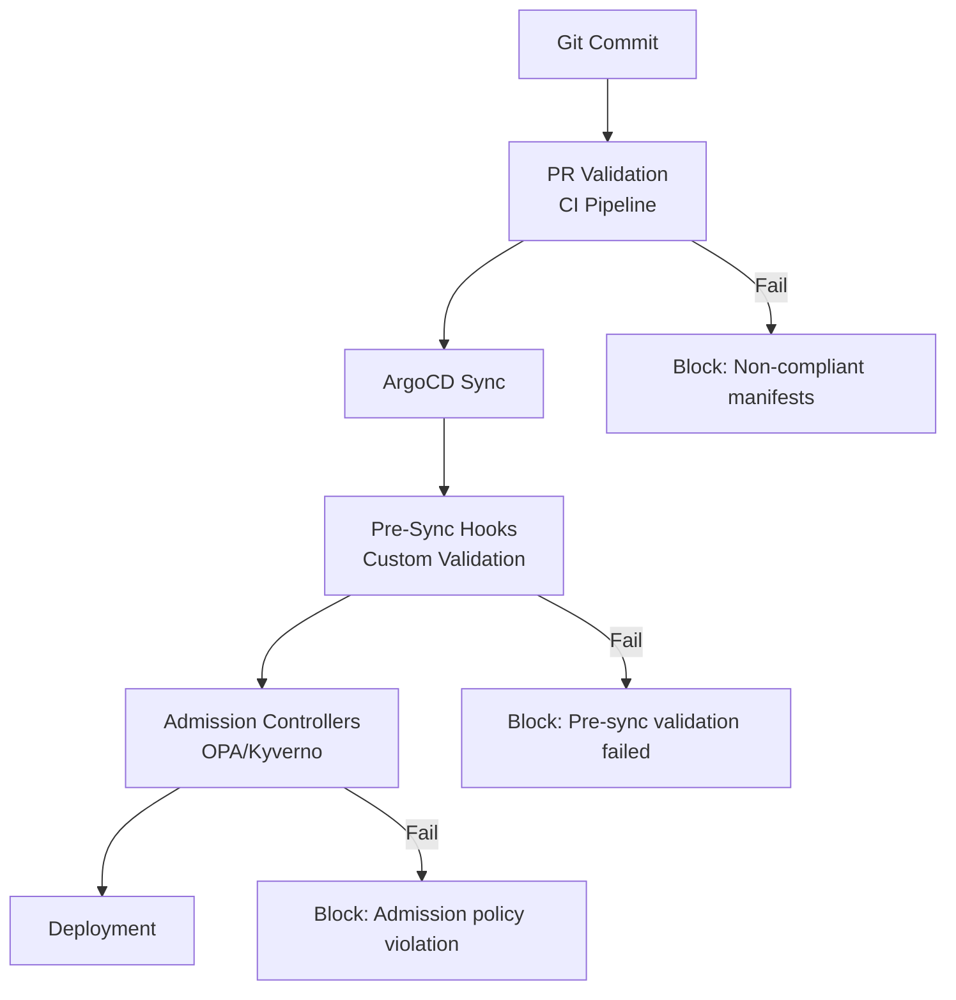

# How to Block Non-Compliant Deployments with ArgoCD

Author: [nawazdhandala](https://github.com/nawazdhandala)

Tags: ArgoCD, GitOps, Kubernetes, Compliance, Security

Description: Implement multi-layered compliance enforcement in ArgoCD using sync hooks, admission controllers, pre-sync validations, and AppProject restrictions to block non-compliant deployments.

---

Compliance enforcement in Kubernetes means preventing deployments that do not meet your organization's standards from reaching production. ArgoCD provides several mechanisms to block non-compliant deployments: AppProject restrictions, sync hooks for pre-deployment validation, integration with admission controllers, and resource-level controls.

This post shows how to build a multi-layered compliance system that catches violations before they reach your clusters.

## Compliance Layers

A robust compliance system uses multiple layers, each catching different types of violations.



## Layer 1: AppProject Restrictions

ArgoCD AppProjects provide the first line of defense. They restrict what can be deployed, where it can go, and from which repositories.

```yaml
# production-project.yaml
# Strict project for production deployments
apiVersion: argoproj.io/v1alpha1
kind: AppProject
metadata:
  name: production
  namespace: argocd
spec:
  description: "Production applications - strict compliance"

  # Only allow specific Git repositories
  sourceRepos:
    - 'https://github.com/company/production-configs'
    - 'https://github.com/company/shared-charts'

  # Restrict destination clusters and namespaces
  destinations:
    - server: 'https://production-cluster:6443'
      namespace: 'app-*'
    - server: 'https://production-cluster:6443'
      namespace: 'service-*'

  # Block specific cluster-scoped resources
  clusterResourceBlacklist:
    - group: ''
      kind: 'Namespace'  # Namespaces managed separately
    - group: 'rbac.authorization.k8s.io'
      kind: 'ClusterRole'
    - group: 'rbac.authorization.k8s.io'
      kind: 'ClusterRoleBinding'

  # Restrict namespace-scoped resources
  namespaceResourceWhitelist:
    - group: ''
      kind: 'ConfigMap'
    - group: ''
      kind: 'Secret'
    - group: ''
      kind: 'Service'
    - group: ''
      kind: 'ServiceAccount'
    - group: 'apps'
      kind: 'Deployment'
    - group: 'apps'
      kind: 'StatefulSet'
    - group: 'networking.k8s.io'
      kind: 'Ingress'
    - group: 'autoscaling'
      kind: 'HorizontalPodAutoscaler'

  # Enforce sync windows - only deploy during maintenance windows
  syncWindows:
    - kind: allow
      schedule: '0 2 * * 1-5'  # 2 AM on weekdays
      duration: 4h
      applications:
        - '*'
    - kind: deny
      schedule: '0 0 * * 0,6'  # All weekend
      duration: 48h
      applications:
        - '*'
      manualSync: true  # Also block manual syncs

  # Require signed commits (if using GPG verification)
  signatureKeys:
    - keyID: "4AEE18F83AFDEB23"
```

## Layer 2: Pre-Sync Validation Hooks

ArgoCD sync hooks let you run validation before the actual sync happens. Use a PreSync hook to run compliance checks.

```yaml
# hooks/compliance-check.yaml
# Pre-sync hook that validates compliance before deployment
apiVersion: batch/v1
kind: Job
metadata:
  name: compliance-check
  annotations:
    argocd.argoproj.io/hook: PreSync
    argocd.argoproj.io/hook-delete-policy: BeforeHookCreation
spec:
  template:
    spec:
      containers:
        - name: compliance-checker
          image: company/compliance-checker:v1.0.0
          env:
            - name: APP_NAME
              value: "{{.app.metadata.name}}"
            - name: APP_NAMESPACE
              value: "{{.app.spec.destination.namespace}}"
            - name: GIT_REPO
              value: "{{.app.spec.source.repoURL}}"
            - name: GIT_REVISION
              value: "{{.app.status.sync.revision}}"
          command:
            - /bin/sh
            - -c
            - |
              echo "Running compliance checks..."

              # Check 1: Verify all images are from approved registries
              echo "Checking image registries..."
              if grep -r 'image:' /manifests/ | grep -v 'company.azurecr.io\|gcr.io/company'; then
                echo "FAIL: Found images from unapproved registries"
                exit 1
              fi

              # Check 2: Verify resource limits are set
              echo "Checking resource limits..."
              if ! /tools/check-resource-limits.sh /manifests/; then
                echo "FAIL: Missing resource limits"
                exit 1
              fi

              # Check 3: Verify no latest tags
              echo "Checking for latest tags..."
              if grep -r ':latest' /manifests/ | grep 'image:'; then
                echo "FAIL: Using :latest tag is not allowed"
                exit 1
              fi

              echo "All compliance checks passed"
      restartPolicy: Never
  backoffLimit: 0  # Do not retry - fail fast
```

## Layer 3: Resource-Level Controls

Use ArgoCD's `ignoreDifferences` and resource actions to control specific fields.

```yaml
# Prevent certain fields from being modified
apiVersion: argoproj.io/v1alpha1
kind: Application
metadata:
  name: production-web-app
spec:
  # ... source and destination
  ignoreDifferences:
    # Ignore replicas managed by HPA
    - group: apps
      kind: Deployment
      jsonPointers:
        - /spec/replicas
  syncPolicy:
    automated:
      prune: true
      selfHeal: true
    syncOptions:
      # Prevent deleting resources not in Git
      - PrunePropagationPolicy=foreground
      # Require all resources to pass validation
      - Validate=true
      # Use server-side apply for conflict detection
      - ServerSideApply=true
```

## Layer 4: Image Restrictions

Restrict which container images can be deployed through Kyverno or OPA policies managed by ArgoCD.

```yaml
# policies/restrict-image-registries.yaml
apiVersion: kyverno.io/v1
kind: ClusterPolicy
metadata:
  name: restrict-image-registries
  annotations:
    argocd.argoproj.io/sync-wave: "0"
spec:
  validationFailureAction: Enforce
  background: true
  rules:
    - name: validate-registries
      match:
        any:
          - resources:
              kinds:
                - Pod
      validate:
        message: "Images must come from approved registries: company.azurecr.io or gcr.io/company-project"
        pattern:
          spec:
            containers:
              - image: "company.azurecr.io/* | gcr.io/company-project/*"
            =(initContainers):
              - image: "company.azurecr.io/* | gcr.io/company-project/*"
```

### Block Latest Tags

```yaml
# policies/disallow-latest-tag.yaml
apiVersion: kyverno.io/v1
kind: ClusterPolicy
metadata:
  name: disallow-latest-tag
spec:
  validationFailureAction: Enforce
  background: true
  rules:
    - name: require-image-tag
      match:
        any:
          - resources:
              kinds:
                - Pod
      validate:
        message: "Images must use a specific tag or digest, not ':latest' or no tag."
        pattern:
          spec:
            containers:
              - image: "*:*"
    - name: disallow-latest
      match:
        any:
          - resources:
              kinds:
                - Pod
      validate:
        message: "The ':latest' tag is not allowed. Use a specific version tag."
        pattern:
          spec:
            containers:
              - image: "!*:latest"
```

## Layer 5: Label and Annotation Requirements

Enforce mandatory labels for cost allocation, ownership, and compliance tracking.

```yaml
# policies/require-labels.yaml
apiVersion: kyverno.io/v1
kind: ClusterPolicy
metadata:
  name: require-mandatory-labels
spec:
  validationFailureAction: Enforce
  background: true
  rules:
    - name: require-labels
      match:
        any:
          - resources:
              kinds:
                - Deployment
                - StatefulSet
                - DaemonSet
      validate:
        message: "The following labels are required: app.kubernetes.io/name, app.kubernetes.io/version, company.com/team, company.com/cost-center"
        pattern:
          metadata:
            labels:
              app.kubernetes.io/name: "?*"
              app.kubernetes.io/version: "?*"
              company.com/team: "?*"
              company.com/cost-center: "?*"
```

## Layer 6: CI Pipeline Integration

Add compliance checks in your CI pipeline that run before ArgoCD picks up the changes.

```yaml
# .github/workflows/compliance.yaml
name: Compliance Check
on:
  pull_request:
    paths:
      - 'apps/**'
      - 'services/**'

jobs:
  compliance:
    runs-on: ubuntu-latest
    steps:
      - uses: actions/checkout@v4

      - name: Validate Kubernetes manifests
        run: |
          # Install kubeval or kubeconform
          wget https://github.com/yannh/kubeconform/releases/latest/download/kubeconform-linux-amd64.tar.gz
          tar xzf kubeconform-linux-amd64.tar.gz

          # Validate all YAML files
          find . -name '*.yaml' -path '*/apps/*' | xargs ./kubeconform -strict

      - name: Check for compliance violations
        run: |
          # Check for latest tags
          if grep -r ':latest' apps/ services/ | grep 'image:'; then
            echo "ERROR: :latest tag found in manifests"
            exit 1
          fi

          # Check for missing resource limits
          python3 scripts/check_resource_limits.py apps/ services/

          # Check for unapproved registries
          python3 scripts/check_registries.py apps/ services/

      - name: Run Kyverno CLI tests
        run: |
          # Install Kyverno CLI
          curl -LO https://github.com/kyverno/kyverno/releases/latest/download/kyverno-cli_linux_amd64.tar.gz
          tar xzf kyverno-cli_linux_amd64.tar.gz

          # Test manifests against policies
          ./kyverno apply policies/ --resource apps/ -o json
```

## Handling Blocked Deployments

When a deployment is blocked, ArgoCD reports the failure. Here is how to diagnose and resolve it.

```bash
# Check why a sync was blocked
argocd app get my-app --show-operation

# View detailed sync error messages
argocd app get my-app -o json | jq '.status.operationState.syncResult.resources[] | select(.status == "SyncFailed") | {kind: .kind, name: .name, message: .message}'

# Check Kyverno/OPA violations
kubectl get events -n production --field-selector reason=PolicyViolation
```

The resolution is always the same in a GitOps workflow: update the manifests in Git to comply with the policy, then let ArgoCD sync the compliant version.

## Wrapping Up

Blocking non-compliant deployments with ArgoCD requires multiple layers: AppProject restrictions for coarse-grained access control, pre-sync hooks for custom validation logic, admission controllers (Kyverno/OPA) for fine-grained policy enforcement, resource-level controls for sync behavior, and CI pipeline checks for early feedback. Each layer catches different types of violations, and together they create a comprehensive compliance system where non-compliant code never reaches your clusters. The key advantage of doing this through GitOps is auditability - every policy change is tracked in Git, and every policy enforcement is logged. For implementing specific admission policies, see [how to implement admission policies for ArgoCD-managed resources](https://oneuptime.com/blog/post/2026-02-26-how-to-implement-admission-policies-for-argocd-managed-resources/view).
