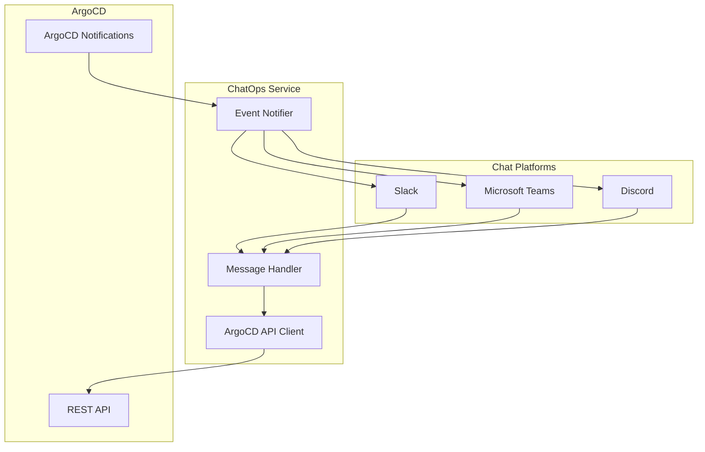

# How to Build ChatOps Integration with ArgoCD API

Author: [nawazdhandala](https://github.com/nawazdhandala)

Tags: ArgoCD, GitOps, Kubernetes, ChatOps, Automation

Description: Build ChatOps integrations for ArgoCD that work across Slack, Microsoft Teams, and Discord to enable deployment operations, status checks, and alerts from chat platforms.

---

ChatOps brings deployment operations into the communication tools your team already uses. Instead of context-switching to a terminal or web UI, engineers can check deployment status, trigger syncs, rollback applications, and get notified about issues directly in their chat platform. ArgoCD's REST API makes building these integrations straightforward.

This post covers building a ChatOps integration that works across multiple platforms, with a focus on the ArgoCD API patterns that power it.

## Architecture Overview

A ChatOps integration for ArgoCD has three components: a message handler that receives commands from chat platforms, an ArgoCD API client that executes operations, and a notification system that pushes deployment events to chat channels.



## The ArgoCD API Client Layer

Start with a clean API client that all chat platform handlers share.

```python
# argocd_client.py
# Shared ArgoCD API client for ChatOps integrations
import requests
from dataclasses import dataclass
from typing import List, Optional, Dict, Any


@dataclass
class AppStatus:
    """Represents an application's current status."""
    name: str
    project: str
    health: str
    sync: str
    revision: str
    cluster: str
    namespace: str
    message: str = ""


@dataclass
class SyncResult:
    """Represents the result of a sync operation."""
    app_name: str
    phase: str
    message: str
    resources_synced: int
    resources_failed: int


class ArgoCDClient:
    """Client for ArgoCD REST API operations commonly used in ChatOps."""

    def __init__(self, url: str, token: str, verify_ssl: bool = False):
        self.url = url.rstrip('/')
        self.session = requests.Session()
        self.session.headers.update({
            'Authorization': f'Bearer {token}',
            'Content-Type': 'application/json'
        })
        self.session.verify = verify_ssl

    def _get(self, endpoint: str, params: dict = None) -> dict:
        resp = self.session.get(f'{self.url}{endpoint}', params=params, timeout=30)
        resp.raise_for_status()
        return resp.json()

    def _post(self, endpoint: str, data: dict = None) -> dict:
        resp = self.session.post(f'{self.url}{endpoint}', json=data, timeout=60)
        resp.raise_for_status()
        return resp.json()

    def get_app_status(self, app_name: str) -> AppStatus:
        """Get the current status of an application."""
        data = self._get(f'/api/v1/applications/{app_name}')
        status = data.get('status', {})
        return AppStatus(
            name=data['metadata']['name'],
            project=data['spec'].get('project', 'default'),
            health=status.get('health', {}).get('status', 'Unknown'),
            sync=status.get('sync', {}).get('status', 'Unknown'),
            revision=status.get('sync', {}).get('revision', 'unknown')[:7],
            cluster=data['spec']['destination'].get('server', ''),
            namespace=data['spec']['destination'].get('namespace', ''),
            message=status.get('health', {}).get('message', '')
        )

    def list_apps(self, project: str = None,
                  selector: str = None) -> List[AppStatus]:
        """List applications with optional filtering."""
        params = {}
        if project:
            params['projects'] = project
        if selector:
            params['selector'] = selector

        data = self._get('/api/v1/applications', params=params)
        apps = []
        for item in data.get('items', []):
            status = item.get('status', {})
            apps.append(AppStatus(
                name=item['metadata']['name'],
                project=item['spec'].get('project', 'default'),
                health=status.get('health', {}).get('status', 'Unknown'),
                sync=status.get('sync', {}).get('status', 'Unknown'),
                revision=status.get('sync', {}).get('revision', '?')[:7],
                cluster=item['spec']['destination'].get('server', ''),
                namespace=item['spec']['destination'].get('namespace', ''),
            ))
        return apps

    def sync_app(self, app_name: str, prune: bool = True,
                 revision: str = None) -> dict:
        """Trigger a sync for an application."""
        data = {'prune': prune}
        if revision:
            data['revision'] = revision
        return self._post(f'/api/v1/applications/{app_name}/sync', data)

    def rollback_app(self, app_name: str, history_id: int) -> dict:
        """Rollback an application to a previous deployment."""
        return self._post(f'/api/v1/applications/{app_name}/rollback', {
            'id': history_id
        })

    def get_app_history(self, app_name: str) -> List[dict]:
        """Get deployment history for an application."""
        data = self._get(f'/api/v1/applications/{app_name}')
        history = data.get('status', {}).get('history', [])
        return [
            {
                'id': h.get('id'),
                'revision': h.get('revision', '')[:7],
                'deployed_at': h.get('deployedAt', ''),
                'source': h.get('source', {}).get('path', '')
            }
            for h in history
        ]

    def get_unhealthy_resources(self, app_name: str) -> List[dict]:
        """Get unhealthy resources for an application."""
        data = self._get(f'/api/v1/applications/{app_name}/resource-tree')
        unhealthy = []
        for node in data.get('nodes', []):
            health = node.get('health', {})
            if health.get('status') not in ('Healthy', None):
                unhealthy.append({
                    'kind': node.get('kind'),
                    'name': node.get('name'),
                    'health': health.get('status'),
                    'message': health.get('message', '')
                })
        return unhealthy

    def get_diff(self, app_name: str) -> List[dict]:
        """Get out-of-sync resources for an application."""
        data = self._get(f'/api/v1/applications/{app_name}')
        resources = data.get('status', {}).get('resources', [])
        return [
            {'kind': r['kind'], 'name': r['name'], 'status': r.get('status')}
            for r in resources
            if r.get('status') == 'OutOfSync'
        ]
```

## Command Parser

Build a platform-agnostic command parser that works regardless of which chat platform the message comes from.

```python
# command_parser.py
# Parses ChatOps commands into structured operations
from dataclasses import dataclass
from typing import Optional


@dataclass
class Command:
    """Parsed chat command."""
    action: str
    app_name: Optional[str] = None
    project: Optional[str] = None
    selector: Optional[str] = None
    revision: Optional[str] = None
    options: dict = None

    def __post_init__(self):
        if self.options is None:
            self.options = {}


def parse_command(text: str) -> Command:
    """Parse a chat command string into a Command object.

    Supported commands:
      status <app-name>
      list [--project <name>] [--selector <label>]
      sync <app-name> [--revision <rev>]
      rollback <app-name> <history-id>
      diff <app-name>
      history <app-name>
      health <app-name>
      help
    """
    parts = text.strip().split()
    if not parts:
        return Command(action='help')

    action = parts[0].lower()
    cmd = Command(action=action)

    # Parse positional arguments
    remaining = parts[1:]
    positional = []
    i = 0
    while i < len(remaining):
        if remaining[i].startswith('--'):
            key = remaining[i][2:]
            if i + 1 < len(remaining):
                cmd.options[key] = remaining[i + 1]
                i += 2
            else:
                cmd.options[key] = True
                i += 1
        else:
            positional.append(remaining[i])
            i += 1

    if positional:
        cmd.app_name = positional[0]

    # Map options to command fields
    cmd.project = cmd.options.get('project')
    cmd.selector = cmd.options.get('selector')
    cmd.revision = cmd.options.get('revision')

    return cmd
```

## Response Formatter

Format responses consistently across platforms.

```python
# formatter.py
# Formats ArgoCD responses for different chat platforms

class ResponseFormatter:
    """Base formatter for chat responses."""

    @staticmethod
    def status_response(status) -> str:
        """Format an application status for display."""
        health_icon = {
            'Healthy': '++',
            'Degraded': 'XX',
            'Progressing': '>>',
            'Unknown': '??',
        }.get(status.health, '??')

        sync_icon = '++' if status.sync == 'Synced' else '!!'

        return (
            f"Application: {status.name}\n"
            f"  Health: [{health_icon}] {status.health}\n"
            f"  Sync:   [{sync_icon}] {status.sync}\n"
            f"  Rev:    {status.revision}\n"
            f"  NS:     {status.namespace}\n"
            f"  Cluster: {status.cluster}"
        )

    @staticmethod
    def list_response(apps) -> str:
        """Format a list of applications."""
        if not apps:
            return "No applications found"

        lines = [f"{'NAME':<35} {'HEALTH':<12} {'SYNC':<12} {'REV':<8}"]
        lines.append('-' * 70)

        for app in apps:
            lines.append(
                f"{app.name:<35} {app.health:<12} {app.sync:<12} {app.revision:<8}"
            )
        lines.append(f"\nTotal: {len(apps)} applications")
        return '\n'.join(lines)

    @staticmethod
    def diff_response(app_name, changes) -> str:
        """Format an application diff."""
        if not changes:
            return f"{app_name} is fully synced"

        lines = [f"Out of sync resources in {app_name}:"]
        for c in changes:
            lines.append(f"  - {c['kind']}/{c['name']}")
        return '\n'.join(lines)

    @staticmethod
    def history_response(app_name, history) -> str:
        """Format deployment history."""
        if not history:
            return f"No deployment history for {app_name}"

        lines = [f"Deployment history for {app_name}:"]
        for h in history[-5:]:  # Show last 5 deployments
            lines.append(
                f"  [{h['id']}] {h['revision']} - {h['deployed_at']} ({h['source']})"
            )
        return '\n'.join(lines)

    @staticmethod
    def help_response() -> str:
        """Format help text."""
        return (
            "ArgoCD ChatOps Commands:\n"
            "  status <app>           - Show application status\n"
            "  list [--project name]  - List applications\n"
            "  sync <app>             - Trigger sync\n"
            "  diff <app>             - Show out-of-sync resources\n"
            "  history <app>          - Show deployment history\n"
            "  health <app>           - Show unhealthy resources\n"
            "  rollback <app> <id>    - Rollback to history ID\n"
            "  help                   - Show this help"
        )
```

## Command Executor

Wire everything together with a command executor.

```python
# executor.py
# Executes parsed commands against ArgoCD API

class CommandExecutor:
    """Executes ChatOps commands against ArgoCD."""

    def __init__(self, client, formatter=None):
        self.client = client
        self.formatter = formatter or ResponseFormatter()

    def execute(self, command) -> str:
        """Execute a parsed command and return formatted response."""
        handlers = {
            'status': self._handle_status,
            'list': self._handle_list,
            'sync': self._handle_sync,
            'diff': self._handle_diff,
            'history': self._handle_history,
            'health': self._handle_health,
            'rollback': self._handle_rollback,
            'help': self._handle_help,
        }

        handler = handlers.get(command.action, self._handle_unknown)
        try:
            return handler(command)
        except requests.exceptions.HTTPError as e:
            if e.response.status_code == 404:
                return f"Application '{command.app_name}' not found"
            return f"API error: {e.response.status_code}"
        except Exception as e:
            return f"Error: {str(e)}"

    def _handle_status(self, cmd):
        if not cmd.app_name:
            return "Usage: status <app-name>"
        status = self.client.get_app_status(cmd.app_name)
        return self.formatter.status_response(status)

    def _handle_list(self, cmd):
        apps = self.client.list_apps(
            project=cmd.project,
            selector=cmd.selector
        )
        return self.formatter.list_response(apps)

    def _handle_sync(self, cmd):
        if not cmd.app_name:
            return "Usage: sync <app-name>"
        self.client.sync_app(cmd.app_name, revision=cmd.revision)
        return f"Sync triggered for {cmd.app_name}"

    def _handle_diff(self, cmd):
        if not cmd.app_name:
            return "Usage: diff <app-name>"
        changes = self.client.get_diff(cmd.app_name)
        return self.formatter.diff_response(cmd.app_name, changes)

    def _handle_history(self, cmd):
        if not cmd.app_name:
            return "Usage: history <app-name>"
        history = self.client.get_app_history(cmd.app_name)
        return self.formatter.history_response(cmd.app_name, history)

    def _handle_health(self, cmd):
        if not cmd.app_name:
            return "Usage: health <app-name>"
        unhealthy = self.client.get_unhealthy_resources(cmd.app_name)
        if not unhealthy:
            return f"All resources in {cmd.app_name} are healthy"
        lines = [f"Unhealthy resources in {cmd.app_name}:"]
        for r in unhealthy:
            lines.append(f"  - {r['kind']}/{r['name']}: {r['health']} - {r['message']}")
        return '\n'.join(lines)

    def _handle_rollback(self, cmd):
        if not cmd.app_name:
            return "Usage: rollback <app-name> <history-id>"
        options = cmd.options
        history_id = int(cmd.options.get('id', 0)) if cmd.options else 0
        if not history_id:
            return "Usage: rollback <app-name> --id <history-id>"
        self.client.rollback_app(cmd.app_name, history_id)
        return f"Rollback triggered for {cmd.app_name} to history #{history_id}"

    def _handle_help(self, cmd):
        return self.formatter.help_response()

    def _handle_unknown(self, cmd):
        return f"Unknown command: {cmd.action}. Type 'help' for available commands."
```

## Deployment Notifications

Configure ArgoCD Notifications to push events to your ChatOps channels.

```yaml
# argocd-notifications-cm
apiVersion: v1
kind: ConfigMap
metadata:
  name: argocd-notifications-cm
  namespace: argocd
data:
  # Slack notification service
  service.slack: |
    token: $slack-token

  # Microsoft Teams webhook
  service.webhook.teams: |
    url: https://outlook.office.com/webhook/...
    headers:
      - name: Content-Type
        value: application/json

  # Sync succeeded template
  template.sync-succeeded: |
    slack:
      attachments: |
        [{
          "color": "#18be52",
          "title": "Deployment Succeeded: {{.app.metadata.name}}",
          "fields": [
            {"title": "Revision", "value": "{{.app.status.sync.revision | trunc 7}}", "short": true},
            {"title": "Project", "value": "{{.app.spec.project}}", "short": true}
          ]
        }]

  # Sync failed template
  template.sync-failed: |
    slack:
      attachments: |
        [{
          "color": "#E96D76",
          "title": "Deployment Failed: {{.app.metadata.name}}",
          "text": "{{.app.status.operationState.message}}",
          "fields": [
            {"title": "Revision", "value": "{{.app.status.sync.revision | trunc 7}}", "short": true},
            {"title": "Project", "value": "{{.app.spec.project}}", "short": true}
          ]
        }]

  # Trigger definitions
  trigger.on-sync-succeeded: |
    - when: app.status.operationState.phase in ['Succeeded']
      send: [sync-succeeded]
  trigger.on-sync-failed: |
    - when: app.status.operationState.phase in ['Failed', 'Error']
      send: [sync-failed]
```

## Wrapping Up

ChatOps with ArgoCD combines the convenience of chat-based interaction with the power of GitOps deployments. The architecture shown here - a shared API client, platform-agnostic command parsing, and a clean executor pattern - makes it easy to support multiple chat platforms with minimal duplication. Combined with ArgoCD Notifications for proactive alerts, your team gets a complete deployment operations interface without leaving their chat tool. For building dedicated Slack bots with richer interactions, see [how to build Slack bots that interact with ArgoCD API](https://oneuptime.com/blog/post/2026-02-26-how-to-build-slack-bots-that-interact-with-argocd-api/view).
