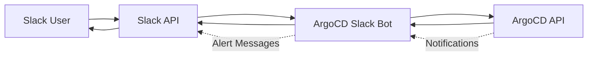

# How to Build Slack Bots that Interact with ArgoCD API

Author: [nawazdhandala](https://github.com/nawazdhandala)

Tags: ArgoCD, GitOps, Kubernetes, Slack, ChatOps

Description: Build a Slack bot that interacts with ArgoCD's REST API to check application status, trigger syncs, and receive deployment notifications directly in Slack channels.

---

ChatOps with ArgoCD means your team can check deployment status, trigger syncs, and get notified about failures without leaving Slack. Instead of switching context to the ArgoCD UI or SSH-ing into a bastion host to use the CLI, developers just type a command in Slack and get instant feedback.

This post walks through building a Slack bot that integrates with ArgoCD's REST API for the most common operations teams need.

## Architecture

The bot runs as a small service that receives Slack events (slash commands or mentions), calls the ArgoCD API, and posts formatted responses back to Slack.



## Setting Up the Slack App

First, create a Slack app with the following permissions (OAuth scopes): `commands` for slash commands, `chat:write` for posting messages, and `chat:write.public` for posting to channels the bot has not been invited to.

Create a slash command `/argocd` that points to your bot's endpoint.

## Bot Implementation

Here is a Python implementation using Flask and the Slack SDK.

```python
# argocd_slack_bot.py
# Slack bot for ArgoCD operations
import os
import json
import requests
from flask import Flask, request, jsonify
from slack_sdk import WebClient
from slack_sdk.errors import SlackApiError

app = Flask(__name__)

# Configuration from environment variables
SLACK_TOKEN = os.environ['SLACK_BOT_TOKEN']
SLACK_SIGNING_SECRET = os.environ['SLACK_SIGNING_SECRET']
ARGOCD_URL = os.environ['ARGOCD_URL']
ARGOCD_TOKEN = os.environ['ARGOCD_TOKEN']

slack_client = WebClient(token=SLACK_TOKEN)

# ArgoCD API helper
def argocd_request(method, endpoint, data=None):
    """Make an authenticated request to the ArgoCD API."""
    headers = {
        'Authorization': f'Bearer {ARGOCD_TOKEN}',
        'Content-Type': 'application/json'
    }
    url = f'{ARGOCD_URL}{endpoint}'
    resp = requests.request(
        method, url,
        headers=headers,
        json=data,
        verify=False,  # Adjust for your TLS setup
        timeout=30
    )
    resp.raise_for_status()
    return resp.json()


@app.route('/slack/commands', methods=['POST'])
def handle_command():
    """Handle the /argocd slash command."""
    command_text = request.form.get('text', '').strip()
    channel_id = request.form.get('channel_id')
    user_id = request.form.get('user_id')

    # Parse the subcommand
    parts = command_text.split()
    if not parts:
        return jsonify({
            'response_type': 'ephemeral',
            'text': 'Usage: /argocd [status|sync|diff|list|health] [app-name]'
        })

    subcommand = parts[0].lower()
    app_name = parts[1] if len(parts) > 1 else None

    # Route to the appropriate handler
    handlers = {
        'status': handle_status,
        'sync': handle_sync,
        'diff': handle_diff,
        'list': handle_list,
        'health': handle_health,
    }

    handler = handlers.get(subcommand)
    if not handler:
        return jsonify({
            'response_type': 'ephemeral',
            'text': f'Unknown command: {subcommand}. Available: {", ".join(handlers.keys())}'
        })

    # Execute the handler and post results
    try:
        result = handler(app_name, channel_id, user_id)
        return jsonify(result)
    except Exception as e:
        return jsonify({
            'response_type': 'ephemeral',
            'text': f'Error: {str(e)}'
        })


def handle_status(app_name, channel_id, user_id):
    """Get the status of a specific application."""
    if not app_name:
        return {'response_type': 'ephemeral', 'text': 'Usage: /argocd status <app-name>'}

    try:
        app_data = argocd_request('GET', f'/api/v1/applications/{app_name}')
    except requests.exceptions.HTTPError as e:
        if e.response.status_code == 404:
            return {'response_type': 'ephemeral', 'text': f'Application `{app_name}` not found'}
        raise

    sync_status = app_data.get('status', {}).get('sync', {}).get('status', 'Unknown')
    health_status = app_data.get('status', {}).get('health', {}).get('status', 'Unknown')
    revision = app_data.get('status', {}).get('sync', {}).get('revision', 'unknown')[:7]
    namespace = app_data.get('spec', {}).get('destination', {}).get('namespace', 'N/A')

    # Color-code the status
    health_emoji = {
        'Healthy': ':white_check_mark:',
        'Degraded': ':red_circle:',
        'Progressing': ':hourglass_flowing_sand:',
        'Unknown': ':grey_question:',
    }.get(health_status, ':grey_question:')

    sync_emoji = ':white_check_mark:' if sync_status == 'Synced' else ':warning:'

    blocks = [
        {
            'type': 'header',
            'text': {'type': 'plain_text', 'text': f'Application: {app_name}'}
        },
        {
            'type': 'section',
            'fields': [
                {'type': 'mrkdwn', 'text': f'*Health:* {health_emoji} {health_status}'},
                {'type': 'mrkdwn', 'text': f'*Sync:* {sync_emoji} {sync_status}'},
                {'type': 'mrkdwn', 'text': f'*Revision:* `{revision}`'},
                {'type': 'mrkdwn', 'text': f'*Namespace:* `{namespace}`'},
            ]
        },
        {
            'type': 'actions',
            'elements': [
                {
                    'type': 'button',
                    'text': {'type': 'plain_text', 'text': 'View in ArgoCD'},
                    'url': f'{ARGOCD_URL}/applications/{app_name}'
                },
                {
                    'type': 'button',
                    'text': {'type': 'plain_text', 'text': 'Sync Now'},
                    'action_id': f'sync_{app_name}',
                    'style': 'primary'
                }
            ]
        }
    ]

    return {'response_type': 'in_channel', 'blocks': blocks}


def handle_sync(app_name, channel_id, user_id):
    """Trigger a sync for an application."""
    if not app_name:
        return {'response_type': 'ephemeral', 'text': 'Usage: /argocd sync <app-name>'}

    # Trigger the sync via API
    argocd_request('POST', f'/api/v1/applications/{app_name}/sync', {
        'prune': True,
        'strategy': {'apply': {'force': False}}
    })

    # Notify the channel
    slack_client.chat_postMessage(
        channel=channel_id,
        text=f'<@{user_id}> triggered a sync for `{app_name}`'
    )

    return {
        'response_type': 'in_channel',
        'text': f':rocket: Sync triggered for `{app_name}`. Watching for completion...'
    }


def handle_list(app_name, channel_id, user_id):
    """List all applications or filter by project."""
    project = app_name  # Reuse the second argument as project filter

    params = f'?projects={project}' if project else ''
    apps = argocd_request('GET', f'/api/v1/applications{params}')

    items = apps.get('items', [])
    if not items:
        return {'response_type': 'ephemeral', 'text': 'No applications found'}

    lines = []
    for a in items[:20]:  # Limit to 20 to avoid Slack message limits
        name = a['metadata']['name']
        health = a.get('status', {}).get('health', {}).get('status', '?')
        sync = a.get('status', {}).get('sync', {}).get('status', '?')
        h_icon = ':white_check_mark:' if health == 'Healthy' else ':red_circle:'
        s_icon = ':white_check_mark:' if sync == 'Synced' else ':warning:'
        lines.append(f'{h_icon} {s_icon} `{name}` - {health}/{sync}')

    text = '\n'.join(lines)
    if len(items) > 20:
        text += f'\n...and {len(items) - 20} more'

    return {'response_type': 'in_channel', 'text': text}


def handle_diff(app_name, channel_id, user_id):
    """Show the diff for an out-of-sync application."""
    if not app_name:
        return {'response_type': 'ephemeral', 'text': 'Usage: /argocd diff <app-name>'}

    app_data = argocd_request('GET', f'/api/v1/applications/{app_name}')
    resources = app_data.get('status', {}).get('resources', [])

    out_of_sync = [r for r in resources if r.get('status') == 'OutOfSync']

    if not out_of_sync:
        return {'response_type': 'in_channel', 'text': f'`{app_name}` is fully synced'}

    lines = [f'*Out of sync resources in `{app_name}`:*']
    for r in out_of_sync:
        kind = r.get('kind', 'Unknown')
        name = r.get('name', 'Unknown')
        lines.append(f'  - `{kind}/{name}`')

    return {'response_type': 'in_channel', 'text': '\n'.join(lines)}


def handle_health(app_name, channel_id, user_id):
    """Show health details for an application."""
    if not app_name:
        return {'response_type': 'ephemeral', 'text': 'Usage: /argocd health <app-name>'}

    app_data = argocd_request('GET', f'/api/v1/applications/{app_name}/resource-tree')
    nodes = app_data.get('nodes', [])

    unhealthy = [n for n in nodes if n.get('health', {}).get('status') not in ('Healthy', None)]

    if not unhealthy:
        return {'response_type': 'in_channel', 'text': f'All resources in `{app_name}` are healthy'}

    lines = [f'*Unhealthy resources in `{app_name}`:*']
    for n in unhealthy:
        kind = n.get('kind', 'Unknown')
        name = n.get('name', 'Unknown')
        status = n.get('health', {}).get('status', 'Unknown')
        message = n.get('health', {}).get('message', '')
        lines.append(f'  - `{kind}/{name}`: {status} - {message}')

    return {'response_type': 'in_channel', 'text': '\n'.join(lines)}


if __name__ == '__main__':
    app.run(host='0.0.0.0', port=8080)
```

## Deploying the Bot to Kubernetes

Deploy the bot alongside ArgoCD for low-latency API access.

```yaml
# bot-deployment.yaml
apiVersion: apps/v1
kind: Deployment
metadata:
  name: argocd-slack-bot
  namespace: argocd
spec:
  replicas: 1
  selector:
    matchLabels:
      app: argocd-slack-bot
  template:
    metadata:
      labels:
        app: argocd-slack-bot
    spec:
      containers:
        - name: bot
          image: company/argocd-slack-bot:v1.0.0
          ports:
            - containerPort: 8080
          env:
            - name: SLACK_BOT_TOKEN
              valueFrom:
                secretKeyRef:
                  name: slack-bot-secrets
                  key: bot-token
            - name: SLACK_SIGNING_SECRET
              valueFrom:
                secretKeyRef:
                  name: slack-bot-secrets
                  key: signing-secret
            - name: ARGOCD_URL
              # Use the internal service URL for low latency
              value: "https://argocd-server.argocd.svc.cluster.local"
            - name: ARGOCD_TOKEN
              valueFrom:
                secretKeyRef:
                  name: argocd-bot-token
                  key: token
          resources:
            requests:
              cpu: 50m
              memory: 64Mi
            limits:
              cpu: 200m
              memory: 128Mi
---
apiVersion: v1
kind: Service
metadata:
  name: argocd-slack-bot
  namespace: argocd
spec:
  selector:
    app: argocd-slack-bot
  ports:
    - port: 8080
      targetPort: 8080
```

## Security Considerations

The bot needs ArgoCD API access, but you should restrict it to only the operations it needs. Create a dedicated ArgoCD account with limited permissions.

```yaml
# argocd-cm - add a bot account
apiVersion: v1
kind: ConfigMap
metadata:
  name: argocd-cm
  namespace: argocd
data:
  # Create a dedicated account for the Slack bot
  accounts.slack-bot: apiKey
  accounts.slack-bot.enabled: "true"
```

```yaml
# argocd-rbac-cm - restrict bot permissions
apiVersion: v1
kind: ConfigMap
metadata:
  name: argocd-rbac-cm
  namespace: argocd
data:
  policy.csv: |
    # Slack bot can read all apps and sync non-production apps
    p, role:slack-bot, applications, get, */*, allow
    p, role:slack-bot, applications, sync, */*, allow
    p, role:slack-bot, applications, action, */*, allow
    # But cannot delete or create applications
    p, role:slack-bot, applications, delete, */*, deny
    p, role:slack-bot, applications, create, */*, deny
    # Assign the role to the bot account
    g, slack-bot, role:slack-bot
```

## Adding Deployment Notifications

Beyond slash commands, have ArgoCD proactively notify Slack when deployments happen. Use ArgoCD Notifications for this.

```yaml
# argocd-notifications-cm
apiVersion: v1
kind: ConfigMap
metadata:
  name: argocd-notifications-cm
  namespace: argocd
data:
  service.slack: |
    token: $slack-token
  template.app-synced: |
    slack:
      attachments: |
        [{
          "color": "#18be52",
          "title": "{{.app.metadata.name}} synced",
          "text": "Application {{.app.metadata.name}} synced to revision {{.app.status.sync.revision | trunc 7}}",
          "fields": [
            {"title": "Project", "value": "{{.app.spec.project}}", "short": true},
            {"title": "Cluster", "value": "{{.app.spec.destination.server}}", "short": true}
          ]
        }]
  trigger.on-sync-succeeded: |
    - when: app.status.operationState.phase in ['Succeeded']
      send: [app-synced]
```

Then annotate your applications to subscribe to notifications.

```yaml
# On the Application or ApplicationSet template
metadata:
  annotations:
    notifications.argoproj.io/subscribe.on-sync-succeeded.slack: deployments-channel
```

## Wrapping Up

A Slack bot backed by ArgoCD's REST API gives your team instant access to deployment status and operations without context switching. The key components are slash command handling for interactive queries, ArgoCD API integration for real-time data, RBAC-scoped bot accounts for security, and ArgoCD Notifications for proactive alerts. Start with the basic status and list commands, then add sync and diff capabilities once your team is comfortable with the workflow. For a broader ChatOps integration that includes other tools, see [how to build ChatOps integration with the ArgoCD API](https://oneuptime.com/blog/post/2026-02-26-how-to-build-chatops-integration-with-argocd-api/view).
