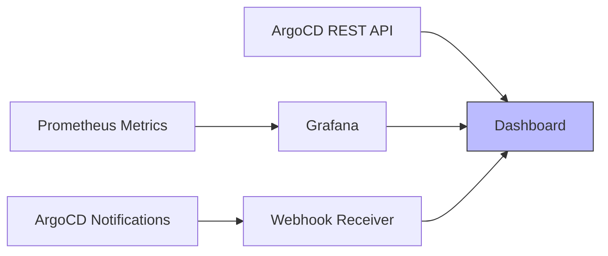

# How to Create Custom Dashboards Using ArgoCD API

Author: [nawazdhandala](https://github.com/nawazdhandala)

Tags: ArgoCD, GitOps, Kubernetes, API, Monitoring

Description: Build custom deployment dashboards by querying ArgoCD's REST API and Prometheus metrics to visualize application health, sync status, and deployment history.

---

The ArgoCD web UI is great for day-to-day operations, but teams often need custom dashboards tailored to their specific workflows. Maybe you want a TV dashboard showing the deployment status across all environments, a manager-friendly view that hides Kubernetes complexity, or a team-specific board that only shows relevant applications.

ArgoCD's REST API and Prometheus metrics give you everything you need to build custom dashboards. This post shows you how to pull the right data and structure it for common dashboard use cases.

## Data Sources

You have three data sources for ArgoCD dashboards: the REST API for real-time application state, Prometheus metrics for historical trends and aggregates, and the event/notification system for deployment activity feeds.



## Fetching Application Health Overview

The most common dashboard panel shows the health and sync status of all applications at a glance. Here is how to fetch that data.

```bash
# Fetch all applications with their status
# Returns name, sync status, health status, and last sync time
curl -s -k "$ARGOCD_URL/api/v1/applications" \
  -H "$AUTH_HEADER" | jq '[.items[] | {
    name: .metadata.name,
    project: .spec.project,
    sync: .status.sync.status,
    health: .status.health.status,
    cluster: .spec.destination.server,
    namespace: .spec.destination.namespace,
    lastSync: .status.operationState.finishedAt,
    revision: .status.sync.revision[0:7]
  }]'
```

For a Python-based dashboard backend, you might structure this as follows.

```python
# dashboard_api.py
# Backend service that aggregates ArgoCD data for the dashboard
import requests
from collections import Counter
from datetime import datetime

class ArgoCDClient:
    def __init__(self, url, token):
        self.url = url.rstrip('/')
        self.headers = {
            'Authorization': f'Bearer {token}',
            'Content-Type': 'application/json'
        }
        # Disable SSL verification for internal clusters
        self.verify = False

    def get_applications(self, project=None):
        """Fetch all applications, optionally filtered by project."""
        params = {}
        if project:
            params['projects'] = project
        resp = requests.get(
            f'{self.url}/api/v1/applications',
            headers=self.headers,
            params=params,
            verify=self.verify
        )
        resp.raise_for_status()
        return resp.json().get('items', [])

    def get_app_summary(self):
        """Generate a summary of all application statuses."""
        apps = self.get_applications()
        summary = {
            'total': len(apps),
            'healthy': 0,
            'degraded': 0,
            'progressing': 0,
            'unknown': 0,
            'synced': 0,
            'out_of_sync': 0,
            'apps': []
        }

        for app in apps:
            health = app.get('status', {}).get('health', {}).get('status', 'Unknown')
            sync = app.get('status', {}).get('sync', {}).get('status', 'Unknown')

            # Count health statuses
            if health == 'Healthy':
                summary['healthy'] += 1
            elif health == 'Degraded':
                summary['degraded'] += 1
            elif health == 'Progressing':
                summary['progressing'] += 1
            else:
                summary['unknown'] += 1

            # Count sync statuses
            if sync == 'Synced':
                summary['synced'] += 1
            else:
                summary['out_of_sync'] += 1

            summary['apps'].append({
                'name': app['metadata']['name'],
                'project': app['spec'].get('project', 'default'),
                'health': health,
                'sync': sync,
                'cluster': app['spec']['destination'].get('server', ''),
                'namespace': app['spec']['destination'].get('namespace', ''),
            })

        return summary
```

## Building a Grafana Dashboard with Prometheus Metrics

ArgoCD exposes rich Prometheus metrics that are perfect for Grafana dashboards. Here are the key metrics and queries.

### Application Health Overview Panel

```promql
# Count of applications by health status
# Use as a stat panel or pie chart
count by (health_status) (argocd_app_info)
```

### Sync Status Distribution

```promql
# Applications grouped by sync status
count by (sync_status) (argocd_app_info)
```

### Sync Operations Over Time

```promql
# Rate of sync operations per hour, broken down by result
sum by (phase) (rate(argocd_app_sync_total[1h])) * 3600
```

### Cluster API Server Latency

```promql
# P95 latency for API calls to each cluster
histogram_quantile(0.95,
  sum by (server, le) (
    rate(argocd_cluster_api_server_requests_duration_seconds_bucket[5m])
  )
)
```

### Repo Server Manifest Generation Time

```promql
# Average time to generate manifests per repo
avg by (repo) (
  rate(argocd_repo_server_generate_manifest_seconds_sum[5m])
  /
  rate(argocd_repo_server_generate_manifest_seconds_count[5m])
)
```

## Custom Grafana Dashboard JSON

Here is a Grafana dashboard configuration you can import directly.

```json
{
  "dashboard": {
    "title": "ArgoCD Deployment Overview",
    "panels": [
      {
        "title": "Application Health",
        "type": "piechart",
        "targets": [
          {
            "expr": "count by (health_status) (argocd_app_info)",
            "legendFormat": "{{health_status}}"
          }
        ],
        "fieldConfig": {
          "overrides": [
            {"matcher": {"id": "byName", "options": "Healthy"}, "properties": [{"id": "color", "value": {"fixedColor": "green"}}]},
            {"matcher": {"id": "byName", "options": "Degraded"}, "properties": [{"id": "color", "value": {"fixedColor": "red"}}]},
            {"matcher": {"id": "byName", "options": "Progressing"}, "properties": [{"id": "color", "value": {"fixedColor": "yellow"}}]}
          ]
        },
        "gridPos": {"h": 8, "w": 6, "x": 0, "y": 0}
      },
      {
        "title": "Sync Operations (24h)",
        "type": "timeseries",
        "targets": [
          {
            "expr": "sum by (phase) (rate(argocd_app_sync_total[1h])) * 3600",
            "legendFormat": "{{phase}}"
          }
        ],
        "gridPos": {"h": 8, "w": 12, "x": 6, "y": 0}
      },
      {
        "title": "Out of Sync Applications",
        "type": "table",
        "targets": [
          {
            "expr": "argocd_app_info{sync_status=\"OutOfSync\"} == 1",
            "format": "table",
            "instant": true
          }
        ],
        "gridPos": {"h": 8, "w": 18, "x": 0, "y": 8}
      }
    ]
  }
}
```

## Building a Deployment Timeline

To show a timeline of recent deployments, query the application's operation history through the API.

```bash
# Get the operation history for an application
curl -s -k "$ARGOCD_URL/api/v1/applications/my-web-app" \
  -H "$AUTH_HEADER" | jq '[.status.history[] | {
    revision: .revision[0:7],
    deployedAt: .deployedAt,
    source: .source.path
  }] | sort_by(.deployedAt) | reverse'
```

For a fleet-wide deployment timeline, iterate over all applications.

```python
def get_deployment_timeline(client, hours=24):
    """Get recent deployments across all applications."""
    apps = client.get_applications()
    deployments = []

    for app in apps:
        history = app.get('status', {}).get('history', [])
        for entry in history:
            deployed_at = entry.get('deployedAt', '')
            if deployed_at:
                deployments.append({
                    'app': app['metadata']['name'],
                    'revision': entry.get('revision', '')[:7],
                    'deployed_at': deployed_at,
                    'source': entry.get('source', {}).get('path', ''),
                })

    # Sort by deployment time, newest first
    deployments.sort(key=lambda x: x['deployed_at'], reverse=True)
    return deployments
```

## Environment Comparison View

A common dashboard need is comparing what version is deployed across environments - dev, staging, and production.

```python
def get_environment_comparison(client):
    """Compare app versions across environments."""
    apps = client.get_applications()
    comparison = {}

    for app in apps:
        name = app['metadata']['name']
        project = app['spec'].get('project', 'default')

        # Extract environment from project or labels
        env = project  # Or use labels/annotations
        base_name = name.replace(f'-{env}', '')

        if base_name not in comparison:
            comparison[base_name] = {}

        sync = app.get('status', {}).get('sync', {})
        comparison[base_name][env] = {
            'revision': sync.get('revision', 'unknown')[:7],
            'status': sync.get('status', 'Unknown'),
            'health': app.get('status', {}).get('health', {}).get('status', 'Unknown'),
        }

    return comparison
```

This produces output like the following, which you can render as a comparison table.

```json
{
  "web-app": {
    "dev": {"revision": "abc1234", "status": "Synced", "health": "Healthy"},
    "staging": {"revision": "abc1234", "status": "Synced", "health": "Healthy"},
    "production": {"revision": "def5678", "status": "Synced", "health": "Healthy"}
  }
}
```

## Auto-Refreshing Dashboard with WebSocket

For real-time updates without polling, use ArgoCD's watch endpoint.

```bash
# Watch for real-time application changes (Server-Sent Events)
curl -s -k -N "$ARGOCD_URL/api/v1/stream/applications?name=my-web-app" \
  -H "$AUTH_HEADER"
```

This streams JSON events whenever the application state changes, which is perfect for updating a dashboard in real-time without polling.

## Wrapping Up

Building custom dashboards with ArgoCD data gives your team visibility tailored to their needs. Use the REST API for real-time application state, Prometheus metrics through Grafana for historical trends and aggregates, and the streaming endpoint for real-time updates. The Python client patterns shown here can be adapted to any dashboard framework, whether you are building a web app with React, a TV dashboard with Grafana, or a Slack integration that posts status updates. For tracking deployments over time, see also [how to use the ArgoCD API for deployment tracking](https://oneuptime.com/blog/post/2026-02-26-how-to-use-argocd-api-for-deployment-tracking/view).
