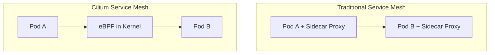

# How to Deploy Cilium Service Mesh with ArgoCD

Author: [nawazdhandala](https://github.com/nawazdhandala)

Tags: ArgoCD, GitOps, Kubernetes, Cilium, Service Mesh

Description: Learn how to deploy Cilium service mesh with ArgoCD for eBPF-powered networking, mTLS, L7 traffic management, and observability without sidecars.

---

Cilium is a unique service mesh that uses eBPF to provide networking, security, and observability directly in the Linux kernel. Unlike Istio or Linkerd, Cilium does not use sidecar proxies - its mesh features run at the kernel level on each node, reducing per-pod overhead significantly. Deploying Cilium with ArgoCD gives you a GitOps-managed service mesh that doubles as your CNI plugin.

This guide covers deploying Cilium's service mesh capabilities with ArgoCD.

## Why Cilium Service Mesh?

Traditional service meshes inject a sidecar proxy (Envoy) into every pod. This adds CPU, memory, and latency overhead per pod. Cilium takes a different approach:

- **eBPF-based**: Networking happens in the kernel, not in userspace sidecars
- **No sidecars needed**: mTLS, L7 policies, and observability work without per-pod proxies
- **CNI + Service Mesh**: One tool replaces both your CNI plugin and service mesh
- **Lower resource overhead**: No extra containers per pod



## Prerequisites

Cilium replaces your CNI plugin, so you need to deploy it either:

- During cluster creation (before any other CNI is installed)
- By replacing an existing CNI (which requires node restarts)

For EKS, you can create clusters without a default CNI:

```bash
eksctl create cluster \
  --name my-cluster \
  --version 1.29 \
  --without-nodegroup \
  --vpc-cni-addon=false

eksctl create nodegroup \
  --cluster my-cluster \
  --name main \
  --node-type m6i.xlarge \
  --nodes 3
```

## Step 1: Deploy Cilium as CNI + Service Mesh

Deploy Cilium with service mesh features enabled:

```yaml
apiVersion: argoproj.io/v1alpha1
kind: Application
metadata:
  name: cilium
  namespace: argocd
  annotations:
    argocd.argoproj.io/sync-wave: "-5"
spec:
  project: default
  source:
    repoURL: https://helm.cilium.io/
    chart: cilium
    targetRevision: 1.15.0
    helm:
      values: |
        # Cluster identification
        cluster:
          name: my-cluster
          id: 1

        # Kubernetes configuration
        kubeProxyReplacement: true
        k8sServiceHost: <API_SERVER_HOST>
        k8sServicePort: "443"

        # Service mesh features
        # Enable Envoy-based L7 proxy (per-node, not per-pod)
        envoy:
          enabled: true

        # Enable mutual TLS
        authentication:
          mutual:
            spiffe:
              enabled: true
              install:
                enabled: true

        # Hubble observability
        hubble:
          enabled: true
          relay:
            enabled: true
            replicas: 2
          ui:
            enabled: true
            replicas: 2
          metrics:
            enabled:
              - dns
              - drop
              - tcp
              - flow
              - port-distribution
              - icmp
              - httpV2:exemplars=true;labelsContext=source_ip,source_namespace,source_workload,destination_ip,destination_namespace,destination_workload,traffic_direction

        # Ingress controller (optional - replaces nginx/traefik)
        ingressController:
          enabled: true
          default: true
          loadbalancerMode: dedicated

        # Gateway API support
        gatewayAPI:
          enabled: true

        # IP address management
        ipam:
          mode: kubernetes

        # Operator configuration
        operator:
          replicas: 2
          resources:
            requests:
              cpu: 100m
              memory: 128Mi
            limits:
              memory: 256Mi

        # Agent resources
        resources:
          requests:
            cpu: 100m
            memory: 256Mi
          limits:
            memory: 512Mi

        # Enable Prometheus metrics
        prometheus:
          enabled: true
          serviceMonitor:
            enabled: true
  destination:
    server: https://kubernetes.default.svc
    namespace: kube-system
  syncPolicy:
    automated:
      prune: true
      selfHeal: true
    syncOptions:
      - ServerSideApply=true
    retry:
      limit: 10
      backoff:
        duration: 10s
        factor: 2
        maxDuration: 5m
```

## Step 2: Verify Cilium Installation

After deployment, verify Cilium is healthy:

```bash
# Check Cilium status
cilium status

# Run connectivity test
cilium connectivity test

# Check Hubble
hubble status
hubble observe --follow
```

## Step 3: Configure L7 Network Policies

Cilium's L7 network policies give you service mesh traffic control without sidecars:

```yaml
apiVersion: cilium.io/v2
kind: CiliumNetworkPolicy
metadata:
  name: api-l7-policy
  namespace: api
  annotations:
    argocd.argoproj.io/sync-wave: "0"
spec:
  endpointSelector:
    matchLabels:
      app: api-service
  ingress:
    - fromEndpoints:
        - matchLabels:
            app: web-frontend
      toPorts:
        - ports:
            - port: "8080"
              protocol: TCP
          rules:
            http:
              # Only allow specific HTTP methods and paths
              - method: "GET"
                path: "/api/v1/.*"
              - method: "POST"
                path: "/api/v1/users"
              - method: "GET"
                path: "/health"
    # Allow monitoring to scrape metrics
    - fromEndpoints:
        - matchLabels:
            app: prometheus
      toPorts:
        - ports:
            - port: "9090"
              protocol: TCP
```

## Step 4: Enable mTLS

Cilium's mutual TLS uses SPIFFE identities:

```yaml
apiVersion: cilium.io/v2
kind: CiliumNetworkPolicy
metadata:
  name: require-mtls
  namespace: api
spec:
  endpointSelector:
    matchLabels:
      app: api-service
  ingress:
    - fromEndpoints:
        - matchLabels:
            app: web-frontend
      authentication:
        mode: required  # Enforce mTLS
      toPorts:
        - ports:
            - port: "8080"
              protocol: TCP
```

Verify mTLS is working:

```bash
# Check authentication status
hubble observe --namespace api --type auth

# View SPIFFE identities
cilium identity list
```

## Step 5: Configure Ingress with Cilium

Cilium can serve as your ingress controller, eliminating the need for nginx or traefik:

```yaml
apiVersion: networking.k8s.io/v1
kind: Ingress
metadata:
  name: api-ingress
  namespace: api
  annotations:
    # Use Cilium as ingress controller
    ingressClassName: cilium
spec:
  rules:
    - host: api.example.com
      http:
        paths:
          - path: /
            pathType: Prefix
            backend:
              service:
                name: api-service
                port:
                  number: 8080
  tls:
    - hosts:
        - api.example.com
      secretName: api-tls
```

Or use the Gateway API for more advanced routing:

```yaml
apiVersion: gateway.networking.k8s.io/v1
kind: Gateway
metadata:
  name: api-gateway
  namespace: api
spec:
  gatewayClassName: cilium
  listeners:
    - name: https
      protocol: HTTPS
      port: 443
      tls:
        mode: Terminate
        certificateRefs:
          - name: api-tls
      allowedRoutes:
        namespaces:
          from: Same
---
apiVersion: gateway.networking.k8s.io/v1
kind: HTTPRoute
metadata:
  name: api-routes
  namespace: api
spec:
  parentRefs:
    - name: api-gateway
  rules:
    - matches:
        - path:
            type: PathPrefix
            value: /api/v1
      backendRefs:
        - name: api-service
          port: 8080
    - matches:
        - path:
            type: PathPrefix
            value: /api/v2
      backendRefs:
        - name: api-service-v2
          port: 8080
```

## Step 6: Set Up Hubble Observability

Hubble provides deep network and application observability. Deploy the Hubble UI and configure metrics:

```yaml
# ServiceMonitor for Cilium and Hubble metrics
apiVersion: monitoring.coreos.com/v1
kind: ServiceMonitor
metadata:
  name: cilium-metrics
  namespace: kube-system
spec:
  selector:
    matchLabels:
      k8s-app: cilium
  endpoints:
    - port: prometheus
      interval: 15s
---
apiVersion: monitoring.coreos.com/v1
kind: ServiceMonitor
metadata:
  name: hubble-metrics
  namespace: kube-system
spec:
  selector:
    matchLabels:
      k8s-app: hubble
  endpoints:
    - port: metrics
      interval: 15s
```

Create Grafana dashboards for Cilium metrics:

```yaml
apiVersion: v1
kind: ConfigMap
metadata:
  name: cilium-dashboard
  namespace: monitoring
  labels:
    grafana_dashboard: "1"
data:
  cilium-dashboard.json: |
    {
      "dashboard": {
        "title": "Cilium Service Mesh",
        "panels": [
          {
            "title": "HTTP Request Rate by Service",
            "targets": [
              {
                "expr": "sum(rate(hubble_http_requests_total[5m])) by (destination_workload)"
              }
            ]
          },
          {
            "title": "HTTP Error Rate",
            "targets": [
              {
                "expr": "sum(rate(hubble_http_requests_total{http_status=~\"5..\"}[5m])) by (destination_workload) / sum(rate(hubble_http_requests_total[5m])) by (destination_workload)"
              }
            ]
          }
        ]
      }
    }
```

## Step 7: Traffic Management

Cilium supports canary deployments through L7 load balancing:

```yaml
apiVersion: cilium.io/v2
kind: CiliumEnvoyConfig
metadata:
  name: api-canary
  namespace: api
spec:
  services:
    - name: api-service
      namespace: api
  backendServices:
    - name: api-service-stable
      namespace: api
    - name: api-service-canary
      namespace: api
  resources:
    - "@type": type.googleapis.com/envoy.config.listener.v3.Listener
      name: api-listener
      filter_chains:
        - filters:
            - name: envoy.filters.network.http_connection_manager
              typed_config:
                "@type": type.googleapis.com/envoy.extensions.filters.network.http_connection_manager.v3.HttpConnectionManager
                route_config:
                  virtual_hosts:
                    - name: api
                      routes:
                        - match:
                            prefix: "/"
                          route:
                            weighted_clusters:
                              clusters:
                                - name: api-service-stable
                                  weight: 90
                                - name: api-service-canary
                                  weight: 10
```

## Custom Health Checks for ArgoCD

```yaml
apiVersion: v1
kind: ConfigMap
metadata:
  name: argocd-cm
  namespace: argocd
data:
  resource.customizations.health.cilium.io_CiliumNetworkPolicy: |
    hs = {}
    hs.status = "Healthy"
    hs.message = "CiliumNetworkPolicy is applied"
    return hs

  resource.customizations.health.cilium.io_CiliumClusterwideNetworkPolicy: |
    hs = {}
    hs.status = "Healthy"
    hs.message = "CiliumClusterwideNetworkPolicy is applied"
    return hs
```

## Handling ArgoCD Diff Issues

Cilium adds annotations and labels to pods. Configure ArgoCD to ignore these:

```yaml
spec:
  ignoreDifferences:
    - group: ""
      kind: Pod
      jqPathExpressions:
        - .metadata.annotations["cilium.io/.*"]
    - group: ""
      kind: Node
      jqPathExpressions:
        - .metadata.annotations["network.cilium.io/.*"]
```

## Multi-Cluster Cilium Mesh

Cilium supports cluster mesh for cross-cluster connectivity. Deploy Cilium Cluster Mesh via ArgoCD:

```yaml
# Enable Cluster Mesh in the Cilium Helm values
clustermesh:
  useAPIServer: true
  apiserver:
    replicas: 2
    resources:
      requests:
        cpu: 100m
        memory: 128Mi
```

Connect clusters:

```bash
# Enable cluster mesh
cilium clustermesh enable

# Connect to another cluster
cilium clustermesh connect --destination-context cluster-b
```

## Summary

Cilium service mesh with ArgoCD gives you eBPF-powered networking, security, and observability managed through GitOps. The sidecar-free architecture reduces per-pod overhead, and Cilium's dual role as CNI and service mesh simplifies your stack. Deploy Cilium as a Helm chart through ArgoCD, configure L7 policies and mTLS through CiliumNetworkPolicy resources, and use Hubble for deep observability. For comparison with sidecar-based meshes, see our guides on [deploying Linkerd with ArgoCD](https://oneuptime.com/blog/post/2026-02-26-how-to-deploy-linkerd-with-argocd/view) and [managing Linkerd configuration](https://oneuptime.com/blog/post/2026-02-26-how-to-manage-linkerd-configuration-with-argocd/view).
