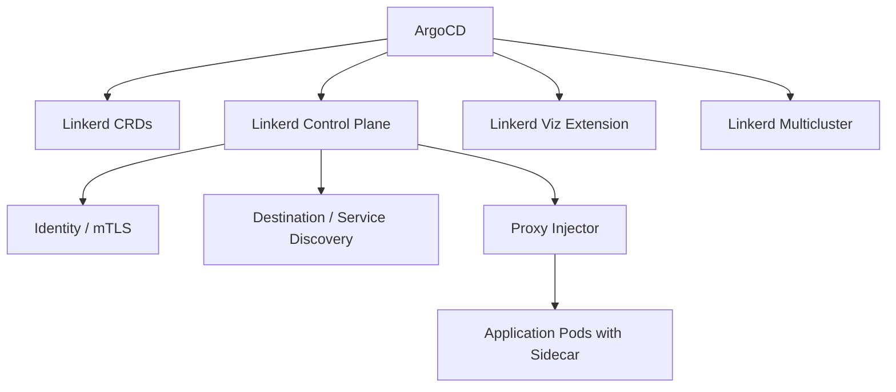

# How to Deploy Linkerd with ArgoCD

Author: [nawazdhandala](https://github.com/nawazdhandala)

Tags: ArgoCD, GitOps, Kubernetes, Linkerd, Service Mesh

Description: Learn how to deploy Linkerd service mesh with ArgoCD for GitOps-managed mTLS, traffic management, and observability, including certificate handling and lifecycle management.

---

Linkerd is a lightweight service mesh for Kubernetes that provides mutual TLS, traffic management, observability, and reliability features without the complexity of heavier meshes. Deploying Linkerd with ArgoCD gives you a fully GitOps-managed service mesh where trust anchor rotations, proxy configurations, and traffic policies are all tracked in Git.

This guide covers deploying Linkerd with ArgoCD from scratch, including the tricky parts like certificate management.

## Why Linkerd with ArgoCD?

Linkerd's lightweight design makes it a great fit for teams that want service mesh features without the operational overhead of Istio. But even Linkerd has lifecycle challenges - certificate rotations, proxy upgrades, and configuration management. ArgoCD solves these by making every change go through Git.

## Architecture Overview



Linkerd has three main deployment phases:

1. **CRDs**: Custom Resource Definitions
2. **Control Plane**: Core Linkerd components (identity, destination, proxy-injector)
3. **Extensions**: Viz (dashboard/metrics), Multicluster, Jaeger

## Step 1: Generate Trust Anchor Certificate

Linkerd uses a trust anchor certificate for mTLS. You must generate this before deploying:

```bash
# Generate trust anchor (CA) certificate
# This is the root of trust for your mesh
step certificate create root.linkerd.cluster.local ca.crt ca.key \
  --profile root-ca \
  --no-password \
  --insecure \
  --not-after 87600h  # 10 years

# Generate issuer certificate signed by the trust anchor
step certificate create identity.linkerd.cluster.local issuer.crt issuer.key \
  --profile intermediate-ca \
  --not-after 8760h \
  --no-password \
  --insecure \
  --ca ca.crt \
  --ca-key ca.key
```

Store the certificates securely. The trust anchor private key should be stored offline - you only need it to generate new issuer certificates.

Create a Kubernetes Secret for the issuer:

```yaml
apiVersion: v1
kind: Secret
metadata:
  name: linkerd-identity-issuer
  namespace: linkerd
type: kubernetes.io/tls
data:
  tls.crt: <base64-encoded-issuer.crt>
  tls.key: <base64-encoded-issuer.key>
  ca.crt: <base64-encoded-ca.crt>
```

For production, use the External Secrets Operator or Sealed Secrets to manage these certificates through GitOps without storing private keys in Git.

## Step 2: Deploy Linkerd CRDs

```yaml
apiVersion: argoproj.io/v1alpha1
kind: Application
metadata:
  name: linkerd-crds
  namespace: argocd
  annotations:
    argocd.argoproj.io/sync-wave: "-3"
spec:
  project: default
  source:
    repoURL: https://helm.linkerd.io/stable
    chart: linkerd-crds
    targetRevision: 1.8.0
  destination:
    server: https://kubernetes.default.svc
    namespace: linkerd
  syncPolicy:
    automated:
      selfHeal: true
    syncOptions:
      - CreateNamespace=true
      - ServerSideApply=true
      - Prune=false
```

## Step 3: Deploy Linkerd Control Plane

```yaml
apiVersion: argoproj.io/v1alpha1
kind: Application
metadata:
  name: linkerd-control-plane
  namespace: argocd
  annotations:
    argocd.argoproj.io/sync-wave: "-2"
spec:
  project: default
  source:
    repoURL: https://helm.linkerd.io/stable
    chart: linkerd-control-plane
    targetRevision: 1.16.0
    helm:
      values: |
        # Use externally managed certificates
        identity:
          externalCA: true
          issuer:
            scheme: kubernetes.io/tls

        # Trust anchor - the CA certificate (NOT the private key)
        identityTrustAnchorsPEM: |
          -----BEGIN CERTIFICATE-----
          <your-ca-certificate-here>
          -----END CERTIFICATE-----

        # Proxy configuration
        proxy:
          resources:
            cpu:
              request: 100m
              limit: "1"
            memory:
              request: 128Mi
              limit: 256Mi
          # Log level
          logLevel: warn,linkerd=info

        # Controller resources
        controllerResources: &controller_resources
          cpu:
            request: 100m
            limit: "1"
          memory:
            request: 128Mi
            limit: 256Mi

        # Destination controller
        destination:
          resources: *controller_resources

        # Identity controller
        identity:
          resources: *controller_resources

        # Proxy injector
        proxyInjector:
          resources: *controller_resources

        # High availability
        enablePodAntiAffinity: true
        controllerReplicas: 2

        # Prometheus integration
        prometheusUrl: http://prometheus-operated.monitoring.svc:9090
  destination:
    server: https://kubernetes.default.svc
    namespace: linkerd
  syncPolicy:
    automated:
      prune: true
      selfHeal: true
    syncOptions:
      - CreateNamespace=true
      - ServerSideApply=true
    retry:
      limit: 5
      backoff:
        duration: 5s
        factor: 2
        maxDuration: 3m
```

## Step 4: Deploy Linkerd Viz Extension

The Viz extension provides the Linkerd dashboard and Prometheus-based metrics:

```yaml
apiVersion: argoproj.io/v1alpha1
kind: Application
metadata:
  name: linkerd-viz
  namespace: argocd
  annotations:
    argocd.argoproj.io/sync-wave: "-1"
spec:
  project: default
  source:
    repoURL: https://helm.linkerd.io/stable
    chart: linkerd-viz
    targetRevision: 30.12.0
    helm:
      values: |
        # Use existing Prometheus
        prometheus:
          enabled: false
        prometheusUrl: http://prometheus-operated.monitoring.svc:9090

        # Dashboard configuration
        dashboard:
          replicas: 2
          resources:
            cpu:
              request: 100m
            memory:
              request: 128Mi
              limit: 256Mi

        # Tap configuration for live traffic inspection
        tap:
          replicas: 2
          resources:
            cpu:
              request: 100m
            memory:
              request: 128Mi

        # Metrics API
        metricsAPI:
          replicas: 2
          resources:
            cpu:
              request: 100m
            memory:
              request: 128Mi
  destination:
    server: https://kubernetes.default.svc
    namespace: linkerd-viz
  syncPolicy:
    automated:
      prune: true
      selfHeal: true
    syncOptions:
      - CreateNamespace=true
```

## Step 5: Enable Mesh Injection for Applications

Linkerd uses annotations to inject the sidecar proxy. You can enable it at the namespace level:

```yaml
apiVersion: v1
kind: Namespace
metadata:
  name: my-application
  annotations:
    linkerd.io/inject: enabled
```

Or at the deployment level:

```yaml
apiVersion: apps/v1
kind: Deployment
metadata:
  name: api
  namespace: my-application
spec:
  template:
    metadata:
      annotations:
        linkerd.io/inject: enabled
        # Optional: configure proxy
        config.linkerd.io/proxy-cpu-request: "100m"
        config.linkerd.io/proxy-memory-request: "128Mi"
        config.linkerd.io/proxy-log-level: "warn"
```

Manage namespace injection through ArgoCD:

```yaml
apiVersion: argoproj.io/v1alpha1
kind: ApplicationSet
metadata:
  name: namespace-config
  namespace: argocd
spec:
  generators:
    - list:
        elements:
          - namespace: api
            inject: enabled
          - namespace: web
            inject: enabled
          - namespace: batch
            inject: disabled
  template:
    metadata:
      name: 'ns-{{namespace}}'
    spec:
      project: default
      source:
        repoURL: https://github.com/myorg/platform.git
        targetRevision: main
        path: namespaces/{{namespace}}
      destination:
        server: https://kubernetes.default.svc
        namespace: '{{namespace}}'
```

## Step 6: Configure Traffic Policies

Linkerd uses Server and ServerAuthorization resources for traffic policy:

```yaml
# Allow only meshed traffic to the API service
apiVersion: policy.linkerd.io/v1beta2
kind: Server
metadata:
  name: api-server
  namespace: api
  annotations:
    argocd.argoproj.io/sync-wave: "1"
spec:
  podSelector:
    matchLabels:
      app: api
  port: http
  proxyProtocol: HTTP/2
---
apiVersion: policy.linkerd.io/v1beta2
kind: ServerAuthorization
metadata:
  name: api-authz
  namespace: api
  annotations:
    argocd.argoproj.io/sync-wave: "1"
spec:
  server:
    name: api-server
  client:
    # Only allow authenticated (meshed) clients
    meshTLS:
      serviceAccounts:
        - name: web-app
          namespace: web
        - name: mobile-bff
          namespace: api
```

## Certificate Rotation

One of the biggest operational challenges with Linkerd is certificate rotation. The issuer certificate must be rotated before it expires.

### Automated Rotation with cert-manager

```yaml
# Use cert-manager to manage Linkerd's issuer certificate
apiVersion: cert-manager.io/v1
kind: Certificate
metadata:
  name: linkerd-identity-issuer
  namespace: linkerd
spec:
  secretName: linkerd-identity-issuer
  duration: 2160h  # 90 days
  renewBefore: 720h  # 30 days before expiry
  issuerRef:
    name: linkerd-trust-anchor
    kind: Issuer
  commonName: identity.linkerd.cluster.local
  isCA: true
  privateKey:
    algorithm: ECDSA
  usages:
    - cert sign
    - crl sign
    - server auth
    - client auth
---
apiVersion: cert-manager.io/v1
kind: Issuer
metadata:
  name: linkerd-trust-anchor
  namespace: linkerd
spec:
  ca:
    secretName: linkerd-trust-anchor
```

## Custom Health Checks

```yaml
apiVersion: v1
kind: ConfigMap
metadata:
  name: argocd-cm
  namespace: argocd
data:
  resource.customizations.health.policy.linkerd.io_Server: |
    hs = {}
    hs.status = "Healthy"
    hs.message = "Server policy is configured"
    return hs

  resource.customizations.health.policy.linkerd.io_ServerAuthorization: |
    hs = {}
    hs.status = "Healthy"
    hs.message = "ServerAuthorization is configured"
    return hs
```

## Verifying the Mesh

After deployment, verify Linkerd is working:

```bash
# Check Linkerd control plane health
linkerd check

# Check proxy injection on a namespace
linkerd check --proxy -n my-application

# View live traffic
linkerd viz top deploy/api -n my-application

# Check mTLS status
linkerd viz edges deploy -n my-application
```

## Handling ArgoCD Diff Issues

Linkerd's proxy injector modifies pod specs, which can cause ArgoCD to show resources as OutOfSync. Configure ArgoCD to ignore injected fields:

```yaml
spec:
  ignoreDifferences:
    - group: apps
      kind: Deployment
      jqPathExpressions:
        - .spec.template.metadata.annotations["linkerd.io/proxy-version"]
        - .spec.template.spec.initContainers
        - '.spec.template.spec.containers[] | select(.name == "linkerd-proxy")'
```

## Summary

Deploying Linkerd with ArgoCD gives you a lightweight, GitOps-managed service mesh. The key steps are: generate trust anchor certificates, deploy CRDs and control plane with sync waves, manage certificate rotation with cert-manager, and configure traffic policies through Git. Linkerd's simplicity makes it well-suited for teams that want mTLS and observability without the complexity of heavier meshes. For more on deploying operators with ArgoCD, see our guide on [deploying Kubernetes operators with ArgoCD](https://oneuptime.com/blog/post/2026-02-26-how-to-deploy-kubernetes-operators-with-argocd/view).
