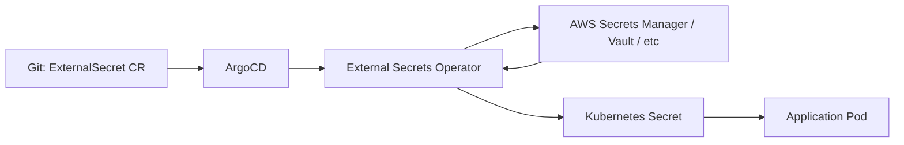

# How to Deploy the External Secrets Operator with ArgoCD

Author: [nawazdhandala](https://github.com/nawazdhandala)

Tags: ArgoCD, GitOps, Kubernetes, External Secrets, Security

Description: Learn how to deploy the External Secrets Operator with ArgoCD to sync secrets from AWS Secrets Manager, HashiCorp Vault, and other providers into Kubernetes.

---

The External Secrets Operator (ESO) bridges the gap between external secret management systems and Kubernetes Secrets. It lets you store sensitive data in providers like AWS Secrets Manager, HashiCorp Vault, Google Secret Manager, or Azure Key Vault, and automatically syncs them into Kubernetes Secrets. Deploying ESO with ArgoCD means your entire secrets pipeline is managed through GitOps - without ever putting actual secret values in Git.

## The Secret Management Problem

In a GitOps workflow, everything should live in Git. But secrets are the exception. You cannot store database passwords, API keys, or TLS private keys in a Git repository. The External Secrets Operator solves this by letting you define ExternalSecret resources in Git that reference secrets stored in an external provider. The operator then creates and manages the actual Kubernetes Secrets.

The flow looks like this:



## Step 1: Deploy ESO CRDs

As with any operator, start with the CRDs:

```yaml
apiVersion: argoproj.io/v1alpha1
kind: Application
metadata:
  name: external-secrets-crds
  namespace: argocd
  annotations:
    argocd.argoproj.io/sync-wave: "-2"
spec:
  project: default
  source:
    repoURL: https://charts.external-secrets.io
    chart: external-secrets
    targetRevision: 0.9.11
    helm:
      values: |
        # Only install CRDs, nothing else
        installCRDs: true
        crds:
          createClusterExternalSecret: true
          createClusterSecretStore: true
        webhook:
          create: false
        certController:
          create: false
        serviceAccount:
          create: false
  destination:
    server: https://kubernetes.default.svc
    namespace: external-secrets
  syncPolicy:
    automated:
      selfHeal: true
    syncOptions:
      - CreateNamespace=true
      - ServerSideApply=true
```

Alternatively, manage CRDs from the Git repository directly:

```yaml
apiVersion: argoproj.io/v1alpha1
kind: Application
metadata:
  name: external-secrets-crds
  namespace: argocd
  annotations:
    argocd.argoproj.io/sync-wave: "-2"
spec:
  project: default
  source:
    repoURL: https://github.com/external-secrets/external-secrets.git
    targetRevision: v0.9.11
    path: deploy/crds
  destination:
    server: https://kubernetes.default.svc
  syncPolicy:
    automated:
      selfHeal: true
    syncOptions:
      - ServerSideApply=true
      - Prune=false
```

## Step 2: Deploy the External Secrets Operator

```yaml
apiVersion: argoproj.io/v1alpha1
kind: Application
metadata:
  name: external-secrets
  namespace: argocd
  annotations:
    argocd.argoproj.io/sync-wave: "-1"
spec:
  project: default
  source:
    repoURL: https://charts.external-secrets.io
    chart: external-secrets
    targetRevision: 0.9.11
    helm:
      values: |
        installCRDs: false

        # Operator configuration
        resources:
          requests:
            cpu: 50m
            memory: 128Mi
          limits:
            memory: 256Mi

        # Webhook for validation
        webhook:
          resources:
            requests:
              cpu: 25m
              memory: 64Mi
            limits:
              memory: 128Mi

        # Cert controller manages webhook certificates
        certController:
          resources:
            requests:
              cpu: 25m
              memory: 64Mi
            limits:
              memory: 128Mi

        # Metrics for monitoring
        serviceMonitor:
          enabled: true

        # Use IRSA on AWS
        serviceAccount:
          annotations:
            eks.amazonaws.com/role-arn: arn:aws:iam::123456789012:role/external-secrets
  destination:
    server: https://kubernetes.default.svc
    namespace: external-secrets
  syncPolicy:
    automated:
      prune: true
      selfHeal: true
    syncOptions:
      - CreateNamespace=true
    retry:
      limit: 5
      backoff:
        duration: 5s
        factor: 2
        maxDuration: 3m
```

## Step 3: Configure SecretStores

SecretStores define how ESO connects to your external secret provider. For a cluster-wide store, use ClusterSecretStore.

### AWS Secrets Manager with IRSA

```yaml
apiVersion: external-secrets.io/v1beta1
kind: ClusterSecretStore
metadata:
  name: aws-secrets-manager
  annotations:
    argocd.argoproj.io/sync-wave: "0"
spec:
  provider:
    aws:
      service: SecretsManager
      region: us-east-1
      auth:
        jwt:
          serviceAccountRef:
            name: external-secrets
            namespace: external-secrets
```

### HashiCorp Vault

```yaml
apiVersion: external-secrets.io/v1beta1
kind: ClusterSecretStore
metadata:
  name: vault-backend
  annotations:
    argocd.argoproj.io/sync-wave: "0"
spec:
  provider:
    vault:
      server: "https://vault.example.com"
      path: "secret"
      version: "v2"
      auth:
        kubernetes:
          mountPath: "kubernetes"
          role: "external-secrets"
          serviceAccountRef:
            name: external-secrets
            namespace: external-secrets
```

### Google Secret Manager

```yaml
apiVersion: external-secrets.io/v1beta1
kind: ClusterSecretStore
metadata:
  name: gcp-secret-manager
  annotations:
    argocd.argoproj.io/sync-wave: "0"
spec:
  provider:
    gcpsm:
      projectID: my-gcp-project
      auth:
        workloadIdentity:
          clusterLocation: us-central1
          clusterName: my-cluster
          clusterProjectID: my-gcp-project
          serviceAccountRef:
            name: external-secrets
            namespace: external-secrets
```

## Step 4: Define ExternalSecrets

Now you can create ExternalSecret resources in your application manifests. These live in Git and are safe to commit because they only contain references, not actual secret values.

```yaml
apiVersion: external-secrets.io/v1beta1
kind: ExternalSecret
metadata:
  name: database-credentials
  namespace: default
  annotations:
    argocd.argoproj.io/sync-wave: "1"
spec:
  refreshInterval: 1h
  secretStoreRef:
    name: aws-secrets-manager
    kind: ClusterSecretStore
  target:
    name: database-credentials
    creationPolicy: Owner
    template:
      type: Opaque
      data:
        # You can template the secret data
        DATABASE_URL: "postgresql://{{ .username }}:{{ .password }}@db.example.com:5432/mydb"
  data:
    - secretKey: username
      remoteRef:
        key: prod/database
        property: username
    - secretKey: password
      remoteRef:
        key: prod/database
        property: password
```

For pulling an entire JSON secret:

```yaml
apiVersion: external-secrets.io/v1beta1
kind: ExternalSecret
metadata:
  name: api-keys
  namespace: default
spec:
  refreshInterval: 30m
  secretStoreRef:
    name: aws-secrets-manager
    kind: ClusterSecretStore
  target:
    name: api-keys
    creationPolicy: Owner
  dataFrom:
    - extract:
        key: prod/api-keys
```

## Custom Health Checks

Add health checks so ArgoCD can track ExternalSecret sync status:

```yaml
apiVersion: v1
kind: ConfigMap
metadata:
  name: argocd-cm
  namespace: argocd
data:
  resource.customizations.health.external-secrets.io_ExternalSecret: |
    hs = {}
    if obj.status ~= nil then
      if obj.status.conditions ~= nil then
        for i, condition in ipairs(obj.status.conditions) do
          if condition.type == "Ready" then
            if condition.status == "True" then
              hs.status = "Healthy"
              hs.message = "Secret synced successfully"
            else
              hs.status = "Degraded"
              hs.message = condition.message or "Secret sync failed"
            end
            return hs
          end
        end
      end
    end
    hs.status = "Progressing"
    hs.message = "Waiting for secret sync"
    return hs

  resource.customizations.health.external-secrets.io_ClusterSecretStore: |
    hs = {}
    if obj.status ~= nil then
      if obj.status.conditions ~= nil then
        for i, condition in ipairs(obj.status.conditions) do
          if condition.type == "Ready" then
            if condition.status == "True" then
              hs.status = "Healthy"
              hs.message = "SecretStore is connected"
            else
              hs.status = "Degraded"
              hs.message = condition.message or "SecretStore connection failed"
            end
            return hs
          end
        end
      end
    end
    hs.status = "Progressing"
    hs.message = "Waiting for SecretStore"
    return hs
```

## Handling ArgoCD Diff Issues

ArgoCD will show managed Kubernetes Secrets as OutOfSync because ESO updates them outside of ArgoCD. You have two options:

Option 1 - Ignore the Secret resources created by ESO:

```yaml
# In the Application spec
spec:
  ignoreDifferences:
    - group: ""
      kind: Secret
      jsonPointers:
        - /data
```

Option 2 - Use resource tracking annotations so ArgoCD does not manage ESO-created Secrets at all. Since ESO creates the Secrets (not ArgoCD), ArgoCD should only track the ExternalSecret resource.

## Multi-Environment Setup

For multiple environments, use Kustomize overlays with different ExternalSecret configurations:

```yaml
# base/external-secret.yaml
apiVersion: external-secrets.io/v1beta1
kind: ExternalSecret
metadata:
  name: app-secrets
spec:
  refreshInterval: 1h
  secretStoreRef:
    name: aws-secrets-manager
    kind: ClusterSecretStore
  target:
    name: app-secrets
    creationPolicy: Owner
  data:
    - secretKey: db-password
      remoteRef:
        key: ENVIRONMENT/database
        property: password
```

```yaml
# overlays/production/kustomization.yaml
apiVersion: kustomize.config.k8s.io/v1beta1
kind: Kustomization
resources:
  - ../../base
patches:
  - target:
      kind: ExternalSecret
      name: app-secrets
    patch: |
      - op: replace
        path: /spec/data/0/remoteRef/key
        value: production/database
```

## Summary

The External Secrets Operator with ArgoCD gives you secure, GitOps-friendly secret management. You keep secret references in Git while actual values stay in your external provider. The key steps are: deploy CRDs and operator with sync waves, configure ClusterSecretStores for your providers, and define ExternalSecrets in your application manifests. Add custom health checks so ArgoCD can report on secret sync status. For more on operator deployment patterns, see our guide on [deploying Kubernetes operators with ArgoCD](https://oneuptime.com/blog/post/2026-02-26-how-to-deploy-kubernetes-operators-with-argocd/view).
