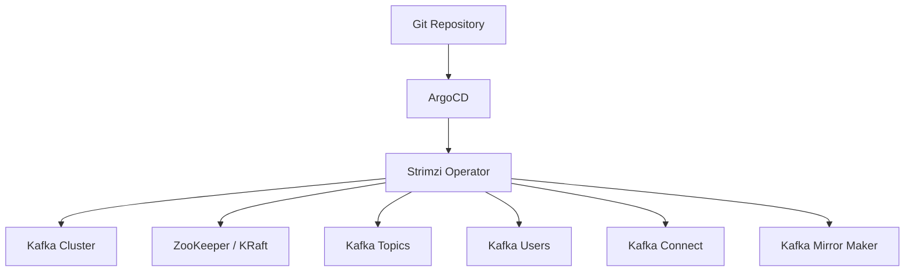

# How to Deploy the Strimzi Kafka Operator with ArgoCD

Author: [nawazdhandala](https://github.com/nawazdhandala)

Tags: ArgoCD, GitOps, Kubernetes, Kafka, Strimzi

Description: Learn how to deploy the Strimzi Kafka Operator with ArgoCD for GitOps-managed Kafka clusters, including topics, users, and connector management.

---

Running Apache Kafka on Kubernetes is complex. The Strimzi Kafka Operator simplifies this by providing Custom Resources for Kafka clusters, topics, users, and connectors. Combining Strimzi with ArgoCD gives you fully GitOps-managed Kafka infrastructure where every cluster configuration, topic definition, and user permission is version-controlled.

This guide walks through deploying Strimzi with ArgoCD and managing a production Kafka cluster.

## Why Strimzi with ArgoCD?

Without GitOps, Kafka cluster management often involves a mix of CLI commands, manual configuration, and ad-hoc changes. Strimzi already makes Kafka declarative, but adding ArgoCD completes the picture. Every change to your Kafka infrastructure goes through a pull request, gets reviewed, and is automatically applied.

## Architecture Overview



## Step 1: Deploy Strimzi CRDs

Strimzi has many CRDs. Deploy them first:

```yaml
apiVersion: argoproj.io/v1alpha1
kind: Application
metadata:
  name: strimzi-crds
  namespace: argocd
  annotations:
    argocd.argoproj.io/sync-wave: "-2"
spec:
  project: default
  source:
    repoURL: https://github.com/strimzi/strimzi-kafka-operator.git
    targetRevision: 0.39.0
    path: install/cluster-operator/
    directory:
      include: '*Crd*'
  destination:
    server: https://kubernetes.default.svc
  syncPolicy:
    automated:
      selfHeal: true
    syncOptions:
      - ServerSideApply=true
      - Replace=true
      - Prune=false
```

## Step 2: Deploy the Strimzi Operator

Deploy the operator using the Helm chart:

```yaml
apiVersion: argoproj.io/v1alpha1
kind: Application
metadata:
  name: strimzi-operator
  namespace: argocd
  annotations:
    argocd.argoproj.io/sync-wave: "-1"
spec:
  project: default
  source:
    repoURL: https://strimzi.io/charts/
    chart: strimzi-kafka-operator
    targetRevision: 0.39.0
    helm:
      values: |
        # Watch all namespaces
        watchAnyNamespace: true

        # Operator resources
        resources:
          requests:
            cpu: 200m
            memory: 384Mi
          limits:
            memory: 512Mi

        # Log level
        logLevel: INFO

        # Feature gates
        featureGates: "+UseKRaft,+KafkaNodePools"
  destination:
    server: https://kubernetes.default.svc
    namespace: strimzi-system
  syncPolicy:
    automated:
      prune: true
      selfHeal: true
    syncOptions:
      - CreateNamespace=true
    retry:
      limit: 5
      backoff:
        duration: 5s
        factor: 2
        maxDuration: 3m
```

## Step 3: Deploy a Kafka Cluster

Now define your Kafka cluster as a Custom Resource. This is the core of your GitOps-managed Kafka infrastructure:

```yaml
apiVersion: kafka.strimzi.io/v1beta2
kind: Kafka
metadata:
  name: production-kafka
  namespace: kafka
  annotations:
    argocd.argoproj.io/sync-wave: "0"
spec:
  kafka:
    version: 3.6.1
    replicas: 3
    listeners:
      - name: plain
        port: 9092
        type: internal
        tls: false
      - name: tls
        port: 9093
        type: internal
        tls: true
        authentication:
          type: tls
      - name: external
        port: 9094
        type: loadbalancer
        tls: true
        authentication:
          type: tls
    config:
      # Replication settings
      offsets.topic.replication.factor: 3
      transaction.state.log.replication.factor: 3
      transaction.state.log.min.isr: 2
      default.replication.factor: 3
      min.insync.replicas: 2
      # Performance settings
      num.partitions: 12
      log.retention.hours: 168
      log.segment.bytes: 1073741824
      # Inter-broker protocol
      inter.broker.protocol.version: "3.6"
    storage:
      type: jbod
      volumes:
        - id: 0
          type: persistent-claim
          size: 100Gi
          class: gp3
          deleteClaim: false
    resources:
      requests:
        cpu: "1"
        memory: 4Gi
      limits:
        memory: 6Gi
    jvmOptions:
      -Xms: 2048m
      -Xmx: 4096m
    metricsConfig:
      type: jmxPrometheusExporter
      valueFrom:
        configMapKeyRef:
          name: kafka-metrics
          key: kafka-metrics-config.yml
  zookeeper:
    replicas: 3
    storage:
      type: persistent-claim
      size: 20Gi
      class: gp3
      deleteClaim: false
    resources:
      requests:
        cpu: 500m
        memory: 1Gi
      limits:
        memory: 2Gi
  entityOperator:
    topicOperator:
      resources:
        requests:
          cpu: 100m
          memory: 256Mi
        limits:
          memory: 512Mi
    userOperator:
      resources:
        requests:
          cpu: 100m
          memory: 256Mi
        limits:
          memory: 512Mi
```

Create the namespace and metrics ConfigMap:

```yaml
apiVersion: v1
kind: Namespace
metadata:
  name: kafka
  annotations:
    argocd.argoproj.io/sync-wave: "-1"
---
apiVersion: v1
kind: ConfigMap
metadata:
  name: kafka-metrics
  namespace: kafka
  annotations:
    argocd.argoproj.io/sync-wave: "-1"
data:
  kafka-metrics-config.yml: |
    lowercaseOutputName: true
    rules:
      - pattern: kafka.server<type=(.+), name=(.+), clientId=(.+), topic=(.+), partition=(.*)><>Value
        name: kafka_server_$1_$2
        type: GAUGE
        labels:
          clientId: "$3"
          topic: "$4"
          partition: "$5"
      - pattern: kafka.server<type=(.+), name=(.+)><>Value
        name: kafka_server_$1_$2
        type: GAUGE
```

## Step 4: Manage Kafka Topics

Define topics as KafkaTopic resources:

```yaml
apiVersion: kafka.strimzi.io/v1beta2
kind: KafkaTopic
metadata:
  name: orders
  namespace: kafka
  labels:
    strimzi.io/cluster: production-kafka
  annotations:
    argocd.argoproj.io/sync-wave: "1"
spec:
  partitions: 12
  replicas: 3
  config:
    retention.ms: 604800000     # 7 days
    segment.bytes: 1073741824   # 1 GB
    cleanup.policy: delete
    min.insync.replicas: 2
---
apiVersion: kafka.strimzi.io/v1beta2
kind: KafkaTopic
metadata:
  name: events
  namespace: kafka
  labels:
    strimzi.io/cluster: production-kafka
  annotations:
    argocd.argoproj.io/sync-wave: "1"
spec:
  partitions: 24
  replicas: 3
  config:
    retention.ms: 2592000000    # 30 days
    cleanup.policy: compact,delete
    min.insync.replicas: 2
---
apiVersion: kafka.strimzi.io/v1beta2
kind: KafkaTopic
metadata:
  name: audit-log
  namespace: kafka
  labels:
    strimzi.io/cluster: production-kafka
  annotations:
    argocd.argoproj.io/sync-wave: "1"
spec:
  partitions: 6
  replicas: 3
  config:
    retention.ms: -1            # Infinite retention
    cleanup.policy: compact
    min.insync.replicas: 2
```

## Step 5: Manage Kafka Users

```yaml
apiVersion: kafka.strimzi.io/v1beta2
kind: KafkaUser
metadata:
  name: order-service
  namespace: kafka
  labels:
    strimzi.io/cluster: production-kafka
  annotations:
    argocd.argoproj.io/sync-wave: "1"
spec:
  authentication:
    type: tls
  authorization:
    type: simple
    acls:
      - resource:
          type: topic
          name: orders
          patternType: literal
        operations:
          - Write
          - Describe
      - resource:
          type: topic
          name: events
          patternType: literal
        operations:
          - Read
          - Describe
      - resource:
          type: group
          name: order-service
          patternType: prefix
        operations:
          - Read
```

## Custom Health Checks

Add Strimzi-specific health checks to ArgoCD:

```yaml
apiVersion: v1
kind: ConfigMap
metadata:
  name: argocd-cm
  namespace: argocd
data:
  resource.customizations.health.kafka.strimzi.io_Kafka: |
    hs = {}
    if obj.status ~= nil then
      if obj.status.conditions ~= nil then
        for i, condition in ipairs(obj.status.conditions) do
          if condition.type == "Ready" then
            if condition.status == "True" then
              hs.status = "Healthy"
              hs.message = "Kafka cluster is ready"
            else
              hs.status = "Progressing"
              hs.message = condition.message or "Kafka cluster is not ready"
            end
            return hs
          end
          if condition.type == "NotReady" then
            hs.status = "Degraded"
            hs.message = condition.message or "Kafka cluster error"
            return hs
          end
        end
      end
    end
    hs.status = "Progressing"
    hs.message = "Waiting for Kafka cluster"
    return hs

  resource.customizations.health.kafka.strimzi.io_KafkaTopic: |
    hs = {}
    if obj.status ~= nil then
      if obj.status.conditions ~= nil then
        for i, condition in ipairs(obj.status.conditions) do
          if condition.type == "Ready" and condition.status == "True" then
            hs.status = "Healthy"
            hs.message = "Topic is ready"
            return hs
          end
        end
      end
    end
    hs.status = "Progressing"
    hs.message = "Waiting for topic"
    return hs
```

## Handling Long Sync Times

Kafka clusters take time to deploy - sometimes 10 to 15 minutes for a 3-broker cluster. Configure ArgoCD with appropriate timeouts:

```yaml
spec:
  syncPolicy:
    retry:
      limit: 10
      backoff:
        duration: 10s
        factor: 2
        maxDuration: 10m
```

Also increase the operation timeout in the ArgoCD server configuration if needed.

## Summary

Deploying Strimzi with ArgoCD gives you a fully GitOps-managed Kafka platform. Topics, users, ACLs, and cluster configuration are all version-controlled and reviewable through pull requests. The key is proper sync wave ordering: CRDs first, then the operator, then the Kafka cluster, and finally topics and users. For more on deploying operators with ArgoCD, see our guide on [deploying Kubernetes operators with ArgoCD](https://oneuptime.com/blog/post/2026-02-26-how-to-deploy-kubernetes-operators-with-argocd/view).
