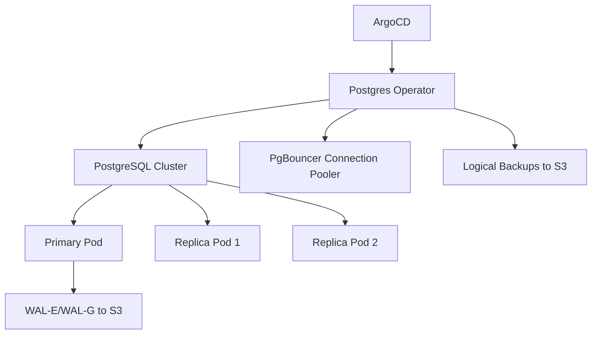

# How to Deploy the Zalando Postgres Operator with ArgoCD

Author: [nawazdhandala](https://github.com/nawazdhandala)

Tags: ArgoCD, GitOps, Kubernetes, PostgreSQL, Zalando

Description: Learn how to deploy the Zalando Postgres Operator with ArgoCD for GitOps-managed PostgreSQL clusters with automated failover, backups, and connection pooling.

---

The Zalando Postgres Operator makes it straightforward to run PostgreSQL clusters on Kubernetes with automated failover, rolling updates, and backup management. When you manage it through ArgoCD, your entire database infrastructure becomes version-controlled - from cluster topology to user permissions.

This guide covers deploying the Zalando Postgres Operator with ArgoCD and creating production-ready PostgreSQL clusters.

## Why Zalando Postgres Operator?

There are several PostgreSQL operators for Kubernetes - CloudNativePG, CrunchyData PGO, and Zalando's postgres-operator being the most popular. Zalando's operator stands out for its Patroni-based high availability, built-in connection pooling with PgBouncer, and excellent AWS S3 backup integration.

## Architecture



## Step 1: Deploy the Operator

The Zalando Postgres Operator is deployed via Helm. First, set up the ArgoCD Application:

```yaml
apiVersion: argoproj.io/v1alpha1
kind: Application
metadata:
  name: postgres-operator
  namespace: argocd
  annotations:
    argocd.argoproj.io/sync-wave: "-1"
spec:
  project: default
  source:
    repoURL: https://opensource.zalando.com/postgres-operator/charts/postgres-operator
    chart: postgres-operator
    targetRevision: 1.12.2
    helm:
      values: |
        # Operator configuration
        configGeneral:
          # Watch all namespaces
          watched_namespace: "*"
          # Enable team-based access
          enable_teams_api: false

        # Kubernetes resources configuration
        configKubernetes:
          # Storage class for PVCs
          ssd_storage_class: gp3
          default_storage_class: gp3

        # AWS S3 backup configuration
        configAwsOrGcp:
          aws_region: us-east-1
          wal_s3_bucket: my-company-postgres-backups
          # Use IRSA for S3 access
          additional_secret_mount: ""

        # Connection pooler configuration
        configConnectionPooler:
          connection_pooler_default_cpu_request: 100m
          connection_pooler_default_memory_request: 100Mi
          connection_pooler_default_cpu_limit: 500m
          connection_pooler_default_memory_limit: 256Mi

        # Resource configuration
        configPostgresPod:
          default_cpu_request: 500m
          default_memory_request: 512Mi
          default_cpu_limit: "2"
          default_memory_limit: 2Gi

        # Operator pod resources
        resources:
          requests:
            cpu: 100m
            memory: 256Mi
          limits:
            memory: 512Mi
  destination:
    server: https://kubernetes.default.svc
    namespace: postgres-operator
  syncPolicy:
    automated:
      prune: true
      selfHeal: true
    syncOptions:
      - CreateNamespace=true
      - ServerSideApply=true
    retry:
      limit: 5
      backoff:
        duration: 5s
        factor: 2
        maxDuration: 3m
```

## Step 2: Create a PostgreSQL Cluster

Define your PostgreSQL cluster as a `postgresql` Custom Resource:

```yaml
apiVersion: acid.zalan.do/v1
kind: postgresql
metadata:
  name: production-db
  namespace: databases
  annotations:
    argocd.argoproj.io/sync-wave: "0"
  labels:
    team: platform
spec:
  teamId: "platform"
  volume:
    size: 100Gi
    storageClass: gp3
  numberOfInstances: 3

  # PostgreSQL version
  postgresql:
    version: "16"
    parameters:
      # Performance tuning
      shared_buffers: "1GB"
      effective_cache_size: "3GB"
      work_mem: "64MB"
      maintenance_work_mem: "256MB"
      max_connections: "200"
      # WAL settings
      wal_buffers: "16MB"
      max_wal_size: "4GB"
      # Logging
      log_min_duration_statement: "1000"
      log_statement: "ddl"

  # Resource allocation
  resources:
    requests:
      cpu: "1"
      memory: 2Gi
    limits:
      cpu: "4"
      memory: 4Gi

  # Users and databases
  users:
    app_user:
      - superuser
      - createdb
    readonly_user: []

  databases:
    app_db: app_user
    analytics_db: app_user

  # Connection pooler (PgBouncer)
  enableConnectionPooler: true
  connectionPooler:
    numberOfInstances: 2
    mode: "transaction"
    maxDBConnections: 100

  # Enable logical backups
  enableLogicalBackup: true
  logicalBackupSchedule: "0 3 * * *"

  # Pod scheduling
  tolerations:
    - key: "database"
      operator: "Equal"
      value: "postgres"
      effect: "NoSchedule"
  nodeAffinity:
    preferredDuringSchedulingIgnoredDuringExecution:
      - weight: 100
        preference:
          matchExpressions:
            - key: node-type
              operator: In
              values:
                - database
```

## Step 3: Create the Namespace and RBAC

```yaml
apiVersion: v1
kind: Namespace
metadata:
  name: databases
  annotations:
    argocd.argoproj.io/sync-wave: "-1"
---
# Allow applications to access database secrets
apiVersion: rbac.authorization.k8s.io/v1
kind: Role
metadata:
  name: db-secret-reader
  namespace: databases
  annotations:
    argocd.argoproj.io/sync-wave: "-1"
rules:
  - apiGroups: [""]
    resources: ["secrets"]
    verbs: ["get", "list"]
    resourceNames:
      - "app-user.production-db.credentials.postgresql.acid.zalan.do"
      - "readonly-user.production-db.credentials.postgresql.acid.zalan.do"
```

## Step 4: Set Up Monitoring

The Zalando Postgres Operator works well with the Prometheus Operator. Add a PodMonitor to scrape PostgreSQL metrics:

```yaml
apiVersion: monitoring.coreos.com/v1
kind: PodMonitor
metadata:
  name: postgres-metrics
  namespace: databases
  annotations:
    argocd.argoproj.io/sync-wave: "1"
spec:
  selector:
    matchLabels:
      application: spilo
  podMetricsEndpoints:
    - port: exporter
      interval: 30s
```

Add alerting rules for database health:

```yaml
apiVersion: monitoring.coreos.com/v1
kind: PrometheusRule
metadata:
  name: postgres-alerts
  namespace: databases
  annotations:
    argocd.argoproj.io/sync-wave: "1"
spec:
  groups:
    - name: postgres.rules
      rules:
        - alert: PostgresReplicationLag
          expr: pg_replication_lag > 30
          for: 5m
          labels:
            severity: warning
          annotations:
            summary: "Replication lag detected"
            description: "Replication lag is {{ $value }} seconds"
        - alert: PostgresConnectionsHigh
          expr: |
            pg_stat_activity_count / pg_settings_max_connections > 0.8
          for: 10m
          labels:
            severity: warning
          annotations:
            summary: "Connection usage above 80%"
        - alert: PostgresDiskUsageHigh
          expr: |
            pg_database_size_bytes / (100 * 1024 * 1024 * 1024) > 0.8
          for: 30m
          labels:
            severity: critical
          annotations:
            summary: "Database disk usage above 80%"
```

## Custom Health Checks for ArgoCD

```yaml
apiVersion: v1
kind: ConfigMap
metadata:
  name: argocd-cm
  namespace: argocd
data:
  resource.customizations.health.acid.zalan.do_postgresql: |
    hs = {}
    if obj.status ~= nil then
      if obj.status.PostgresClusterStatus == "Running" then
        hs.status = "Healthy"
        hs.message = "PostgreSQL cluster is running"
      elseif obj.status.PostgresClusterStatus == "Creating" or
             obj.status.PostgresClusterStatus == "Updating" then
        hs.status = "Progressing"
        hs.message = "PostgreSQL cluster is " .. obj.status.PostgresClusterStatus
      else
        hs.status = "Degraded"
        hs.message = "PostgreSQL cluster status: " .. (obj.status.PostgresClusterStatus or "Unknown")
      end
    else
      hs.status = "Progressing"
      hs.message = "Waiting for PostgreSQL cluster status"
    end
    return hs
```

## Handling Database Credentials

The Zalando Postgres Operator creates Kubernetes Secrets for database users in the format `<username>.<cluster-name>.credentials.postgresql.acid.zalan.do`. These secrets contain `username` and `password` keys.

To use them in your application:

```yaml
apiVersion: apps/v1
kind: Deployment
metadata:
  name: api-server
  namespace: default
spec:
  template:
    spec:
      containers:
        - name: api
          env:
            - name: DB_HOST
              # Use the pooler service for connection pooling
              value: "production-db-pooler.databases.svc.cluster.local"
            - name: DB_PORT
              value: "5432"
            - name: DB_NAME
              value: "app_db"
            - name: DB_USER
              valueFrom:
                secretKeyRef:
                  name: app-user.production-db.credentials.postgresql.acid.zalan.do
                  key: username
            - name: DB_PASSWORD
              valueFrom:
                secretKeyRef:
                  name: app-user.production-db.credentials.postgresql.acid.zalan.do
                  key: password
```

## Handling Upgrades

PostgreSQL major version upgrades with the Zalando operator involve creating a new cluster and migrating data. For minor version updates, the operator handles rolling updates automatically.

To upgrade the operator itself:

1. Update the `targetRevision` in the ArgoCD Application
2. Review the changelog for breaking changes
3. Let ArgoCD sync the new version

The operator is designed for zero-downtime upgrades of itself. It will not restart PostgreSQL clusters when the operator version changes.

## Backup and Recovery

The operator handles WAL archiving to S3 automatically. To restore from a backup, create a new cluster with a clone definition:

```yaml
apiVersion: acid.zalan.do/v1
kind: postgresql
metadata:
  name: production-db-restored
  namespace: databases
spec:
  teamId: "platform"
  volume:
    size: 100Gi
    storageClass: gp3
  numberOfInstances: 3
  postgresql:
    version: "16"
  clone:
    cluster: "production-db"
    timestamp: "2026-02-25T10:00:00+00:00"
```

## Summary

The Zalando Postgres Operator with ArgoCD provides a GitOps-managed PostgreSQL platform with high availability, automated backups, connection pooling, and monitoring. Define your clusters, users, and databases in Git, and ArgoCD handles the rest. For more on deploying operators, see our guide on [deploying Kubernetes operators with ArgoCD](https://oneuptime.com/blog/post/2026-02-26-how-to-deploy-kubernetes-operators-with-argocd/view).
