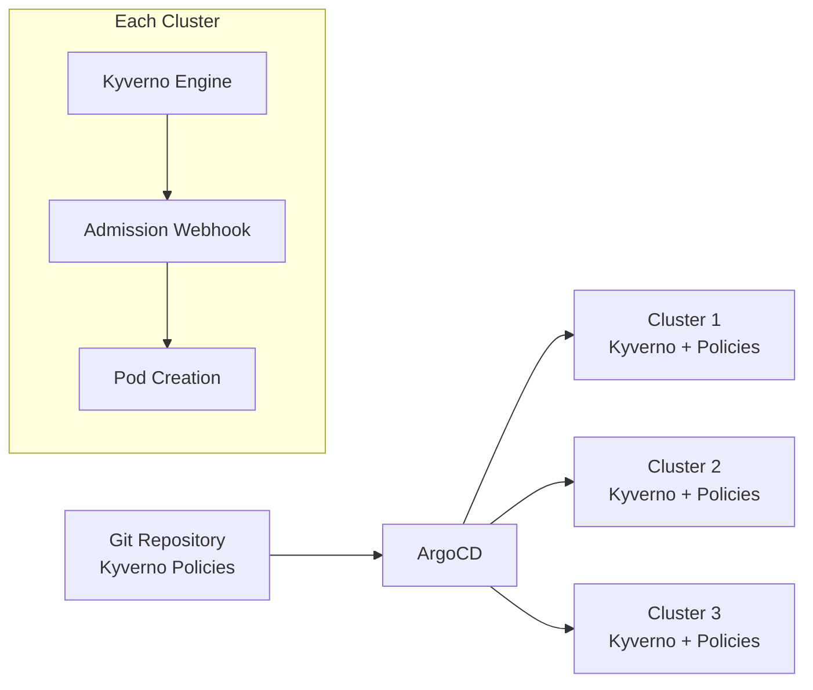

# How to Enforce Pod Security Standards with ArgoCD and Kyverno

Author: [nawazdhandala](https://github.com/nawazdhandala)

Tags: ArgoCD, GitOps, Kubernetes, Kyverno, Security

Description: Implement pod security standards using Kyverno policies deployed and managed through ArgoCD to enforce security baselines across all Kubernetes namespaces via GitOps.

---

Pod Security Standards define three levels of security for Kubernetes pods: Privileged, Baseline, and Restricted. Enforcing these standards prevents containers from running with dangerous privileges, accessing the host network, or using root users. Kyverno is a Kubernetes-native policy engine that makes enforcing these standards straightforward, and ArgoCD ensures those policies are deployed consistently across all your clusters through GitOps.

This post shows you how to deploy and manage Kyverno policies through ArgoCD to enforce pod security standards.

## Why Kyverno with ArgoCD

Kyverno policies are Kubernetes resources (CRDs), which means they fit perfectly into a GitOps workflow. You write policies as YAML, store them in Git, and ArgoCD deploys and reconciles them across clusters. If someone manually deletes or modifies a policy, ArgoCD's self-heal puts it back.



## Step 1: Deploy Kyverno with ArgoCD

First, deploy Kyverno itself through ArgoCD using its Helm chart.

```yaml
# kyverno-app.yaml
# ArgoCD Application to deploy Kyverno
apiVersion: argoproj.io/v1alpha1
kind: Application
metadata:
  name: kyverno
  namespace: argocd
spec:
  project: security
  source:
    repoURL: https://kyverno.github.io/kyverno
    chart: kyverno
    targetRevision: 3.1.4
    helm:
      valuesObject:
        # High availability configuration
        replicaCount: 3
        # Resource limits for production
        resources:
          limits:
            cpu: 500m
            memory: 512Mi
          requests:
            cpu: 100m
            memory: 256Mi
        # Webhook timeout - important for policy evaluation
        webhookTimeout: 10
        # Exclude kube-system and argocd from enforcement
        config:
          excludeGroups:
            - system:nodes
          webhooks:
            - namespaceSelector:
                matchExpressions:
                  - key: kubernetes.io/metadata.name
                    operator: NotIn
                    values:
                      - kube-system
                      - argocd
                      - kyverno
  destination:
    server: https://kubernetes.default.svc
    namespace: kyverno
  syncPolicy:
    automated:
      prune: true
      selfHeal: true
    syncOptions:
      - CreateNamespace=true
      - ServerSideApply=true
```

## Step 2: Define Pod Security Baseline Policies

The Baseline profile prevents known privilege escalations. Here are the key policies.

### Disallow Privileged Containers

```yaml
# policies/disallow-privileged.yaml
apiVersion: kyverno.io/v1
kind: ClusterPolicy
metadata:
  name: disallow-privileged-containers
  annotations:
    policies.kyverno.io/title: Disallow Privileged Containers
    policies.kyverno.io/category: Pod Security Standards (Baseline)
    policies.kyverno.io/severity: high
    policies.kyverno.io/description: >-
      Privileged containers run with full host access and should never be
      allowed in production workloads.
spec:
  validationFailureAction: Enforce
  background: true
  rules:
    - name: privileged-containers
      match:
        any:
          - resources:
              kinds:
                - Pod
      validate:
        message: "Privileged containers are not allowed. Set securityContext.privileged to false."
        pattern:
          spec:
            containers:
              - securityContext:
                  privileged: "false"
            initContainers:
              - securityContext:
                  privileged: "false"
            ephemeralContainers:
              - securityContext:
                  privileged: "false"
```

### Disallow Host Namespaces

```yaml
# policies/disallow-host-namespaces.yaml
apiVersion: kyverno.io/v1
kind: ClusterPolicy
metadata:
  name: disallow-host-namespaces
  annotations:
    policies.kyverno.io/title: Disallow Host Namespaces
    policies.kyverno.io/category: Pod Security Standards (Baseline)
    policies.kyverno.io/severity: high
spec:
  validationFailureAction: Enforce
  background: true
  rules:
    - name: host-namespaces
      match:
        any:
          - resources:
              kinds:
                - Pod
      validate:
        message: "Sharing host namespaces (PID, IPC, Network) is not allowed."
        pattern:
          spec:
            =(hostPID): "false"
            =(hostIPC): "false"
            =(hostNetwork): "false"
```

### Disallow Host Ports

```yaml
# policies/disallow-host-ports.yaml
apiVersion: kyverno.io/v1
kind: ClusterPolicy
metadata:
  name: disallow-host-ports
  annotations:
    policies.kyverno.io/title: Disallow Host Ports
    policies.kyverno.io/category: Pod Security Standards (Baseline)
    policies.kyverno.io/severity: medium
spec:
  validationFailureAction: Enforce
  background: true
  rules:
    - name: host-ports
      match:
        any:
          - resources:
              kinds:
                - Pod
      validate:
        message: "Host ports are not allowed. Use ClusterIP or NodePort services instead."
        pattern:
          spec:
            containers:
              - ports:
                  - =(hostPort): "0"
```

## Step 3: Define Restricted Profile Policies

The Restricted profile adds tighter controls for hardened environments.

### Require Non-Root User

```yaml
# policies/require-non-root.yaml
apiVersion: kyverno.io/v1
kind: ClusterPolicy
metadata:
  name: require-run-as-non-root
  annotations:
    policies.kyverno.io/title: Require Non-Root User
    policies.kyverno.io/category: Pod Security Standards (Restricted)
    policies.kyverno.io/severity: high
spec:
  validationFailureAction: Enforce
  background: true
  rules:
    - name: run-as-non-root
      match:
        any:
          - resources:
              kinds:
                - Pod
      validate:
        message: >-
          Containers must run as non-root. Set runAsNonRoot to true and
          specify a non-root runAsUser.
        pattern:
          spec:
            securityContext:
              runAsNonRoot: true
            containers:
              - securityContext:
                  allowPrivilegeEscalation: false
```

### Require Read-Only Root Filesystem

```yaml
# policies/require-readonly-rootfs.yaml
apiVersion: kyverno.io/v1
kind: ClusterPolicy
metadata:
  name: require-readonly-root-filesystem
  annotations:
    policies.kyverno.io/title: Require Read-Only Root Filesystem
    policies.kyverno.io/category: Pod Security Standards (Restricted)
    policies.kyverno.io/severity: medium
spec:
  validationFailureAction: Enforce
  background: true
  rules:
    - name: readonly-rootfs
      match:
        any:
          - resources:
              kinds:
                - Pod
      validate:
        message: "Root filesystem must be read-only. Set readOnlyRootFilesystem to true."
        pattern:
          spec:
            containers:
              - securityContext:
                  readOnlyRootFilesystem: true
```

### Drop All Capabilities

```yaml
# policies/drop-all-capabilities.yaml
apiVersion: kyverno.io/v1
kind: ClusterPolicy
metadata:
  name: drop-all-capabilities
  annotations:
    policies.kyverno.io/title: Drop All Capabilities
    policies.kyverno.io/category: Pod Security Standards (Restricted)
    policies.kyverno.io/severity: medium
spec:
  validationFailureAction: Enforce
  background: true
  rules:
    - name: drop-capabilities
      match:
        any:
          - resources:
              kinds:
                - Pod
      validate:
        message: >-
          Containers must drop ALL capabilities and may only add NET_BIND_SERVICE.
        deny:
          conditions:
            any:
              - key: "{{ request.object.spec.containers[].securityContext.capabilities.drop[] | length(@) }}"
                operator: LessThan
                value: 1
    - name: allowed-capabilities
      match:
        any:
          - resources:
              kinds:
                - Pod
      validate:
        message: "Only NET_BIND_SERVICE capability is allowed to be added."
        pattern:
          spec:
            containers:
              - securityContext:
                  capabilities:
                    drop:
                      - ALL
                    =(add):
                      - NET_BIND_SERVICE
```

## Step 4: Deploy Policies with ArgoCD

Organize policies in Git and deploy with an ArgoCD Application.

```
security-policies/
  kyverno/
    baseline/
      disallow-privileged.yaml
      disallow-host-namespaces.yaml
      disallow-host-ports.yaml
    restricted/
      require-non-root.yaml
      require-readonly-rootfs.yaml
      drop-all-capabilities.yaml
    kustomization.yaml
```

```yaml
# security-policies/kyverno/kustomization.yaml
apiVersion: kustomize.config.k8s.io/v1beta1
kind: Kustomization
resources:
  - baseline/disallow-privileged.yaml
  - baseline/disallow-host-namespaces.yaml
  - baseline/disallow-host-ports.yaml
  - restricted/require-non-root.yaml
  - restricted/require-readonly-rootfs.yaml
  - restricted/drop-all-capabilities.yaml
```

```yaml
# kyverno-policies-app.yaml
apiVersion: argoproj.io/v1alpha1
kind: Application
metadata:
  name: kyverno-policies
  namespace: argocd
spec:
  project: security
  source:
    repoURL: https://github.com/company/security-policies
    targetRevision: main
    path: kyverno
  destination:
    server: https://kubernetes.default.svc
  syncPolicy:
    automated:
      prune: true
      selfHeal: true
```

## Step 5: Fleet-Wide Deployment with ApplicationSets

Deploy policies across all clusters.

```yaml
# appset-kyverno-policies.yaml
apiVersion: argoproj.io/v1alpha1
kind: ApplicationSet
metadata:
  name: kyverno-policies-fleet
  namespace: argocd
spec:
  generators:
    - clusters:
        selector:
          matchLabels:
            policies: enabled
  template:
    metadata:
      name: 'kyverno-policies-{{name}}'
    spec:
      project: security
      source:
        repoURL: https://github.com/company/security-policies
        targetRevision: main
        path: kyverno
      destination:
        server: '{{server}}'
      syncPolicy:
        automated:
          prune: true
          selfHeal: true
```

## Step 6: Handling Policy Violations

When a deployment managed by ArgoCD violates a Kyverno policy, the sync will fail. ArgoCD will report the application as `Degraded` with the Kyverno violation message.

```bash
# Check for policy violations
kubectl get policyreport -A

# Get detailed violation information
kubectl get clusterpolicyreport -o yaml | \
  yq '.items[].results[] | select(.result == "fail") | {policy: .policy, rule: .rule, message: .message}'

# Check ArgoCD sync errors that are caused by policy violations
argocd app get my-app --show-operation
```

### Mutating Policies for Auto-Remediation

Instead of just blocking non-compliant pods, use Kyverno's mutating policies to automatically fix common issues.

```yaml
# policies/mutate-add-security-context.yaml
# Automatically adds security context to pods that are missing it
apiVersion: kyverno.io/v1
kind: ClusterPolicy
metadata:
  name: add-default-security-context
  annotations:
    policies.kyverno.io/title: Add Default Security Context
    policies.kyverno.io/category: Pod Security Standards
spec:
  rules:
    - name: add-security-context
      match:
        any:
          - resources:
              kinds:
                - Pod
      mutate:
        patchStrategicMerge:
          spec:
            securityContext:
              +(runAsNonRoot): true
              +(seccompProfile):
                type: RuntimeDefault
            containers:
              - (name): "*"
                +(securityContext):
                  allowPrivilegeEscalation: false
                  readOnlyRootFilesystem: true
                  capabilities:
                    drop:
                      - ALL
```

## Monitoring Policy Compliance

Track compliance across your fleet using Kyverno's policy reports and Prometheus metrics.

```yaml
# PrometheusRule for policy compliance monitoring
apiVersion: monitoring.coreos.com/v1
kind: PrometheusRule
metadata:
  name: kyverno-compliance-alerts
spec:
  groups:
    - name: kyverno-compliance
      rules:
        - alert: KyvernoPolicyViolation
          expr: |
            increase(kyverno_policy_results_total{rule_result="fail"}[1h]) > 0
          for: 5m
          labels:
            severity: warning
          annotations:
            summary: "Kyverno policy violations detected in the last hour"
```

## Wrapping Up

Combining ArgoCD and Kyverno gives you a powerful GitOps-driven security enforcement pipeline. Kyverno policies are Kubernetes-native YAML, which makes them perfect for version control and ArgoCD management. Deploy Kyverno itself through ArgoCD, manage policies as Git-tracked resources, use ApplicationSets for fleet-wide enforcement, and leverage mutating policies for automatic remediation where appropriate. This approach ensures that security standards are consistently enforced across all clusters and cannot be bypassed by manual changes. For complementary policy enforcement with OPA, see [how to enforce resource quotas with ArgoCD and OPA](https://oneuptime.com/blog/post/2026-02-26-how-to-enforce-resource-quotas-with-argocd-and-opa/view).
