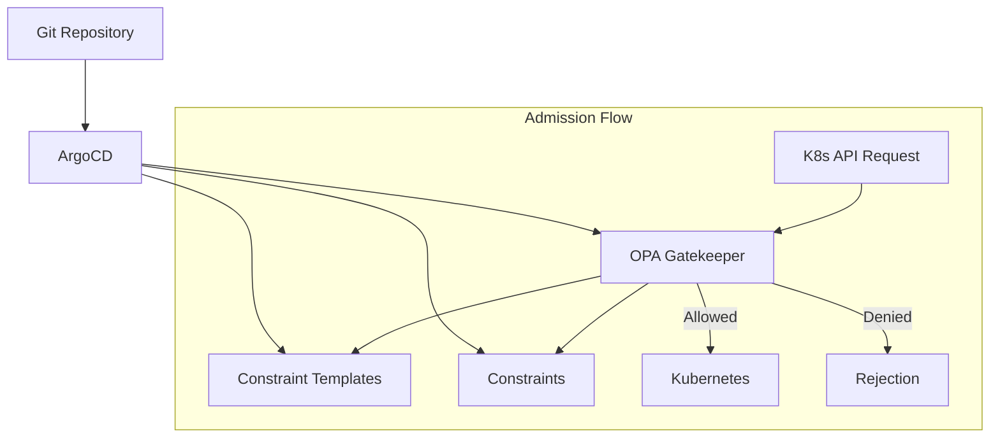

# How to Enforce Resource Quotas with ArgoCD and OPA

Author: [nawazdhandala](https://github.com/nawazdhandala)

Tags: ArgoCD, GitOps, Kubernetes, OPA, Gatekeeper

Description: Use Open Policy Agent Gatekeeper with ArgoCD to enforce resource quotas, limit ranges, and resource request policies across Kubernetes namespaces via GitOps.

---

Resource quotas prevent any single team or application from consuming all the CPU, memory, or storage in a shared Kubernetes cluster. Open Policy Agent (OPA) Gatekeeper extends this concept by letting you define custom policies that enforce resource limits at admission time. Combined with ArgoCD, you get a GitOps-driven resource governance system where policies are version-controlled, reviewed through pull requests, and consistently applied across all clusters.

This post shows how to deploy OPA Gatekeeper through ArgoCD and create policies that enforce resource quotas and limits.

## Architecture

OPA Gatekeeper runs as an admission controller that intercepts Kubernetes API requests and evaluates them against your policies. ArgoCD manages both Gatekeeper itself and the constraint templates and constraints that define your policies.



## Step 1: Deploy Gatekeeper with ArgoCD

```yaml
# gatekeeper-app.yaml
apiVersion: argoproj.io/v1alpha1
kind: Application
metadata:
  name: gatekeeper
  namespace: argocd
spec:
  project: security
  source:
    repoURL: https://open-policy-agent.github.io/gatekeeper/charts
    chart: gatekeeper
    targetRevision: 3.15.1
    helm:
      valuesObject:
        replicas: 3
        audit:
          replicas: 1
          # Audit interval in seconds
          auditInterval: 300
        # Log denials for debugging
        logDenials: true
        # Emit admission events
        emitAdmissionEvents: true
        # Exempt system namespaces
        exemptNamespaces:
          - kube-system
          - gatekeeper-system
          - argocd
  destination:
    server: https://kubernetes.default.svc
    namespace: gatekeeper-system
  syncPolicy:
    automated:
      prune: true
      selfHeal: true
    syncOptions:
      - CreateNamespace=true
      - ServerSideApply=true
```

## Step 2: Create Constraint Templates

Constraint Templates define the policy logic in Rego (OPA's policy language). They are reusable - you define the template once and create multiple constraints from it.

### Require Resource Requests and Limits

```yaml
# templates/k8srequiredresources.yaml
# Constraint Template: Require resource requests and limits on all containers
apiVersion: templates.gatekeeper.sh/v1
kind: ConstraintTemplate
metadata:
  name: k8srequiredresources
  annotations:
    description: "Requires all containers to specify CPU and memory requests and limits"
spec:
  crd:
    spec:
      names:
        kind: K8sRequiredResources
      validation:
        openAPIV3Schema:
          type: object
          properties:
            requireRequests:
              type: array
              items:
                type: string
              description: "List of resource types that must have requests set"
            requireLimits:
              type: array
              items:
                type: string
              description: "List of resource types that must have limits set"
  targets:
    - target: admission.k8s.gatekeeper.sh
      rego: |
        package k8srequiredresources

        violation[{"msg": msg}] {
          container := input.review.object.spec.containers[_]
          required_request := input.parameters.requireRequests[_]
          not container.resources.requests[required_request]
          msg := sprintf("Container '%v' must specify resource request for '%v'", [container.name, required_request])
        }

        violation[{"msg": msg}] {
          container := input.review.object.spec.containers[_]
          required_limit := input.parameters.requireLimits[_]
          not container.resources.limits[required_limit]
          msg := sprintf("Container '%v' must specify resource limit for '%v'", [container.name, required_limit])
        }

        # Also check init containers
        violation[{"msg": msg}] {
          container := input.review.object.spec.initContainers[_]
          required_request := input.parameters.requireRequests[_]
          not container.resources.requests[required_request]
          msg := sprintf("Init container '%v' must specify resource request for '%v'", [container.name, required_request])
        }
```

### Enforce Maximum Resource Limits

```yaml
# templates/k8smaxresources.yaml
# Constraint Template: Enforce maximum resource limits per container
apiVersion: templates.gatekeeper.sh/v1
kind: ConstraintTemplate
metadata:
  name: k8smaxresources
  annotations:
    description: "Enforces maximum CPU and memory limits per container"
spec:
  crd:
    spec:
      names:
        kind: K8sMaxResources
      validation:
        openAPIV3Schema:
          type: object
          properties:
            maxCPU:
              type: string
              description: "Maximum CPU limit per container (e.g., '4')"
            maxMemory:
              type: string
              description: "Maximum memory limit per container (e.g., '8Gi')"
  targets:
    - target: admission.k8s.gatekeeper.sh
      rego: |
        package k8smaxresources

        # Convert CPU string to millicores for comparison
        cpu_to_millicores(cpu) = result {
          endswith(cpu, "m")
          result := to_number(trim_suffix(cpu, "m"))
        }

        cpu_to_millicores(cpu) = result {
          not endswith(cpu, "m")
          result := to_number(cpu) * 1000
        }

        # Convert memory string to bytes for comparison
        mem_to_bytes(mem) = result {
          endswith(mem, "Gi")
          result := to_number(trim_suffix(mem, "Gi")) * 1073741824
        }

        mem_to_bytes(mem) = result {
          endswith(mem, "Mi")
          result := to_number(trim_suffix(mem, "Mi")) * 1048576
        }

        mem_to_bytes(mem) = result {
          endswith(mem, "Ki")
          result := to_number(trim_suffix(mem, "Ki")) * 1024
        }

        violation[{"msg": msg}] {
          container := input.review.object.spec.containers[_]
          cpu_limit := container.resources.limits.cpu
          max_cpu := input.parameters.maxCPU
          cpu_to_millicores(cpu_limit) > cpu_to_millicores(max_cpu)
          msg := sprintf("Container '%v' CPU limit '%v' exceeds maximum allowed '%v'", [container.name, cpu_limit, max_cpu])
        }

        violation[{"msg": msg}] {
          container := input.review.object.spec.containers[_]
          mem_limit := container.resources.limits.memory
          max_mem := input.parameters.maxMemory
          mem_to_bytes(mem_limit) > mem_to_bytes(max_mem)
          msg := sprintf("Container '%v' memory limit '%v' exceeds maximum allowed '%v'", [container.name, mem_limit, max_mem])
        }
```

### Enforce Resource Request to Limit Ratio

```yaml
# templates/k8sresourceratio.yaml
# Prevents users from setting very low requests with very high limits
apiVersion: templates.gatekeeper.sh/v1
kind: ConstraintTemplate
metadata:
  name: k8sresourceratio
  annotations:
    description: "Enforces that resource requests are within a ratio of limits"
spec:
  crd:
    spec:
      names:
        kind: K8sResourceRatio
      validation:
        openAPIV3Schema:
          type: object
          properties:
            maxRatio:
              type: number
              description: "Maximum ratio of limit/request (e.g., 2.0 means limit can be at most 2x request)"
  targets:
    - target: admission.k8s.gatekeeper.sh
      rego: |
        package k8sresourceratio

        violation[{"msg": msg}] {
          container := input.review.object.spec.containers[_]
          cpu_request := to_number(trim_suffix(container.resources.requests.cpu, "m"))
          cpu_limit := to_number(trim_suffix(container.resources.limits.cpu, "m"))
          ratio := cpu_limit / cpu_request
          ratio > input.parameters.maxRatio
          msg := sprintf("Container '%v' CPU limit/request ratio %.1f exceeds maximum %.1f", [container.name, ratio, input.parameters.maxRatio])
        }
```

## Step 3: Create Constraints

Constraints are instances of Constraint Templates with specific parameters.

```yaml
# constraints/require-resources.yaml
# All containers must have CPU and memory requests and limits
apiVersion: constraints.gatekeeper.sh/v1beta1
kind: K8sRequiredResources
metadata:
  name: require-resource-requests-and-limits
spec:
  enforcementAction: deny
  match:
    kinds:
      - apiGroups: [""]
        kinds: ["Pod"]
    # Only enforce in application namespaces
    namespaceSelector:
      matchExpressions:
        - key: kubernetes.io/metadata.name
          operator: NotIn
          values:
            - kube-system
            - gatekeeper-system
            - argocd
  parameters:
    requireRequests:
      - cpu
      - memory
    requireLimits:
      - cpu
      - memory
```

```yaml
# constraints/max-resources-standard.yaml
# Standard tier: max 2 CPU and 4Gi memory per container
apiVersion: constraints.gatekeeper.sh/v1beta1
kind: K8sMaxResources
metadata:
  name: max-resources-standard-tier
spec:
  enforcementAction: deny
  match:
    kinds:
      - apiGroups: [""]
        kinds: ["Pod"]
    namespaceSelector:
      matchLabels:
        resource-tier: standard
  parameters:
    maxCPU: "2"
    maxMemory: "4Gi"
```

```yaml
# constraints/max-resources-premium.yaml
# Premium tier: max 8 CPU and 16Gi memory per container
apiVersion: constraints.gatekeeper.sh/v1beta1
kind: K8sMaxResources
metadata:
  name: max-resources-premium-tier
spec:
  enforcementAction: deny
  match:
    kinds:
      - apiGroups: [""]
        kinds: ["Pod"]
    namespaceSelector:
      matchLabels:
        resource-tier: premium
  parameters:
    maxCPU: "8"
    maxMemory: "16Gi"
```

## Step 4: Deploy with ArgoCD

Organize everything in Git and deploy with ArgoCD.

```
resource-policies/
  gatekeeper/
    templates/
      k8srequiredresources.yaml
      k8smaxresources.yaml
      k8sresourceratio.yaml
    constraints/
      require-resources.yaml
      max-resources-standard.yaml
      max-resources-premium.yaml
    kustomization.yaml
```

```yaml
# resource-policies/gatekeeper/kustomization.yaml
apiVersion: kustomize.config.k8s.io/v1beta1
kind: Kustomization
resources:
  # Templates must be applied before constraints
  - templates/k8srequiredresources.yaml
  - templates/k8smaxresources.yaml
  - templates/k8sresourceratio.yaml
  - constraints/require-resources.yaml
  - constraints/max-resources-standard.yaml
  - constraints/max-resources-premium.yaml
```

```yaml
# gatekeeper-policies-app.yaml
apiVersion: argoproj.io/v1alpha1
kind: Application
metadata:
  name: gatekeeper-policies
  namespace: argocd
  annotations:
    # Sync templates before constraints
    argocd.argoproj.io/sync-wave: "1"
spec:
  project: security
  source:
    repoURL: https://github.com/company/resource-policies
    targetRevision: main
    path: gatekeeper
  destination:
    server: https://kubernetes.default.svc
  syncPolicy:
    automated:
      prune: true
      selfHeal: true
    syncOptions:
      - ServerSideApply=true
```

## Step 5: Handling Sync Order

Constraint Templates must exist before Constraints. Use sync waves in ArgoCD to ensure correct ordering.

```yaml
# Add sync wave annotations to templates
apiVersion: templates.gatekeeper.sh/v1
kind: ConstraintTemplate
metadata:
  name: k8srequiredresources
  annotations:
    argocd.argoproj.io/sync-wave: "0"

---
# Constraints in a later wave
apiVersion: constraints.gatekeeper.sh/v1beta1
kind: K8sRequiredResources
metadata:
  name: require-resource-requests-and-limits
  annotations:
    argocd.argoproj.io/sync-wave: "1"
```

## Step 6: Monitoring Compliance

Check the audit results to see which existing resources violate your policies.

```bash
# Check audit results for all constraints
kubectl get k8srequiredresources -o yaml | \
  yq '.items[].status.violations'

# Get a summary of all violations
kubectl get constraints -A -o json | \
  jq '.items[] | {name: .metadata.name, violations: (.status.totalViolations // 0)}'
```

## Handling ArgoCD Sync Failures

When an ArgoCD-managed deployment violates a Gatekeeper policy, the sync fails with the policy violation message. This is expected behavior - it means your policies are working.

```bash
# Check why a sync failed
argocd app get my-app --show-operation

# Example output:
# Operation:     Sync
# Phase:         Failed
# Message:       one or more objects failed to apply:
#   Deployment web-frontend: admission webhook "validation.gatekeeper.sh" denied the request:
#   Container 'web-frontend' must specify resource request for 'cpu'
```

The fix is to update the application manifests in Git to comply with the policy - add resource requests and limits, reduce container limits to within the maximum, etc. This is the GitOps workflow working as intended: policies enforce standards, and developers fix violations in Git.

## Wrapping Up

OPA Gatekeeper with ArgoCD gives you a robust resource governance system. Constraint Templates define reusable policy logic in Rego, Constraints apply those templates with specific parameters, and ArgoCD ensures both are consistently deployed across all clusters through GitOps. The key benefit is that resource policies are treated as code: they are version-controlled, reviewed in pull requests, and cannot be silently modified on the cluster because ArgoCD's self-heal restores them. For blocking other types of non-compliant deployments beyond resource quotas, see [how to block non-compliant deployments with ArgoCD](https://oneuptime.com/blog/post/2026-02-26-how-to-block-non-compliant-deployments-with-argocd/view).
