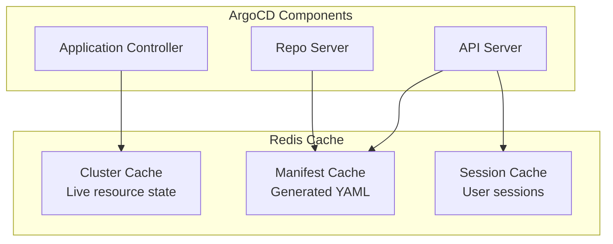

# How to Handle Application State in ArgoCD Redis

Author: [nawazdhandala](https://github.com/nawazdhandala)

Tags: ArgoCD, GitOps, Kubernetes, Redis, State Management

Description: Understand how ArgoCD uses Redis for caching application state, cluster data, and manifest generation results, and learn how to configure, monitor, and troubleshoot Redis issues.

---

ArgoCD uses Redis as an in-memory cache layer for application state, cluster API responses, and generated manifests. While ArgoCD can rebuild this cache from scratch, a poorly configured or misbehaving Redis instance causes slow UI response times, failed reconciliation loops, and unnecessary load on your Git repositories and cluster API servers.

This post explains what ArgoCD stores in Redis, how to configure it for production use, and how to troubleshoot common Redis-related issues.

## What ArgoCD Stores in Redis

ArgoCD's Redis cache serves three primary purposes. First, the application controller caches the live state of Kubernetes resources from each managed cluster. This avoids making expensive API server calls on every reconciliation loop. Second, the repo server caches generated manifests - the output of rendering Helm charts, Kustomize overlays, or plain YAML directories. This avoids re-running manifest generation when nothing has changed. Third, the API server uses Redis for session management and short-lived request caching.



## Default Redis Configuration

ArgoCD installs a single Redis instance by default (or Redis HA with the HA manifests). The default configuration is minimal and works for small deployments.

```bash
# Check the current Redis deployment
kubectl get pods -n argocd -l app.kubernetes.io/name=argocd-redis

# Check Redis memory usage
kubectl exec -n argocd deploy/argocd-redis -- redis-cli info memory | grep used_memory_human
```

For a typical ArgoCD installation managing 50 to 100 applications across a few clusters, Redis uses around 100 to 500 MB of memory. This scales roughly linearly with the number of managed resources.

## Configuring Redis for Production

For production deployments, you need to tune Redis memory limits, eviction policies, and persistence settings.

### Memory Configuration

```yaml
# argocd-redis deployment with production settings
apiVersion: apps/v1
kind: Deployment
metadata:
  name: argocd-redis
  namespace: argocd
spec:
  template:
    spec:
      containers:
        - name: redis
          image: redis:7.2-alpine
          args:
            # Set max memory limit
            - --maxmemory
            - "1gb"
            # Use allkeys-lru eviction when memory is full
            # This ensures ArgoCD can always write new cache entries
            - --maxmemory-policy
            - allkeys-lru
            # Disable RDB snapshots (ArgoCD can rebuild cache)
            - --save
            - ""
            # Disable AOF persistence
            - --appendonly
            - "no"
            # Optimize for low latency
            - --tcp-keepalive
            - "300"
            - --timeout
            - "0"
          resources:
            requests:
              cpu: 100m
              memory: 256Mi
            limits:
              cpu: 500m
              memory: 1Gi
          ports:
            - containerPort: 6379
```

### Redis HA with Sentinel

For high availability, deploy Redis with Sentinel. ArgoCD's HA manifests include this.

```yaml
# argocd-cmd-params-cm - configure Redis HA
apiVersion: v1
kind: ConfigMap
metadata:
  name: argocd-cmd-params-cm
  namespace: argocd
data:
  # Point to Redis Sentinel instead of standalone Redis
  redis.server: argocd-redis-ha-haproxy:6379
```

If you are using an external Redis (like AWS ElastiCache or Redis Cloud), configure the connection string.

```yaml
# argocd-cmd-params-cm - external Redis
apiVersion: v1
kind: ConfigMap
metadata:
  name: argocd-cmd-params-cm
  namespace: argocd
data:
  redis.server: redis.company.internal:6379
```

For Redis with authentication, create a secret.

```yaml
# Redis password secret
apiVersion: v1
kind: Secret
metadata:
  name: argocd-redis
  namespace: argocd
type: Opaque
stringData:
  auth: "your-redis-password"
```

## Understanding Cache Behavior

The application controller's cluster cache has a configurable retry timeout. When a cluster becomes unreachable, the cached state persists until the timeout expires.

```yaml
# argocd-cmd-params-cm - cache settings
apiVersion: v1
kind: ConfigMap
metadata:
  name: argocd-cmd-params-cm
  namespace: argocd
data:
  # How long to keep cluster cache after connectivity loss
  controller.cluster.cache.retry.timeout: "300"
  # Repo server manifest cache expiration
  reposerver.repo.cache.expiration: "24h"
```

When you update `reposerver.repo.cache.expiration`, you control how long rendered manifests stay cached. A longer TTL reduces Git fetch and manifest generation operations but means changes to Helm charts or Kustomize bases take longer to propagate.

## Monitoring Redis Health

Set up monitoring to catch Redis issues before they affect ArgoCD.

```bash
# Check Redis connection from the application controller
kubectl exec -n argocd deploy/argocd-application-controller -- \
  curl -s localhost:8082/metrics | grep argocd_redis

# Check Redis memory stats
kubectl exec -n argocd deploy/argocd-redis -- redis-cli info memory

# Check key count and distribution
kubectl exec -n argocd deploy/argocd-redis -- redis-cli info keyspace

# Check connected clients
kubectl exec -n argocd deploy/argocd-redis -- redis-cli info clients
```

### Prometheus Alerts for Redis

```yaml
# PrometheusRule for ArgoCD Redis monitoring
apiVersion: monitoring.coreos.com/v1
kind: PrometheusRule
metadata:
  name: argocd-redis-alerts
spec:
  groups:
    - name: argocd-redis
      rules:
        # Alert when Redis memory usage is high
        - alert: ArgoCDRedisHighMemory
          expr: |
            redis_memory_used_bytes{namespace="argocd"}
            / redis_memory_max_bytes{namespace="argocd"} > 0.85
          for: 10m
          labels:
            severity: warning
          annotations:
            summary: "ArgoCD Redis memory usage above 85%"

        # Alert when Redis is unreachable
        - alert: ArgoCDRedisDown
          expr: |
            up{job="argocd-redis-metrics", namespace="argocd"} == 0
          for: 2m
          labels:
            severity: critical
          annotations:
            summary: "ArgoCD Redis is down"

        # Alert on high eviction rate
        - alert: ArgoCDRedisHighEviction
          expr: |
            rate(redis_evicted_keys_total{namespace="argocd"}[5m]) > 100
          for: 5m
          labels:
            severity: warning
          annotations:
            summary: "ArgoCD Redis is evicting keys rapidly"
```

## Inspecting Cache Contents

Sometimes you need to look at what ArgoCD has cached to debug issues.

```bash
# List all Redis keys (be careful on large instances)
kubectl exec -n argocd deploy/argocd-redis -- redis-cli --scan --pattern '*' | head -20

# Check the size of the cluster cache
kubectl exec -n argocd deploy/argocd-redis -- redis-cli dbsize

# Get info about a specific cached application
kubectl exec -n argocd deploy/argocd-redis -- redis-cli keys '*my-app*'

# Check the TTL on a specific key
kubectl exec -n argocd deploy/argocd-redis -- redis-cli ttl "app|resources-tree|my-app"
```

## Invalidating Cache

When ArgoCD is showing stale data or you suspect cache corruption, you can invalidate specific entries or flush the entire cache.

```bash
# Force refresh a specific application (invalidates its cache)
argocd app get my-web-app --refresh

# Hard refresh - also re-fetches manifests from Git
argocd app get my-web-app --hard-refresh

# Via API
curl -s -k "$ARGOCD_URL/api/v1/applications/my-web-app?refresh=hard" \
  -H "$AUTH_HEADER"

# Nuclear option: flush the entire Redis cache
# ArgoCD will rebuild everything from scratch
kubectl exec -n argocd deploy/argocd-redis -- redis-cli FLUSHALL
```

Flushing the entire cache triggers a burst of API calls to all managed clusters and Git repositories as ArgoCD rebuilds the cache. On large installations, this can cause temporary performance degradation. Use it only when necessary.

## Tuning Cache for Scale

For large ArgoCD installations (hundreds of applications or dozens of clusters), the default Redis configuration needs tuning.

```yaml
# Scale-optimized Redis configuration
apiVersion: apps/v1
kind: Deployment
metadata:
  name: argocd-redis
  namespace: argocd
spec:
  template:
    spec:
      containers:
        - name: redis
          image: redis:7.2-alpine
          args:
            - --maxmemory
            - "4gb"
            - --maxmemory-policy
            - allkeys-lru
            - --save
            - ""
            - --appendonly
            - "no"
            # Increase client output buffer for large responses
            - --client-output-buffer-limit
            - "normal 256mb 128mb 60"
            # Increase max number of simultaneous clients
            - --maxclients
            - "1000"
            # Optimize hash storage for many small entries
            - --hash-max-ziplist-entries
            - "128"
            - --hash-max-ziplist-value
            - "64"
          resources:
            requests:
              cpu: 500m
              memory: 2Gi
            limits:
              cpu: 2
              memory: 5Gi
```

Also tune the ArgoCD components that interact with Redis.

```yaml
# argocd-cmd-params-cm - tune cache interaction
apiVersion: v1
kind: ConfigMap
metadata:
  name: argocd-cmd-params-cm
  namespace: argocd
data:
  # Increase the number of status processors for parallel cache updates
  controller.status.processors: "50"
  controller.operation.processors: "25"
  # Adjust repo server parallelism
  reposerver.parallelism.limit: "10"
```

## Wrapping Up

Redis is a critical component of ArgoCD's architecture even though it is "just a cache". A healthy Redis instance means fast UI responses, efficient reconciliation, and reduced load on your clusters and Git repositories. Configure appropriate memory limits and eviction policies, monitor memory usage and eviction rates, use hard refresh to invalidate stale cache entries when needed, and scale Redis resources proportionally to the number of managed applications and clusters. For handling Redis failures gracefully, see [how to handle ArgoCD state after Redis failure](https://oneuptime.com/blog/post/2026-02-26-how-to-handle-argocd-state-after-redis-failure/view).
