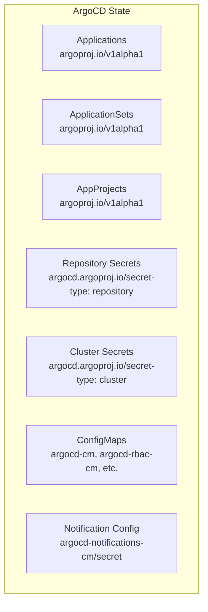

# How to Handle ArgoCD State After Cluster Migration

Author: [nawazdhandala](https://github.com/nawazdhandala)

Tags: ArgoCD, GitOps, Kubernetes, Migration, State Management

Description: A practical guide to migrating ArgoCD state when moving between clusters, including application definitions, project configs, repository credentials, and cluster registrations.

---

Migrating ArgoCD from one Kubernetes cluster to another - whether for a cluster upgrade, cloud provider switch, or disaster recovery - requires careful handling of state. Unlike stateless applications that you just redeploy, ArgoCD carries configuration state: application definitions, project settings, repository credentials, cluster registrations, and RBAC policies.

The good news is that ArgoCD's state is stored declaratively in Kubernetes resources and ConfigMaps, which makes it exportable and reproducible. This post walks through the complete migration process.

## What State Needs to Be Migrated

ArgoCD's state is spread across several resource types in the `argocd` namespace.



Here is the complete inventory of what to export:

- Application resources (`Application` CRDs)
- ApplicationSet resources (`ApplicationSet` CRDs)
- AppProject resources (project definitions)
- Repository credential secrets
- Cluster registration secrets
- ConfigMaps: `argocd-cm`, `argocd-rbac-cm`, `argocd-cmd-params-cm`, `argocd-notifications-cm`
- Secrets: `argocd-notifications-secret`, `argocd-secret`
- GPG keys and SSH known hosts ConfigMaps

## Step 1: Export Application Definitions

Export all Application resources, stripping out cluster-specific metadata.

```bash
# Export all ArgoCD applications
kubectl get applications -n argocd -o yaml | \
  yq eval 'del(.items[].metadata.resourceVersion,
              .items[].metadata.uid,
              .items[].metadata.generation,
              .items[].metadata.creationTimestamp,
              .items[].metadata.managedFields,
              .items[].status)' - > applications-export.yaml

echo "Exported $(kubectl get applications -n argocd --no-headers | wc -l) applications"
```

If you prefer individual files per application.

```bash
# Export each application to a separate file
mkdir -p export/applications
for app in $(kubectl get applications -n argocd -o name); do
  name=$(echo $app | cut -d/ -f2)
  kubectl get $app -n argocd -o yaml | \
    yq eval 'del(.metadata.resourceVersion,
                .metadata.uid,
                .metadata.generation,
                .metadata.creationTimestamp,
                .metadata.managedFields,
                .status)' - > "export/applications/${name}.yaml"
done
```

## Step 2: Export ApplicationSets

```bash
# Export all ApplicationSets
kubectl get applicationsets -n argocd -o yaml | \
  yq eval 'del(.items[].metadata.resourceVersion,
              .items[].metadata.uid,
              .items[].metadata.generation,
              .items[].metadata.creationTimestamp,
              .items[].metadata.managedFields,
              .items[].status)' - > applicationsets-export.yaml
```

## Step 3: Export AppProjects

```bash
# Export all AppProjects (excluding the default project)
kubectl get appprojects -n argocd -o yaml | \
  yq eval 'del(.items[].metadata.resourceVersion,
              .items[].metadata.uid,
              .items[].metadata.generation,
              .items[].metadata.creationTimestamp,
              .items[].metadata.managedFields,
              .items[].status)' - > projects-export.yaml
```

## Step 4: Export Repository Credentials

Repository secrets contain credentials, so handle them carefully.

```bash
# Export repository secrets (contains credentials - handle securely)
kubectl get secrets -n argocd \
  -l argocd.argoproj.io/secret-type=repository \
  -o yaml | \
  yq eval 'del(.items[].metadata.resourceVersion,
              .items[].metadata.uid,
              .items[].metadata.creationTimestamp,
              .items[].metadata.managedFields)' - > repos-export.yaml

# Export repository credential templates
kubectl get secrets -n argocd \
  -l argocd.argoproj.io/secret-type=repo-creds \
  -o yaml | \
  yq eval 'del(.items[].metadata.resourceVersion,
              .items[].metadata.uid,
              .items[].metadata.creationTimestamp,
              .items[].metadata.managedFields)' - > repo-creds-export.yaml
```

## Step 5: Export Cluster Registrations

Cluster secrets contain bearer tokens and CA certificates. You may need to regenerate these for the new ArgoCD instance since the service account tokens are tied to the old cluster.

```bash
# Export cluster secrets (tokens may need regeneration)
kubectl get secrets -n argocd \
  -l argocd.argoproj.io/secret-type=cluster \
  -o yaml | \
  yq eval 'del(.items[].metadata.resourceVersion,
              .items[].metadata.uid,
              .items[].metadata.creationTimestamp,
              .items[].metadata.managedFields)' - > clusters-export.yaml

echo "WARNING: Cluster bearer tokens may need to be regenerated on the new instance"
```

## Step 6: Export Configuration

```bash
# Export all ArgoCD ConfigMaps
for cm in argocd-cm argocd-rbac-cm argocd-cmd-params-cm argocd-notifications-cm argocd-ssh-known-hosts-cm argocd-tls-certs-cm argocd-gpg-keys-cm; do
  kubectl get configmap $cm -n argocd -o yaml 2>/dev/null | \
    yq eval 'del(.metadata.resourceVersion,
                .metadata.uid,
                .metadata.creationTimestamp,
                .metadata.managedFields)' - > "export/${cm}.yaml" 2>/dev/null
done

# Export notification secrets
kubectl get secret argocd-notifications-secret -n argocd -o yaml 2>/dev/null | \
  yq eval 'del(.metadata.resourceVersion,
              .metadata.uid,
              .metadata.creationTimestamp,
              .metadata.managedFields)' - > export/argocd-notifications-secret.yaml 2>/dev/null
```

## Step 7: Install ArgoCD on the New Cluster

```bash
# On the new cluster, install ArgoCD
kubectl create namespace argocd
kubectl apply -n argocd -f https://raw.githubusercontent.com/argoproj/argo-cd/stable/manifests/ha/install.yaml

# Wait for ArgoCD to be ready
kubectl wait --for=condition=ready pod -l app.kubernetes.io/part-of=argocd -n argocd --timeout=300s
```

## Step 8: Import Configuration First

Import ConfigMaps and secrets before applications, as applications depend on project and repository configuration.

```bash
# Import ConfigMaps
for cm in argocd-cm argocd-rbac-cm argocd-cmd-params-cm argocd-notifications-cm argocd-ssh-known-hosts-cm argocd-tls-certs-cm; do
  if [ -f "export/${cm}.yaml" ]; then
    kubectl apply -f "export/${cm}.yaml"
    echo "Applied $cm"
  fi
done

# Restart ArgoCD to pick up configuration changes
kubectl rollout restart deployment -n argocd -l app.kubernetes.io/part-of=argocd
kubectl wait --for=condition=ready pod -l app.kubernetes.io/part-of=argocd -n argocd --timeout=300s
```

## Step 9: Import Secrets and Credentials

```bash
# Import repository credentials
kubectl apply -f repos-export.yaml
kubectl apply -f repo-creds-export.yaml

# Import notification secrets
kubectl apply -f export/argocd-notifications-secret.yaml 2>/dev/null
```

## Step 10: Re-register Clusters

Cluster tokens from the old installation likely will not work with the new ArgoCD instance. Re-register each cluster.

```bash
# Option A: Use the CLI to re-register clusters
# This creates fresh service accounts and tokens
argocd cluster add staging-cluster --name staging --kubeconfig /path/to/staging-kubeconfig
argocd cluster add production-cluster --name production --kubeconfig /path/to/production-kubeconfig

# Option B: If the old tokens still work (same service accounts exist),
# import the cluster secrets directly
kubectl apply -f clusters-export.yaml

# Verify cluster connectivity
argocd cluster list
```

## Step 11: Import Projects and Applications

```bash
# Import AppProjects first (applications reference projects)
kubectl apply -f projects-export.yaml

# Import ApplicationSets (these generate applications)
kubectl apply -f applicationsets-export.yaml

# Import standalone Applications
kubectl apply -f applications-export.yaml

# Verify all applications are imported
argocd app list
```

## Step 12: Verify and Fix

After importing, some applications may be in an Unknown or OutOfSync state while ArgoCD rebuilds its cache.

```bash
# Check the status of all applications
argocd app list -o json | jq '.[] | {name: .metadata.name, health: .status.health.status, sync: .status.sync.status}' | head -50

# Force a refresh of all applications
for app in $(argocd app list -o name); do
  argocd app get "$app" --refresh
done

# Check for any applications with errors
argocd app list -o json | jq '.[] | select(.status.health.status != "Healthy" or .status.sync.status != "Synced") | {name: .metadata.name, health: .status.health.status, sync: .status.sync.status}'
```

## Handling the In-Cluster Destination

If your old ArgoCD managed applications on its own cluster (using `https://kubernetes.default.svc` as the destination), those applications will now point to the new cluster by default. Make sure the namespaces and resources those applications expect are present on the new cluster.

```bash
# Find all applications targeting in-cluster
argocd app list -o json | jq '.[] | select(.spec.destination.server == "https://kubernetes.default.svc") | .metadata.name'
```

## Automating Migration with a Script

Here is a complete migration script that bundles all the steps.

```bash
#!/bin/bash
# migrate-argocd.sh - Export ArgoCD state for migration
set -euo pipefail

EXPORT_DIR="argocd-migration-$(date +%Y%m%d-%H%M%S)"
mkdir -p "$EXPORT_DIR"

echo "Exporting ArgoCD state to $EXPORT_DIR"

# Applications
echo "Exporting applications..."
kubectl get applications -n argocd -o yaml > "$EXPORT_DIR/applications.yaml"

# ApplicationSets
echo "Exporting applicationsets..."
kubectl get applicationsets -n argocd -o yaml > "$EXPORT_DIR/applicationsets.yaml" 2>/dev/null || true

# Projects
echo "Exporting projects..."
kubectl get appprojects -n argocd -o yaml > "$EXPORT_DIR/projects.yaml"

# Secrets
echo "Exporting secrets..."
kubectl get secrets -n argocd -l argocd.argoproj.io/secret-type=repository -o yaml > "$EXPORT_DIR/repo-secrets.yaml" 2>/dev/null || true
kubectl get secrets -n argocd -l argocd.argoproj.io/secret-type=repo-creds -o yaml > "$EXPORT_DIR/repo-creds.yaml" 2>/dev/null || true
kubectl get secrets -n argocd -l argocd.argoproj.io/secret-type=cluster -o yaml > "$EXPORT_DIR/cluster-secrets.yaml" 2>/dev/null || true

# ConfigMaps
echo "Exporting configmaps..."
for cm in argocd-cm argocd-rbac-cm argocd-cmd-params-cm argocd-notifications-cm argocd-ssh-known-hosts-cm argocd-tls-certs-cm; do
  kubectl get configmap $cm -n argocd -o yaml > "$EXPORT_DIR/${cm}.yaml" 2>/dev/null || true
done

echo "Export complete: $EXPORT_DIR"
echo "Files:"
ls -la "$EXPORT_DIR"
```

## Wrapping Up

Migrating ArgoCD state between clusters is a methodical process: export all declarative resources (applications, projects, repos, clusters, config), install ArgoCD on the new cluster, import configuration first, then credentials, then projects, and finally applications. The key gotchas are cluster tokens that need regeneration and in-cluster destinations that now point to a different cluster. Always verify application health after migration and force a refresh to rebuild the cache. For handling the related challenge of Redis state during migration, see [how to handle ArgoCD state after Redis failure](https://oneuptime.com/blog/post/2026-02-26-how-to-handle-argocd-state-after-redis-failure/view).
