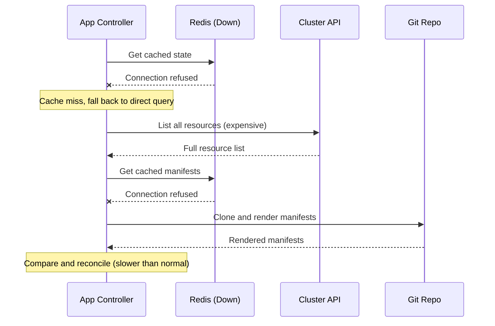

# How to Handle ArgoCD State After Redis Failure

Author: [nawazdhandala](https://github.com/nawazdhandala)

Tags: ArgoCD, GitOps, Kubernetes, Redis, Disaster Recovery

Description: Learn how ArgoCD recovers from Redis failures, what symptoms to expect, how to speed up cache rebuilding, and how to prevent Redis failures from impacting your deployments.

---

Redis is ArgoCD's cache layer - it stores cluster state, generated manifests, and session data. When Redis goes down, ArgoCD does not lose any persistent state (that is all in Kubernetes CRDs and ConfigMaps), but it does lose its cache. This means slower reconciliation, increased load on cluster API servers and Git repositories, and temporary UI issues.

This post covers what happens during a Redis failure, how ArgoCD recovers, and what you can do to minimize the impact.

## What Happens When Redis Fails

When Redis becomes unavailable, each ArgoCD component is affected differently.

The **application controller** loses its cluster state cache. It falls back to querying each cluster's API server directly for every reconciliation cycle. This works but is significantly slower and generates much more API traffic. You will see increased reconciliation times and potentially API server throttling on managed clusters.

The **repo server** loses its manifest cache. Every reconciliation cycle requires re-fetching from Git and re-rendering Helm charts or Kustomize overlays. This increases Git clone operations and CPU usage on the repo server.

The **API server** loses session data. Active user sessions may be invalidated, requiring users to log in again. API responses that relied on cached data will be slower.



## Symptoms of Redis Failure

Here are the signs that Redis is causing problems.

```bash
# Check if Redis is running
kubectl get pods -n argocd -l app.kubernetes.io/name=argocd-redis

# Check application controller logs for Redis errors
kubectl logs -n argocd deploy/argocd-application-controller | grep -i redis | tail -20

# Check repo server logs
kubectl logs -n argocd deploy/argocd-repo-server | grep -i redis | tail -20

# Check API server logs
kubectl logs -n argocd deploy/argocd-server | grep -i redis | tail -20
```

Common error messages include:

- `redis: connection refused` - Redis is completely down
- `redis: i/o timeout` - Redis is overloaded or network issues
- `LOADING Redis is loading the dataset in memory` - Redis is restarting and loading data
- `OOM command not allowed when used memory > 'maxmemory'` - Redis ran out of memory

## Immediate Recovery Steps

### Step 1: Check Redis Status

```bash
# Check the Redis pod status
kubectl get pods -n argocd -l app.kubernetes.io/name=argocd-redis -o wide

# Check Redis logs for the failure reason
kubectl logs -n argocd deploy/argocd-redis --tail=50

# Check if Redis is responding
kubectl exec -n argocd deploy/argocd-redis -- redis-cli ping
# Expected: PONG
```

### Step 2: Restart Redis if Necessary

```bash
# If Redis is in CrashLoopBackOff, check for OOM or configuration issues
kubectl describe pod -n argocd -l app.kubernetes.io/name=argocd-redis

# Restart Redis
kubectl rollout restart deployment argocd-redis -n argocd

# Wait for it to be ready
kubectl wait --for=condition=ready pod -l app.kubernetes.io/name=argocd-redis -n argocd --timeout=120s
```

### Step 3: Verify Redis is Accepting Connections

```bash
# Verify Redis is healthy
kubectl exec -n argocd deploy/argocd-redis -- redis-cli info server | head -10

# Check memory usage
kubectl exec -n argocd deploy/argocd-redis -- redis-cli info memory | grep used_memory_human

# Verify ArgoCD components can reach Redis
kubectl logs -n argocd deploy/argocd-application-controller --tail=10 | grep -i redis
```

### Step 4: Speed Up Cache Rebuilding

After Redis comes back, ArgoCD rebuilds the cache gradually during normal reconciliation. You can speed this up.

```bash
# Force a hard refresh of all applications to rebuild cache faster
for app in $(argocd app list -o name); do
  argocd app get "$app" --hard-refresh &
done
wait

echo "All applications refreshed"
```

Or through the API.

```bash
# Refresh all applications via API
APPS=$(curl -s -k "$ARGOCD_URL/api/v1/applications" \
  -H "$AUTH_HEADER" | jq -r '.items[].metadata.name')

for app in $APPS; do
  curl -s -k "$ARGOCD_URL/api/v1/applications/$app?refresh=hard" \
    -H "$AUTH_HEADER" > /dev/null &
done
wait
echo "All applications hard-refreshed"
```

## Preventing Redis Failures

### Use Redis HA

The single biggest improvement is running Redis in HA mode with Sentinel or a Redis cluster.

```yaml
# Use ArgoCD's HA manifests which include Redis HA
# Or deploy Redis Sentinel manually

# argocd-cmd-params-cm - point to Redis Sentinel
apiVersion: v1
kind: ConfigMap
metadata:
  name: argocd-cmd-params-cm
  namespace: argocd
data:
  redis.server: argocd-redis-ha-haproxy:6379
```

### Set Appropriate Memory Limits

Redis OOM (out of memory) is the most common cause of Redis failures. Set `maxmemory` with an eviction policy so Redis gracefully drops old cache entries instead of crashing.

```yaml
# Redis with memory protection
args:
  - --maxmemory
  - "2gb"
  - --maxmemory-policy
  - allkeys-lru
```

Make sure the Kubernetes memory limit is higher than Redis's `maxmemory` to account for Redis overhead.

```yaml
resources:
  requests:
    memory: 1Gi
  limits:
    # Set 30% higher than Redis maxmemory to account for overhead
    memory: 3Gi
```

### Monitor Redis Proactively

Set up alerts that fire before Redis runs out of memory.

```yaml
# Prometheus alerts for Redis health
apiVersion: monitoring.coreos.com/v1
kind: PrometheusRule
metadata:
  name: argocd-redis-alerts
spec:
  groups:
    - name: argocd-redis
      rules:
        - alert: ArgoCDRedisMemoryWarning
          expr: |
            redis_memory_used_bytes{namespace="argocd"}
            / redis_memory_max_bytes{namespace="argocd"} > 0.75
          for: 5m
          labels:
            severity: warning
          annotations:
            summary: "ArgoCD Redis memory at 75%"

        - alert: ArgoCDRedisMemoryCritical
          expr: |
            redis_memory_used_bytes{namespace="argocd"}
            / redis_memory_max_bytes{namespace="argocd"} > 0.90
          for: 2m
          labels:
            severity: critical
          annotations:
            summary: "ArgoCD Redis memory at 90% - risk of OOM"

        - alert: ArgoCDRedisDown
          expr: up{job="argocd-redis"} == 0
          for: 1m
          labels:
            severity: critical
          annotations:
            summary: "ArgoCD Redis is down"
```

### Configure Liveness and Readiness Probes

```yaml
# Redis deployment with proper health checks
containers:
  - name: redis
    livenessProbe:
      exec:
        command:
          - redis-cli
          - ping
      initialDelaySeconds: 15
      periodSeconds: 5
      timeoutSeconds: 3
      failureThreshold: 3
    readinessProbe:
      exec:
        command:
          - redis-cli
          - ping
      initialDelaySeconds: 5
      periodSeconds: 3
      timeoutSeconds: 1
      failureThreshold: 3
```

## Handling Persistent Redis Data Loss

If Redis data is completely lost (pod deleted without persistence, PVC lost), ArgoCD recovers automatically but slowly. Here is how to speed up recovery.

```bash
# After Redis comes back empty, restart the application controller
# This forces it to rebuild its entire cluster cache
kubectl rollout restart deployment argocd-application-controller -n argocd

# Restart the repo server to clear any stale connection state
kubectl rollout restart deployment argocd-repo-server -n argocd

# Wait for everything to stabilize
kubectl wait --for=condition=ready pod -l app.kubernetes.io/part-of=argocd -n argocd --timeout=300s

# Monitor the cache rebuild progress
watch kubectl exec -n argocd deploy/argocd-redis -- redis-cli dbsize
```

The cache rebuild time depends on the number of managed clusters and applications. For a typical installation with 100 applications, expect the cache to be fully rebuilt within 10 to 15 minutes. For 1000+ applications, it can take 30 minutes or more.

## Testing Redis Failure Recovery

Periodically test your Redis failure recovery process to make sure it works when you need it.

```bash
# Simulate Redis failure by scaling to 0
kubectl scale deployment argocd-redis -n argocd --replicas=0

# Observe ArgoCD behavior for 5 minutes
# Check that applications are still functional
sleep 300

# Bring Redis back
kubectl scale deployment argocd-redis -n argocd --replicas=1
kubectl wait --for=condition=ready pod -l app.kubernetes.io/name=argocd-redis -n argocd --timeout=120s

# Verify recovery
kubectl exec -n argocd deploy/argocd-redis -- redis-cli ping
argocd app list --output json | jq '.[0:3] | .[] | {name: .metadata.name, health: .status.health.status}'
```

## Wrapping Up

Redis failures in ArgoCD are disruptive but not catastrophic. ArgoCD's persistent state lives in Kubernetes CRDs and ConfigMaps, not in Redis. When Redis fails, ArgoCD falls back to direct API server queries and Git fetches, which is slower but functional. To minimize impact: run Redis in HA mode, set memory limits with LRU eviction, monitor proactively with alerts at 75% and 90% memory usage, and have a recovery playbook ready. After Redis comes back, force a hard refresh of all applications to speed up cache rebuilding. For rebuilding ArgoCD state from scratch in more extreme scenarios, see [how to rebuild ArgoCD state from scratch](https://oneuptime.com/blog/post/2026-02-26-how-to-rebuild-argocd-state-from-scratch/view).
