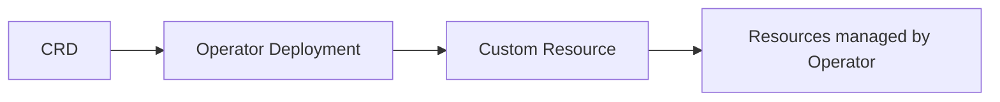

# How to Handle CRD and CR Ordering with ArgoCD

Author: [nawazdhandala](https://github.com/nawazdhandala)

Tags: ArgoCD, GitOps, Kubernetes, CRDs, Sync Waves

Description: Learn how to manage CRD and Custom Resource ordering in ArgoCD using sync waves, sync phases, and resource hooks to avoid dependency failures.

---

One of the most common frustrations when using ArgoCD is getting Custom Resource Definitions (CRDs) and their corresponding Custom Resources (CRs) to apply in the right order. If ArgoCD tries to create a CR before the CRD exists, the sync fails with an "unable to recognize" error. This guide covers every technique for handling CRD and CR ordering properly.

## Understanding the Problem

When you define a CRD and a CR in the same ArgoCD Application, ArgoCD discovers all manifests and attempts to apply them. Without explicit ordering, ArgoCD uses a default resource ordering that puts CRDs before most other resources, but this default ordering is not always sufficient - especially when the operator that handles the CRD also needs to be running.

The typical dependency chain looks like this:



Each step depends on the previous one being fully ready, not just applied.

## Technique 1: Sync Waves

Sync waves are the primary mechanism for ordering resources in ArgoCD. Resources with lower wave numbers are applied first, and ArgoCD waits for them to be healthy before moving to the next wave.

```yaml
# Wave -1: Namespace (if needed)
apiVersion: v1
kind: Namespace
metadata:
  name: cert-manager
  annotations:
    argocd.argoproj.io/sync-wave: "-1"
---
# Wave 0: CRDs
apiVersion: apiextensions.k8s.io/v1
kind: CustomResourceDefinition
metadata:
  name: certificates.cert-manager.io
  annotations:
    argocd.argoproj.io/sync-wave: "0"
spec:
  group: cert-manager.io
  names:
    kind: Certificate
    listKind: CertificateList
    plural: certificates
    singular: certificate
  scope: Namespaced
  versions:
    - name: v1
      served: true
      storage: true
      schema:
        openAPIV3Schema:
          type: object
---
# Wave 1: Operator deployment
apiVersion: apps/v1
kind: Deployment
metadata:
  name: cert-manager
  namespace: cert-manager
  annotations:
    argocd.argoproj.io/sync-wave: "1"
spec:
  replicas: 1
  selector:
    matchLabels:
      app: cert-manager
  template:
    metadata:
      labels:
        app: cert-manager
    spec:
      containers:
        - name: cert-manager
          image: quay.io/jetstack/cert-manager-controller:v1.14.0
---
# Wave 2: Custom Resources
apiVersion: cert-manager.io/v1
kind: ClusterIssuer
metadata:
  name: letsencrypt-prod
  annotations:
    argocd.argoproj.io/sync-wave: "2"
spec:
  acme:
    server: https://acme-v02.api.letsencrypt.org/directory
    email: admin@example.com
    privateKeySecretRef:
      name: letsencrypt-prod
    solvers:
      - http01:
          ingress:
            class: nginx
```

ArgoCD processes waves sequentially. All resources in wave 0 must be healthy before wave 1 starts, and so on.

## Technique 2: Sync Phases with Resource Hooks

For more granular control, ArgoCD supports sync phases. There are three phases: PreSync, Sync, and PostSync.

```yaml
# PreSync: Apply CRDs before anything else
apiVersion: apiextensions.k8s.io/v1
kind: CustomResourceDefinition
metadata:
  name: myresources.example.com
  annotations:
    argocd.argoproj.io/hook: PreSync
    argocd.argoproj.io/hook-delete-policy: HookSucceeded
spec:
  group: example.com
  versions:
    - name: v1
      served: true
      storage: true
      schema:
        openAPIV3Schema:
          type: object
  scope: Namespaced
  names:
    plural: myresources
    singular: myresource
    kind: MyResource
```

Wait - do not use `hook-delete-policy: HookSucceeded` on CRDs. That would delete the CRD after the sync completes, which is not what you want. Use hooks without a delete policy for CRDs, or better yet, manage CRDs separately.

A more practical use of hooks is to run a Job that waits for the operator to be ready:

```yaml
apiVersion: batch/v1
kind: Job
metadata:
  name: wait-for-operator
  annotations:
    argocd.argoproj.io/hook: Sync
    argocd.argoproj.io/sync-wave: "1"
    argocd.argoproj.io/hook-delete-policy: HookSucceeded
spec:
  template:
    spec:
      containers:
        - name: wait
          image: bitnami/kubectl:latest
          command:
            - /bin/sh
            - -c
            - |
              # Wait until the operator deployment is ready
              kubectl rollout status deployment/my-operator \
                -n operators --timeout=120s
      restartPolicy: Never
  backoffLimit: 3
```

## Technique 3: Separate ArgoCD Applications

The cleanest approach is to split CRDs, operators, and CRs into separate ArgoCD Applications with explicit dependencies.

```yaml
# Application 1: CRDs only
apiVersion: argoproj.io/v1alpha1
kind: Application
metadata:
  name: my-operator-crds
  namespace: argocd
  annotations:
    argocd.argoproj.io/sync-wave: "0"
spec:
  project: default
  source:
    repoURL: https://github.com/myorg/platform.git
    targetRevision: main
    path: crds/my-operator
  destination:
    server: https://kubernetes.default.svc
  syncPolicy:
    automated:
      selfHeal: true
    syncOptions:
      - ServerSideApply=true
      - Replace=true
---
# Application 2: Operator deployment
apiVersion: argoproj.io/v1alpha1
kind: Application
metadata:
  name: my-operator
  namespace: argocd
  annotations:
    argocd.argoproj.io/sync-wave: "1"
spec:
  project: default
  source:
    repoURL: https://github.com/myorg/platform.git
    targetRevision: main
    path: operators/my-operator
  destination:
    server: https://kubernetes.default.svc
    namespace: operators
  syncPolicy:
    automated:
      prune: true
      selfHeal: true
    syncOptions:
      - CreateNamespace=true
---
# Application 3: Custom Resources
apiVersion: argoproj.io/v1alpha1
kind: Application
metadata:
  name: my-operator-instances
  namespace: argocd
  annotations:
    argocd.argoproj.io/sync-wave: "2"
spec:
  project: default
  source:
    repoURL: https://github.com/myorg/platform.git
    targetRevision: main
    path: instances/my-operator
  destination:
    server: https://kubernetes.default.svc
    namespace: default
  syncPolicy:
    automated:
      prune: true
      selfHeal: true
```

When these applications are managed by an App of Apps or an ApplicationSet, the sync waves on the Application resources themselves control the ordering.

## Technique 4: SkipDryRunOnMissingResource

ArgoCD has a sync option specifically for the CRD ordering problem:

```yaml
syncPolicy:
  syncOptions:
    - SkipDryRunOnMissingResource=true
```

This tells ArgoCD to skip the dry-run validation for resources whose types are not yet registered in the cluster. Combined with sync waves, this prevents the "unable to recognize" error during the dry-run phase.

## Technique 5: Replace Policy for CRD Updates

When updating CRDs, standard `kubectl apply` can fail if the CRD is too large (due to the `last-applied-configuration` annotation). Use the Replace sync option:

```yaml
apiVersion: apiextensions.k8s.io/v1
kind: CustomResourceDefinition
metadata:
  name: certificates.cert-manager.io
  annotations:
    argocd.argoproj.io/sync-options: Replace=true,ServerSideApply=true
```

You can set sync options per-resource using annotations, which is useful when only CRDs need special handling.

## Handling CRD Deletion Safely

Deleting a CRD removes all instances of that custom resource cluster-wide. This is extremely dangerous. To prevent accidental CRD deletion:

```yaml
apiVersion: apiextensions.k8s.io/v1
kind: CustomResourceDefinition
metadata:
  name: certificates.cert-manager.io
  annotations:
    # Prevent ArgoCD from pruning this CRD
    argocd.argoproj.io/sync-options: Prune=false
```

Setting `Prune=false` on CRDs ensures that even if you remove the CRD manifest from Git, ArgoCD will not delete it from the cluster. You would need to manually remove it.

## Debugging Ordering Issues

When a sync fails due to ordering, here is how to diagnose:

```bash
# Check the sync result details
argocd app get my-app --show-operation

# Look at events for failed resources
kubectl get events --sort-by='.lastTimestamp' -n my-namespace

# Check if CRD is registered
kubectl get crd | grep myresource

# Verify the operator is running
kubectl get pods -n operators -l app=my-operator
```

## Recommended Pattern

After working with many operator deployments, this is the pattern I recommend:

1. **CRDs in a separate Application** with `Prune=false` and `ServerSideApply=true`
2. **Operator in its own Application** with sync wave 1
3. **Custom Resources in a third Application** with sync wave 2
4. **All three managed by an App of Apps** that enforces ordering

This gives you independent lifecycle management for each component, safe CRD handling, and clear separation of concerns. It is more Applications to manage, but the reliability improvement is worth it.

For more on deploying specific operators with ArgoCD, see our guide on [deploying Kubernetes operators with ArgoCD](https://oneuptime.com/blog/post/2026-02-26-how-to-deploy-kubernetes-operators-with-argocd/view).

## Summary

CRD and CR ordering is one of those problems that seems simple but has many edge cases. Sync waves handle most scenarios. For complex operator deployments, split CRDs, operators, and CRs into separate Applications. Always protect CRDs from accidental deletion with `Prune=false`, and use `ServerSideApply=true` to avoid annotation size limits. With these techniques, your operator deployments will sync reliably every time.
