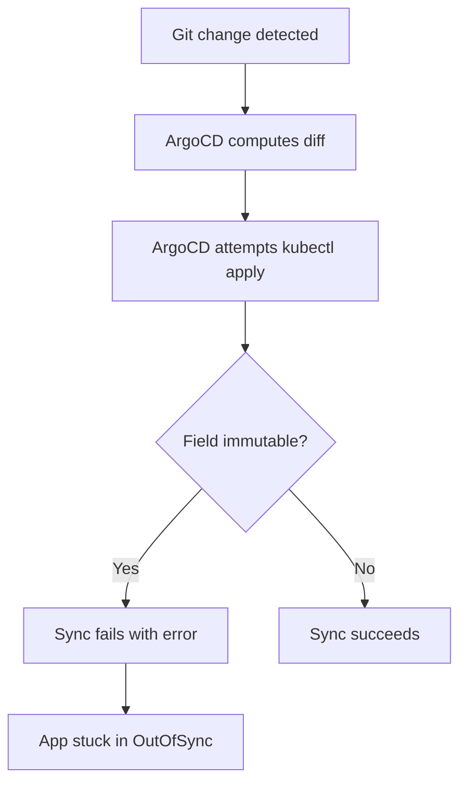

# How to Handle Immutable Fields in ArgoCD

Author: [nawazdhandala](https://github.com/nawazdhandala)

Tags: ArgoCD, GitOps, Kubernetes, Troubleshooting, Configuration

Description: Learn how to handle immutable Kubernetes fields like Job selectors, StatefulSet volume claims, and Service types in ArgoCD to avoid sync failures and stuck deployments.

---

Some Kubernetes resource fields are immutable after creation. You cannot change a Job's selector, a StatefulSet's volumeClaimTemplates, or a Service's clusterIP. When you try, Kubernetes rejects the update with an error like "field is immutable." In an ArgoCD GitOps workflow, this creates a frustrating situation: you update the manifest in Git, ArgoCD tries to sync, and the sync fails because Kubernetes refuses the change. This guide covers every common immutable field scenario and how to handle each one.

## Understanding Immutable Fields

Kubernetes marks certain fields as immutable for good reasons - they are fundamental to the resource's identity or operation and changing them would require recreating the resource. The most common immutable fields include:

- **Job**: `spec.selector`, `spec.template` (in most cases)
- **StatefulSet**: `spec.volumeClaimTemplates`, `spec.selector`
- **Service**: `spec.clusterIP`, `spec.type` (in some transitions)
- **PersistentVolumeClaim**: `spec.storageClassName`, `spec.accessModes`, `spec.resources.requests.storage` (can only increase in some cases)
- **Deployment**: `spec.selector`
- **DaemonSet**: `spec.selector`
- **CronJob**: `spec.jobTemplate.spec.selector` (inherited immutability)

## The Problem in ArgoCD

When you change an immutable field in Git, the ArgoCD sync cycle looks like this:



The application gets stuck: Git says one thing, the cluster has another, and Kubernetes will not allow the update. ArgoCD retries and fails repeatedly.

## Solution 1: Replace Instead of Apply

The `Replace=true` sync option tells ArgoCD to use `kubectl replace` instead of `kubectl apply`. Replace deletes and recreates the resource, which sidesteps the immutability constraint:

```yaml
apiVersion: argoproj.io/v1alpha1
kind: Application
metadata:
  name: my-app
spec:
  syncPolicy:
    syncOptions:
      - Replace=true
```

**Warning**: `Replace=true` affects all resources in the Application. This means brief downtime as resources are deleted and recreated. Use it selectively.

For a more targeted approach, use the CLI:

```bash
# Replace only specific resources
argocd app sync my-app --resource batch:Job:my-job --replace
```

## Solution 2: Force Sync

Force sync deletes the resource before recreating it:

```bash
argocd app sync my-app --force
```

This is essentially a delete-then-create operation. It works for any immutable field issue but causes brief downtime for the affected resources.

## Solution 3: Use Sync Waves to Delete and Recreate

For Jobs specifically, use ArgoCD hooks with sync waves:

```yaml
# Delete old job first (negative sync wave runs first)
apiVersion: batch/v1
kind: Job
metadata:
  name: my-job
  annotations:
    argocd.argoproj.io/hook: PreSync
    argocd.argoproj.io/hook-delete-policy: BeforeHookCreation
spec:
  selector: {}    # Let Kubernetes generate this
  template:
    metadata:
      labels:
        app: my-job
    spec:
      containers:
        - name: worker
          image: my-app:v2
      restartPolicy: Never
```

The `BeforeHookCreation` delete policy ensures the old Job is deleted before a new one is created, avoiding the immutability conflict entirely.

## Handling Specific Immutable Fields

### Job Selectors

Jobs are the most common source of immutable field errors. The selector is generated at creation time and cannot be changed:

```
The Job "my-job" is invalid: spec.selector: Invalid value: ...: field is immutable
```

**Solution A**: Use unique Job names with the Git revision or timestamp:

```yaml
apiVersion: batch/v1
kind: Job
metadata:
  name: my-job-{{ .Values.image.tag | replace "." "-" }}
  annotations:
    argocd.argoproj.io/hook: PreSync
    argocd.argoproj.io/hook-delete-policy: BeforeHookCreation
spec:
  template:
    spec:
      containers:
        - name: worker
          image: "{{ .Values.image.repository }}:{{ .Values.image.tag }}"
      restartPolicy: Never
```

**Solution B**: Use `generateName` instead of `name` (works with ArgoCD hooks):

```yaml
apiVersion: batch/v1
kind: Job
metadata:
  generateName: my-job-
  annotations:
    argocd.argoproj.io/hook: PreSync
    argocd.argoproj.io/hook-delete-policy: HookSucceeded
```

**Solution C**: Add the Replace sync option for Jobs only:

```bash
argocd app sync my-app --resource batch:Job:my-job --replace
```

### StatefulSet Volume Claim Templates

StatefulSet volumeClaimTemplates are immutable. You cannot change the storage size, access mode, or storage class:

```
The StatefulSet "my-db" is invalid: spec: Forbidden: updates to statefulset spec for fields other than ...
```

**Solution**: Delete the StatefulSet (not the PVCs) and let ArgoCD recreate it:

```bash
# Delete the StatefulSet without deleting its pods (--cascade=orphan)
kubectl delete statefulset my-db -n my-namespace --cascade=orphan

# Now sync - ArgoCD will recreate the StatefulSet with new volumeClaimTemplates
argocd app sync my-app
```

The existing PVCs remain intact. The new StatefulSet adopts the existing pods and PVCs if the pod selector matches.

For an automated approach, annotate the StatefulSet:

```yaml
apiVersion: argoproj.io/v1alpha1
kind: Application
spec:
  syncPolicy:
    syncOptions:
      # Only use Replace for specific resource types
      - Replace=true    # Be careful - this affects all resources
```

### Service Type Changes

Changing a Service type (e.g., from ClusterIP to LoadBalancer) can hit immutability issues:

```yaml
# This can fail if clusterIP changes
spec:
  ignoreDifferences:
    - group: ""
      kind: Service
      jsonPointers:
        - /spec/clusterIP
        - /spec/clusterIPs
```

For Service type changes, you often need to delete and recreate:

```bash
kubectl delete service my-service -n my-namespace
argocd app sync my-app
```

### Deployment Selectors

Deployment selectors are immutable after creation:

```
The Deployment "my-app" is invalid: spec.selector: Invalid value: ...: field is immutable
```

**Solution**: This is a design-level issue. You cannot change a Deployment's selector. Instead, create a new Deployment with the new selector and delete the old one:

```yaml
# Rename the deployment or use a different name
apiVersion: apps/v1
kind: Deployment
metadata:
  name: my-app-v2    # New name since selector changed
spec:
  selector:
    matchLabels:
      app: my-app-v2    # New selector
```

Or use Replace sync:

```bash
argocd app sync my-app --resource apps:Deployment:my-app --replace
```

### PersistentVolumeClaim Fields

PVC storage class and access modes are immutable. Storage size can only increase (if the storage class supports it):

```yaml
# Ignore PVC fields that cause issues
spec:
  ignoreDifferences:
    - group: ""
      kind: PersistentVolumeClaim
      jsonPointers:
        - /spec/volumeName
        - /spec/volumeMode
```

For storage class or access mode changes, the PVC must be deleted and recreated (which means data migration):

```bash
# Backup data first
kubectl exec my-pod -n my-namespace -- tar czf /tmp/backup.tar.gz /data

# Delete the PVC
kubectl delete pvc my-pvc -n my-namespace

# Sync to create new PVC with updated spec
argocd app sync my-app

# Restore data
kubectl exec my-pod -n my-namespace -- tar xzf /tmp/backup.tar.gz -C /
```

## Server-Side Apply as a Solution

Server-side apply can help with some immutable field conflicts because it manages field ownership differently:

```yaml
apiVersion: argoproj.io/v1alpha1
kind: Application
spec:
  syncPolicy:
    syncOptions:
      - ServerSideApply=true
```

Server-side apply is more lenient about fields that ArgoCD did not set, reducing some conflicts. However, it does not bypass truly immutable fields like Job selectors.

## Automated Handling with Sync Retry

Configure ArgoCD to retry after sync failures, giving you time to manually resolve immutable field issues:

```yaml
apiVersion: argoproj.io/v1alpha1
kind: Application
spec:
  syncPolicy:
    retry:
      limit: 3
      backoff:
        duration: 30s
        factor: 2
        maxDuration: 5m
```

## Prevention: Resource Naming Strategies

The best way to avoid immutable field issues is to design your manifests to avoid them:

### Use Unique Job Names

```yaml
# Include a hash or version in Job names
apiVersion: batch/v1
kind: Job
metadata:
  name: "migrate-{{ .Values.migration.version }}"
```

### Use ArgoCD Hooks for One-Off Tasks

```yaml
# Hooks with BeforeHookCreation automatically handle cleanup
metadata:
  annotations:
    argocd.argoproj.io/hook: PreSync
    argocd.argoproj.io/hook-delete-policy: BeforeHookCreation
```

### Separate Mutable and Immutable Resources

Keep resources with immutable fields in separate Applications so that `Replace=true` can be scoped:

```yaml
# Application for stateless workloads (safe to replace)
apiVersion: argoproj.io/v1alpha1
kind: Application
metadata:
  name: my-app-jobs
spec:
  source:
    path: k8s/jobs
  syncPolicy:
    syncOptions:
      - Replace=true

# Application for stateful workloads (careful with replace)
apiVersion: argoproj.io/v1alpha1
kind: Application
metadata:
  name: my-app-services
spec:
  source:
    path: k8s/services
```

## Summary

Immutable fields are one of the most common sources of ArgoCD sync failures. The key strategies are: use ArgoCD hooks with `BeforeHookCreation` for Jobs, use `Replace=true` or `--force` sync for resources that need to be recreated, use unique names for one-off resources like Jobs, and separate mutable and immutable resources into different Applications when possible. Always test these strategies in a non-production environment first, as delete-and-recreate operations can cause brief downtime.
