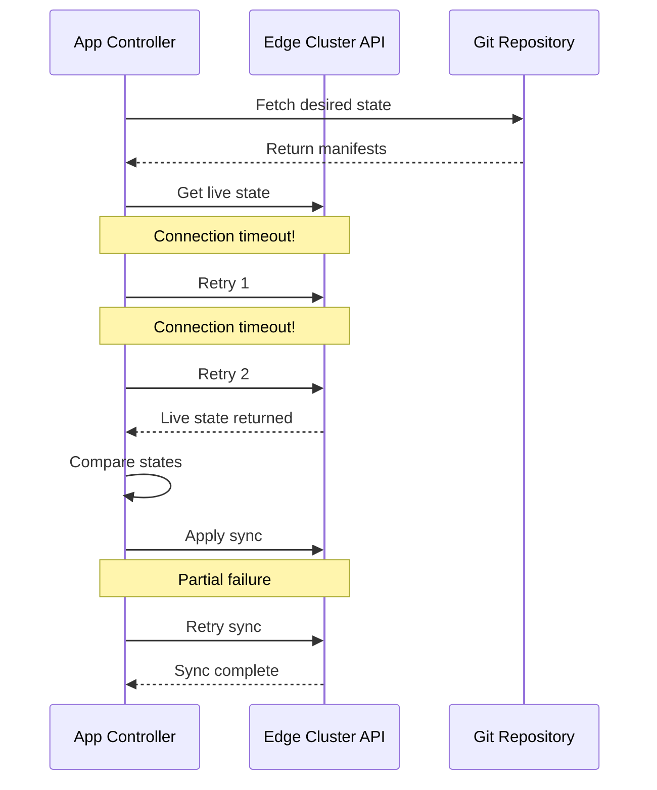

# How to Handle Intermittent Connectivity with ArgoCD

Author: [nawazdhandala](https://github.com/nawazdhandala)

Tags: ArgoCD, GitOps, Kubernetes, Edge Computing, Network Resilience

Description: Practical strategies for handling unreliable network connections between ArgoCD and remote Kubernetes clusters, including retry policies, timeouts, and offline resilience.

---

When you manage Kubernetes clusters in remote locations - factory floors, retail stores, oil rigs, or branch offices - network connectivity is never guaranteed. Links go down, VPN tunnels flap, and satellite connections have high latency with frequent packet loss. ArgoCD needs to handle all of this gracefully without flooding your alert system with false positives or giving up on syncing remote clusters.

This post covers practical strategies for configuring ArgoCD to work reliably with intermittent connectivity to remote clusters.

## Understanding the Problem

ArgoCD's application controller runs a continuous reconciliation loop. Every few minutes (default is 3 minutes), it checks each application's live state against the desired state in Git. When it cannot reach a remote cluster's API server, several things happen: the application health status becomes "Unknown", sync operations fail with connection timeouts, and the repo server might queue up redundant manifest generation requests.

The default behavior is designed for low-latency, reliable connections. For edge scenarios, you need to tune almost everything.



## Tuning Reconciliation Intervals

The first thing to adjust is how often ArgoCD checks each application. For edge clusters on unreliable links, the default 3-minute interval is too aggressive.

```yaml
# argocd-cm ConfigMap - increase reconciliation timeout
apiVersion: v1
kind: ConfigMap
metadata:
  name: argocd-cm
  namespace: argocd
data:
  # Increase default reconciliation to 10 minutes
  # This reduces API calls to remote clusters
  timeout.reconciliation: "600"
```

You can also set per-application reconciliation intervals using annotations. This lets you treat edge clusters differently from your local clusters.

```yaml
# Application-level reconciliation override
apiVersion: argoproj.io/v1alpha1
kind: Application
metadata:
  name: pos-edge-site-42
  namespace: argocd
  annotations:
    # Check this edge app every 15 minutes instead of the default
    argocd.argoproj.io/refresh: "900"
spec:
  # ... app spec
```

## Configuring Connection Timeouts

By default, ArgoCD uses fairly aggressive timeouts when connecting to cluster API servers. For high-latency or unreliable links, you need to increase these.

```yaml
# argocd-cmd-params-cm - adjust timeout settings
apiVersion: v1
kind: ConfigMap
metadata:
  name: argocd-cmd-params-cm
  namespace: argocd
data:
  # Increase the timeout for cluster API server connections
  # Default is 60 seconds, increase for satellite/LTE links
  controller.kubectl.parallelism: "10"
  # Repo server timeout for generating manifests
  reposerver.timeout.seconds: "300"
```

For the cluster connection itself, you can configure timeouts in the cluster secret.

```yaml
# Cluster secret with extended timeouts
apiVersion: v1
kind: Secret
metadata:
  name: edge-site-42
  namespace: argocd
  labels:
    argocd.argoproj.io/secret-type: cluster
type: Opaque
stringData:
  name: edge-site-42
  server: https://edge-42.vpn.internal:6443
  config: |
    {
      "bearerToken": "<token>",
      "tlsClientConfig": {
        "insecure": false,
        "caData": "<ca-data>"
      },
      "execProviderConfig": null
    }
```

## Retry Policies for Sync Operations

When a sync operation fails due to a network interruption, ArgoCD should retry automatically with exponential backoff. Configure this in the Application's sync policy.

```yaml
# Application with aggressive retry for intermittent connections
apiVersion: argoproj.io/v1alpha1
kind: Application
metadata:
  name: inventory-agent-edge-42
  namespace: argocd
spec:
  project: edge-fleet
  source:
    repoURL: https://github.com/company/edge-configs
    targetRevision: main
    path: apps/inventory-agent
  destination:
    server: https://edge-42.vpn.internal:6443
    namespace: inventory
  syncPolicy:
    automated:
      prune: true
      selfHeal: true
    retry:
      # Retry up to 20 times for unreliable connections
      limit: 20
      backoff:
        # Start with 30 second delay
        duration: 30s
        # Double the delay each retry
        factor: 2
        # Cap at 30 minutes between retries
        maxDuration: 30m
    syncOptions:
      - CreateNamespace=true
      # Apply only changed resources to minimize API calls
      - ApplyOutOfSyncOnly=true
      # Use server-side apply for better conflict handling
      - ServerSideApply=true
```

The `ApplyOutOfSyncOnly=true` option is particularly important for intermittent connections. Without it, ArgoCD applies all resources on every sync, even those that have not changed. With it, ArgoCD only applies resources that differ from the desired state, cutting down the number of API calls significantly.

## Handling the "Unknown" Health State

When ArgoCD cannot reach a cluster, applications show as "Unknown" health status. You need to distinguish between "temporarily unreachable" and "actually broken". The key is setting appropriate alert thresholds.

```yaml
# PrometheusRule that accounts for intermittent connectivity
apiVersion: monitoring.coreos.com/v1
kind: PrometheusRule
metadata:
  name: edge-connectivity-alerts
spec:
  groups:
    - name: edge-health
      rules:
        # Only alert if an edge app has been Unknown for over 2 hours
        - alert: EdgeClusterUnreachable
          expr: |
            argocd_app_info{
              health_status="Unknown",
              name=~".*edge.*"
            } == 1
          for: 2h
          labels:
            severity: warning
          annotations:
            summary: "Edge cluster {{ $labels.name }} unreachable for 2+ hours"

        # Critical alert at 8 hours - likely a real outage
        - alert: EdgeClusterDown
          expr: |
            argocd_app_info{
              health_status="Unknown",
              name=~".*edge.*"
            } == 1
          for: 8h
          labels:
            severity: critical
          annotations:
            summary: "Edge cluster {{ $labels.name }} down for 8+ hours"
```

## Resource Caching for Offline Resilience

ArgoCD caches cluster state in Redis. When a connection drops, the cached state is still available, which means the UI still shows the last-known state rather than immediately showing everything as unknown.

Increase the cache TTL for edge clusters so that the cached state persists longer during outages.

```yaml
# argocd-cmd-params-cm - extend cache for edge resilience
apiVersion: v1
kind: ConfigMap
metadata:
  name: argocd-cmd-params-cm
  namespace: argocd
data:
  # Increase the cluster cache retry timeout
  controller.cluster.cache.retry.timeout: "300"
```

## Reducing Bandwidth Usage

On low-bandwidth links, every API call counts. Here are techniques to minimize the data ArgoCD transfers.

First, use resource tracking by annotation instead of label. Labels require ArgoCD to list all resources to find managed ones, while annotations are only checked on known resources.

```yaml
# argocd-cm - use annotation tracking to reduce API queries
apiVersion: v1
kind: ConfigMap
metadata:
  name: argocd-cm
  namespace: argocd
data:
  # Annotation-based tracking is more efficient for remote clusters
  application.resourceTrackingMethod: annotation
```

Second, limit the resource kinds that ArgoCD watches on edge clusters. If your edge applications only use Deployments, Services, and ConfigMaps, there is no need to watch CRDs, Jobs, or other resource types.

```yaml
# In the Application spec, use resource inclusion/exclusion
spec:
  source:
    directory:
      recurse: true
  # Only track specific resource types on edge clusters
  ignoreDifferences:
    - group: ""
      kind: "ConfigMap"
      jsonPointers:
        - /data/last-heartbeat  # Ignore frequently changing fields
```

## Connection Pooling and Keep-Alive

For VPN or tunnel-based connections to edge clusters, configure HTTP keep-alive to maintain persistent connections instead of establishing new TLS handshakes for every API call.

```bash
# When registering a cluster with specific connection settings
argocd cluster add edge-site-42 \
  --name edge-site-42 \
  --kubeconfig /path/to/kubeconfig \
  --server-side-diff
```

## Testing Your Configuration

Before rolling these settings to production, test with a simulated unreliable connection. You can use `tc` (traffic control) on Linux to add latency and packet loss to your test edge cluster.

```bash
# On the edge cluster node - simulate 200ms latency with 10% packet loss
sudo tc qdisc add dev eth0 root netem delay 200ms 50ms loss 10%

# Remove the simulation when done
sudo tc qdisc del dev eth0 root netem
```

Then watch how ArgoCD behaves - check the application controller logs for retry patterns and verify that applications eventually converge to the desired state.

```bash
# Watch the app controller logs for connection issues
kubectl logs -n argocd -l app.kubernetes.io/name=argocd-application-controller \
  --follow | grep -i "edge-site-42"
```

## Wrapping Up

Handling intermittent connectivity with ArgoCD comes down to four principles: increase timeouts and reconciliation intervals for edge clusters, configure generous retry policies with exponential backoff, set appropriate alert thresholds that account for expected outages, and minimize API calls through efficient resource tracking and selective syncing. With these settings in place, ArgoCD becomes a reliable GitOps engine even for the most challenging network environments.
