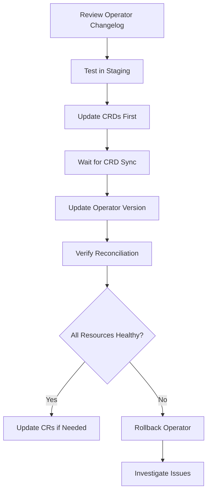

# How to Handle Operator Upgrades with ArgoCD

Author: [nawazdhandala](https://github.com/nawazdhandala)

Tags: ArgoCD, GitOps, Kubernetes, Operators, Upgrades

Description: Learn how to safely upgrade Kubernetes Operators with ArgoCD, including CRD migration strategies, version pinning, rollback procedures, and zero-downtime upgrade patterns.

---

Upgrading Kubernetes Operators is one of the riskier operations in a cluster. A bad operator upgrade can break all Custom Resources it manages, corrupt data, or cause extended downtime. When you manage operators through ArgoCD, you need a disciplined upgrade process that leverages GitOps principles for safety and rollback capability.

This guide covers strategies for upgrading operators safely with ArgoCD.

## Why Operator Upgrades Are Risky

Operators are more than regular deployments. When you upgrade an operator, you are potentially:

- Changing CRD schemas (which can be a one-way migration)
- Altering how the operator reconciles existing resources
- Introducing new required fields on Custom Resources
- Changing the operator's behavior with existing workloads

A bad application deployment affects one service. A bad operator upgrade can affect every resource the operator manages across the cluster.

## The Upgrade Flow



## Step 1: Version Pinning

Always pin operator versions in your ArgoCD Applications. Never use `latest` or floating tags:

```yaml
apiVersion: argoproj.io/v1alpha1
kind: Application
metadata:
  name: cert-manager
  namespace: argocd
spec:
  source:
    repoURL: https://charts.jetstack.io
    chart: cert-manager
    # Pin to exact version
    targetRevision: v1.14.0
```

For Git-sourced operators, pin to a tag or commit SHA:

```yaml
spec:
  source:
    repoURL: https://github.com/myorg/operators.git
    # Pin to a tag, not a branch
    targetRevision: v2.5.0
    # Or pin to a commit SHA for maximum control
    # targetRevision: abc123def456
```

## Step 2: Disable Auto-Sync Before Upgrading

For critical operators, disable auto-sync before making version changes:

```bash
# Disable auto-sync on the operator application
argocd app set my-operator --sync-policy none

# Disable auto-sync on the CRD application
argocd app set my-operator-crds --sync-policy none
```

This prevents ArgoCD from immediately applying changes when you push to Git. You control exactly when the upgrade happens.

## Step 3: Update CRDs First

CRDs must be updated before the operator. CRD changes are usually backward-compatible (new optional fields), but you should verify.

```yaml
# Update the CRD application version in Git
apiVersion: argoproj.io/v1alpha1
kind: Application
metadata:
  name: my-operator-crds
spec:
  source:
    targetRevision: v2.6.0  # Updated from v2.5.0
```

Then manually sync the CRD application:

```bash
# Sync CRDs first
argocd app sync my-operator-crds

# Wait for sync to complete
argocd app wait my-operator-crds --health

# Verify CRDs are updated
kubectl get crd mycustomresources.example.com -o jsonpath='{.spec.versions[*].name}'
```

## Step 4: Update the Operator

After CRDs are synced, update the operator version:

```yaml
apiVersion: argoproj.io/v1alpha1
kind: Application
metadata:
  name: my-operator
spec:
  source:
    targetRevision: v2.6.0  # Updated from v2.5.0
```

Sync the operator:

```bash
# Sync the operator
argocd app sync my-operator

# Watch the rollout
argocd app wait my-operator --health --timeout 300
```

## Step 5: Verify After Upgrade

After the operator is running, verify it is reconciling resources correctly:

```bash
# Check operator logs for errors
kubectl logs -n operators -l app=my-operator --tail=100

# Check all custom resources are still healthy
kubectl get myresources --all-namespaces

# Verify ArgoCD shows healthy status
argocd app get my-operator-instances
```

## Step 6: Re-enable Auto-Sync

Once everything looks good:

```bash
# Re-enable auto-sync
argocd app set my-operator --sync-policy automated --auto-prune --self-heal
argocd app set my-operator-crds --sync-policy automated --self-heal
```

## Rollback Strategy

If the upgrade goes wrong, you need to roll back. With ArgoCD, this means reverting the version change in Git.

```bash
# Quick rollback: revert the Git commit
git revert HEAD
git push

# Or sync to the previous version directly
argocd app set my-operator --revision v2.5.0
argocd app sync my-operator
```

Important caveats about operator rollbacks:

- **CRD rollbacks may not work**: If the new CRD version added a required field and existing resources now have that field, downgrading the CRD may fail validation
- **Data migrations may not be reversible**: Some operators perform data migrations on upgrade that cannot be undone
- **Test rollbacks in staging first**: Always verify that a downgrade path exists before upgrading in production

## CRD Migration Strategies

### Strategy 1: In-Place CRD Update

The simplest approach. Update the CRD in place. This works when the new CRD version only adds optional fields.

```yaml
# Old CRD version
spec:
  versions:
    - name: v1
      served: true
      storage: true

# New CRD version - adds v2, keeps serving v1
spec:
  versions:
    - name: v2
      served: true
      storage: true
    - name: v1
      served: true
      storage: false
```

### Strategy 2: Conversion Webhook

For CRDs that need to convert between versions, deploy a conversion webhook alongside the operator:

```yaml
spec:
  conversion:
    strategy: Webhook
    webhook:
      clientConfig:
        service:
          name: my-operator-webhook
          namespace: operators
          path: /convert
      conversionReviewVersions:
        - v1
        - v1beta1
```

### Strategy 3: Blue-Green CRD Migration

For major CRD changes, create a new CRD group entirely:

1. Deploy new CRD (e.g., `v2.example.com`) alongside old one
2. Deploy new operator version that watches both
3. Migrate resources from old to new CRD
4. Remove old CRD and old operator version

## Using ArgoCD Sync Windows

Schedule operator upgrades during maintenance windows using ArgoCD sync windows:

```yaml
apiVersion: argoproj.io/v1alpha1
kind: AppProject
metadata:
  name: operators
  namespace: argocd
spec:
  syncWindows:
    # Allow syncs only during maintenance window
    - kind: allow
      schedule: "0 2 * * 3"    # Wednesdays at 2 AM
      duration: 2h
      applications:
        - "*-operator"
        - "*-crds"
      manualSync: true
    # Deny syncs outside the window
    - kind: deny
      schedule: "0 0 * * *"
      duration: 24h
      applications:
        - "*-operator"
        - "*-crds"
```

## Canary Operator Upgrades

For operators that support it, you can run two versions simultaneously:

```yaml
# Old operator watches namespace "production"
apiVersion: argoproj.io/v1alpha1
kind: Application
metadata:
  name: my-operator-v1
spec:
  source:
    targetRevision: v2.5.0
    helm:
      values: |
        watchNamespaces:
          - production

# New operator watches namespace "canary"
apiVersion: argoproj.io/v1alpha1
kind: Application
metadata:
  name: my-operator-v2
spec:
  source:
    targetRevision: v2.6.0
    helm:
      values: |
        watchNamespaces:
          - canary
```

Test the new version with canary workloads before switching production to the new version.

## Monitoring Upgrades

Track operator upgrade health with these metrics:

```yaml
apiVersion: monitoring.coreos.com/v1
kind: PrometheusRule
metadata:
  name: operator-upgrade-alerts
  namespace: monitoring
spec:
  groups:
    - name: operator.upgrade.rules
      rules:
        - alert: OperatorReconcileErrors
          expr: |
            increase(controller_runtime_reconcile_errors_total[5m]) > 10
          for: 5m
          labels:
            severity: critical
          annotations:
            summary: "Operator reconciliation errors spiking after upgrade"
        - alert: OperatorCRNotReady
          expr: |
            count(kube_customresource_status_condition{status!="True",type="Ready"}) > 0
          for: 10m
          labels:
            severity: warning
          annotations:
            summary: "Custom resources not ready after operator upgrade"
```

## Automated Upgrade Testing

Integrate operator upgrade testing into your CI pipeline:

```yaml
# GitHub Actions workflow for operator upgrade testing
name: Test Operator Upgrade
on:
  pull_request:
    paths:
      - 'operators/*/application.yaml'
jobs:
  test-upgrade:
    runs-on: ubuntu-latest
    steps:
      - uses: actions/checkout@v4
      - name: Create Kind cluster
        uses: helm/kind-action@v1
      - name: Install old version
        run: |
          kubectl apply -f operators/my-operator/crds/
          kubectl apply -f operators/my-operator/deployment-old.yaml
          kubectl wait --for=condition=Ready pod -l app=my-operator -n operators
      - name: Create test resources
        run: kubectl apply -f tests/operator-upgrade/fixtures/
      - name: Upgrade operator
        run: |
          kubectl apply -f operators/my-operator/crds/
          kubectl apply -f operators/my-operator/deployment.yaml
          kubectl wait --for=condition=Ready pod -l app=my-operator -n operators
      - name: Verify resources still healthy
        run: |
          kubectl wait --for=condition=Ready myresource --all --timeout=120s
```

## Summary

Operator upgrades with ArgoCD require a careful, phased approach: disable auto-sync, update CRDs first, update the operator, verify reconciliation, then re-enable auto-sync. Version pin everything, test upgrades in staging, and have a rollback plan ready. Sync windows can enforce maintenance schedules, and canary deployments let you test new operator versions with limited blast radius. For specific operator deployment guides, see our posts on deploying [Prometheus](https://oneuptime.com/blog/post/2026-02-26-how-to-deploy-the-prometheus-operator-with-argocd/view), [cert-manager](https://oneuptime.com/blog/post/2026-02-26-how-to-deploy-the-cert-manager-operator-with-argocd/view), and [Strimzi Kafka](https://oneuptime.com/blog/post/2026-02-26-how-to-deploy-the-strimzi-kafka-operator-with-argocd/view) with ArgoCD.
