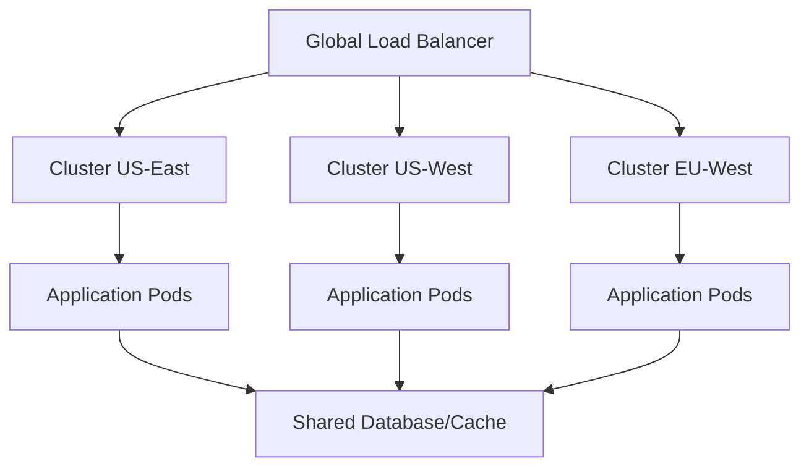

# How to Implement Active-Active Deployments Across Clusters with ArgoCD

Author: [nawazdhandala](https://github.com/nawazdhandala)

Tags: ArgoCD, GitOps, Kubernetes, Multi-Cluster, High Availability

Description: Learn how to implement active-active deployments across multiple Kubernetes clusters with ArgoCD using ApplicationSets, DNS-based routing, and consistent configuration management.

---

Active-active deployments run your application across multiple Kubernetes clusters simultaneously, with all clusters serving production traffic. This gives you geographic redundancy, lower latency for distributed users, and the ability to survive entire cluster failures. ArgoCD's multi-cluster support and ApplicationSets make this pattern practical to manage through GitOps.

This guide walks through implementing active-active deployments with ArgoCD.

## Active-Active vs Active-Passive

In active-active, every cluster handles production traffic at all times. In active-passive, one cluster handles traffic while others stand by. Active-active gives you better resource utilization and lower latency, but requires your application to handle distributed state.



## Prerequisites

Before implementing active-active, you need:

1. **Multiple Kubernetes clusters** registered with ArgoCD
2. **A global load balancer** (Route53, Cloudflare, or a cloud provider's global LB)
3. **An application that supports distributed operation** (stateless, or with shared state management)
4. **ArgoCD with multi-cluster access** configured

## Step 1: Register Clusters with ArgoCD

Add each target cluster to ArgoCD:

```bash
# Add US-East cluster
argocd cluster add us-east-cluster \
  --name us-east \
  --kubeconfig /path/to/us-east-kubeconfig

# Add US-West cluster
argocd cluster add us-west-cluster \
  --name us-west \
  --kubeconfig /path/to/us-west-kubeconfig

# Add EU-West cluster
argocd cluster add eu-west-cluster \
  --name eu-west \
  --kubeconfig /path/to/eu-west-kubeconfig
```

Or manage cluster secrets declaratively in Git:

```yaml
apiVersion: v1
kind: Secret
metadata:
  name: us-east-cluster
  namespace: argocd
  labels:
    argocd.argoproj.io/secret-type: cluster
    environment: production
    region: us-east-1
type: Opaque
stringData:
  name: us-east
  server: https://us-east.k8s.example.com
  config: |
    {
      "bearerToken": "<token>",
      "tlsClientConfig": {
        "insecure": false,
        "caData": "<base64-ca>"
      }
    }
```

## Step 2: Deploy with ApplicationSets

ApplicationSets let you deploy the same application across all clusters from a single definition:

```yaml
apiVersion: argoproj.io/v1alpha1
kind: ApplicationSet
metadata:
  name: api-active-active
  namespace: argocd
spec:
  generators:
    - clusters:
        selector:
          matchLabels:
            environment: production
        values:
          # Cluster-specific values
          region: '{{metadata.labels.region}}'
  template:
    metadata:
      name: 'api-{{name}}'
    spec:
      project: default
      source:
        repoURL: https://github.com/myorg/api-service.git
        targetRevision: main
        path: deploy/overlays/{{values.region}}
      destination:
        server: '{{server}}'
        namespace: api
      syncPolicy:
        automated:
          prune: true
          selfHeal: true
        syncOptions:
          - CreateNamespace=true
        retry:
          limit: 5
          backoff:
            duration: 5s
            factor: 2
            maxDuration: 3m
```

## Step 3: Cluster-Specific Configuration

Use Kustomize overlays for cluster-specific settings:

```
deploy/
  base/
    deployment.yaml
    service.yaml
    hpa.yaml
    kustomization.yaml
  overlays/
    us-east-1/
      kustomization.yaml
      patch-replicas.yaml
    us-west-2/
      kustomization.yaml
      patch-replicas.yaml
    eu-west-1/
      kustomization.yaml
      patch-replicas.yaml
```

Base deployment:

```yaml
# deploy/base/deployment.yaml
apiVersion: apps/v1
kind: Deployment
metadata:
  name: api
spec:
  replicas: 3
  selector:
    matchLabels:
      app: api
  template:
    metadata:
      labels:
        app: api
    spec:
      containers:
        - name: api
          image: myorg/api:v1.5.0
          ports:
            - containerPort: 8080
          env:
            - name: REGION
              value: "PLACEHOLDER"
          resources:
            requests:
              cpu: 500m
              memory: 512Mi
            limits:
              memory: 1Gi
          readinessProbe:
            httpGet:
              path: /health
              port: 8080
            initialDelaySeconds: 5
            periodSeconds: 10
```

Region-specific overlay:

```yaml
# deploy/overlays/us-east-1/kustomization.yaml
apiVersion: kustomize.config.k8s.io/v1beta1
kind: Kustomization
resources:
  - ../../base
patches:
  - target:
      kind: Deployment
      name: api
    patch: |
      - op: replace
        path: /spec/replicas
        value: 5
      - op: replace
        path: /spec/template/spec/containers/0/env/0/value
        value: "us-east-1"
```

## Step 4: DNS-Based Traffic Distribution

For active-active to work, you need a global load balancer. Here is an example using ExternalDNS with weighted routing:

```yaml
apiVersion: v1
kind: Service
metadata:
  name: api
  namespace: api
  annotations:
    # ExternalDNS annotations for weighted routing
    external-dns.alpha.kubernetes.io/hostname: api.example.com
    external-dns.alpha.kubernetes.io/aws-weight: "100"
    external-dns.alpha.kubernetes.io/set-identifier: us-east-1
spec:
  type: LoadBalancer
  ports:
    - port: 443
      targetPort: 8080
  selector:
    app: api
```

Each cluster gets the same DNS hostname but with different set identifiers and optional weights.

## Step 5: Health-Based Traffic Routing

Configure DNS health checks so traffic is automatically routed away from unhealthy clusters:

```yaml
# AWS Route53 health check (managed via Terraform or Crossplane)
apiVersion: route53.aws.upbound.io/v1beta1
kind: HealthCheck
metadata:
  name: api-us-east
spec:
  forProvider:
    fqdn: api-us-east.internal.example.com
    port: 443
    type: HTTPS
    resourcePath: /health
    failureThreshold: 3
    requestInterval: 30
    region: us-east-1
```

## Step 6: Consistent Rollouts

For active-active deployments, you want changes to roll out across all clusters consistently. Use ArgoCD's progressive sync feature or implement a rollout strategy:

```yaml
apiVersion: argoproj.io/v1alpha1
kind: ApplicationSet
metadata:
  name: api-active-active
  namespace: argocd
spec:
  generators:
    - clusters:
        selector:
          matchLabels:
            environment: production
  strategy:
    type: RollingSync
    rollingSync:
      steps:
        - matchExpressions:
            - key: region
              operator: In
              values:
                - us-east-1
        - matchExpressions:
            - key: region
              operator: In
              values:
                - us-west-2
        - matchExpressions:
            - key: region
              operator: In
              values:
                - eu-west-1
  template:
    metadata:
      name: 'api-{{name}}'
    spec:
      project: default
      source:
        repoURL: https://github.com/myorg/api-service.git
        targetRevision: main
        path: deploy/overlays/{{metadata.labels.region}}
      destination:
        server: '{{server}}'
        namespace: api
```

This rolls out changes to us-east-1 first, waits for it to be healthy, then proceeds to us-west-2, and finally eu-west-1.

## Step 7: Monitoring Active-Active Health

Monitor the health of all clusters from ArgoCD:

```bash
# View all instances of the active-active deployment
argocd app list --selector appset=api-active-active

# Check specific cluster
argocd app get api-us-east

# Compare configurations across clusters
argocd app diff api-us-east
argocd app diff api-us-west
argocd app diff api-eu-west
```

Create alerting rules for cross-cluster health:

```yaml
apiVersion: monitoring.coreos.com/v1
kind: PrometheusRule
metadata:
  name: active-active-alerts
  namespace: monitoring
spec:
  groups:
    - name: active-active.rules
      rules:
        - alert: ClusterSyncFailed
          expr: |
            argocd_app_info{sync_status!="Synced",name=~"api-.*"} == 1
          for: 10m
          labels:
            severity: critical
          annotations:
            summary: "Active-active deployment out of sync in {{ $labels.name }}"
        - alert: ClusterUnhealthy
          expr: |
            argocd_app_info{health_status!="Healthy",name=~"api-.*"} == 1
          for: 5m
          labels:
            severity: critical
          annotations:
            summary: "Active-active deployment unhealthy in {{ $labels.name }}"
```

## Handling Shared State

Active-active deployments need careful state management. Here are common patterns:

**Database**: Use a managed database service (RDS, Cloud SQL) accessible from all clusters, or use a distributed database like CockroachDB.

**Cache**: Use a managed Redis cluster (ElastiCache, Memorystore) in each region, or use Redis with cross-region replication.

**Sessions**: Use sticky sessions at the load balancer level, or store sessions in a shared cache.

## Common Pitfalls

**Configuration drift between clusters**: Use ApplicationSets and Kustomize overlays to keep configurations consistent. Never make manual changes to individual clusters.

**Uneven traffic distribution**: Monitor request rates per cluster and adjust DNS weights accordingly.

**Database latency**: If your database is in one region, clusters in other regions will have higher latency. Consider read replicas or a multi-region database.

**Deployment race conditions**: Use the RollingSync strategy to deploy changes one cluster at a time rather than all at once.

## Summary

Active-active deployments with ArgoCD give you geographic redundancy and high availability. Use ApplicationSets with cluster generators to deploy across all clusters, Kustomize overlays for cluster-specific configuration, DNS-based routing for traffic distribution, and rolling sync for safe rollouts. The pattern requires careful attention to shared state and consistent configuration. For handling cluster-specific overrides in more detail, see our guide on [cluster-specific overrides with ArgoCD](https://oneuptime.com/blog/post/2026-02-26-how-to-handle-cluster-specific-overrides-with-argocd/view).
