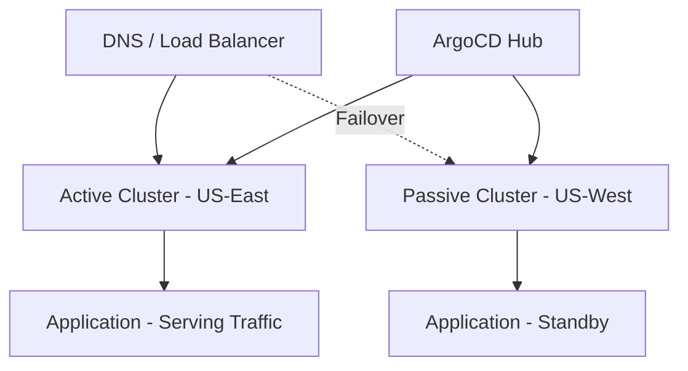

# How to Implement Active-Passive Deployments Across Clusters with ArgoCD

Author: [nawazdhandala](https://github.com/nawazdhandala)

Tags: ArgoCD, GitOps, Kubernetes, Multi-Cluster, Disaster Recovery

Description: Learn how to implement active-passive deployments across Kubernetes clusters with ArgoCD for disaster recovery, including failover automation and standby cluster management.

---

Active-passive deployment is a disaster recovery pattern where one cluster handles all production traffic (active) while one or more standby clusters (passive) are ready to take over if the active cluster fails. ArgoCD makes this pattern manageable by keeping standby clusters synchronized with the active cluster through GitOps.

This guide covers implementing active-passive deployments with ArgoCD, including failover procedures and standby management.

## When to Use Active-Passive

Active-passive is the right choice when:

- Your application cannot run in multiple clusters simultaneously (shared-nothing databases, single-writer systems)
- You want simpler operations than active-active
- You need disaster recovery but not geographic load distribution
- Cost optimization matters (standby clusters can run smaller)



## Architecture Overview

The architecture uses a hub-spoke model:

- **Hub cluster**: Runs ArgoCD and manages all target clusters
- **Active cluster**: Runs the application and serves traffic
- **Passive cluster(s)**: Run the application in standby mode, ready for failover

## Step 1: Set Up the Hub Cluster

Install ArgoCD on a dedicated management cluster:

```yaml
apiVersion: argoproj.io/v1alpha1
kind: Application
metadata:
  name: argocd
  namespace: argocd
spec:
  project: default
  source:
    repoURL: https://argoproj.github.io/argo-helm
    chart: argo-cd
    targetRevision: 5.51.0
    helm:
      values: |
        server:
          replicas: 2
        controller:
          replicas: 2
        repoServer:
          replicas: 2
  destination:
    server: https://kubernetes.default.svc
    namespace: argocd
```

Register both the active and passive clusters:

```yaml
# Active cluster
apiVersion: v1
kind: Secret
metadata:
  name: active-cluster
  namespace: argocd
  labels:
    argocd.argoproj.io/secret-type: cluster
    role: active
    environment: production
type: Opaque
stringData:
  name: active-us-east
  server: https://active.k8s.example.com
  config: |
    {
      "bearerToken": "<token>",
      "tlsClientConfig": {
        "insecure": false,
        "caData": "<base64-ca>"
      }
    }
---
# Passive cluster
apiVersion: v1
kind: Secret
metadata:
  name: passive-cluster
  namespace: argocd
  labels:
    argocd.argoproj.io/secret-type: cluster
    role: passive
    environment: production
type: Opaque
stringData:
  name: passive-us-west
  server: https://passive.k8s.example.com
  config: |
    {
      "bearerToken": "<token>",
      "tlsClientConfig": {
        "insecure": false,
        "caData": "<base64-ca>"
      }
    }
```

## Step 2: Deploy to Both Clusters

Use an ApplicationSet to deploy the same application to both clusters:

```yaml
apiVersion: argoproj.io/v1alpha1
kind: ApplicationSet
metadata:
  name: api-service
  namespace: argocd
spec:
  generators:
    - clusters:
        selector:
          matchLabels:
            environment: production
        values:
          clusterRole: '{{metadata.labels.role}}'
  template:
    metadata:
      name: 'api-{{name}}'
      labels:
        cluster-role: '{{values.clusterRole}}'
    spec:
      project: default
      source:
        repoURL: https://github.com/myorg/api-service.git
        targetRevision: main
        path: deploy/overlays/{{values.clusterRole}}
      destination:
        server: '{{server}}'
        namespace: api
      syncPolicy:
        automated:
          prune: true
          selfHeal: true
        syncOptions:
          - CreateNamespace=true
```

## Step 3: Configure Standby Scaling

The passive cluster runs the application but at reduced capacity. Use Kustomize overlays to manage this:

```yaml
# deploy/overlays/active/kustomization.yaml
apiVersion: kustomize.config.k8s.io/v1beta1
kind: Kustomization
resources:
  - ../../base
patches:
  - target:
      kind: Deployment
      name: api
    patch: |
      - op: replace
        path: /spec/replicas
        value: 10
  - target:
      kind: HorizontalPodAutoscaler
      name: api
    patch: |
      - op: replace
        path: /spec/minReplicas
        value: 10
      - op: replace
        path: /spec/maxReplicas
        value: 50
```

```yaml
# deploy/overlays/passive/kustomization.yaml
apiVersion: kustomize.config.k8s.io/v1beta1
kind: Kustomization
resources:
  - ../../base
patches:
  - target:
      kind: Deployment
      name: api
    patch: |
      # Minimal replicas in standby - enough to verify health
      - op: replace
        path: /spec/replicas
        value: 2
  - target:
      kind: HorizontalPodAutoscaler
      name: api
    patch: |
      - op: replace
        path: /spec/minReplicas
        value: 2
      - op: replace
        path: /spec/maxReplicas
        value: 5
```

## Step 4: Implement Failover Automation

Create a failover script or Job that switches roles:

```yaml
# failover-job.yaml
apiVersion: batch/v1
kind: Job
metadata:
  name: failover
  namespace: argocd
spec:
  template:
    spec:
      serviceAccountName: argocd-failover
      containers:
        - name: failover
          image: argoproj/argocd:v2.10.0
          command:
            - /bin/sh
            - -c
            - |
              # Step 1: Scale up passive cluster
              echo "Scaling up passive cluster..."
              argocd app set api-passive-us-west \
                --path deploy/overlays/active

              # Step 2: Wait for passive to be healthy
              echo "Waiting for passive cluster to be ready..."
              argocd app wait api-passive-us-west --health --timeout 300

              # Step 3: Update DNS to point to passive cluster
              echo "Updating DNS..."
              # This would call your DNS provider API
              # aws route53 change-resource-record-sets ...

              # Step 4: Scale down old active
              echo "Scaling down old active cluster..."
              argocd app set api-active-us-east \
                --path deploy/overlays/passive

              # Step 5: Swap cluster labels
              echo "Swapping cluster roles..."
              kubectl label secret active-cluster -n argocd role=passive --overwrite
              kubectl label secret passive-cluster -n argocd role=active --overwrite

              echo "Failover complete"
      restartPolicy: Never
  backoffLimit: 0
```

## Step 5: DNS Configuration for Failover

Use DNS with health checks to automate traffic routing:

```yaml
# Primary DNS record pointing to active cluster
apiVersion: externaldns.k8s.io/v1alpha1
kind: DNSEndpoint
metadata:
  name: api-primary
  namespace: api
spec:
  endpoints:
    - dnsName: api.example.com
      recordType: A
      targets:
        - <active-cluster-lb-ip>
      setIdentifier: primary
      providerSpecific:
        - name: aws/failover
          value: PRIMARY
        - name: aws/health-check-id
          value: <health-check-id>
---
# Secondary DNS record pointing to passive cluster
apiVersion: externaldns.k8s.io/v1alpha1
kind: DNSEndpoint
metadata:
  name: api-secondary
  namespace: api
spec:
  endpoints:
    - dnsName: api.example.com
      recordType: A
      targets:
        - <passive-cluster-lb-ip>
      setIdentifier: secondary
      providerSpecific:
        - name: aws/failover
          value: SECONDARY
```

## Step 6: Standby Verification

Regularly verify the passive cluster can serve traffic. This is a readiness check that runs as a CronJob:

```yaml
apiVersion: batch/v1
kind: CronJob
metadata:
  name: standby-readiness-check
  namespace: argocd
spec:
  schedule: "*/30 * * * *"
  jobTemplate:
    spec:
      template:
        spec:
          containers:
            - name: check
              image: curlimages/curl:latest
              command:
                - /bin/sh
                - -c
                - |
                  # Check passive cluster health endpoint
                  RESPONSE=$(curl -s -o /dev/null -w "%{http_code}" \
                    https://api-passive.internal.example.com/health)

                  if [ "$RESPONSE" != "200" ]; then
                    echo "ALERT: Passive cluster health check failed: $RESPONSE"
                    # Send alert via webhook
                    curl -X POST https://hooks.slack.com/services/... \
                      -H 'Content-type: application/json' \
                      -d '{"text":"Passive cluster health check failed!"}'
                    exit 1
                  fi

                  echo "Passive cluster health check passed"
          restartPolicy: Never
```

## Step 7: Data Synchronization

For stateful applications, ensure data is replicated to the passive cluster:

**Database replication**: Set up cross-region read replicas. During failover, promote the replica to primary.

**Persistent volume replication**: Use tools like Velero for PV snapshots, or cloud-native replication (EBS cross-region snapshots, GCE disk replication).

```yaml
# Velero backup schedule for disaster recovery
apiVersion: velero.io/v1
kind: Schedule
metadata:
  name: api-backup
  namespace: velero
spec:
  schedule: "0 */4 * * *"
  template:
    includedNamespaces:
      - api
    storageLocation: secondary-region
    volumeSnapshotLocations:
      - secondary-region
    ttl: 168h
```

## Monitoring and Alerting

Monitor both clusters to detect issues before they require failover:

```yaml
apiVersion: monitoring.coreos.com/v1
kind: PrometheusRule
metadata:
  name: failover-alerts
  namespace: monitoring
spec:
  groups:
    - name: failover.rules
      rules:
        - alert: ActiveClusterUnhealthy
          expr: |
            argocd_app_info{health_status!="Healthy",
              name=~"api-active.*"} == 1
          for: 5m
          labels:
            severity: critical
          annotations:
            summary: "Active cluster is unhealthy - consider failover"
        - alert: PassiveClusterOutOfSync
          expr: |
            argocd_app_info{sync_status!="Synced",
              name=~"api-passive.*"} == 1
          for: 15m
          labels:
            severity: warning
          annotations:
            summary: "Passive cluster is out of sync - DR readiness compromised"
```

## Failover Testing

Schedule regular failover drills:

1. Announce the maintenance window
2. Execute the failover procedure
3. Verify all services are healthy on the new active cluster
4. Run integration tests against the new active endpoint
5. Either stay on the new active or fail back

Document the failover procedure and keep it updated. A failover that has never been tested is a failover that will likely fail when you need it most.

## Summary

Active-passive deployments with ArgoCD provide disaster recovery through synchronized standby clusters. Use ApplicationSets to deploy to both clusters, Kustomize overlays for role-specific scaling, DNS failover for traffic routing, and regular readiness checks to verify standby health. The key to success is regular testing - run failover drills frequently to ensure your procedures work. For active-active patterns where both clusters serve traffic, see our guide on [active-active deployments with ArgoCD](https://oneuptime.com/blog/post/2026-02-26-how-to-implement-active-active-deployments-across-clusters-with-argocd/view).
