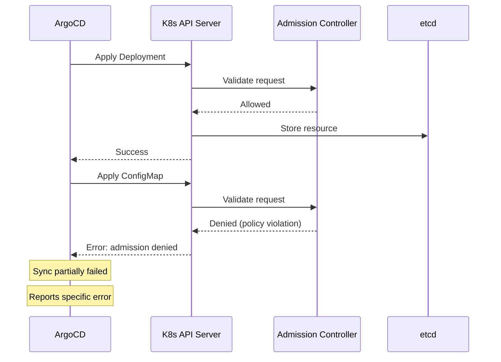

# How to Implement Admission Policies for ArgoCD-Managed Resources

Author: [nawazdhandala](https://github.com/nawazdhandala)

Tags: ArgoCD, GitOps, Kubernetes, Admission Control, Policy

Description: Implement Kubernetes admission policies that work correctly with ArgoCD-managed resources using ValidatingAdmissionPolicy, Kyverno, and OPA Gatekeeper while avoiding sync conflicts.

---

Admission policies evaluate Kubernetes resources at creation or update time and either allow or deny them based on rules you define. When ArgoCD manages your deployments, admission policies add a critical safety net - even if a non-compliant manifest gets into Git, the admission controller blocks it at the Kubernetes API level.

However, there are subtle interactions between ArgoCD and admission controllers that you need to handle carefully. This post covers how to implement admission policies that work correctly with ArgoCD's sync process.

## Understanding the Interaction

When ArgoCD syncs an application, it creates or updates Kubernetes resources through the API server. If an admission controller rejects one of those resources, the sync partially fails. ArgoCD will report the failure and, depending on your retry settings, keep trying.

The key challenge is that admission rejections can leave applications in a partially synced state - some resources applied successfully while others were rejected. ArgoCD handles this by reporting the specific resources that failed, allowing you to fix them in Git.



## Using Kubernetes ValidatingAdmissionPolicy

Starting with Kubernetes 1.28, ValidatingAdmissionPolicy is GA. It is a built-in alternative to external webhook-based admission controllers.

```yaml
# Require resource limits on all Deployments
apiVersion: admissionregistration.k8s.io/v1
kind: ValidatingAdmissionPolicy
metadata:
  name: require-resource-limits
  annotations:
    argocd.argoproj.io/sync-wave: "0"
spec:
  failurePolicy: Fail
  matchConstraints:
    resourceRules:
      - apiGroups: ["apps"]
        apiVersions: ["v1"]
        operations: ["CREATE", "UPDATE"]
        resources: ["deployments"]
  validations:
    - expression: >
        object.spec.template.spec.containers.all(c,
          has(c.resources) &&
          has(c.resources.limits) &&
          has(c.resources.limits.cpu) &&
          has(c.resources.limits.memory)
        )
      message: "All containers must have CPU and memory limits defined"
    - expression: >
        object.spec.template.spec.containers.all(c,
          has(c.resources) &&
          has(c.resources.requests) &&
          has(c.resources.requests.cpu) &&
          has(c.resources.requests.memory)
        )
      message: "All containers must have CPU and memory requests defined"
---
# Bind the policy to specific namespaces
apiVersion: admissionregistration.k8s.io/v1
kind: ValidatingAdmissionPolicyBinding
metadata:
  name: require-resource-limits-binding
  annotations:
    argocd.argoproj.io/sync-wave: "1"
spec:
  policyName: require-resource-limits
  validationActions:
    - Deny
  matchResources:
    namespaceSelector:
      matchExpressions:
        - key: kubernetes.io/metadata.name
          operator: NotIn
          values:
            - kube-system
            - argocd
            - gatekeeper-system
```

### Deploy with ArgoCD

```yaml
# admission-policies-app.yaml
apiVersion: argoproj.io/v1alpha1
kind: Application
metadata:
  name: admission-policies
  namespace: argocd
spec:
  project: security
  source:
    repoURL: https://github.com/company/platform-policies
    targetRevision: main
    path: admission-policies
  destination:
    server: https://kubernetes.default.svc
  syncPolicy:
    automated:
      prune: true
      selfHeal: true
    syncOptions:
      - ServerSideApply=true
```

## Exempting ArgoCD Namespaces

ArgoCD's own components (application controller, repo server, API server) should be exempt from your admission policies to prevent circular dependency issues where a policy blocks ArgoCD itself from running.

### With Kyverno

```yaml
# Exclude ArgoCD namespace from policy enforcement
apiVersion: kyverno.io/v1
kind: ClusterPolicy
metadata:
  name: require-labels
spec:
  validationFailureAction: Enforce
  rules:
    - name: check-labels
      match:
        any:
          - resources:
              kinds:
                - Deployment
      exclude:
        any:
          - resources:
              namespaces:
                - argocd
                - kube-system
                - gatekeeper-system
                - kyverno
      validate:
        message: "Label 'app.kubernetes.io/name' is required"
        pattern:
          metadata:
            labels:
              app.kubernetes.io/name: "?*"
```

### With OPA Gatekeeper

```yaml
# Gatekeeper Helm values - exempt ArgoCD
exemptNamespaces:
  - kube-system
  - gatekeeper-system
  - argocd
```

### With ValidatingAdmissionPolicy

```yaml
# Use namespace selectors to exclude system namespaces
spec:
  matchResources:
    namespaceSelector:
      matchExpressions:
        - key: kubernetes.io/metadata.name
          operator: NotIn
          values:
            - kube-system
            - argocd
```

## Handling Server-Side Apply Interactions

ArgoCD supports server-side apply (`ServerSideApply=true`), which changes how admission controllers see the request. With server-side apply, the request includes field ownership metadata that some admission controllers may not expect.

```yaml
# Application with server-side apply
spec:
  syncPolicy:
    syncOptions:
      - ServerSideApply=true
      # Force conflicts resolution in favor of ArgoCD
      - ServerSideApply=true
```

If your admission controller has issues with server-side apply, you can fall back to client-side apply for specific applications.

## Writing Policies for Common Compliance Requirements

### Require Network Policies

Ensure every namespace has at least one NetworkPolicy.

```yaml
# policies/require-network-policy.yaml
apiVersion: kyverno.io/v1
kind: ClusterPolicy
metadata:
  name: require-network-policy
spec:
  validationFailureAction: Audit  # Start with audit, move to enforce
  background: true
  rules:
    - name: check-network-policy
      match:
        any:
          - resources:
              kinds:
                - Deployment
      preconditions:
        all:
          - key: "{{request.object.metadata.namespace}}"
            operator: NotIn
            value:
              - kube-system
              - argocd
      context:
        - name: netpols
          apiCall:
            urlPath: "/apis/networking.k8s.io/v1/namespaces/{{request.object.metadata.namespace}}/networkpolicies"
            jmesPath: "items | length(@)"
      validate:
        message: "Namespace {{request.object.metadata.namespace}} must have at least one NetworkPolicy before deploying workloads"
        deny:
          conditions:
            all:
              - key: "{{netpols}}"
                operator: LessThan
                value: 1
```

### Require Pod Disruption Budgets

```yaml
# policies/require-pdb.yaml
apiVersion: kyverno.io/v1
kind: ClusterPolicy
metadata:
  name: require-pdb-for-ha-deployments
spec:
  validationFailureAction: Enforce
  background: true
  rules:
    - name: check-pdb-exists
      match:
        any:
          - resources:
              kinds:
                - Deployment
      preconditions:
        all:
          # Only enforce for deployments with 2+ replicas
          - key: "{{request.object.spec.replicas}}"
            operator: GreaterThan
            value: 1
      context:
        - name: pdbs
          apiCall:
            urlPath: "/apis/policy/v1/namespaces/{{request.object.metadata.namespace}}/poddisruptionbudgets"
            jmesPath: "items[?spec.selector.matchLabels == `{{request.object.spec.selector.matchLabels}}`] | length(@)"
      validate:
        message: "Deployments with more than 1 replica must have a PodDisruptionBudget"
        deny:
          conditions:
            all:
              - key: "{{pdbs}}"
                operator: LessThan
                value: 1
```

### Restrict External Load Balancers

```yaml
# policies/restrict-loadbalancer.yaml
apiVersion: kyverno.io/v1
kind: ClusterPolicy
metadata:
  name: restrict-loadbalancer-services
spec:
  validationFailureAction: Enforce
  rules:
    - name: block-loadbalancer
      match:
        any:
          - resources:
              kinds:
                - Service
      exclude:
        any:
          - resources:
              namespaces:
                - ingress-nginx
                - istio-system
      validate:
        message: "LoadBalancer services are only allowed in ingress namespaces. Use Ingress or ClusterIP services instead."
        pattern:
          spec:
            type: "!LoadBalancer"
```

## Gradual Rollout Strategy

Do not enable enforcement all at once. Use a graduated approach.

### Phase 1: Audit Mode

Start with policies in audit mode to see what would be blocked without actually blocking anything.

```yaml
spec:
  validationFailureAction: Audit
```

Check violations.

```bash
# Kyverno: check policy reports
kubectl get policyreport -A -o json | \
  jq '.items[].results[] | select(.result == "fail") | {policy: .policy, resource: .resources[0].name, message: .message}'

# Gatekeeper: check audit violations
kubectl get constraints -o json | \
  jq '.items[] | {name: .metadata.name, violations: .status.totalViolations}'
```

### Phase 2: Warn Mode

Enable warnings that show up in ArgoCD but do not block syncs.

```yaml
# Gatekeeper: use warn enforcement
spec:
  enforcementAction: warn
```

### Phase 3: Enforce Mode

Once teams have fixed existing violations, switch to enforcement.

```yaml
spec:
  validationFailureAction: Enforce
```

## Custom Health Checks for Policy Resources

ArgoCD needs custom health checks to understand whether Kyverno or Gatekeeper policies are healthy.

```yaml
# argocd-cm - custom health for Kyverno policies
apiVersion: v1
kind: ConfigMap
metadata:
  name: argocd-cm
  namespace: argocd
data:
  resource.customizations.health.kyverno.io_ClusterPolicy: |
    hs = {}
    if obj.status ~= nil then
      if obj.status.ready == true then
        hs.status = "Healthy"
        hs.message = "Policy is ready"
      else
        hs.status = "Progressing"
        hs.message = "Policy is not yet ready"
      end
    else
      hs.status = "Progressing"
      hs.message = "Waiting for policy status"
    end
    return hs
```

## Wrapping Up

Implementing admission policies for ArgoCD-managed resources adds a critical enforcement layer to your GitOps workflow. The key principles are: exempt ArgoCD's own namespace from policies to prevent circular failures, use sync waves to ensure policy definitions exist before constraints, start with audit mode and gradually move to enforcement, handle partial sync failures by fixing manifests in Git, and add custom health checks for policy CRDs so ArgoCD can report their status accurately. This layered approach ensures compliance without disrupting your deployment pipeline. For auditing overall policy compliance, see [how to audit policy compliance with ArgoCD](https://oneuptime.com/blog/post/2026-02-26-how-to-audit-policy-compliance-with-argocd/view).
