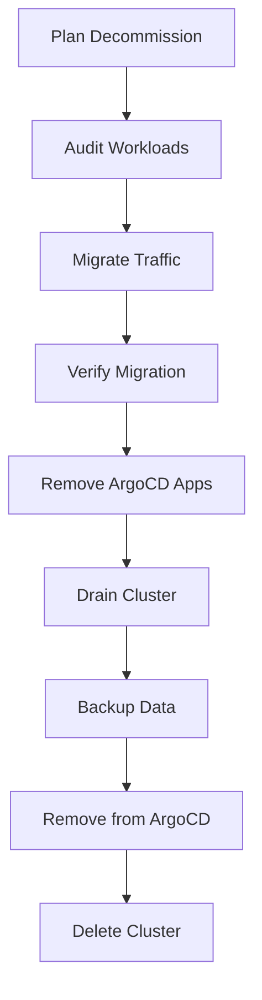

# How to Implement Cluster Decommissioning with ArgoCD

Author: [nawazdhandala](https://github.com/nawazdhandala)

Tags: ArgoCD, GitOps, Kubernetes, Multi-Cluster, Operations

Description: Learn how to safely decommission Kubernetes clusters managed by ArgoCD, including workload migration, traffic draining, data backup, and clean cluster removal.

---

Decommissioning a Kubernetes cluster is something teams rarely plan for but regularly need to do. Maybe you are migrating to a new cloud provider, consolidating clusters, or replacing an aging cluster with a new one. When your clusters are managed by ArgoCD, you have a clear path for safely removing a cluster without losing workloads or data.

This guide covers the complete process of decommissioning a cluster from an ArgoCD-managed multi-cluster environment.

## Why Clusters Get Decommissioned

Common reasons include:

- Kubernetes version end of life (easier to replace than upgrade)
- Cloud provider migration (AWS to GCP, or vice versa)
- Region consolidation (reducing from 5 regions to 3)
- Cost optimization (merging underutilized clusters)
- Infrastructure refresh (new node types, new networking)

## The Decommissioning Process



## Step 1: Audit Workloads

First, understand everything running on the cluster. ArgoCD makes this easy:

```bash
# List all applications deployed to the cluster being decommissioned
argocd app list --dest-server https://old-cluster.k8s.example.com

# Export the list for review
argocd app list --dest-server https://old-cluster.k8s.example.com -o json > workloads.json

# Check for applications not managed by ArgoCD
kubectl get all --all-namespaces --context old-cluster | \
  grep -v "argocd\|kube-system\|monitoring"
```

Create a migration checklist:

```yaml
# migration-plan.yaml (for documentation, not applied)
clusters:
  source: old-cluster-us-east-1
  targets:
    - new-cluster-us-east-1
    - cluster-us-west-2  # For some workloads

workloads:
  - name: api-service
    namespace: api
    migration_target: new-cluster-us-east-1
    has_persistent_data: false
    traffic_sensitive: true

  - name: batch-processor
    namespace: batch
    migration_target: new-cluster-us-east-1
    has_persistent_data: true
    traffic_sensitive: false

  - name: database-operator
    namespace: databases
    migration_target: new-cluster-us-east-1
    has_persistent_data: true
    traffic_sensitive: true
    special_handling: "Requires database migration"
```

## Step 2: Add the New Cluster

Before removing the old cluster, ensure the new cluster is registered and healthy:

```yaml
apiVersion: v1
kind: Secret
metadata:
  name: new-cluster
  namespace: argocd
  labels:
    argocd.argoproj.io/secret-type: cluster
    environment: production
    region: us-east-1
    migration-status: target
type: Opaque
stringData:
  name: new-us-east-1
  server: https://new-cluster.k8s.example.com
  config: |
    {
      "bearerToken": "<token>",
      "tlsClientConfig": {
        "insecure": false,
        "caData": "<base64-ca>"
      }
    }
```

## Step 3: Migrate Workloads

### For Stateless Applications

Stateless applications are straightforward. Update the ApplicationSet or Application to deploy to the new cluster:

```yaml
# Option A: Update ApplicationSet selector to include new cluster
apiVersion: argoproj.io/v1alpha1
kind: ApplicationSet
metadata:
  name: api-service
  namespace: argocd
spec:
  generators:
    - clusters:
        selector:
          matchExpressions:
            - key: environment
              operator: In
              values: ["production"]
            # Include both old and new cluster during migration
            - key: migration-status
              operator: In
              values: ["active", "target"]
```

### For Stateful Applications

Stateful applications require data migration. Use Velero for persistent volume migration:

```yaml
# Step 1: Create a backup on the old cluster
apiVersion: velero.io/v1
kind: Backup
metadata:
  name: database-migration-backup
  namespace: velero
spec:
  includedNamespaces:
    - databases
  includedResources:
    - persistentvolumeclaims
    - persistentvolumes
    - pods
    - deployments
    - statefulsets
    - services
    - configmaps
    - secrets
  storageLocation: shared-s3-location
  volumeSnapshotLocations:
    - shared-s3-location
  snapshotMoveData: true
```

```bash
# Step 2: Restore on the new cluster
velero restore create database-migration-restore \
  --from-backup database-migration-backup \
  --restore-volumes=true
```

## Step 4: Migrate Traffic

Gradually shift traffic from the old cluster to the new one:

```bash
# Phase 1: 10% traffic to new cluster (canary)
# Update DNS weights
aws route53 change-resource-record-sets \
  --hosted-zone-id Z123 \
  --change-batch '{
    "Changes": [{
      "Action": "UPSERT",
      "ResourceRecordSet": {
        "Name": "api.example.com",
        "Type": "A",
        "SetIdentifier": "new-cluster",
        "Weight": 10,
        "AliasTarget": {
          "DNSName": "new-cluster-lb.us-east-1.elb.amazonaws.com",
          "HostedZoneId": "Z456",
          "EvaluateTargetHealth": true
        }
      }
    }]
  }'
```

Monitor error rates and latency during each phase:

```bash
# Phase 2: 50% traffic
# Phase 3: 90% traffic
# Phase 4: 100% traffic to new cluster
```

## Step 5: Verify Migration

Before removing the old cluster, verify everything works:

```bash
# Check all applications on new cluster are healthy
argocd app list --dest-server https://new-cluster.k8s.example.com \
  -o json | jq '.[] | {name: .metadata.name, health: .status.health.status, sync: .status.sync.status}'

# Run integration tests against new cluster
./run-integration-tests.sh --target new-cluster

# Verify no traffic reaches old cluster
kubectl logs -n ingress-nginx -l app=ingress-nginx --context old-cluster --tail=100
```

## Step 6: Remove Applications from Old Cluster

Once traffic is fully migrated, remove ArgoCD applications targeting the old cluster:

```bash
# Option 1: Delete applications targeting old cluster
# Be careful - this will delete resources from the old cluster
argocd app delete api-old-cluster --cascade

# Option 2: If using ApplicationSets, update the selector to exclude old cluster
# Update the cluster label
kubectl label secret old-cluster -n argocd migration-status=decommissioning --overwrite
```

For ApplicationSets, update the generator selector to exclude the decommissioned cluster:

```yaml
spec:
  generators:
    - clusters:
        selector:
          matchExpressions:
            - key: migration-status
              operator: NotIn
              values: ["decommissioning", "decommissioned"]
```

## Step 7: Drain the Cluster

Remove remaining resources from the old cluster:

```bash
# Cordon all nodes
kubectl cordon --all --context old-cluster

# Delete non-system namespaces
for ns in $(kubectl get ns --context old-cluster -o jsonpath='{.items[*].metadata.name}' | \
  tr ' ' '\n' | grep -v "^kube-\|^default$\|^argocd$"); do
  echo "Deleting namespace: $ns"
  kubectl delete ns "$ns" --context old-cluster --timeout=120s
done
```

## Step 8: Backup and Remove from ArgoCD

Take a final backup and remove the cluster from ArgoCD:

```bash
# Final backup of cluster state
kubectl get all --all-namespaces --context old-cluster -o yaml > old-cluster-final-state.yaml

# Remove cluster from ArgoCD
argocd cluster rm https://old-cluster.k8s.example.com

# Or delete the cluster secret
kubectl delete secret old-cluster -n argocd
```

## Step 9: Delete the Cluster

Once the cluster is removed from ArgoCD and all data is migrated:

```bash
# For EKS
eksctl delete cluster --name old-cluster --region us-east-1

# For GKE
gcloud container clusters delete old-cluster --region us-central1

# For AKS
az aks delete --resource-group mygroup --name old-cluster
```

## Rollback Plan

If issues are discovered after migration, you need a rollback path:

```bash
# Keep the old cluster running for 1-2 weeks after migration
# Re-add to ArgoCD if rollback is needed
argocd cluster add old-cluster-context --name old-cluster

# Redeploy applications
argocd app sync api-old-cluster

# Shift traffic back
# Update DNS to point back to old cluster
```

## Automating Decommission

For organizations that regularly decommission clusters, automate the process:

```yaml
apiVersion: batch/v1
kind: Job
metadata:
  name: cluster-decommission
  namespace: argocd
spec:
  template:
    spec:
      containers:
        - name: decommission
          image: myorg/cluster-tools:v1.0
          env:
            - name: CLUSTER_NAME
              value: "old-cluster"
            - name: CLUSTER_SERVER
              value: "https://old-cluster.k8s.example.com"
          command:
            - /bin/sh
            - -c
            - |
              set -e

              echo "=== Cluster Decommission: $CLUSTER_NAME ==="

              # Verify no traffic
              echo "Checking for active traffic..."
              # ...traffic check logic...

              # Verify all apps migrated
              echo "Checking application migration status..."
              APPS=$(argocd app list --dest-server "$CLUSTER_SERVER" -o name)
              if [ -n "$APPS" ]; then
                echo "ERROR: Applications still deployed to cluster:"
                echo "$APPS"
                exit 1
              fi

              # Remove cluster
              echo "Removing cluster from ArgoCD..."
              argocd cluster rm "$CLUSTER_SERVER"

              echo "=== Decommission Complete ==="
      restartPolicy: Never
```

## Checklist

Before decommissioning, verify:

- [ ] All workloads migrated to new cluster
- [ ] All traffic routed to new cluster
- [ ] No incoming requests to old cluster for 24+ hours
- [ ] Persistent data backed up or migrated
- [ ] DNS records updated
- [ ] Integration tests pass on new cluster
- [ ] Monitoring and alerting working on new cluster
- [ ] Old cluster backup created
- [ ] Team notified of decommission timeline
- [ ] Rollback plan documented and tested

## Summary

Cluster decommissioning with ArgoCD follows a structured process: audit workloads, migrate to the new cluster, shift traffic gradually, verify everything works, remove applications, and finally delete the cluster. ArgoCD's multi-cluster management makes it easy to track what is deployed where and ensure nothing is missed. Keep the old cluster running for at least a week after migration for rollback capability. For cluster upgrade patterns that do not require full decommissioning, see our guide on [cluster upgrades with ArgoCD](https://oneuptime.com/blog/post/2026-02-26-how-to-implement-cluster-upgrades-with-argocd/view).
